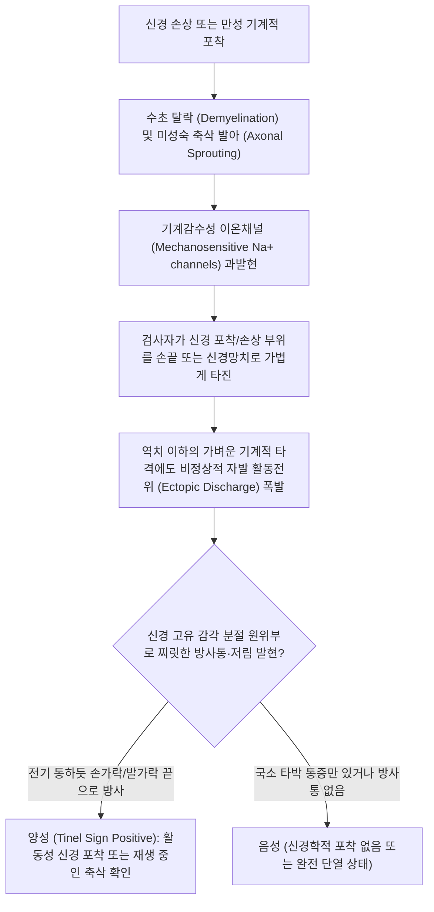

---
aliases:
  - 티넬 징후
  - 티넬 검사
  - Tinel Sign
  - Tinel's Sign
  - Tinel-Hoffmann Sign
  - 신경 타진 검사
tags:
  - 이학적검사
  - 신경학적검사
  - 말초신경
  - 정중신경
  - 척골신경
  - 수근관증후군
  - 주관증후군
---

# 티넬 징후 (Tinel's Sign)

> **핵심 3줄 요약 (Key Summary)**:
> 🎯 손상되거나 포착된 말초신경 부위를 손가락 또는 진찰 망치로 가볍게 두드릴(타진) 때, 신경 주행 방향의 원위부로 전기가 통하듯 찌릿한 방사 감각이상(Paresthesia)이 유발되는지 평가하는 신경학적 검사.
> 🔍 손목 수근관([[정중신경]]) 타진 시 제1~3수지 저림 유발, 주관절 내측상과와 주두돌기 사이 패임([[척골신경]]) 타진 시 제4~5수지 저림 유발 시 양성.
> ⚠️ 말초신경의 압박성 신경병증(수근관·주관·족근관 증후군) 진단뿐 아니라, 외상 후 신경 재생(Regeneration) 시 성장 중인 미성숙 축삭돌기의 원위부 전진 속도를 추적하는 핵심 임상 지표로 활용됨.

---

---

## 1. 검사 개요 (Test Overview)

* **검사 목적**: 
  1. [[정중신경]], [[척골신경]], [[요골신경]], [[경골신경]], [[총비골신경]] 등 표재성 말초신경이 주행하는 섬유골성 터널에서의 만성 포착성 신경병증(Entrapment Neuropathy) 진단.
  2. 신경 단열 봉합술 또는 신경 손상 후 축삭의 원위부 재생(Axonal Regeneration) 진행 경과 판정.
* **검사 대상**:
  * 손목 터널 부위 통증 및 손가락 저림 ([[수근관 증후군]]).
  * 팔꿈치 안쪽 찌릿함 및 넷째·새끼손가락 저림 및 근력 저하 ([[주관 증후군]]).
  * 발목 내측 복사뼈 아래 통증 및 발바닥 감각이상 ([[족근관 증후군]]).
* **소요 시간 및 준비물**: 1~2분 소요, 검사자의 검지/중지 손가락 끝 또는 소형 신경 진찰 해머(Taylor reflex hammer).

---

## 2. 해부학적 및 생체역학적 기전 (Anatomical & Biomechanical Mechanism)

### 2.1 신경생리학적 발생 기전 (Pathophysiological Mechanism)
* **미성숙 축삭의 기계감수성(Mechanosensitivity)**:
  * 정상적으로 수초(Myelin sheath)에 둘러싸인 건강한 신경 섬유는 가벼운 외부 압박이나 타진에 활동전위를 방전하지 않음.
  * 반면, 압박이나 외상으로 인해 수초가 탈락(Demyelination)되거나 재생 중인 축삭 성장원추(Growth cone) 및 무수초 신경돌기(Unmyelinated axon sprouts) 부위에는 전압개폐성 나트륨 통로(Nav1.7, Nav1.8 등)가 비정상적으로 고밀도 집적됨.
* **이소성 활동전위(Ectopic Impulse Discharge)**:
  * 가벼운 기계적 타진(Mechanical tap)만으로도 역치(Threshold)를 넘어선 강한 탈분극이 유발되어 원위부 고유 피부분절(Dermatome)로 방사되는 전격통(Electric shock-like sensation)과 저림(Pins and needles)이 발생함.

> [수근관 단면 해부도: 굴근지대 바로 아래를 지나는 정중신경의 표재성 주행으로 타진 자극에 매우 취약함]

### 2.2 인체 주요 부위별 티넬 징후 타진점 및 신경 주행
1. **수근관 (Carpal Tunnel)**:
   * **신경: [[정중신경]](Median nerve)
   * **타진 부위**: 손목 전면 손목주름(Wrist crease) 원위부 1cm, 대릉(PC7) 혈 부위.
   * **방사 영역**: 엄지, 검지, 중지 및 약지의 요측 반.
2. **주관 (Cubital Tunnel)**:
   * **신경: [[척골신경]](Ulnar nerve)
   * **타진 부위**: 팔꿈치 후내측의 내측상과(Medial epicondyle)와 주두돌기(Olecranon) 사이 고랑(Ulnar groove), 소해(HT3) 부근.
   * **방사 영역**: 약지의 척측 반과 소지(새끼손가락) 및 수장·수배 척측연.
3. **가이온관 (Guyon's Canal)**:
   * **신경: [[척골신경]](Ulnar nerve) 수부 분지.
   * **타진 부위**: 두상골(Pisiform)과 유구골 갈고리(Hook of hamate) 사이.
4. **비골두 (Fibular Head)**:
   * **신경: [[총비골신경]](Common peroneal nerve)
   * **타진 부위**: 비골두 외측 및 경부(Neck of fibula) 후외측.
   * **방사 영역**: 하퇴 외측면 및 족배부(발등) 감각이상, 족하수(Foot drop) 연계.
5. **족근관 (Tarsal Tunnel)**:
   * **신경: [[경골신경]](Tibial nerve)
   * **타진 부위**: 발목 안쪽 복사뼈(내과, Medial malleolus) 후하방, 태계(KI3) 혈 부위.
   * **방사 영역**: 발바닥 전체 및 발가락 끝(Plantar aspect of foot).

> [척골신경 해부도(Gray812): 상완골 내측상과 뒤쪽의 주관(Cubital tunnel)을 통과하여 척측수근굴근 사이로 주행하는 경로]

---

## 3. 단계별 검사 절차 (Step-by-Step Procedure)

### [수근관 정중신경 타진 절차]

#### 1단계: 환자 자세 및 손목 세팅
* 환자를 진료대 앞에 편안히 앉히고, 검사할 팔의 팔꿈치를 굴곡하여 전완을 베드에 안정적으로 지지시킴.
* 손바닥이 천장을 향하도록(Supination) 두고 손목은 중립위(Neutral) 또는 약간 신전된 상태를 유지함.

> [티넬 징후 1단계: 환자의 전완을 회외시켜 손목 전면부를 편안하게 노출시키는 시작 자세]

#### 2단계: 수근관 주행 부위 정밀 타진
* 검사자는 본인의 검지 또는 중지 끝(Fingertip)을 세워, 손목 주름(원위 수근 주름) 중앙의 횡수근인대 직상방([[정중신경]] 주행선)을 '톡-톡-톡' 가볍게 4~6회 두드림.
* 필요시 소형 신경 진찰 해머를 사용하여 일정한 강도로 가볍게 두드릴 수 있음.

> [티넬 징후 2단계: 횡수근인대 직상방을 손가락 끝으로 가볍게 타진하여 정중신경의 이상 방전을 유도]

#### 3단계: 원위부 방사통 및 저림 확인
* 타진 순간 환자에게 "두드릴 때 손가락 끝으로 전기가 통하듯 찌릿한 느낌이 뻗어나갑니까?"라고 질문함.
* 국소적인 뼈나 피부의 두드림 통증(Local tenderness)과 신경을 타고 손끝으로 뻗는 방사 감각이상(Referred paresthesia)을 엄격히 구분하여 판정함.

> [티넬 징후 3단계: 타진 시 손가락 끝으로 찌릿한 전기 방사 반응이 뻗어나가는지 피부분절을 따라 평가]

---

### [주관 척골신경 타진 절차]
1. 환자의 팔꿈치를 약 60~90도 굴곡시켜 내측상과와 주두돌기 사이 고랑(Cubital tunnel groove)을 노출시킴.
2. 검사자의 검지로 척골신경 고랑 부위를 가볍게 3~4회 튕기듯 타진함.
3. 넷째 손가락 척측 반과 새끼손가락 끝으로 찌릿한 감전감이 퍼져나가는지 확인함.

---

## 4. 양성 반응 및 임상적 해석 (Positive Sign & Clinical Interpretation)

### 4.1 양성 판정 기준
* **양성 (Tinel Sign Positive)**:
  * 타진 부위 자체의 통증을 넘어, 해당 신경의 지배 분절 원위부(손가락 끝, 발바닥 등)로 **전기가 찌릿찌릿 통하는 느낌(Electric shock), 핀으로 콕콕 찌르는 듯한 저림(Pins and needles), 화끈거림**이 강하게 재현되는 경우.
* **음성**:
  * 타진 부위에 단순 둔탁한 타박감이나 국소 압통만 있고 손끝이나 발끝으로 뻗는 방사 저림이 전혀 없는 경우.

### 4.2 신경 재생(Regeneration) 추적에서의 임상적 의미
* **신경 봉합/손상 후 전진하는 티넬 징후 (Advancing Tinel's sign)**:
  * 신경 손상 후 시간이 경과함에 따라 티넬 징후가 양성으로 나타나는 부위가 하루에 약 1mm(한 달에 약 1인치)씩 손가락 원위부 방향으로 이동함.
  * 이는 재생 중인 축삭(Axon)이 표적 근육 및 피부 수용기를 향해 성공적으로 자라 내려가고 있음을 증명하는 가장 신뢰할 만한 임상 신호임.
  * 만약 봉합 수개월 후에도 티넬 징후가 손상 부위에만 머물러 있고 전진하지 않는다면 신경종(Neuroma) 형성 및 축삭 재생 장애를 의미하므로 재수술적 박리를 고려해야 함.

---

## 5. 감별 진단 (Differential Diagnosis)

| 평가 부위 및 신경 | 의심 질환 | 타진 부위 | 방사 감각 영역 | 주요 감별 질환 |
| :--- | :--- | :--- | :--- | :--- |
| 손목 전면 ([[정중신경]]) | [[수근관 증후군]] | 원위 수근 횡선 중앙 (대릉혈) | 제1~3수지, 제4수지 요측 | [[원회내근 증후군]], [[경추 추간판 탈출증]](C6-C7) |
| 팔꿈치 내측 ([[척골신경]]) | [[주관 증후군]] | 내측상과-주두돌기 사이 홈 | 제4수지 척측, 제5수지 전체 | 경추 신경근병증(C8-T1), [[흉곽출구 증후군]] |
| 손목 두상골 외측 ([[척골신경]]) | 가이온관 증후군 | 유구골 갈고리-두상골 사이 | 제4~5수지 (수배 감각 보존) | 주관 증후군(수배 감각도 저하) |
| 비골두 외측 ([[총비골신경]]) | 비골신경 포착증 | 비골두 후하방 경부 | 하퇴 전외측, 족배부 | L5 신경근병증(요통, 하지직거상 검사 양성) |
| 발목 내과 후하방 ([[경골신경]]) | [[족근관 증후군]] | 내측 복사뼈 후하방 (태계혈) | 발바닥 전체, 발가락 저림 | 족저근막염, S1 신경근병증, 당뇨병성 말초신경병증 |

---

## 6. 검사 신뢰도 및 통계 (Diagnostic Accuracy)

### 6.1 수근관 증후군(CTS)에서의 통계
* **민감도 (Sensitivity)**: **38% ~ 60%** (평균 약 50% - 비교적 낮음)
* **특이도 (Specificity)**: **67% ~ 87%** (평균 약 77% - 비교적 높음)
* **양성우도비 (LR+)**: **2.1 ~ 3.8**
* **음성우도비 (LR-)**: **0.65 ~ 0.80**

### 6.2 주관 증후군(Cubital Tunnel Syndrome)에서의 통계
* **민감도**: **62% ~ 70%**
* **특이도**: **85% ~ 98%** (매우 높은 특이도)

> [!IMPORTANT]
> 티넬 징후는 위음성률이 다소 높습니다(진짜 수근관 증후군 환자의 절반 가까이에서 타진 시 저림이 나타나지 않을 수 있음). 특히 장기간 방치되어 축삭 변성이 심하고 신경 전도가 차단된 만성 완전 포착 단계에서는 티넬 징후가 오히려 음성으로 소실됩니다. 따라서 [[팔렌 검사]](Phalen's test) 및 Durkan 압박 검사와 반드시 복합 시행해야 합니다.

---

## 7. 진료실 핵심 임상 필기 (Clinical Pearls & Practice Tips)

* **원장님 타진 강도 조절 노하우 (Gentle Tap Principle)**:
  * 정상인이라도 신경 고랑 부위를 해머로 강하게 내려치면 일시적인 신경 쇼크로 전기가 찌릿할 수 있어 위양성이 유발됨.
  * 티넬 징후 검사의 핵심은 **"정상 신경이라면 전혀 자극을 느끼지 않을 정도의 가벼운 손가락 탭(Gentle fingertip percussion)"**으로 두드려야만 병적 기계감수성을 정확히 선별할 수 있음.
* **주관 증후군 원장님 감별 포인트**:
  * 팔꿈치를 90도 굽힌 채 척골신경구를 두드릴 때 새끼손가락 끝으로 찌릿함이 퍼진다면, 반드시 프로망 징후(Froment's sign, 종이를 양 엄지와 검지로 쥐게 했을 때 엄지 지절간관절 굴곡 보상)를 확인하여 내전근 마비 여부를 점검할 것.
* **한의 치료 및 원내 임상 가이드**:
  * **약침 및 봉약침 신경 주위 주입 (Hydrodissection)**:
    * 수근관의 대릉, 주관의 소해, 족근관의 태계 부위에서 티넬 징후가 가장 강하게 유발되는 'Trigger Point' 바로 인접 부위에 신바로약침 또는 저농도 봉약침을 주입하여 섬유성 유착을 물리적으로 박리하고 신경 부종을 신속히 감압.
  * **전침 치료**:
    * 신경 주행선을 따라 상·하 혈자리(예: 대릉-내관, 소해-양로)에 2Hz의 저주파 자극을 주어 신경 세포의 축삭 재생 단백질(GAP-43) 발현과 국소 미세혈류 순환을 촉진함.

---

## 8. 출처 및 현대 학술 연구 요약 (References)

* **Tinel J.** (1915). *Le signe du "fourmillement" dans les lésions des nerfs périphériques.* **Presse Médicale**, 23: 388-389.
  * PubMed Central: [PMC Classic Archive](https://pubmed.ncbi.nlm.nih.gov/22421332/)
  * `[연구 요약]`: 프랑스 신경학자 쥘 티넬(Jules Tinel)이 제1차 세계대전 중 말초신경 손상 군인들을 대상으로 손상된 신경 타진 시 발생하는 '개미가 기어가는 듯한 저림(Fourmillement)' 반응과 축삭 재생의 상관관계를 세계 최초로 기술한 역사적 랜드마크 논문.
* **MacDermid JC, Wessel J.** (2004). *Clinical diagnosis of carpal tunnel syndrome: a systematic review.* **J Hand Ther**, 17(2): 309-319.
  * DOI: [10.1197/j.jht.2004.02.015](https://doi.org/10.1197/j.jht.2004.02.015) | PubMed: [PMID: 15162113](https://pubmed.ncbi.nlm.nih.gov/15162113/)
  * `[연구 요약]`: 수근관 증후군 진단에서 티넬 징후의 메타분석 결과 민감도 50%, 특이도 77%로 나타났으며, 단독 검사보다는 팔렌 검사 및 압박 검사와의 병합 시 진단 정확도가 유의미하게 높아짐을 증명.
* **Novak CB, et al.** (1994). *Provocative sensory testing in carpal tunnel syndrome.* **J Hand Surg Am**, 19(5): 777-781.
  * DOI: [10.1016/0363-5023(94)90183-5](https://doi.org/10.1016/0363-5023(94)90183-5) | PubMed: [PMID: 7806799](https://pubmed.ncbi.nlm.nih.gov/7806799/)
  * `[연구 요약]`: 티넬 징후의 타진 강도 및 위치에 따른 양성률을 분석하고, 경미한 자극에도 반응하는 환자군일수록 전기진단검사 상 활성 탈수초 손상이 급성으로 진행 중임을 확인.