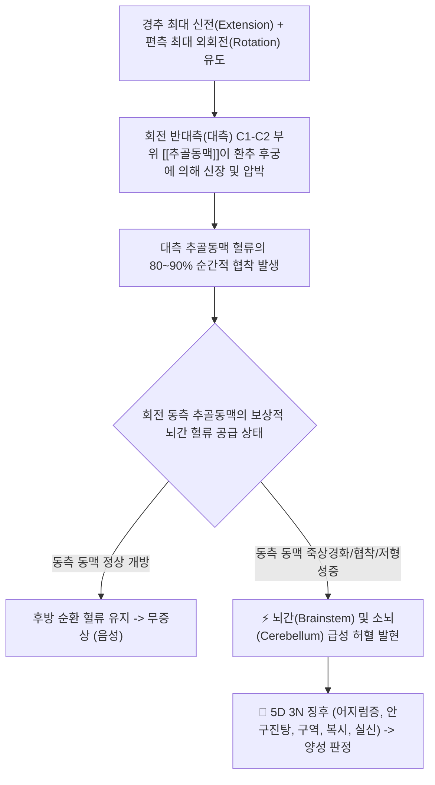
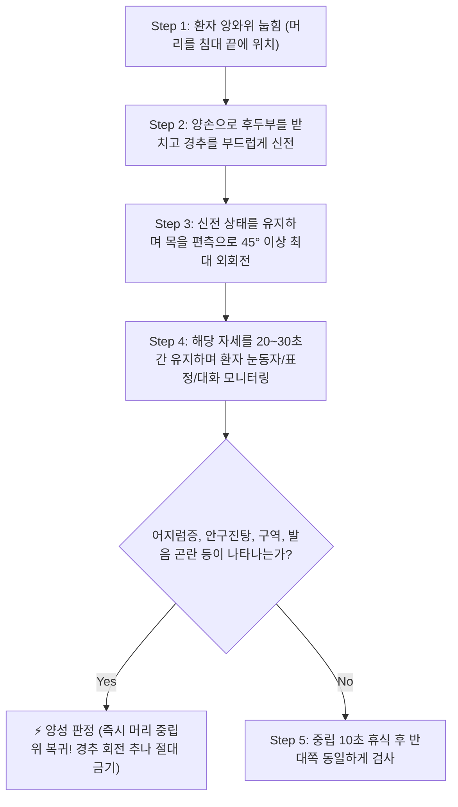

# 🩺 [[Vertebral artery patency test]] (추골동맥 개방성 검사)

> **핵심 3줄 요약 (Key Summary)**:
> - 🎯 검사 목적 & 타겟 병소: 경추 추나 치료 및 도수 조작 전 추골뇌저동맥부전(VBI) 위험 선별, [[추골동맥]]의 횡돌기공 및 C1-C2 환추축추관절 경유 부위 협착/압박 평가.
> - 🔍 검사 시행 프로토콜 & 양성 반응: 앙와위에서 환자의 경추를 침대 밖으로 살짝 빼내어 완전 신전 및 편측 최대 외회전 상태로 20~30초간 유지, 현훈(어지럼증), 안구진탕, 구역, 복시 등 5D 3N 허혈 증상 발현 시 양성 판정.
> - 📊 진단 정확도(민감도·특이도) & 임상적 의의: 위음성 가능성이 있어 단독 배제 가치는 제한적이나, 양성 소견 시 고속저진폭(HVLA) 경추 회전 추나 기법을 절대적으로 금기해야 하는 최우선 안전 필터임.
> - ⚠️ 위양성/위음성 요인 & 검사 금기: 검사 중 심한 어지럼증이나 실신 징후 발생 시 즉시 중립위로 복귀, 음성이라도 VBI를 완전히 배제할 수 없으므로 추나 시 환자 눈동자와 안색을 상시 모니터링.

---

## 📌 목차
1. [검사 기본 정보 & 진단 목적 (Diagnostic Overview)](#1-검사-기본-정보--진단-목적-diagnostic-overview)
2. [해부학적 유발 메커니즘 & 생체역학적 원리 (Biomechanical Mechanism)](#2-해부학적-유발-메커니즘--생체역학적-원리-biomechanical-mechanism)
3. [표준 검사 시행 절차 (Step-by-Step Clinical Protocol)](#3-표준-검사-시행-절차-step-by-step-clinical-protocol)
4. [양성 반응 판정 기준 & 5D 3N 뇌허혈 증상 맵핑 (Diagnostic Criteria & Mapping)](#4-양성-반응-판정-기준--5d-3n-뇌허혈-증상-맵핑-diagnostic-criteria--mapping)
5. [연관 검사군 비교 & 추나 안전 다단계 감별 알고리즘 (Differential Battery & Algorithm)](#5-연관-검사군-비교--추나-안전-다단계-감별-알고리즘-differential-battery--algorithm)
6. [양성 소견 시 한의 임상 안전 프로토콜 및 대체 치료 (Integrative Korean Medicine)](#6-양성-소견-시-한의-임상-안전-프로토콜-및-대체-치료-integrative-korean-medicine)
7. [💡 사용자 진료실 핵심 필기 & 실전 임상 팁 (원문 보존)](#7--사용자-진료실-핵심-필기--실전-임상-팁-원문-보존)
8. [출처 및 학술 참고 문헌 (References)](#8-출처-및-학술-참고-문헌-references)

---

## 1. 검사 기본 정보 & 진단 목적 (Diagnostic Overview)

![[추골동맥검사_1단계_경추신전외회전_실사.png|450]]
> [그림 1: 검사자가 앙와위 환자의 후두부를 받치고 경추를 신전 및 회전시켜 추골동맥 개방성을 검사하는 모습]

| 항목 | 상세 내용 |
| :--- | :--- |
| **검사명 (Test Name)** | 추골동맥 개방성 검사 (Vertebral Artery Patency Test / Extension-Rotation Test / de Kleyn Test) |
| **분류 (Category)** | 혈관성 뇌허혈 유발 검사 / 경추 추나 및 도수치료 사전 안전 선별 검사 |
| **타겟 병소 (Target)** | [[추골동맥]](V1~V4 분절), [[뇌저동맥]], 환추축추관절(C1-C2), 경추 횡돌기공 |
| **의심 질환 (Suspected Pathologies)** | 추골뇌저동맥부전(Vertebrobasilar Insufficiency, VBI), 추골동맥 박리증, 경추성 현훈 |
| **진단 정확도 (Diagnostic Accuracy)** | • **민감도 (Sensitivity)**: 0% ~ 20% (음성이라도 VBI 완전 배제 불가) • **특이도 (Specificity)**: 85% ~ 95% (증상 유발 시 혈류 장애 확진) • **양성 우도비 (LR+)**: 3.5 ~ 8.0 |
| **시연 영상 (Video Guide)** | [🎥 시연 영상: Physiotutors - Extension Rotation Test (VBI)](https://www.youtube.com/watch?v=V49zvZMZQTM) |

---

## 2. 해부학적 유발 메커니즘 & 생체역학적 원리 (Biomechanical Mechanism)

![[추골동맥검사_2단계_추골동맥_횡돌기공주행_해부도.png|400]]
> [그림 2: 경추 횡돌기공을 수직 관통하며 C1-C2 부위에서 고도의 굴곡을 형성하는 추골동맥의 해부학적 모형]

### 1) 추골동맥의 주행과 취약 부위 (V3 분절 역학)
* [[추골동맥]](Vertebral artery)은 쇄골하동맥에서 분지하여 C6부터 C1까지 경추 횡돌기공(Transverse foramen)을 수직으로 통과합니다.
* 특히 제1경추(환추 Atlas)와 제2경추(축추 Axis) 사이인 **V3 분절(Suboccipital segment)**에서는 대후두공으로 들어가기 위해 'S'자형 곡선(Loop)을 크게 그립니다.
* 이 부위는 뼈와 인대에 밀착되어 있어 경추 회전 운동 시 기계적 비틀림(Torsion)과 신장(Stretching)에 가장 취약합니다.

### 2) 회전 시 대측 동맥 압박과 동측 보상 기전
* 고개를 한쪽(예: 오른쪽)으로 45° 이상 회전시키면, **회전 반대쪽(왼쪽)의 추골동맥이 환추 후궁의 골성 가장자리와 인대에 눌려 내경이 좁아지며 혈류가 급감**합니다.
* 정상인에서는 오른쪽 동맥이 굵어져 대뇌 후방 순환계로 충분한 피를 공급해주므로 아무런 이상이 없습니다.
* 그러나 만약 **오른쪽 동맥마저 이미 협착, 석회화, 동맥경화, 또는 선천적 저형성증**이 있다면, 양측 모두에서 뇌간으로 가는 피가 끊기면서 뇌간 및 전정신경핵에 급성 허혈이 촉발됩니다.

---

## 3. 표준 검사 시행 절차 (Step-by-Step Clinical Protocol)

### Step 1: 환자 세팅 및 사전 안전 고지 (Starting Position)
* 환자를 침대에 편안히 눕힙니다 (앙와위 Supine position).
* 환자의 머리가 침대 상단 경계선 밖으로 살짝 나오도록 위치시켜 검사자의 양손으로 환자의 두개골 무게를 완전히 지지할 수 있도록 합니다.
* 환자에게 "검사 중 어지럽거나 눈이 침침해지거나 메스꺼우면 즉시 말씀하세요"라고 사전 고지하고, 눈을 절대 감지 말고 검사자의 눈이나 천장의 한 점을 계속 응시하도록 지시합니다.

### Step 2: 신전 및 편측 회전 기동 (Extension & Rotation Maneuver)
> [그림 3: 검사자가 양손으로 환자의 후두부를 안정적으로 지지하고 경추를 신전 및 편측으로 회전시킨 상태]

* 검사자는 환자의 머리를 천천히 뒤로 젖혀(신전 Extension), 경추 관절을 잠급니다.
* 신전된 상태를 유지하면서 환자의 머리를 한쪽 방향(우측 또는 좌측)으로 45°가량 부드럽게 끝 범위까지 회전시킵니다.

### Step 3: 20~30초 유지 및 실시간 모니터링 (Sustained Hold & Monitoring)
* **유지 시간**: 그 자세 그대로 **최소 20초에서 30초간 유지**합니다 (혈류 감소 후 뇌간 허혈 증상이 발현되기까지 수초의 지연 시간이 필요함).
* **모니터링 항목**:
  1. 환자의 눈동자를 주시하여 불수의적인 떨림인 **안구진탕(Nystagmus)**이 발생하는지 관찰.
  2. 환자에게 "1부터 10까지 숫자를 소리 내어 세어보세요"라고 말하게 하여 **발음 이상(Dysarthria)이나 혀 꼬임**이 있는지 확인.
  3. 환자 안색이 창백해지거나 식은땀, 동공 변화가 있는지 확인.

### Step 4: 중립위 복귀 및 반대측 대조 (Release & Contra-lateral Check)
* 증상이 없으면 머리를 천천히 중립 상태로 돌려놓고 침대 위에서 10초간 안정시킵니다.
* 동일한 요령으로 반대쪽 회전 검사를 시행하여 양측 추골동맥을 모두 평가합니다.

---

## 4. 양성 반응 판정 기준 & 5D 3N 뇌허혈 증상 맵핑 (Diagnostic Criteria & Mapping)

* **진정한 양성 반응 (True Positive - VBI Positive)**:
  * 경추 신전 및 회전 자세를 유지하는 동안 **5D 3N 징후 중 하나 이상이 뚜렷하게 발현**될 때.
  * 즉각 검사를 중단하고 고개를 정면으로 돌려야 하며, **추골뇌저동맥 혈류 장애**를 강력히 시사.
* **음성 반응 (Negative)**:
  * 30초간 자세를 유지해도 어지럼증, 안구진탕, 구역 등의 허혈 징후가 전혀 나타나지 않는 경우.
* **경추성 통증과의 감별 (Cervical Pain)**:
  * 어지럼증 없이 단순히 목 뒤나 어깨 근육이 당기고 뻐근한 것은 후관절 증후군이나 근막통증이며, 혈관성 양성 반응이 아닙니다.

| 5D 증상 (5Ds) | 3N 증상 (3Ns) | 기타 뇌간 허혈 징후 |
| :--- | :--- | :--- |
| • **Dizziness** (현훈 / 회전성 어지럼증) • **Diplopia** (복시 / 물체가 둘로 보임) • **Dysarthria** (구음장애 / 발음 어눌함) • **Dysphagia** (연하곤란 / 침 삼키기 어려움) • **Drop attacks** (낙상 발작 / 의식소실 없는 급성 쓰러짐) | • **Nystagmus** (안구진탕 / 눈동자 떨림) • **Nausea** (구역 및 구토감) • **Numbness** (안면부 또는 편측 감각 저하/저림) | • Ataxia (보행 실조, 비틀거림) • Tinnitus (이명, 귀울림) • Visual disturbance (시야 흐림, 암점) • Syncope (미주신경성 실신) |

---

## 5. 연관 검사군 비교 & 추나 안전 다단계 감별 알고리즘 (Differential Battery & Algorithm)

| 검사명 | 검사 수기 및 동작 | 병태생리적 원리 | 임상적 역할 (추나 안전 필터) |
| :--- | :--- | :--- | :--- |
| [[Vertebral artery patency test]] (본 검사) | 앙와위 경추 신전 + 45° 회전 30초 유지 | C1-C2 추골동맥 기계적 폐색 유도 | 경추 회전 추나(HVLA) 전 VBI 필수 선별 |
| [[추골뇌저 동맥 청진 및 촉진]] | 경동맥/쇄골하동맥 촉진 및 잡음(Bruit) 청진 | 경부 대혈관 협착 및 난류성 혈류 청진 | 대혈관 죽상동맥경화증 사전 스크리닝 |
| **딕스-홀파이크 검사 (Dix-Hallpike Test)** | 좌위에서 고개 45° 돌리고 신속히 앙와위 눕힘 | 후반고리관 이석(Otoconia) 이동 자극 | 양성 돌발성 두위현훈(BPPV, 이석증) 확진 감별 |
| [[스펄링 검사]] | 경추 신전·측굴 후 두정부 축성 수직 압박 | 경추 추간공 협착 및 신경근 직접 압박 | 경추 신경근병증(목 디스크) 확진 검사 |

---

## 6. 양성 소견 시 한의 임상 안전 프로토콜 및 대체 치료 (Integrative Korean Medicine)

* **🚨 절대적 금기 사항 (Absolute Contraindication)**:
  * 추골동맥 검사에서 양성이 나타난 환자에게 **경추의 고속저진폭 회전 스러스트(Cervical Rotational Thrust HVLA) 추나를 시행하는 것은 추골동맥 박리(Vertebral Artery Dissection) 및 뇌경색(PICA infarction, Wallenberg syndrome)을 유발할 수 있으므로 절대 금기**입니다.
  * 즉시 경동맥-추골동맥 도플러 초음파(Carotid & Vertebral Doppler US) 또는 Brain MRA 검사를 의뢰해야 합니다.
* **안전한 한의 대체 치료법 (Safe Alternative Approach)**:
  * **경추 무회전 감압 추나 (Non-rotational Chuna)**: 회전 조작을 완전히 배제하고, 순수한 직선적 종축 견인(Longitudinal Axial Traction) 및 후두하근 이완 수기요법(Suboccipital release)만 적용.
  * **침구 치료**: 풍지(GB20), 완골(GB12), 천주(BL10) 등 후두하 삼각 혈위에 얕게 자침하여 척추기립근과 두판상근의 경결을 해소하고 추골동맥 주변 교감신경 긴장을 완화.
  * **한약 치료**:
    * 뇌혈류 개선 및 어혈 제거: [[자음건비탕]], [[반하백출천마탕]] (담훈, 경추성 어지럼증 치료).
    * 동맥경화 및 순환 장애: [[보양환오탕]], [[통도산]] 가감방.

---

## 7. 💡 사용자 진료실 핵심 필기 & 실전 임상 팁 (원문 보존)

* **사용자 원문 필기 (100% 보존)**:
  * 환자의 목을 신전, 외회전시킨 뒤 20~30초간 그대로 있도록 함.
  * 현훈, 구역, 이명 등의 증상이 나타나는 경우는 경추의 횡돌기공을 지나는 추골 동맥에 문제가 생겨 혈액공급이 원활하지 않은 것.
* **진료실 실전 노하우 & 감별 팁**:
  1. **"눈을 감지 마세요"가 핵심인 이유**: 환자에게 목을 젖히고 돌리게 하면 무서워서 눈을 질끈 감아버립니다. 이때 눈을 감으면 검사자가 가장 중요한 타겟인 **안구진탕(Nystagmus - 눈동자가 한쪽으로 튀는 현상)**을 전혀 볼 수 없습니다. 반드시 "제 눈을 똑바로 보세요"라고 지시하십시오.
  2. **말을 시켜보는 요령**: 30초 동안 가만히 있으면 환자가 어눌해지는 것을 모릅니다. "원장님 이름이 무엇입니까?", "일주일 요일을 거꾸로 말해보세요"라고 말을 시키면, 혀가 굳어 발음이 새는 구음장애(Dysarthria)를 즉각 잡아낼 수 있습니다.
  3. **위음성(False Negative)의 한계 인지**: 이 검사가 음성으로 나왔다고 해서 "추골동맥이 100% 안전하다"고 맹신하면 안 됩니다. Kerry(2006) 등의 최신 연구에 따르면 이 검사의 민감도는 20% 이하로 매우 낮습니다. 따라서 평소 고혈압, 당뇨, 고지혈증이 있거나 흡연을 하는 50대 이상 환자에게는 목을 비트는 강한 스러스트 추나 자체를 가급적 지양하고 안전한 근막 이완과 관절 가동 기법을 위주로 치료하는 것이 안전합니다.

---

## 8. 출처 및 학술 참고 문헌 (References)

1. **Kerry, R., Taylor, A. J., Mitchell, J., & McCarthy, C. (2006)**. *Cervical arterial dysfunction and manual therapy: a critical literature review to inform professional practice*. **Manual Therapy**, 11(4), 243-253. [DOI: 10.1016/j.math.2006.06.012](https://doi.org/10.1016/j.math.2006.06.012)
   - **[연구 요약]**: 경추 도수치료 전 추골동맥 개방성 검사의 한계와 낮은 선별 민감도를 체계적으로 검토하고, 혈관성 위험 징후(5D 3N)와 사전 문진을 결합한 통합적 임상 추론 프레임워크를 제안함.
2. **Mitchell, J. (2007)**. *Vertebral artery blood flow velocity changes associated with cervical spine rotation: a meta-analysis of the evidence with implications for professional practice*. **Journal of Manual & Manipulative Therapy**, 15(3), 165-175. [PMID: 19066664](https://pubmed.ncbi.nlm.nih.gov/19066664/)
   - **[연구 요약]**: 경추 회전 시 초음파 도플러로 측정한 추골동맥 혈류 속도 변화를 메타분석하여, 회전 반대측 동맥의 유의미한 혈류 저하와 해부학적 기전을 객관적으로 증명함.
3. **Magee, D. J. (2014)**. *Orthopedic Physical Assessment (6th ed.)*. Elsevier Health Sciences.
   - **[연구 요약]**: 경추 평가 단원에서 Vertebral Artery Test (de Kleyn-Hautes Test)의 정확한 수기 절차, 30초 유지 기준 및 양성 반응 발생 시의 즉각적인 응급 처치 지침을 정리함.