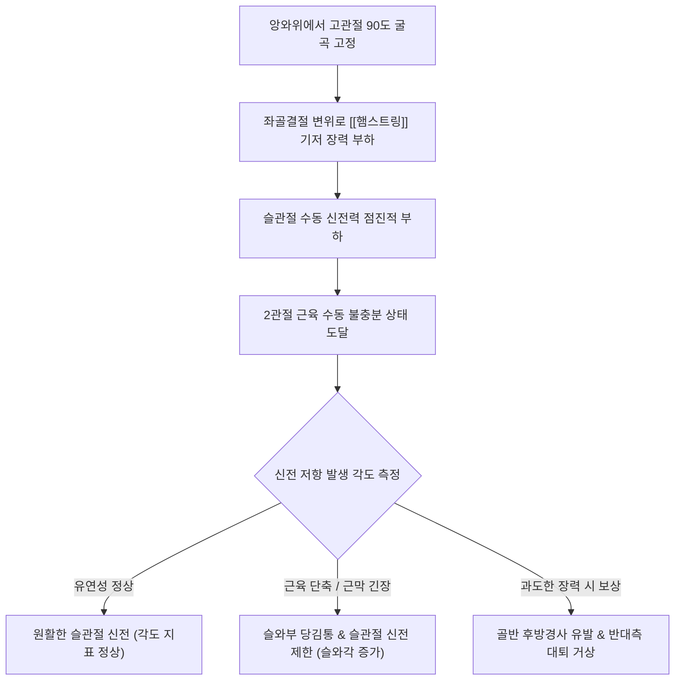

---
aliases:
  - "Popliteal Angle Test"
  - "슬와각 검사"
  - "슬와각도 검사"
  - "햄스트링 유연성 검사"
tags:
  - "이학적검사"
  - "슬관절"
  - "고관절"
  - "햄스트링"
  - "유연성"
  - "뇌성마비"
created: "2024-02-27"
updated: "2026-09-14"
---

# 슬와각 검사 (Popliteal Angle Test)

> **핵심 3줄 요약 (Key Summary)**:
> 🎯 앙와위에서 검사측 고관절을 90도 굴곡시킨 상태로 고정하고, 슬관절을 수동적으로 가능한 최대로 신전시켜 수직 기준선과 하퇴 장축이 이루는 각도(슬와각)를 측정하는 검사이다.
> 🚩 [[햄스트링]](대퇴이두근, 반건양근, 반막양근)의 단축, 구축 및 긴장도를 정량적으로 평가하며, 요천추 골반 역학 및 골반 후방경사 유발 인자를 분석한다.
> 🔬 고전적 측정 기준에서 평균 각도는 약 74도(남성 77도, 여성 71도) 내외로 나타나며, 신전 결손각(Extension deficit) 기준 시 통상 15~30도 미만을 정상 유연성으로 평가한다.
> ⚠️ 반대측 하지가 침대에서 들뜨면 골반 후방경사로 인한 위음성이 발생하므로 반대측 대퇴부를 침대에 확고히 밀착 고정해야 한다.

---

## 1. 개요 및 검사 목적

슬와각 검사(Popliteal Angle Test)는 무릎 뒤쪽 오금 부위(슬와, Popliteal fossa)를 가로지르는 하지 후면의 핵심 근육군인 [[햄스트링]](Hamstrings)의 유연성, 근육 길이 및 구축(Contracture) 정도를 정량적인 각도(Degree)로 측정하기 위해 개발된 대표적인 정형외과 및 재활의학적 이학적 검사이다.

임상적으로 소아 재활(뇌성마비 아동의 슬관절 굴곡 구축 및 보행 분석), 스포츠 의학(단거리 육상, 축구 등 햄스트링 부상 위험도 선별), 그리고 척추 관절 클리닉(만성 요통 환자의 골반 후방경사 및 요추 전만 소실 원인 감별)에서 필수적인 기초 측정 도구로 활용된다.

![[Pasted image 20240227001608.png|360]]
> **[도해] 슬와각(Popliteal Angle) 측정 기전**: 고관절을 90도 굴곡하여 대퇴부를 수직으로 고정한 상태에서 슬관절을 수동 신전시킬 때 형성되는 각도를 측정한다.

---

## 2. 해부학 및 생체역학 기전

### 생체역학 메커니즘

[[햄스트링]] 근육군([[대퇴이두근]], [[반건양근]], [[반막양근]])은 좌골결절(Ischial tuberosity)에서 기시하여 슬관절을 지나 경골과 비골에 정지하는 전형적인 2관절 근육(Bi-articular muscle)이다.
1. **수동 불충분(Passive Insufficiency)의 활용**:
   - 고관절을 90도 굴곡시키면 햄스트링의 근위부 기시점(좌골결절)이 후하방으로 당겨지면서 근육 전체에 기저 긴장(Pre-tension)이 걸리게 된다.
   - 이 상태에서 원위부 정지점인 슬관절을 신전시키면 햄스트링은 두 관절 모두에서 최대로 신장되어 수동 불충분(Passive insufficiency) 상태에 도달한다.
2. **저항력 발생 및 정지점(End-feel)**:
   - 햄스트링의 유연성이 충분한 정상인에서는 슬관절이 거의 완전 신전에 가깝게 펴지지만, 근육 섬유의 단축이나 근막 긴장이 있는 환자는 저항감이 발생하며 특정 각도 이상 신전되지 못하고 단단한 근막 탄성 저항(Firm elastic end-feel)과 함께 오금 뒤쪽의 당김통을 호소하게 된다.
3. **골반 연쇄 보상(Pelvic Compensation)**:
   - 햄스트링에 강력한 장력이 부하될 때 신전력을 더 가하면, 장력이 좌골결절을 전하방으로 당겨 골반을 강제로 후방경사(Posterior pelvic tilt)시키고 요추 전만을 편평화(Flat back)시키려는 보상 움직임이 나타난다.

### 검사 시 관여 조직 및 해부학적 구조

| 구조물 분류 | 관여 조직 및 명칭 | 슬와각 검사 시 생체역학적 역할 |
| :--- | :--- | :--- |
| **표적 근육군** | [[햄스트링]] ([[대퇴이두근]], [[반건양근]], [[반막양근]]) | 고관절 굴곡 + 슬관절 신전에 따른 최대 수동 신장 |
| **기시·정지 골격** | 좌골결절(Ischial tuberosity), 경골 내측사면, 비골두 | 장력의 기계적 전달 지지점, 골반 후방경사 견인력 전달 |
| **신경계** | [[좌골신경]](Sciatic nerve), 경골신경(Tibial nerve) | 슬관절 신전 시 신경 주행 경로 신장, 신경통 동반 여부 관찰 |
| **대항근(길항근)** | [[대퇴사두근]], [[장요근]] | 수동 검사 시 이완 상태 유지, 능동 검사 시 수축 관여 |

---

## 3. 검사 방법 및 절차

### 검사 전 준비
1. 환자를 진찰대에 편안하게 앙와위(Supine)로 눕힌다.
2. 반대측 하지는 침대 바닥에 무릎이 완전히 펴진 상태로 수평 밀착되도록 유지한다. 반대측 다리가 들뜨면 골반 후방경사가 발생하여 검사 결과가 왜곡된다.

![[popliteal_angle_clinical_maneuver.jpg|450]]
> **[도해] 슬와각 검사의 임상 시술 및 측정**: 검사자가 한 손으로 대퇴부를 수직(90도)으로 견고하게 유지하고, 다른 손으로 발목을 쥐고 슬관절을 신전시키며 형성되는 각도를 측정한다.

### 단계별 시행 절차

#### 1단계: 고관절 90도 굴곡 및 대퇴 고정 (Step 1)
- 검사자는 환자의 측면에 위치하여, 검사하려는 쪽의 고관절을 정확히 90도 굴곡시킨다.
- 한 손으로 환자의 대퇴골 원위부(슬개골 상부)를 단단히 감싸 쥐어 대퇴부가 수평면과 90도 수직을 유지하도록 확고하게 위치를 고정한다.

#### 2단계: 슬관절 수동 신전 및 각도 측정 (Step 2)
- 검사자의 다른 손으로 환자의 하퇴 원위부(발목 관절 직상부)를 부드럽게 감싼다.
- 대퇴부의 90도 수직 위치가 흐트러지지 않도록 주의하면서, 슬관절을 천천히 위쪽으로 수동 신전(Passive knee extension)시킨다.
- 강한 저항감(Firm end-feel)이 느껴지거나 환자가 오금 뒤쪽의 뚜렷한 당김통을 호소하여 저항하는 지점에서 동작을 멈춘다.
- 각도기(Goniometer)를 슬관절 외측 중심(대퇴골 외측상과)에 위치시키고 슬와각을 계측한다.

### 검사 시연 영상
- [Popliteal Angle Measurement in Clinical Practice](https://www.youtube.com/watch?v=TBLXd5ivPrA)
- [Hamstring Flexibility & Popliteal Angle](https://www.youtube.com/watch?v=bOh5tkdUwC0)

---

## 4. 양성 판정 기준 및 임상적 의의

슬와각의 수치는 측정 기준 정의(신전 결손각 기준 vs 굴곡 잔여각 기준)에 따라 수치 해석이 다르므로 임상 차팅 시 기준을 명확히 해야 한다.

### 정상치 및 성별 기준 (고전적 측정 기준)

원문 임상 필기에 기술된 기준은 고전적 측정 각도 기준이다:
- **전체 평균 각도**: 약 **74도** 내외
- **성별 평균치**: **남성 약 77도**, **여성 약 71도** (여성이 남성에 비해 골반 구조 및 인대 유연성으로 인해 무릎이 더 잘 펴져 각도 수치가 낮게 측정됨).

### 각도 측정 체계 비교 분석

| 측정 기준 체계 | 측정 방식 | 정상 유연성 범위 | 단축 및 구축 판정 |
| :--- | :--- | :--- | :--- |
| **신전 결손각 기준 (Extension Deficit)** *(현대 정형외과학 표준)* | 대퇴골의 가상 수직선과 경골 장축 사이의 각도 (완전 신전 = 0도) | **15도 ~ 30도 미만** | **35도 ~ 40도 이상**: 유의한 햄스트링 단축 **50도 이상**: 중증 근구축 |
| **관절 굴곡 잔여각 기준 (Flexion Angle)** *(고전적 임상 필기 기준)* | 대퇴부와 하퇴부가 이루는 내측 포함 각도 (직각 = 90도) | **70도 ~ 75도 내외** | **80도 ~ 85도 이상**: 햄스트링 유연성 현저한 저하 |

### 진단 정확도 및 신뢰도 지표

| 통계 지표 | 수치 범위 | 임상적 해석 |
| :--- | :--- | :--- |
| **검사자 간 신뢰도 (Inter-rater ICC)** | 0.82 ~ 0.93 | 골반 및 대퇴 고정이 확고할 때 매우 높은 측정 재현성 보임 |
| **검사자 내 신뢰도 (Intra-rater ICC)** | 0.88 ~ 0.96 | 단일 검사자의 치료 전후 호전도 추적 관찰에 최적의 지표 |

---

## 5. 감별 진단 및 유사 검사

슬와각 검사는 하지 후면의 유연성과 신경 긴장도를 평가하는 여러 검사법과 유기적으로 연결된다.

| 검사명 | 주 측정 대상 | 검사 동작 특성 | 감별 진단 포인트 |
| :--- | :--- | :--- | :--- |
| **슬와각 검사** | [[햄스트링]] 순수 근육 길이 | 고관절 90도 굴곡 고정 상태에서 **슬관절만 단독 신전** | 골반 회전을 최소화하여 햄스트링의 순수 단축 각도 계측 |
| [[SLR test]] (하지직거상) | [[좌골신경]] 신경근 압박, 요추간판 탈출 | 무릎을 완전히 편 상태에서 **고관절 전체를 거상** | 35~70도 사이 방사통 재현 시 신경근 압박 확진 |
| [[브라가드 검사]] | 신경인성 좌골신경통 감별 | SLR 양성 각도에서 5도 내린 후 족관절 배굴 | 신경만 선택적으로 신장시켜 근육통과 신경통 감별 |
| [[토마스 검사]] | [[장요근]], [[대퇴직근]] 고관절 굴곡근 | 반대측 고관절 굴곡 시 검사측 대퇴 신전 상태 확인 | 하지 전면 고관절 굴곡근의 단축 및 골반 전방경사 평가 |
| [[오버 검사]] | [[대퇴근막장근]], 장경인대(ITB) | 측와위에서 고관절 외전·신전 후 내전 낙하 평가 | 외측 하지 지지 구조물의 단축 평가 |

---

## 6. 주의사항 및 위양성/위음성 요인

### 위양성(False Positive) 요인
1. **좌골신경의 신경학적 포착(Sciatic nerve tension)**: [[좌골신경]] 자체의 단축이 아니라 햄스트링 자체의 단축이 아니라 이상근 증후군이나 요추간판 탈출증으로 좌골신경이 긴장되어 있는 경우, 슬관절 신전 시 신경 견인통으로 인해 무릎을 펴지 못하고 조기에 저항이 발생할 수 있다.
2. **슬관절 자체의 굴곡 구축(Knee flexion contracture)**: 슬관절 관절낭의 구축, 퇴행성 관절염, 반월상 연골 파열 등으로 관절 자체의 신전 제한이 있는 경우 햄스트링 단축으로 오인될 수 있다.

### 위음성(False Negative) 요인
1. **골반 후방경사 보상 허용**: 반대측 다리가 침대에서 들뜨거나 검사측 골반이 뒤로 기울어지는 것을 방치하면, 햄스트링의 실제 길이에 비해 무릎이 더 많이 펴져 정상인 것처럼 왜곡된다.
2. **대퇴부 90도 각도 붕괴**: 검사 중 환자의 대퇴부가 90도 수직을 유지하지 못하고 전방으로 기울어지면(고관절 굴곡 각도 감소) 인위적으로 슬관절 신전 각도가 커진다.

---

## 7. 진료실 핵심 임상 필기

### 💡 원장실 실전 노하우 & 진료실 체크리스트
- **원문 필기 100% 융합 및 실전 적용**:
  - 원문 기록: *"[[햄스트링]] 단축, 긴장을 확인하기 위한 검사. 평균적으로 74도 정도 나오며, 남자는 77도, 여자는 71도 정도 나온다."*
  - **골반-요추 리듬(Lumbopelvic Rhythm) 진단의 핵심 열쇠**: 만성 요통 환자 중 골반이 뒤로 누워 일자허리(Flat back)가 된 환자의 대다수는 슬와각 검사에서 유의한 단축을 보인다. 햄스트링이 좌골결절을 아래로 잡아끌면 서 있을 때 골반이 후방경사되고 요추 전만이 소실되어 디스크 후방 섬유륜에 만성적인 압박이 걸린다. 요통 치료 시 허리만 볼 것이 아니라 슬와각을 반드시 측정하여 햄스트링을 치료해야 재발을 막을 수 있다.
  - **좌골신경통 vs 햄스트링 단축 원터치 감별법**: 슬관절을 신전시켜 당김통이 나타난 저항 지점에서, **환자의 발목을 발등 쪽으로 젖히는 족관절 배굴(Dorsiflexion)**을 살짝 추가해 본다. 발목을 젖혔을 때 찌릿한 전기 통증이 종아리나 발바닥으로 뻗치면 [[좌골신경]] 병변이며, 통증 변화 없이 오금의 묵직한 근육 당김만 유지된다면 순수 [[햄스트링]] 단축이다.

### 🗣️ 환자 티칭 & 설명 스크립트
> "환자분, 지금 무릎 뒤쪽 오금의 각도를 재어보았습니다. 정상적으로는 무릎이 거의 수직에 가깝게 시원하게 펴져야 하는데, 환자분은 약 50도 부근에서 허벅지 뒤쪽 근육이 팽팽한 고무줄처럼 굳어 더 이상 펴지지 않습니다. 허벅지 뒤쪽의 [[햄스트링]] 근육이 굳어 짧아지면, 엉덩이 골반뼈를 아래로 강하게 끌어당겨 허리의 자연스러운 C자 곡선(요추 전만)을 무너뜨리고 일자허리를 만듭니다. 허리 디스크에 지속적인 부담을 주는 근본 원인이 바로 이 허벅지 뒷근육의 단축이므로, 침 치료와 스트레칭으로 이 근육의 길이를 정상으로 회복시켜야 허리 통증이 근본적으로 해결됩니다."

### 🌿 한의 임상 치료 연계 프로토콜
- **햄스트링 침구 및 도침 요법**:
  - **혈자리 타겟**: 은문(BL37), 위중(BL40), 부극(BL38), 승부(BL36).
  - **도침(Acupotomy) 치료**: 좌골결절 기시부 및 반건양근-대퇴이두근 근육-건 이행부(Musculotendinous junction)의 만성 유착과 섬유화 부위에 도침 치료를 적용하여 영구적인 구축을 박리하고 정상 근육 길이를 복원.
  - **약침 요법**: 좌골결절 기시부의 만성 건병증에는 신바로약침 또는 자하거약침을 시술하여 조직 재생 유도.
- **추나 요법 연계 (MET 및 골반 교정)**:
  - **근에너지기법(PIR / Post-Isometric Relaxation)**: 검사 자세(고관절 90도)에서 환자에게 약 20%의 힘으로 무릎을 굽히는 방향(검사자 손에 저항)으로 7초간 등척성 수축을 유도한 뒤, 숨을 내쉴 때 슬관절을 부드럽게 추가 신전시켜 새로운 유연성 장벽을 확보하는 치료를 3~5회 반복.
  - 골반 변위 교정: 장골 후하방 변위(PI ilium) 교정 추나 병행.

---

## 8. 참고문헌 및 학술 연구 (References)

1. **Interrater reliability for unilateral and bilateral tests to measure the popliteal angle in children and youth with cerebral palsy.**
   - 저자: Cloodt E, Krasny J, Jozwiak M.
   - 저널: *BMC Musculoskelet Disord*. 2021 Mar 13;22(1):276.
   - PMID: [33714264](https://pubmed.ncbi.nlm.nih.gov/33714264/) | DOI: [10.1186/s12891-021-04149-1](https://doi.org/10.1186/s12891-021-04149-1)
   - `[연구 요약]`: 뇌성마비 및 근골격계 환자에서 단측 및 양측 슬와각 측정법의 검사자 간 신뢰도를 평가하여, 반대측 하지 고정의 엄격성에 따른 높은 재현성(ICC > 0.85)과 햄스트링 구축 진단 지표로서의 타당성을 입증함.

2. **Short-term effects of the suboccipital muscle inhibition technique and cranio-cervical flexion exercise on hamstring flexibility, cranio-vertebral angle, and range of motion of the cervical spine in subjects with neck pain: A randomized controlled trial.**
   - 저자: Jeong ED, Kim CY, Kim SM.
   - 저널: *J Back Musculoskelet Rehabil*. 2018;31(5):829-837.
   - PMID: [30248030](https://pubmed.ncbi.nlm.nih.gov/30248030/) | DOI: [10.3233/BMR-170940](https://doi.org/10.3233/BMR-170940)
   - `[연구 요약]`: 후두하근 이완 및 경추 운동이 천근후방경선(Superficial Back Line) 근막 연쇄를 통해 [[햄스트링]] 유연성 및 슬와각 개선에 미치는 영향을 규명하여 전신 근막 연결망의 임상적 치료 근거를 제공함.

3. **Interobserver and intraobserver reliability in lower-limb flexibility measurements.**
   - 저자: Atamaz F, Ozcaldiran B, Ozdedeli S.
   - 저널: *J Sports Med Phys Fitness*. 2011 Dec;51(4):612-8.
   - PMID: [22212274](https://pubmed.ncbi.nlm.nih.gov/22212274/)
   - `[연구 요약]`: 하지 유연성을 측정하는 다양한 이학적 검사법(슬와각 검사, 토마스 검사, 엘리 검사 등)의 검사자 내 및 검사자 간 신뢰도를 비교 분석하여 슬와각 계측의 높은 표준화 수준을 검증함.