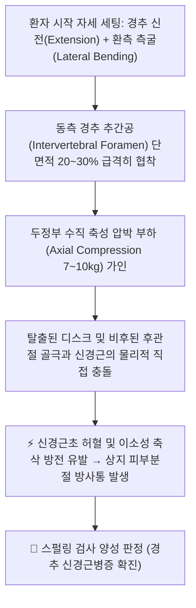
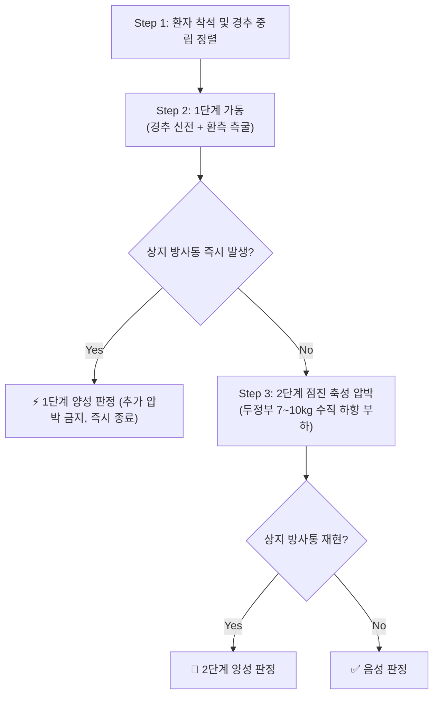

# 🩺 [[스펄링 검사]] (Spurling's Test / Neck Compression Test)

> **핵심 3줄 요약 (Key Summary)**:
> - 🎯 검사 목적 & 타겟 병소: 경추 신경근병증([[경추 추간판 탈출증]], 추간공 협착) 감별, 타겟 병소인 경추 신경근(C5~C8 Cervical Nerve Roots) 및 경추 추간공(Intervertebral Foramen).
> - 🔍 검사 시행 프로토콜 & 양성 반응: 환자 경추를 신전 및 환측 측굴시킨 후 1단계 반응을 보고, 증상 미발현 시 두정부에 7~10kg 점진적 수직 압박을 가하여 상지로 뻗치는 날카로운 방사통(Radicular pain) 유발 시 양성.
> - 📊 진단 정확도(민감도·특이도) & 임상적 의의: 민감도는 30~50% 수준이나 특이도가 83~100%로 매우 높아, 양성 시 경추 신경근 압박을 강력히 확진(Rule-In)할 수 있는 대표적 도발 검사.
> - ⚠️ 위양성/위음성 요인 & 검사 금기: 급성 경추 골절, 경추 불안정성, 척수병증(Myelopathy) 시 과도한 압박 절대 금기, 후관절 증후군으로 인한 단순 목 주변 국소 통증을 방사통과 감별 필수.

---

## 📌 목차
1. [검사 기본 정보 & 진단 목적 (Diagnostic Overview)](#1-검사-기본-정보--진단-목적-diagnostic-overview)
2. [해부학적 유발 메커니즘 & 생체역학적 원리 (Biomechanical Mechanism)](#2-해부학적-유발-메커니즘--생체역학적-원리-biomechanical-mechanism)
3. [표준 검사 시행 절차 (Step-by-Step Clinical Protocol)](#3-표준-검사-시행-절차-step-by-step-clinical-protocol)
4. [양성 반응 판정 기준 & 신경근/조직별 감별 맵핑 (Diagnostic Criteria & Mapping)](#4-양성-반응-판정-기준--신경근조직별-감별-맵핑-diagnostic-criteria--mapping)
5. [연관 검사군 비교 & 다단계 감별 알고리즘 (Differential Battery & Algorithm)](#5-연관-검사군-비교--다단계-감별-알고리즘-differential-battery--algorithm)
6. [양성 소견 시 한의 임상 연계 치료 전략 (Integrative Korean Medicine)](#6-양성-소견-시-한의-임상-연계-치료-전략-integrative-korean-medicine)
7. [💡 사용자 진료실 핵심 필기 & 실전 임상 팁 (원문 보존)](#7--사용자-진료실-핵심-필기--실전-임상-팁-원문-보존)
8. [출처 및 학술 참고 문헌 (References)](#8-출처-및-학술-참고-문헌-references)

---

## 1. 검사 기본 정보 & 진단 목적 (Diagnostic Overview)

![[PNP_Fig_1_CervicalPlexus.png|450]]
> [그림 1: 경추 신경근(Cervical Nerve Roots) 주행 및 추간공 압박 기전 해부학 도해]

| 항목 | 상세 내용 |
| :--- | :--- |
| **검사명 (Test Name)** | Spurling's Test (스펄링 검사 / 경추 추간공 압박 검사 / Neck Compression Test) |
| **분류 (Category)** | 정형외과적·신경학적 경추 도발 검사 (Cervical Provocation Test) |
| **타겟 병소 (Target)** | 경추 추간공(Intervertebral Foramen), 경추 신경근(C5~C8) 및 후관절(Facet Joint) |
| **의심 질환 (Suspected Pathologies)** | [[경추 추간판 탈출증]](Cervical HNP), 경추 신경근병증(Cervical Radiculopathy), 경추 추간공 협착증 |
| **진단 정확도 (Diagnostic Accuracy)** | • **민감도 (Sensitivity)**: 30 ~ 50% (음성이라도 디스크를 완전히 배제할 수는 없음) • **특이도 (Specificity)**: 83 ~ 100% (양성일 경우 신경근 압박 확진에 매우 유용) • **양성 우도비 (LR+)**: 7.3 ~ 30.0+ |
| **시연 영상 (Video Guide)** | [🎥 시연 영상: Physiotutors - Spurling's Test for Cervical Radicular Syndrome](https://youtu.be/3ZSNdv0o0yk) |

---

## 2. 해부학적 유발 메커니즘 & 생체역학적 원리 (Biomechanical Mechanism)

### 1) 경추 3차원 복합 가동에 의한 추간공 협착
* 경추를 신전시키면 후방 관절낭과 황색인대가 전방으로 접혀 들어가고, 환측으로 측굴하면 동측의 추간공 직경이 최소화됩니다.
* 이 상태에서 두정부에 수직 하중(Axial load)을 가하면 디스크 후외측 내압이 증가함과 동시에 좁아진 추간공 내에서 염증 상태의 신경근(Nerve root)이 기계적으로 압박(Pinching)됩니다.

### 2) 후관절증(Facet Syndrome)과 신경근 압박의 생체역학적 감별
* 후관절에 관절염이나 활액막염이 있는 경우에도 압박 시 통증이 유발될 수 있으나, 이는 **경항부 및 승모근에 국한된 국소 뻐근함**으로 나타납니다.
* 반면 진정한 신경근 압박은 Anekstein 연구에서 증명된 바와 같이 **상완, 전완, 손가락 끝으로 뻗치는 원위부 전격성 방사통(Distal pain)**으로 발현됩니다.

---

## 3. 표준 검사 시행 절차 (Step-by-Step Clinical Protocol)

### Step 1: 환자 준비 및 초기 자세 (Starting Position)
* 환자는 등받이가 없는 의자에 허리와 등을 곧게 펴고 편안하게 앉습니다 (착석 중립 자세).
* 검사자는 환자의 뒤에 서서 환자의 경추 안정성과 기본 가동 범위를 육안으로 확인합니다.

### Step 2: 1차 유발 기동 (1st Maneuver - 신전 및 환측 측굴)
![[스펄링검사_1단계_신전_환측측굴_동작.jpg|400]]
> [그림 2: 1단계 - 환자의 경추를 신전(Extension)시키고 통증이 있는 환측으로 측굴(Lateral bending)시킨 기본 유발 자세]

* 환자의 고개를 약 30도 신전시킨 후, 증상이 있는 쪽(환측)으로 부드럽게 측굴시킵니다.
* **⚠️ 임상 안전 수칙**: Physiotutors 가이드라인 및 Anekstein(2011) 연구에 따르면 이 1단계 자세만으로도 이미 신경근 압박이 심한 환자는 방사통이 유발됩니다. **이 단계에서 방사통이 나타나면 2단계 압박을 가하지 않고 즉시 검사를 종료(1단계 양성)합니다.**

### Step 3: 2차 점진적 부하 가인 (2nd Maneuver - 두정부 축성 압박)
![[스펄링검사_2단계_두정부_축성압박_동작.jpg|400]]
> [그림 3: 2단계 - 1단계에서 음성일 때, 검사자가 양손으로 두정부에 7~10kg의 수직 하향 압박(Axial compression)을 점진적으로 가하는 모습]

* 1단계 자세에서 증상이 유발되지 않은 경우에 한하여 진행합니다.
* 검사자는 양손을 깍지 끼거나 정수리(두정부)에 안정적으로 얹고, 척추 장축 방향으로 점진적으로 체중을 실어 7~10kg의 수직 하향 압력을 가합니다.
* **주의**: 갑작스러운 충격(Thrust)이나 쾅 누르는 동작은 급성 척수 손상을 유발할 수 있으므로 절대 금기입니다.

### Step 4: 즉각 반응 평가 및 부하 해제 (Release & Safety)
![[스펄링검사_단계적_점진부하_프로토콜.jpg|400]]
> [그림 4: 스펄링 검사의 단계적 점진 부하(Gradual Escalation) 프로토콜 전체 요약]

* 환자가 상지로 뻗치는 찌릿한 방사통을 호소하는 즉시 압박을 멈추고 부하를 완전히 제거합니다.
* 통증 발생 시 1초 이내에 압박을 해제하여 신경 허혈 지속 및 신경 손상을 철저히 예방합니다.

---

## 4. 양성 반응 판정 기준 & 신경근/조직별 감별 맵핑 (Diagnostic Criteria & Mapping)

* **진정한 양성 (True Positive - 경추 신경근병증 확진)**:
  * 머리를 신전/측굴하거나 누르는 순간, 환자가 평소 겪던 팔 저림이나 전격통이 어깨, 견갑골 내측, 상완, 전완, 손가락으로 동일하게 뻗쳐나갈 때.
* **가양성 (False Positive - 후관절증 또는 근막통증증후군)**:
  * 팔로 뻗치는 방사통 없이 목 뒤나 승모근 부위에 국한된 뻐근한 국소 압통만 발생하는 경우.

| 이환 신경근 레벨 | 주요 압박 원인 분절 | 전형적 방사통 및 감각 저하 부위 | 주요 근력 약화 평가 지표 | 심부건반사 (DTR) |
| :--- | :--- | :--- | :--- | :--- |
| **C5 신경근** | C4-C5 디스크 탈출 | 어깨 외측(삼각근 부위), 상완 외측 | [[삼각근]](견관절 외전), 상완이두근 | 상완이두근 건반사 저하 |
| **C6 신경근** | C5-C6 디스크 탈출 | 전완 외측(요측), 1~2지(엄지·검지) | 상완이두근(주관절 굴곡), 수근신근 | 상완요골근 건반사 저하 |
| **C7 신경근** | C6-C7 디스크 탈출 | 중지(3지), 손등, 전완 후면 | [[상완삼두근]](주관절 신전), 수근굴근 | 상완삼두근 건반사 저하 |
| **C8 신경근** | C7-T1 디스크 탈출 | 4~5지(약지·소지), 전완 내측(척측) | 수부 내재근(골간근 파지력, 손가락 벌림) | 내재근 반사 저하 |

---

## 5. 연관 검사군 비교 & 다단계 감별 알고리즘 (Differential Battery & Algorithm)

| 검사명 | 검사 수기 및 동작 | 병태생리적 원리 | 임상적 역할 및 특성 |
| :--- | :--- | :--- | :--- |
| [[스펄링 검사]] (본 검사) | 경추 신전 + 측굴 + 수직 압박 | 추간공 협착 및 신경근 직접 압박 | **특이도 83~100% (신경근병증 확진용)** |
| [[경추 견인 검사]](Distraction) | 머리를 양손으로 잡고 상방 견인 | 추간공 확대 및 신경근 압박 해제 | **방사통 즉각 감소 시 양성 (완화 검사)** |
| [[상지 신경긴장 검사]](ULTT / Elvey) | 상지 외전·신전·외회전 신경 신장 | 신경 주행 경로 장력 최대화 | **민감도 97%+ (신경근병증 선별/배제용)** |
| [[어깨 외전 징후]](Bakody sign) | 환측 손을 정수리 위에 얹는 자세 | 신경근 장력 이완 및 감압 | **통증 완화 시 C5/C6 신경근병증 시사** |

---

## 6. 양성 소견 시 한의 임상 연계 치료 전략 (Integrative Korean Medicine)

* **침구 및 전침 치료 (Acupuncture & EA)**:
  * **병변 협척혈 자침**: C5~C7 경추 신경근 출구부 협척혈(Huatuojiaji)에 40~50mm 호침을 직자하고 2~4Hz 저주파 전침을 15분간 통전하여 신경근 주변 미세혈류 개선 및 부종 완화.
* **신경근 약침 요법 (Pharmacopuncture)**:
  * 신바로약침 또는 중성어혈약침 1.0~2.0cc를 경추 추간공 후외측 인대 및 관절돌기 주변에 주입하여 화학적 염증성 사이토카인(IL-1, TNF-$\alpha$) 분비를 차단하고 신경 유착을 박리.
* **경추 감압 추나 치료 (Cervical Decompression Chuna)**:
  * 급성기 디스크 파열 및 척수 손상 위험이 있는 고속저진폭(HVLA) 스러스트는 절대 금기하며, **경추 수기 견인 기법(Manual Traction)** 및 후두하근막 이완(Suboccipital Release) 위주의 관절가동추나를 안전하게 적용.
* **한약 처방 (Herbal Medicine)**:
  * **급성 신경근 염증기**: [[영선제통음]], [[오적산]], [[갈근탕]] (소염진통, 근육 경련 이완).
  * **만성 신경 포착 및 마비기**: [[독활기생탕]], [[서경탕]], [[보양환오탕]] (신경 영양 공급 및 기혈 순환 촉진).

---

## 7. 💡 사용자 진료실 핵심 필기 & 실전 임상 팁 (원문 보존)

* **사용자 원문 필기 (100% 보존)**:
  * [방법]: 고개를 젖히고 환측으로 머리를 돌리게 함.
  * [의의]: 국소 통증은 추간공의 압박, 방사통은 신경근 압박으로 인한 경추 [[추간판 탈출증]]을 의심해 볼 수 있다.
* **진료실 실전 노하우 & 안전 팁**:
  1. **단계적 점진 부하 원칙 준수**: 환자가 고개를 뒤로 젖히고 꺾는 1단계 동작만으로도 아파하면 절대 누르지 않는다.
  2. **완화 검사(견인 검사) 우선 시행 고려**: 통증이 극심한 환자에게는 유발 검사로 고통을 주기보다 머리를 위로 들어 올려주는 [[경추 견인 검사]]를 먼저 시행하여 "팔 저림이 줄어드는지" 확인하는 것이 라포 형성에 훨씬 좋다.
  3. **디스크 vs [[흉곽출구 증후군]] 감별**: 스펄링 양성(정수리 누를 때 방사통 악화)은 경추 디스크이고, 팔을 위로 들고 쥐었다 펼 때 저림이 악화되는 [[루스 검사]] 양성은 흉곽출구 증후군이다.

---

## 8. 출처 및 학술 참고 문헌 (References)

1. **Spurling, R. G. & Scoville, W. B. (1944)**. *Lateral rupture of the cervical intervertebral discs: A common cause of shoulder and arm pain*. **Surg Gynecol Obstet**, 78, 350-358.
   - **[클래식 원전]**: 경추 추간판 탈출증 환자에서 추간공 압박 검사의 진단적 가치를 최초로 체계화한 논문.
2. **Anekstein, Y. et al. (2011)**. *How to perform the Spurling test: Investigating the best combination of movements to provoke radicular pain*. **Spine**, 36(26), 2260-2265.
   - **[핵심 연구 요약]**: 스펄링 검사의 6가지 변형 수기를 비교한 결과, '신전 + 환측 측굴 + 축성 압박' 조합이 가장 높은 VAS 통증과 원위부 방사통을 유발하여 단순 경추증과 실제 신경근병증을 감별하는 최적의 방법임을 규명.
3. **Wainner, R. S. et al. (2003)**. *Reliability and diagnostic accuracy of the clinical examination and patient self-report measures for cervical radiculopathy*. **Spine**, 28(1), 52-62.
   - **[연구 요약]**: 스펄링 검사(민감도 50%, 특이도 83%), 경추 견인 검사, 상지 신경긴장 검사(ULTT), 회전 가동범위 제한의 4가지 조합 시 경추 신경근병증 진단 정확도가 99%에 달함을 규명.
4. **Physiotutors (2016)**. *Spurling's Test | Cervical Radicular Syndrome*. YouTube Reference (https://youtu.be/3ZSNdv0o0yk).
   - **[시연 영상 요약]**: 경추 신전 및 측굴 1단계 후 단계적으로 축성 압박을 가하는 표준 검사 프로토콜 및 진단 정확도 해설.
