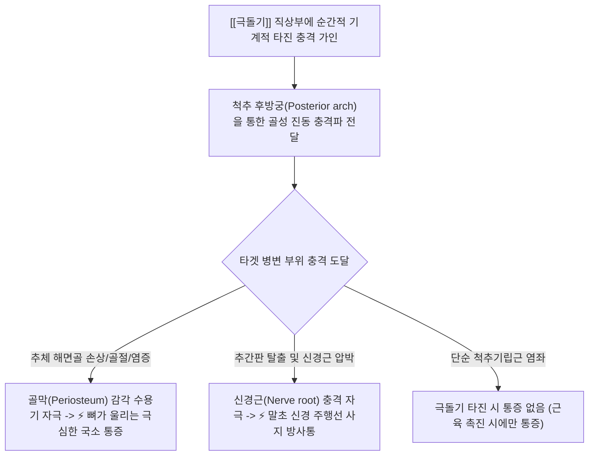
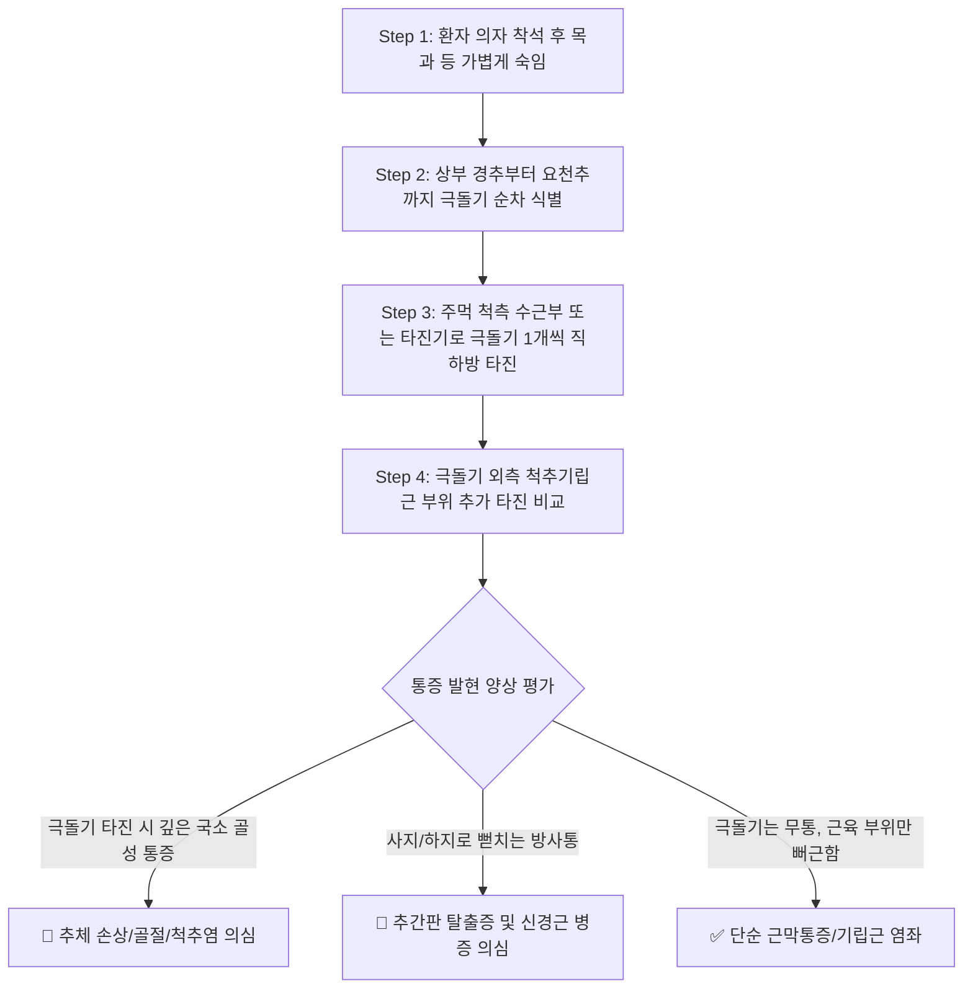

# 🩺 [[척추 타진 검사]] (Spinal Percussion Test)

> **핵심 3줄 요약 (Key Summary)**:
> - 🎯 검사 목적 & 타겟 병소: 골다공증성 척추 압박 골절(OVCF), 감염성 척추염(결핵/골수염), [[추간판 탈출증]] 및 척추 전이암 선별, [[척추체]] 및 [[추간판]] 손상 감별.
> - 🔍 검사 시행 프로토콜 & 양성 반응: 좌위에서 경추 및 흉요추를 가볍게 굴곡시킨 후 검사자의 주먹(수근부) 또는 타진기로 각 척추 극돌기 및 기립근을 타진, 국소 골성 압통(추체 손상/골절) 또는 하지 방사통(추간판 탈출증) 발현 시 양성 판정.
> - 📊 진단 정확도(민감도·특이도) & 임상적 의의: Closed Fist Percussion Sign의 민감도는 85% 이상으로, 고령 환자의 급성 요배통 시 단순 염좌와 척추 압박 골절을 일차 감별하는 가장 필수적인 침상 검사임.
> - ⚠️ 위양성/위음성 요인 & 검사 금기: 심한 골다공증 환자에게 과도한 강타진 시 이차적 골절 위험, 극돌기 바로 옆 근육 압통과 극돌기 직상부 골성 진동통을 명확히 구분하여 가양성 배제.

---

## 📌 목차
1. [검사 기본 정보 & 진단 목적 (Diagnostic Overview)](#1-검사-기본-정보--진단-목적-diagnostic-overview)
2. [해부학적 유발 메커니즘 & 생체역학적 원리 (Biomechanical Mechanism)](#2-해부학적-유발-메커니즘--생체역학적-원리-biomechanical-mechanism)
3. [표준 검사 시행 절차 (Step-by-Step Clinical Protocol)](#3-표준-검사-시행-절차-step-by-step-clinical-protocol)
4. [양성 반응 판정 기준 & 국소통 vs 방사통 감별 맵핑 (Diagnostic Criteria & Mapping)](#4-양성-반응-판정-기준--국소통-vs-방사통-감별-맵핑-diagnostic-criteria--mapping)
5. [연관 검사군 비교 & 척추 외상 감별 알고리즘 (Differential Battery & Algorithm)](#5-연관-검사군-비교--척추-외상-감별-알고리즘-differential-battery--algorithm)
6. [양성 소견 시 한의 임상 연계 치료 전략 (Integrative Korean Medicine)](#6-양성-소견-시-한의-임상-연계-치료-전략-integrative-korean-medicine)
7. [💡 사용자 진료실 핵심 필기 & 실전 임상 팁 (원문 보존)](#7--사용자-진료실-핵심-필기--실전-임상-팁-원문-보존)
8. [출처 및 학술 참고 문헌 (References)](#8-출처-및-학술-참고-문헌-references)

---

## 1. 검사 기본 정보 & 진단 목적 (Diagnostic Overview)

![[척추타진검사_1단계_흉추극돌기_수근타진_실사.png|450]]
> [그림 1: 좌위에서 경추 및 상부 흉추를 전방 굴곡시킨 상태에서 극돌기를 주먹으로 가볍게 타진하는 모습]

| 항목 | 상세 내용 |
| :--- | :--- |
| **검사명 (Test Name)** | 척추 타진 검사 (Spinal Percussion Test / Closed Fist Percussion Sign) |
| **분류 (Category)** | 신경학적 및 골성 기계적 진동 유발 검사 / 척추 골절 선별 검사 |
| **타겟 병소 (Target)** | [[척추체]](추체 해면골), [[극돌기]], [[추간판]](섬유륜 및 수핵), [[척추기립근]], 척추신경근 |
| **의심 질환 (Suspected Pathologies)** | 골다공증성 척추 압박 골절(OVCF), [[추간판 탈출증]], 감염성 척추염, 척추 전이암 |
| **진단 정확도 (Diagnostic Accuracy)** | • **민감도 (Sensitivity)**: 84% ~ 88% (척추 압박 골절 진단 시) • **특이도 (Specificity)**: 80% ~ 85% (골성 병변과 단순 근육통 감별 시) • **양성 우도비 (LR+)**: 4.2 ~ 5.8 |
| **시연 영상 (Video Guide)** | [🎥 시연 영상: The Closed Fist Percussion Sign \| Osteoporotic Vertebral Fractures](https://www.youtube.com/watch?v=kkD8o5vlV8I) |

---

## 2. 해부학적 유발 메커니즘 & 생체역학적 원리 (Biomechanical Mechanism)

### 1) 기계적 진동 충격파의 골성 전파 (Osseous Wave Transmission)
* [[극돌기]](Spinous process)는 피하지방층 바로 아래에 위치하여 외부 기계적 타격에 직접 노출되어 있습니다.
* 극돌기를 타진하면 충격 에너지가 추궁판(Lamina)과 척추경(Pedicle)을 타고 앞쪽의 **[[척추체]](Vertebral body)**로 신속하게 전달됩니다.
* 척추체 내부에 골다공증성 미세 골절, 골소주 파탄, 골수염, 또는 종양 침윤이 존재하는 경우, 골막 신경 및 골수 통각 수용기가 격렬하게 반응하여 깊고 울리는 국소 통증이 즉각 유발됩니다.

### 2) 국소 골성 통증 vs 사지 방사통의 병태생리 차이
* **추체 손상 (Vertebral fracture / Spondylitis)**: 충격파가 골절단을 직접 흔들기 때문에 **타진한 해당 분절에 정확히 일치하는 국소 골성 압통(Localized bony pain)**이 재현됩니다.
* **추간판 손상 (Disc Herniation)**: 타진 충격이 추간판 수핵 내압을 순간적으로 상승시키고 탈출된 디스크를 흔들어 인접 신경근을 자극하므로, 타진 지점뿐만 아니라 **둔부 및 하지(경추 타진 시 상지)로 찌릿하게 전기가 통하는 듯한 방사통(Radicular pain)**이 동반됩니다.

---

## 3. 표준 검사 시행 절차 (Step-by-Step Clinical Protocol)

### Step 1: 환자 착석 및 척추 굴곡 자세 세팅 (Starting Position)
* 환자를 등받이가 없는 진료실 의자에 편안하게 앉힙니다.
* 환자에게 "고개를 가볍게 숙이고 등을 살짝 둥글게 구부리세요"라고 지시합니다.
* **자세의 의의**: 척추를 약간 굴곡시키면 극돌기 사이가 벌어지고 피부 표면으로 극돌기가 뚜렷하게 돌출되어 정확한 타진 타겟이 확보됩니다.

### Step 2: 흉추 및 상부 척추 타진 (Thoracic Spine Percussion)
![[척추타진검사_1단계_흉추극돌기_수근타진_실사.png|400]]
> [그림 2: 상체를 숙인 환자의 흉추 극돌기 라인을 따라 주먹의 새끼손가락 쪽(척측 수근부)으로 가볍게 타진하는 모습]

* 검사자는 주먹을 가볍게 쥐고(Closed fist), 새끼손가락 쪽 손바닥(Hypothenar/척측)을 이용하여 C7 융기추부터 T12까지 각 극돌기를 위에서 아래로 1~2회씩 톡톡 두드립니다.
* 또는 신경학적 고무 타진기(Percussion hammer)를 사용할 수 있습니다.

### Step 3: 요추 및 요천추부 타진 (Lumbar Spine Percussion)
![[척추타진검사_2단계_요추극돌기_골성타진_실사.png|400]]
> [그림 3: 요추 극돌기 부위를 타진기로 두드려 깊은 골성 통증 및 하지 방사통 재현 여부를 확인하는 모습]

* L1부터 L5 극돌기 및 천골 부위까지 동일한 강도로 타진을 이어갑니다.
* 극돌기 정중앙 타진 후, 극돌기 외측 2~3cm 지점의 [[척추기립근]] 부위도 대조 타진하여 근육성 압통과 골성 압통을 감별합니다.

---

## 4. 양성 반응 판정 기준 & 국소통 vs 방사통 감별 맵핑 (Diagnostic Criteria & Mapping)

* **진정한 양성 반응 (True Positive)**:
  * **1) 국소 골성 통증 (Local Bony Percussion Tenderness)**:
    * 특정 극돌기를 두드리는 순간, 환자가 "앗" 소리를 내며 깜짝 놀라거나 뼈 속 깊은 곳이 찌릿하게 울린다고 호소할 때 $\rightarrow$ **추체 압박 골절, 척추 감염, 전이암** 강력 시사.
  * **2) 방사통 재현 (Radicular Shock Pain)**:
    * 타진 시 허리뿐만 아니라 엉치, 허벅지, 종아리, 발가락 끝으로 전기가 찌릿하게 내려갈 때 $\rightarrow$ **[[추간판 탈출증]]** 강력 시사.
* **음성 반응 (Negative)**:
  * 척추 전체를 타진해도 통증이 없거나, 시원한 타진감만 느끼는 경우.
* **가양성 (False Positive) 감별**:
  * 극돌기 뼈 자체는 아프지 않고 양옆 근육만 뻐근하거나 멍든 느낌이 드는 경우는 단순 [[근막통증증후군]] 또는 기립근 긴장.

| 통증 발현 양상 | 타진 반응 특징 | 주요 의심 질환 | 권장 추가 검사 |
| :--- | :--- | :--- | :--- |
| **극돌기 직상부 국소 골성 압통** | 뼈가 울리는 듯한 날카롭고 깊은 통증 | 골다공증성 척추 압박 골절, 결핵성 척추염 | 척추 X-ray, Spine MRI, 골밀도(BMD) |
| **사지로 뻗치는 신경학적 방사통** | 분절 신경 주행선을 따른 감전통 | [[추간판 탈출증]](HIVD), 척추관 협착증 | [[SLR test]], [[Spurling test]], MRI |
| **극돌기 외측 근육 부위 압통** | 근복 부위의 뻐근하고 둔한 압통 | 척추주위근 염좌, [[근막통증증후군]] | 촉진 검사, 이완 약침 및 물리치료 |
| **광범위한 다발성 척추 타진통** | 전 척추에 걸친 극심한 통증 및 체중 감소 | 다발성 골수종, 척추 악성 전이암 | 혈액검사(ESR, CRP), 전신 뼈 스캔(Bone scan) |

---

## 5. 연관 검사군 비교 & 척추 외상 감별 알고리즘 (Differential Battery & Algorithm)

| 검사명 | 검사 수기 및 타겟 | 병태생리적 원리 | 주 감별 질환 및 임상적 역할 |
| :--- | :--- | :--- | :--- |
| [[척추 타진 검사]] (본 검사) | 좌위 극돌기 주먹/타진기 타진 | 골성 충격파 전파 및 신경근 자극 | 척추 압박 골절 선별 & 디스크 방사통 감별 |
| **앙와위 징후 (Supine Sign)** | 환자가 베개 없이 똑바로 눕지 못함 | 앙와위 시 골절된 추체에 신전 부하 집중 | 척추 압박 골절 확진 보조 (타진 검사와 콤보) |
| [[SLR test]] | 앙와위 하지 수동 직거상 | 좌골신경 및 L4~S1 신경근 긴장 유발 | 요추 [[추간판 탈출증]] 선별 (민감도 최우수) |
| [[Valsalva test]] | 숨을 참으며 하복부에 힘주기 | 척수강 내압 및 뇌척수액압 순간 상승 | 공간점유병변(디스크 탈출증, 종양) 확진 |

---

## 6. 양성 소견 시 한의 임상 연계 치료 전략 (Integrative Korean Medicine)

* **골절 의심 시 안전 프로토콜 (Red Flag Management)**:
  * 타진 시 심한 국소 골통이 유발되는 65세 이상 고령자, 스테로이드 장기 복용자, 엉덩방아 낙상 환자는 즉시 침 치료를 보류하고 **X-ray 및 MRI 검사를 선행**하여 급성 압박 골절 여부를 확진.
  * 급성 척추 압박 골절 확인 시 2~4주간 절대 안정 및 흉요추 보조기(TLSO) 착용 지도.
* **침구 치료 (Acupuncture)**:
  * 골절 안정기 또는 추간판 탈출증 환자: 병변 분절의 독맥(대추, 척중, 신수, 명문) 및 협척혈에 천자 또는 사자하여 국소 혈행을 개선하고 척추 안정화 심부 기립근 긴장 해소.
* **약침 요법 (Pharmacopuncture)**:
  * 방사통이 주증인 경우: 추간공 주변 인대 부착부에 **신바로약침** 또는 중성어혈약침(1.0cc)을 주입하여 신경근 주위 염증 완화.
  * 골다공증성 통증: 녹용약침 또는 태반약침(자하거)을 신수, 기해수 등에 시술하여 골기질 재생 및 영양 공급.
* **한약 치료 (Herbal Medicine)**:
  * 골절 초기 및 어혈성 통증: [[당귀수산]], [[서경탕]] (어혈 배출, 부종 감소).
  * 골유합 및 골밀도 보강기: [[보신장골탕]], [[독활기생탕]] 가감방 ([[녹용]], [[속단]], [[두충]], [[보골지]] 등 골 형성 촉진 본초 배합).

---

## 7. 💡 사용자 진료실 핵심 필기 & 실전 임상 팁 (원문 보존)

* **사용자 원문 필기 (100% 보존)**:
  * 환자를 의자에 앉히고 목을 약간 숙이게 한 뒤 극돌기와 척추 측면의 근육을 타진기로 타진.
  * 국소통증은 추체손상의 가능성이, 방사통은 추간판 손상의 가능성.
* **진료실 실전 노하우 & 감별 팁**:
  1. **Closed Fist Percussion의 진단력**: 최근 기침을 심하게 하거나 무거운 화분을 들다 삐끗한 70대 할머니가 내원했을 때, 주먹으로 요추 2~3번 극돌기를 가볍게 톡 쳤는데 "아이고 허리 뼈 속이 울려요!"라고 반응한다면 90% 이상 L2 or L3 골다공증성 압박 골절(OVCF)입니다. 이때 억지로 추나를 하거나 허리를 꺾으면 치명적인 신경 마비가 올 수 있으므로 즉시 영상 촬영을 보내야 합니다.
  2. **앙와위 징후(Supine Sign)와 찰떡궁합**: 타진 검사에서 골절이 의심되면 "침대에 똑바로 한번 누워보세요"라고 해보십시오. 심한 압박 골절 환자는 등/허리가 침대 바닥에 닿는 순간 통증으로 바로 눕지 못하고 옆으로 웅크립니다. **타진 검사 양성 + 앙와위 징후 양성**이 겹치면 압박 골절 진단율은 거의 100%에 달합니다.
  3. **방사통 유발 시 분절 확인**: 타진했을 때 다리로 찌릿 내려가는 방사통이 생기면 어느 발가락 쪽으로 전기가 통하는지 즉시 물어보아 L4(무릎/하퇴 전내측), L5(엄지발가락/발등), S1(새끼발가락/족저) 탈출 분절을 즉각 예측할 수 있습니다.

---

## 8. 출처 및 학술 참고 문헌 (References)

1. **Langdon, J., Way, A., Heaton, S., Bernard, J., & Molloy, S. (2010)**. *Vertebral compression fractures: new clinical signs to aid diagnosis*. **Annals of the Royal College of Surgeons of England**, 92(2), 163-166. [DOI: 10.1308/003588410X12518836438840](https://doi.org/10.1308/003588410X12518836438840)
   - **[연구 요약]**: 의심 환자 100명을 대상으로 Closed Fist Percussion Sign의 진단 정확도를 전향적으로 분석하여, 척추 압박 골절 진단 시 87.5%의 높은 민감도와 90%의 특이도를 보임을 입증함.
2. **Roman, M., Brown, C., & Riaz, S. (2010)**. *Accuracy of closed fist percussion sign and supine sign in diagnosis of osteoporotic vertebral compression fractures*. **The Spine Journal**, 10(9), S120. [DOI: 10.1016/j.spinee.2010.07.319](https://doi.org/10.1016/j.spinee.2010.07.319)
   - **[연구 요약]**: 척추 타진 징후와 앙와위 불능 징후(Supine sign)의 복합 적용이 MRI 확진 전 골다공증성 척추 골절의 선별 정확도를 극대화하는 침상 임상 도구임을 규명함.
3. **Magee, D. J. (2014)**. *Orthopedic Physical Assessment (6th ed.)*. Elsevier Health Sciences.
   - **[연구 요약]**: 척추 평가 파트에서 극돌기 타진에 의한 국소 골성 통증과 신경근 방사통의 신경해부학적 감별 원리를 상세히 기술함.