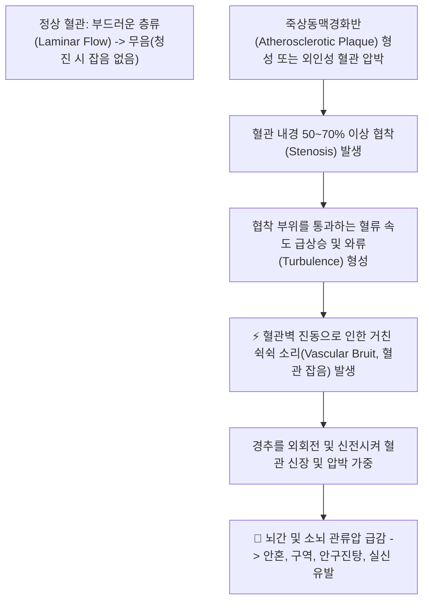
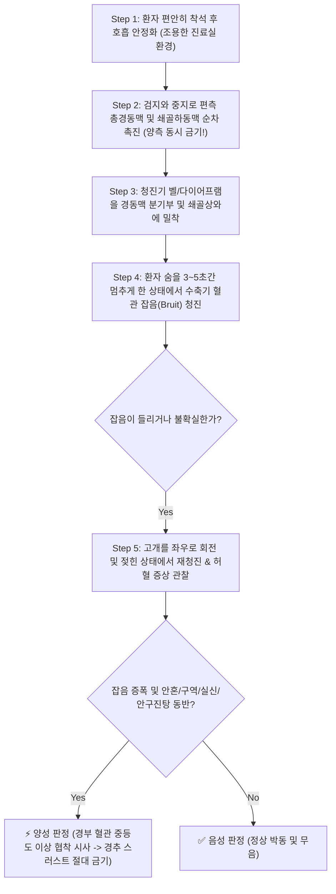

# 🩺 [[추골뇌저 동맥 청진 및 촉진]] (Auscultation and Palpation of Cranial Vessels)

> **핵심 3줄 요약 (Key Summary)**:
> - 🎯 검사 목적 & 타겟 병소: 경추 추나 및 침 치료 전 경부 대혈관의 죽상동맥경화증 및 뇌허혈 위험 선별, [[총경동맥]], [[쇄골하동맥]], [[추골동맥]]의 기계적 협착 및 혈류 장애 평가.
> - 🔍 검사 시행 프로토콜 & 양성 반응: 좌위에서 경동맥 삼각과 쇄골상와를 한쪽씩 촉진하여 맥박 결손을 확인하고 청진기로 혈관 잡음(Bruit)을 청진, 정면에서 불확실할 경우 목을 회전·신전시켜 잡음 증폭 또는 안혼(시야 흐림), 안구진탕, 구역, 실신 발현 시 양성 판정.
> - 📊 진단 정확도(민감도·특이도) & 임상적 의의: 혈관 잡음 청진 시 심뇌혈관 질환 위험(LR+ 4.0 이상)을 강력히 시사하며, 경동맥 협착증 조기 발견과 경추 도수치료 사고를 예방하는 비침습적 혈관 평가 도구임.
> - ⚠️ 위양성/위음성 요인 & 검사 금기: 양측 경동맥을 동시에 촉진하면 급성 뇌허혈 및 경동맥동 반사로 인한 서맥/실신 위험(절대 금기), 완전 폐색(100% Occlusion) 시에는 잡음이 소실되는 위음성 주의.

---

## 📌 목차
1. [검사 기본 정보 & 진단 목적 (Diagnostic Overview)](#1-검사-기본-정보--진단-목적-diagnostic-overview)
2. [해부학적 유발 메커니즘 & 생체역학적 원리 (Biomechanical Mechanism)](#2-해부학적-유발-메커니즘--생체역학적-원리-biomechanical-mechanism)
3. [표준 검사 시행 절차 (Step-by-Step Clinical Protocol)](#3-표준-검사-시행-절차-step-by-step-clinical-protocol)
4. [양성 반응 판정 기준 & 혈관 잡음 및 허혈 맵핑 (Diagnostic Criteria & Mapping)](#4-양성-반응-판정-기준--혈관-잡음-및-허혈-맵핑-diagnostic-criteria--mapping)
5. [연관 검사군 비교 & 경부 혈관 감별 알고리즘 (Differential Battery & Algorithm)](#5-연관-검사군-비교--경부-혈관-감별-알고리즘-differential-battery--algorithm)
6. [양성 소견 시 한의 임상 안전 프로토콜 및 연계 관리 (Integrative Korean Medicine)](#6-양성-소견-시-한의-임상-안전-프로토콜-및-연계-관리-integrative-korean-medicine)
7. [💡 사용자 진료실 핵심 필기 & 실전 임상 팁 (원문 보존)](#7--사용자-진료실-핵심-필기--실전-임상-팁-원문-보존)
8. [출처 및 학술 참고 문헌 (References)](#8-출처-및-학술-참고-문헌-references)

---

## 1. 검사 기본 정보 & 진단 목적 (Diagnostic Overview)

![[경동맥촉진_1단계_총경동맥_쇄골하동맥_촉지_실사.png|450]]
> [그림 1: 흉쇄유돌근 전연의 경동맥 삼각 부위에서 검지와 중지를 이용해 총경동맥 박동을 한쪽씩 촉진하는 모습]

| 항목 | 상세 내용 |
| :--- | :--- |
| **검사명 (Test Name)** | 추골뇌저 동맥 청진 및 촉진 (Auscultation & Palpation of Vertebrobasilar and Carotid Arteries) |
| **분류 (Category)** | 혈관계 이학적 검사 / 뇌졸중 및 동맥경화 선별 검사 / 추나 사전 스크리닝 |
| **타겟 병소 (Target)** | [[총경동맥]](Carotid bifurcation), [[쇄골하동맥]], [[추골동맥]](V1~V4), 경동맥동(Carotid sinus) |
| **의심 질환 (Suspected Pathologies)** | 경동맥 협착증, 죽상동맥경화증, 추골뇌저동맥부전(VBI), 쇄골하동맥 도쇄증후군 |
| **진단 정확도 (Diagnostic Accuracy)** | • **민감도 (Sensitivity)**: 50% ~ 70% (70% 이상 유의미한 동맥 협착 시) • **특이도 (Specificity)**: 85% ~ 95% (거친 수축기 혈관 잡음 청진 시) • **양성 우도비 (LR+)**: 4.0 ~ 7.2 |
| **시연 영상 (Video Guide)** | [🎥 시연 영상: Carotid Artery Assessment & Auscultation](https://www.youtube.com/watch?v=c2ZOkXthcV0) |

---

## 2. 해부학적 유발 메커니즘 & 생체역학적 원리 (Biomechanical Mechanism)

![[추골뇌저동맥청진_2단계_경동맥쇄골하동맥_혈관잡음청진_실사.png|400]]
> [그림 2: 청진기 종형(Bell) 또는 판막형(Diaphragm)을 경부 대혈관 및 쇄골상와에 밀착시켜 혈관 잡음(Bruit)을 청진하는 모습]

### 1) 유체역학적 원리: 층류(Laminar)에서 난류(Turbulent)로의 전환
* 혈관 내강이 매끄럽고 일정한 정상 상태에서는 혈액이 중심부에서 가장 빠르고 혈관벽에서 느리게 흐르는 조용한 **층류(Laminar flow)**를 유지합니다.
* 그러나 고혈압, 당뇨, 고지혈증 등으로 혈관벽에 죽상경화반이 쌓여 내경이 50% 이상 좁아지면, 좁은 통로를 빠져나오면서 혈류가 소용돌이치는 **와류와 난류(Turbulent flow)**로 바뀝니다.
* 이 난류가 혈관벽을 진동시키면서 발생하는 거칠고 바람 부는 듯한 소리(Whooshing sound)가 바로 청진기로 들리는 **혈관 잡음(Bruit)**입니다.

### 2) 경추 가동 시의 혈역학적 스트레스 (Kinematic Stress)
* 고개를 좌우로 돌리고 젖히면(회전 및 신전), 흉쇄유돌근과 전사각근이 팽팽하게 긴장하며 그 밑을 지나는 [[총경동맥]]과 [[쇄골하동맥]]을 외부에서 짓누릅니다.
* 동시에 C1-C2 분절에서 [[추골동맥]]이 비틀려 협착이 악화됩니다.
* 이때 혈관 잡음의 음조(Pitch)와 강도가 급격히 증폭되며, 뇌간 혈류 공급이 순간적으로 끊겨 **안혼(눈앞이 캄캄해짐), 구역감, 어지럼증, 안구진탕, 실신**이 재현됩니다.

---

## 3. 표준 검사 시행 절차 (Step-by-Step Clinical Protocol)

### Step 1: 환자 준비 및 진료실 정숙 (Starting Position)
* 환자를 등받이가 있는 의자에 편안하게 바른 자세로 앉힙니다.
* 진료실 내부 소음을 최소화하고, 환자에게 긴장을 풀도록 지도합니다.

### Step 2: 편측 총경동맥 및 쇄골하동맥 촉진 (Unilateral Palpation)
![[경동맥촉진_1단계_총경동맥_쇄골하동맥_촉지_실사.png|400]]
> [그림 3: 흉쇄유돌근 앞쪽 경계선에서 검지와 중지 끝으로 경동맥 박동의 세기와 규칙성을 촉진하는 모습]

* **총경동맥 촉진**: 하악각 아래, 갑상연골 상연 높이의 흉쇄유돌근 전연(Anterior border of SCM)에 검지와 중지 끝을 가볍게 얹어 박동(Pulse)의 세기, 대칭성, 스릴(Thrills, 진전감)을 평가합니다.
  * ⚠️ **절대 주의**: **절대로 양쪽 경동맥을 동시에 누르면 안 됩니다!** 반드시 오른쪽과 왼쪽을 번갈아 1개씩 단독 촉진합니다.
* **쇄골하동맥 촉진**: 쇄골 위쪽 오목한 곳(쇄골상와 Supraclavicular fossa)의 내측 1/3 지점을 지그시 눌러 쇄골하동맥 박동을 확인합니다.

### Step 3: 청진기를 이용한 호흡 정지 청진 (Auscultation with Breath-hold)
![[추골뇌저동맥청진_2단계_경동맥쇄골하동맥_혈관잡음청진_실사.png|400]]
> [그림 4: 환자가 호흡을 멈춘 상태에서 청진기로 혈관 잡음을 집중 청진하는 모습]

* 청진기의 종형(Bell, 저음역 잡음 감지) 또는 판막형(Diaphragm)을 경동맥 3개 포인트(하부 총경동맥, 중간 분기부, 상부 내경동맥 부위) 및 쇄골상와에 가볍게 댑니다.
* 환자에게 "숨을 깊게 들이마신 후 잠깐 멈추세요(3~5초간)"라고 지시합니다 (기관지 호흡음이 혈관 소리를 덮어버리는 것을 방지하기 위함).
* 심장 수축기에 맞춰 '쉭-쉭-' 하고 스쳐 지나가는 잡음(Systolic bruit)이 들리는지 집중하여 귀를 기울입니다.

### Step 4: 두경부 회전 및 신전 유발 검사 (Provocative Extension-Rotation Re-check)
* 정면 자세에서 잡음이 희미하거나 확실하지 않을 때, 또는 평소 어지럼증을 호소하는 환자의 경우:
  * 환자의 고개를 천천히 좌측 또는 우측으로 끝까지 회전시키고 뒤로 살짝 젖히게 한 상태에서 다시 청진기를 댑니다.
  * 혈관 잡음이 더욱 거칠고 커지는지 청진함과 동시에, 환자에게 "눈앞이 어두워지거나(안혼), 핑 돌거나(어지럼증), 메스껍거나(구역), 눈동자가 떨리는지(안구진탕)" 확인합니다.

---

## 4. 양성 반응 판정 기준 & 혈관 잡음 및 허혈 맵핑 (Diagnostic Criteria & Mapping)

* **진정한 양성 반응 (True Positive)**:
  * **1) 청진상 양성**: 호흡 정지 시 또는 경추 회전 시 심장 박동에 동기화된 **거친 난류성 혈관 잡음(Bruit)**이 명확히 청진될 때.
  * **2) 유발 기동상 양성**: 목을 돌려 젖혔을 때 **안혼(시야 흐림), 구역감, 실신 전조(Presyncope), 안구진탕** 등의 뇌간 허혈 증상이 재현될 때.
  * $\rightarrow$ **총경동맥, 쇄골하동맥, 또는 추골뇌저동맥의 유의미한 죽상경화성 협착(50~70% 이상)**을 강력히 시사.
* **음성 반응 (Negative)**:
  * 부드러운 규칙적 동맥 박동음 외에 거친 잡음이 전혀 없으며, 목을 돌려도 어지럼증이 유발되지 않는 상태.
* **위음성(False Negative) 주의**:
  * 혈관이 완전히 막혀버린 **완전 폐색(100% Occlusion)** 상태에서는 혈류 자체가 흐르지 않으므로 오히려 잡음이 소실됩니다 (맥박 결손으로 감별).

| 청진 및 촉진 부위 | 전형적 혈관 잡음 (Bruit)의 의미 | 동반 징후 및 유발 증상 | 주요 의심 혈관 질환 |
| :--- | :--- | :--- | :--- |
| **경동맥 삼각 (하악각 아래)** | 내경동맥/외경동맥 분기부 협착 | 일과성 허혈 발작(TIA), 편측 위약, 흑암시 | 경동맥 협착증 (Carotid stenosis) |
| **쇄골상와 (쇄골 안쪽 오목)** | [[쇄골하동맥]] 분지부 협착/도쇄 | 양팔 혈압 차이(20mmHg 이상), 상지 파행 | 쇄골하동맥 도쇄증후군 (Steal syndrome) |
| **유발 기동 시 (회전+신전)** | C1-C2 [[추골동맥]] 역학적 폐색 | 안혼, 안구진탕, 구역, 실신, 회전성 현훈 | 추골뇌저동맥부전 (VBI) |
| **심장 기저부 방사 잡음** | 대동맥판 협착증 잡음의 경부 전도 | 심장 청진 시 수축기 구출성 잡음 일치 | 대동맥판 협착증 (Aortic stenosis) |

---

## 5. 연관 검사군 비교 & 경부 혈관 감별 알고리즘 (Differential Battery & Algorithm)

| 검사명 | 검사 수기 및 타겟 | 진단 메커니즘 | 임상적 역할 (혈관 감별) |
| :--- | :--- | :--- | :--- |
| [[추골뇌저 동맥 청진 및 촉진]] (본 검사) | 경동맥/쇄골상와 촉진 및 호흡정지 청진 | 대혈관 난류성 잡음 및 박동 평가 | 경부 대혈관 죽상동맥경화증 침상 선별 |
| [[Vertebral artery patency test]] | 앙와위 경추 신전·외회전 30초 유지 | C1-C2 추골동맥 기계적 허혈 유발 | 추골뇌저동맥부전(5D 3N) 유발 확진 |
| **양팔 혈압 측정 (Bilateral BP Exam)** | 양측 상완 동맥 혈압 동시 측정 | 쇄골하동맥 협착에 따른 분기 후 혈압 강하 | 20mmHg 이상 차이 시 쇄골하동맥 폐색 확진 |
| [[Costoclavicular test]] | 군인 차렷 자세 및 요골동맥 박동 감지 | 쇄골과 제1늑골 사이 쇄골하동맥 포착 | 흉곽출구 증후군(TOS) 혈관형 감별 |

---

## 6. 양성 소견 시 한의 임상 안전 프로토콜 및 연계 관리 (Integrative Korean Medicine)

* **🚨 한의 치료 절대적 안전 원칙 (Safety First Protocol)**:
  * 청진상 뚜렷한 혈관 잡음(Bruit)이 들리거나 목을 돌릴 때 안혼/실신이 유발되는 환자에게는 **경추 추나 치료(특히 HVLA 스러스트)를 절대로 시행해서는 안 됩니다**.
  * 불안정한 죽상경화반이 떨어져 나가 **대뇌 색전증(Cerebral embolism / 뇌경색)**을 일으킬 위험이 극도로 높습니다.
  * 즉시 **경동맥 도플러 초음파(Carotid Duplex Ultrasonography) 및 Brain MRA** 검사를 의뢰하여 스텐트 시술이나 항혈소판제 복용 필요성을 평가받도록 지도합니다.
* **비침습적 한의 보존 치료 (Safe Conservative Care)**:
  * **침구 치료**: 혈관 부위를 직접 자침하지 않고, 원위부 혈위(곡지, 합곡, 태충, 족삼리, 현종)를 취혈하여 전신 혈압 안정화 및 혈류 순환 개선.
  * **추나 대체 요법**: 경추 관절을 비틀지 않는 **근막이완기법(Myofascial Release)**, 흉쇄유돌근 및 승모근의 가벼운 수기 마사지, 턱관절 가동술만 제한적으로 적용.
  * **한약 치료**:
    * 죽상동맥경화 및 어혈 정체: [[구등산]], [[보양환오탕]], [[통도산]] ([[단삼]], [[천궁]], [[조구등]], [[은행엽]] 등 뇌혈관 확장 및 미세순환 개선 본초 배합).
    * 현훈 및 기혈 허약: [[자음건비탕]], [[반하백출천마탕]] (담탁 저체로 인한 어지럼증 완화).

---

## 7. 💡 사용자 진료실 핵심 필기 & 실전 임상 팁 (원문 보존)

* **사용자 원문 필기 (100% 보존)**:
  * 의자에 앉히고 환자의 총경 동맥과 쇄골하 동맥을 촉진과 청진을 하여 박동과 이상잡음이 있는지를 알아봄.
  * 양쪽 모두 확실치 않을 때는 목을 좌우로 돌리고 젖혀 늘여서 다시 한번 검사.
  * 박동이나 잡음이 있으면 검사는 양성, 돌려 젖혀서 안혼, 구역, 실신, 안구진탕 등의 증상이 동반되면 양성을 의미하고, 추골, 뇌저, 총경 동맥의 압박이나 협착을 시사하는 것.
* **진료실 실전 노하우 & 감별 팁**:
  1. **청진기 Bell(종형)을 써야 하는 이유**: 혈관 잡음(Bruit)은 심장 판막음보다 주파수가 낮고 부드러운 경우가 많습니다. 청진기의 납작한 다이어프램보다 오목한 벨(Bell) 부위를 피부에 살짝 얹듯이 밀착(세게 누르면 혈관이 눌려 인위적 잡음 발생)시키면 미세한 수축기 잡음도 놀랍도록 선명하게 들립니다.
  2. **"숨을 멈추세요"의 마법**: 환자가 숨을 쉬고 있으면 목의 기관지를 지나는 공기 소리 때문에 혈관 잡음을 100% 놓칩니다. 반드시 "숨 들이마시고 잠깐 멈추세요"라고 한 뒤 3초 안에 잡음을 캐치하십시오.
  3. **양측 동시 촉진 금지의 생리학적 이유**: 진료실에서 양쪽 목을 동시에 만지는 실수를 절대 범해서는 안 됩니다. 경동맥 분기부의 경동맥동(Carotid sinus) 압수용기가 양쪽에서 동시에 자극받으면, 미주신경 반사로 인해 심박수가 급격히 떨어지고(Bradycardia) 혈압이 곤두박질치며 환자가 진료실 의자에서 그대로 기절(Syncope)할 수 있습니다. 항상 한쪽씩 만져야 합니다.

---

## 8. 출처 및 학술 참고 문헌 (References)

1. **Pickett, C. A., Jackson, J. L., Hemann, B. A., & Atwood, J. E. (2010)**. *Carotid bruits as a predictor of cardiovascular events: a systematic review and meta-analysis*. **The Lancet**, 375(9723), 1387-1394. [DOI: 10.1016/S0140-6736(10)60008-0](https://doi.org/10.1016/S0140-6736(10)60008-0)
   - **[연구 요약]**: 경동맥 청진상 혈관 잡음이 심근경색, 뇌졸중 및 심혈관 사망률을 2배 이상 높이는 강력한 독립적 예측 인자임을 17,295명의 대규모 메타분석을 통해 규명함.
2. **Sauvé, J. S., Laupacis, A., Ostbye, T., & Sackett, D. L. (1993)**. *Does this patient have a clinically important carotid bruit?*. **The Journal of the American Medical Association (JAMA)**, 270(23), 2843-2845. [PMID: 8254858](https://pubmed.ncbi.nlm.nih.gov/8254858/)
   - **[연구 요약]**: 경동맥 잡음의 청진 기법과 70% 이상의 혈관 협착을 선별하는 임상적 진단 정확도(민감도 및 특이도)와 심장 잡음과의 청진 감별법을 체계화함.
3. **Magee, D. J. (2014)**. *Orthopedic Physical Assessment (6th ed.)*. Elsevier Health Sciences.
   - **[연구 요약]**: 경추 및 두경부 평가 파트에서 총경동맥 및 쇄골하동맥의 촉진/청진 절차와 목 회전 기동 시의 뇌혈류 변화 및 추나 치료 전 필수 안전 검사 프로토콜을 기술함.