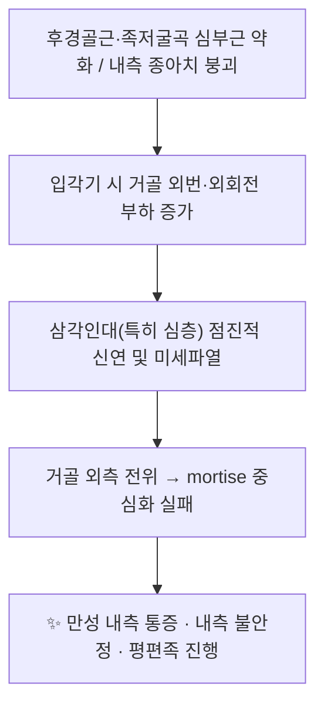

# 🦴 [[구조물/인대/삼각인대]] (Deltoid Ligament of the Ankle)

> **핵심 요약 (Key Summary)**:
> [[삼각인대]](Deltoid ligament)는 [[내측 복사뼈]](medial malleolus)에서 기시하여 [[주상골]]·[[종골]]·[[거골]] 내측면에 팬(fan) 모양으로 부착하는 족관절의 **유일한 내측 안정화 인대 복합체**로, 천층 3다발(종주상골·종거골·천층후종거골)과 심층 2다발(전·후심층종거골)로 구성된다.
> 주 기능은 거골의 **외번(valgus)·외회전 및 외측 전위** 구속이며, 특히 **심층 삼각인대가 족관절 mortise 안정성의 결정적 구속물**이어서 급성 족관절 골절에서 수술 여부를 좌우한다([[족관절 골절]], [[경비인대]] 손상 동반 시).
> 임상적으로는 내측 염좌·만성 내측 불안정·성인 후천성 평편족(Stage IV)에서 핵심 타깃이며, 치료는 [[추나요법]]·도수치료(MET/PIR)를 통한 거골 활주 회복, [[후경골근]] 강화, 그리고 초음파 유도 하 [[약침]]·침구 시술(내측 복사뼈 전방의 복재신경·정맥, 후방의 경골신경 혈관속 회피)로 구성된다.

---
## 📌 목차
1. [해부학적 정밀 구조 및 지배 신경/혈관](#1-해부학적-정밀-구조-및-지배-신경혈관)
2. [생체역학·토크 분석 & 근막 사슬 (Biomechanical Synergy)](#2-생체역학토크-분석--근막-사슬-biomechanical-synergy)
3. [근막통증증후군(TP) & 연관통 패턴 (Travell & Simons)](#3-근막통증증후군tp--연관통-패턴-travell--simons)
4. [초음파 해부학(Sonoanatomy) 및 중재 시술 랜드마크](#4-초음파-해부학sonoanatomy-및-중재-시술-랜드마크)
5. [⭐ 원장님 심층 임상 고찰 및 원본 필기 (Clinical Pearls)](#5-원장님-심층-임상-고찰-및-원본-필기-clinical-pearls)
6. [관련 임상 질환 및 운동손상 증후군 총괄](#6-관련-임상-질환-및-운동손상-증후군-총괄)
7. [추나·도수치료(MET/PIR) & 침구·약침·재활 프로토콜](#7-추나도수치료metpir--침구약침재활-프로토콜)
8. [출처 및 학술 참고 문헌 (References)](#8-출처-및-학술-참고-문헌-references)

---
## 1. 해부학적 정밀 구조 및 지배 신경/혈관

| 항목 | 상세 내용 |
| :--- | :--- |
| **기시 (Origin)** | [[내측 복사뼈]](medial malleolus). **천층**은 전방 결절(anterior colliculus)과 그 주변에서, **심층**은 전방 결절의 후면 및 결절간 고랑(intercollicular groove)·후방 결절(posterior colliculus)에서 기시한다. 즉 천층과 심층의 기시부가 해부학적으로 층을 이루며, 이는 MRI에서 층상 구조로 구분되는 근거가 된다. |
| **정지 (Insertion)** | **천층 3다발**: ① 종주상골섬유(tibionavicular) → [[주상골]] 조면 및 내측 종아치 구조물, ② 종거골섬유(tibiocalcaneal) → [[종골]]의 거골지지대(sustentaculum tali), ③ 천층후종거골섬유(superficial posterior tibiotalar) → 거골 내측 후방. **심층 2다발**: ④ 전심층종거골섬유(deep anterior tibiotalar) → [[거골]] 내측면 전방(활차 내측연), ⑤ 후심층종거골섬유(deep posterior tibiotalar) → 거골 내측 후방 결절부. 천층은 내측 종아치·종골까지 이어지는 표재성 지지대, 심층은 거골과 복사뼈를 직접 결속하는 심부 안정화 인대라는 기능적 이원성을 갖는다. |
| **신경 지배** | [[경골신경]](tibial nerve, L4–S2)의 관절가지가 주 지배하며, 전내측부는 [[복재신경]](saphenous nerve, L3–L4)의 분지가 관여한다. 다발별 신경 분포의 상세 구획은 **근거 미확인**(문헌별 기술 차이 존재). |
| **혈관 공급** | [[후경골동맥]]의 내측 복사 분지(medial malleolar branches)와 [[전경골동맥]]의 내측 복사 분지가 내측 복사뼈 주위 문합망을 형성하며, 종골분지·거골동맥 문합이 관여한다. 삼각인대는 섬유성·섬유연골성 조직으로 자체 혈류가 적어 **치유 잠재력이 낮고**, 이는 만성 내측 불안정과 재손상의 해부학적 배경이 된다. |

### 🔬 해부학적 세부 고찰 (Layered Concept)

- **천층(superficial layer)**: 팬 형태로 넓게 퍼지며, 내번(inversion)보다 **외번·외회전**에 대한 일차 구속력이 크다. 종주상골섬유는 [[스프링인대]](calcaneonavicular ligament)와 해부학적으로 연속·중첩되어 **내측 종아치 지지 시스템**을 이룬다.
- **심층(deep layer)**: 짧고 두꺼운 섬유로 내측 복사뼈와 거골을 직접 연결하며, **거골의 외측 전위(lateral talar shift)와 외회전을 막는 최종 구속물**이다. 임상적으로 심층 손상 여부가 족관절 골절의 안정성 판정 기준이 된다.
- **경비인대(syndesmosis)와의 관계**: 원위 경비인대와 삼각인대는 족관절 mortise를 이루는 **링(ring) 구조**의 양 축으로, 한쪽이 손상되면 반대편에 병적 부하가 집중된다.
- Mengiardi & Pinto(2016)는 MRI에서 삼각인대 복합체를 천층–심층으로 구분해 판독하는 것이 내측 불안정 진단의 핵심이라 기술하였다(PMID: 27077590).

---
## 2. 생체역학·토크 분석 & 근막 사슬 (Biomechanical Synergy)

* **구속물로서의 역할**: 삼각인대는 ① 거골의 외번(valgus tilt), ② 거골의 외회전(external rotation), ③ 거골의 외측 전위(lateral shift)를 구속한다. 이 중 **외측 전위와 외회전의 일차 구속물은 심층 삼각인대**이며, 심층이 온전하면 외측 복사뼈(비골) 골절이 있어도 mortise는 비교적 안정적으로 유지될 수 있다. 반대로 심층 파열 시에는 비골 골절의 형태와 무관하게 불안정성 골절로 취급된다.
* **모멘트 분석 관점**: 체중 부하 시 거골 활차는 경골 천장(tibial plafond) 하방에서 회전·활주하며, 내측 구속물의 작용선은 내측 복사뼈–거골 내측면 사이의 **짧은 모멘트 암**을 갖는다. 따라서 심층 인대의 작은 신연만으로도 거골의 외측 전위가 기하급수적으로 증가하는 **비선형 안정성 곡선**을 보인다(정량적 수치는 **근거 미확인**).
* **족관절 골절에서의 임상적 함의**: 삼각인대 손상이 경비인대 불안정과 동반될 때 삼각인대 봉합을 함께 시행하는 것이 mortise 정복 유지에 유리한지에 대해서는 체계적 문헌고찰이 이루어졌다(PMID: 33218869; PMID: 35017184).
* **근막 사슬 연계 (McGill / Myers Anatomy Trains)**:
  - **Myers의 심부전방선(Deep Front Line)**은 하지에서 심부 후방 구획의 [[후경골근]]을 경유하여 종아리 심부 → 내측 종아치로 이어진다. 즉 삼각인대는 **후경골근–스프링인대–족저근막**으로 이어지는 내측 심부 사슬의 골-인대성 종착점으로 볼 수 있다.
  - **후방 기능선(Superficial Back Line)**의 종골 정지부, 그리고 비복근 내측두–아킬레스건–종골 축과 인접하여, 종아리 심부 긴장이 내측 복사뼈 주위 인대성 통증으로 발현될 수 있다.
  - McGill의 core–hip 안정성 모델 관점에서는 **족관절 내측 구속 + 고관절 외회전 조절**의 협응 실패가 반복적 내측 미세손상을 유발한다.

---
## 3. 근막통증증후군(TP) & 연관통 패턴 (Travell & Simons)

* **전제**: 삼각인대는 근육이 아닌 **인대성(ligamentous) 구조**이므로 Travell & Simons의 고전적 발통점(TrP) 개념이 직접 적용되지 않는다. 즉 "삼각인대 TrP"라는 표현은 해부학적으로 부정확하며, **국소 인대성 압통(local ligamentous tenderness)** 과 인접 근육 TrP의 **연관통(trigger point referral)** 을 구분해 평가해야 한다.
* **인대성 통증 패턴(국소)**: 내측 복사뼈 첨단 전하방 → [[주상골]] 조면에 이르는 천층 종주상골섬유를 따라 압통이 집중되며, 종거골섬유 손상 시 [[종골]] 거골지지대 부위, 심층 손상 시 복사뼈 후방/관절 간격 내측에 심부 압통을 호소한다. 통증은 대개 **국소적**이며 원위부로의 명확한 방사는 적다.
* **인접 근육 TrP의 감별(내측 복사뼈 주위 통증의 실제 원인)**:
  - [[후경골근]] TrP: 종아리 내측 원위부 및 아킬레스건 내측연, 내측 종아치로 연관통 → 삼각인대 손상과 혼동 빈도 높음.
  - [[장모지굴근]] TrP: 족저 내측, 엄지발가락으로 방사.
  - [[장지굴근]] TrP: 발바닥 중앙부 방사.
  - [[비복근]] 내측두 TrP: 종아리 내측에서 종골·내측 복사뼈 방향으로 방사.
* **감별 포인트**: 내측 복사뼈 주위 통증이 (1) 원위부로의 광범위 방사 + 근육 압통 결절을 동반하면 근육성, (2) 외상력과 함께 국소 압통 + 부종·점상 출혈 + 관절 불안정 소견이면 인대성으로 판단한다.

---
## 4. 초음파 해부학(Sonoanatomy) 및 중재 시술 랜드마크

* **탐촉자 및 스캔 뷰**: 고주파 선형 탐촉자(6–15 MHz)를 사용하여 내측 복사뼈를 중심으로 **종단면(복사뼈 → 주상골 방향)** 과 **횡단면(복사뼈 첨단부 단면)** 을 조합한다. 천층 삼각인대는 내측 복사뼈 원위에서 거골·주상골로 이어지는 **섬유성 에코 밴드**로, 심층 삼각인대는 복사뼈와 거골 내측면 사이의 심부 층으로 관찰된다.
* **주요 랜드마크**:
  1. [[내측 복사뼈]] 전방 결절 및 첨단 — 천층 인대 기시부 확인.
  2. [[주상골]] 조면 — 천층 종주상골섬유 정지부, 내측 종아치 지지 평가.
  3. [[종골]] 거골지지대(sustentaculum tali) — 종거골섬유 정지부.
  4. [[거골]] 내측면 — 심층 인대 정지부.
* **위험 구조물 및 안전 마진**:
  - **전방**: 대복재정맥(great saphenous vein) 및 [[복재신경]]이 내측 복사뼈 **전방**을 주행하므로, 복사뼈 전방부 자침·약침 시 표재 천자를 우선하고 혈관 내 주입을 피한다.
  - **후방/후하방**: [[후경골동맥]]·[[경골신경]]·[[장모지굴근]] 건이 내측 복사뼈 후방의 굴근지지대(flexor retinaculum) 하방에 밀집해 있으므로, 후방 접근 시 깊은 천자를 금하고 초음파로 신경 혈관속을 확인한 후 자입한다.
  - 복사뼈 전하방 첨단부는 피하 조직이 얇아 **표재성 천자(수 mm 깊이)** 로 인대 표면 자극이 가능하며, 심부 천자는 관절 내 주입 위험이 있다.
* **시술 시 활용**: 초음파 유도 하에 인대 주변(periligamentous) 약침·자극을 시행하면 주변 신경혈관 손상 위험을 낮추고, 동시에 후경골근 건·굴근군과의 감별이 가능하다.

---
## 5. ⭐ 원장님 심층 임상 고찰 및 원본 필기 (Clinical Pearls)

* **"내측이 아프면 골절·경비인대부터 배제한다"**: 급성 외상 후 내측 복사뼈 주위 압통이 있으면, 단순 염좌로 단정하지 말고 (1) 골절(특히 비골 골절·후과 골절), (2) 경비인대 손상, (3) 심층 삼각인대 파열을 순차적으로 확인한다. 내측 압통 + 전후방 경비인대 압통 조합은 **경비인대 불안정 동반 손상**을 강하게 시사한다.
* **내측 염좌는 "드문 손상"이다**: 삼각인대 단독 염좌는 외측 염좌에 비해 빈도가 낮고, 대개 **회내-외회전(pronation-external rotation) 기전** 또는 골절과 동반되어 발생한다. 따라서 내측 손상만 보이면 반드시 손상 기전을 역추적하여 동반 병변을 찾는다(Pflüger & Valderrabano, 2023; PMID: 37137629).
* **촉진 루틴**: ① 복사뼈 첨단 → 주상골 조면(종주상골섬유), ② 복사뼈 하방 → 거골지지대(종거골섬유), ③ 복사뼈 후방 심부(천층후종거골·후심층종거골). 세 지점을 각각 눌러 통증의 층을 구분하고, 반대측과 비교한다.
* **심층 손상 = 안정성 문제**: 심층 삼각인대가 파열되면 체중부하 시 거골이 외측으로 밀려 mortise가 벌어지고, 장기적으로 관절염·만성 불안정으로 이어진다. 이런 경우 보존적 치료만으로는 한계가 있어 **수술적 봉합/안정화**가 논의되며, 봉합 술기의 적응증과 결과에 대한 체계적 문헌고찰이 존재한다(PMID: 35017184; PMID: 37449811). 임상에서는 내측 불안정이 의심될 때 조기에 영상·전문의 협진을 의뢰하는 것이 원칙이다.
* **평편족과의 연결**: 성인 후천성 평편족(adult flatfoot)에서 [[후경골근]] 기능부전이 진행되면 내측 구속물인 삼각인대(특히 천층)가 점진적으로 신연되고, 말기(Stage IV)에는 거골 외번 변형이 고정된다(Toullec, 2015; PMID: 25595429). 즉 **평편족 환자의 내측 통증은 단순 근육통이 아니라 인대성 신연 통증일 수 있다.**
* **만성 환자 평가**: 만성 내측 통증 환자에서 MRI상 삼각인대 천층의 비후·신호증가, 심층의 부분 파열 소견이 보이면 내측 불안정으로 판단하며, 이는 Mengiardi & Pinto(2016)의 MRI 해부·소견 체계와 부합한다(PMID: 27077590).
* **치료 전략의 대원칙**: 급성기에는 **보호·부하 조절**, 아급성기에는 **거골 활주 회복 + 후경골근 강화**, 만성기에는 **고유수용감각·내측 종아치 지지 + 보행 패턴 교정**의 3단계로 접근한다. 인대 자체는 혈류가 적어 회복이 느리므로, "인대만 치료"하지 말고 내측 사슬 전체를 다룬다.

---
## 6. 관련 임상 질환 및 운동손상 증후군 총괄

| 임상 질환 / 증후군 | 병리적 연관 기전 | 주요 증상 및 이학적 검사 | 핵심 교정 타깃 |
| :--- | :--- | :--- | :--- |
| [[족관절 내측 염좌]] (삼각인대 복합체 염좌) | 회내-외회전 등 외번·외회전 부하로 천층(및 심층) 섬유 신연·부분 파열 | 내측 복사뼈 주위 통증·부종·압통, 외회전 스트레스 검사 시 통증, 체중부하 시 내측 통증 | 급성 보호·부하 조절 → 후경골근 강화, 거골 활주 회복 |
| [[족관절 골절]] 동반 삼각인대 손상 | 골절과 함께 mortise 링이 파괴되어 심층 구속력 소실 | 내측 압통 + 골절 소견, 불안정성 스트레스 영상에서 거골 외측 전위 | 심층 인대 온전성 평가 후 수술적 안정화 여부 결정 |
| [[경비인대 불안정]] 동반 골절 | 삼각인대와 경비인대가 함께 손상되어 회전·전위 구속 소실 | 전후방 경비인대 압통, squeeze/외회전 검사 양성 | 삼각인대 봉합 병행 여부 및 mortise 정복 유지 |
| [[만성 족관절 내측 불안정]] | 심층/천층 인대의 반복 미세손상 및 치유 실패, 낮은 자체 혈류 | 만성 내측 통증, MRI상 인대 비후·신호증가·부분 파열 | 내측 심부 안정화, 고유수용감각 재훈련 |
| [[성인 후천성 평편족]] (Stage IV) | 후경골근 기능부전 → 내측 구속물 신연 → 거골 외번 고정 변형 | 내측 종아치 붕괴, 후족부 외번, 다중 관절 변형 | 후경골근 강화 + 내측 종아치 지지 + 인대성 통증 관리 |
| [[족관절 불안정성]](내측성 감별) | 심층 인대 파열로 거골 외측 전위 | 반복적 내측 불편감, 불안정감, 점진적 관절 퇴행 | 심층 인대 평가 우선, 필요 시 전문의 협진 |

---
## 7. 추나·도수치료(MET/PIR) & 침구·약침·재활 프로토콜

* **한의학 경혈 매핑**: [[照海]](KI6, 내측 복사뼈 직하방의 함요처로 천층 종주상골섬유 부착부와 인접), [[商丘]](SP5, 내측 복사뼈 전하방), [[中封]](LR4, 내측 복사뼈 전방), [[太谿]](KI3, 내측 복사뼈와 아킬레스건 사이 — **후경골동맥·경골신경과 매우 근접하므로 천자 깊이 주의**), [[丘墟]](GB40, 외측 대응 혈).
* **도수치료 (MET/PIR)**:
  1. **거골 활주 평가 및 회복**: 거골의 전방·후방 활주 제한을 확인하고, 관절낭 내측 mobilization으로 내측 구속 조직의 점진적 이완을 유도한다.
  2. **후경골근 MET**: 발을 내번+족저굴곡 방향으로 등척성 수축(5–10초, 3–5회) 후 호기 시 부드러운 신장. 내측 사슬의 핵심 안정화 근육이다.
  3. **비복근 내측두·장모지굴근 PIR**: 종아리 심부·표재부의 과긴장을 이완시켜 내측 복사뼈 주위 인대성 긴장을 간접 감소시킨다.
  4. **족관절 내번/외번 등척성 훈련**: 중립 위치에서 저강도 등척성 수축으로 관절 위치감각을 재교육한다.
* **침구·약침 프로토콜(안전 우선)**:
  - 급성기: 내측 복사뼈 전하방을 따라 **표재성 자침** 중심, 강한 자극·깊은 천자 회피. 부종이 심하면 원위 혈(足三里·陽陵泉 등) 위주로 원격 취혈.
  - 아급성·만성기: 照海·商丘·中封 주위 자극으로 내측 인대 주변 순환 및 통증 조절. 太谿 사용 시 초음파 또는 촉진으로 후경골동맥 박동을 확인하고 천자 깊이를 최소화한다.
  - 약침: 초음파 유도 하 **인대 주변(periligamentous)** 소량 주입을 원칙으로 하며, 복재정맥·경골신경 혈관속을 반드시 회피한다. 삼각인대 자체에 대한 특정 약침 효능의 근거는 **근거 미확인**(일반적 인대 손상 관리 원칙에 준함).
* **재활 단계별 프로토콜**:
  | 단계 | 목표 | 주요 중재 | 주의점 |
  | :--- | :--- | :--- | :--- |
  | 1. 급성기(0–2주) | 보호·통증·부종 조절 | 보조기/테이핑, 부분 체중부하, 냉·온 요법, 원격 취혈 | 불안정성 의심 시 즉시 영상 검사·협진 |
  | 2. 아급성기(2–6주) | 가동성·근력 회복 | 거골 활주 mobilization, 후경골근 등척성 → 등장성 강화, MET/PIR | 통증 유발 범위 내 진행 |
  | 3. 만성·복귀기(6주~) | 기능적 안정성·고유수용감각 | 한발 서기, 균형판, 보행 패턴 교정, 내측 종아치 지지 | 스포츠 복귀 전 좌우 비교 평가 |
* **복귀 기준**: 통증 없이 체중부하 가능, 좌우 거골 활주 대칭성 회복, 한발 서기 안정성 및 내번/외번 등척성 근력 좌우 차이 최소화.

---
## 8. 출처 및 학술 참고 문헌 (References)

1. **Pflüger P, Valderrabano V. (2023)**. Sprain of the Medial Ankle Ligament Complex. *Foot Ankle Clin*. PMID: 37137629
2. **James M, Dodd A. (2022)**. Management of deltoid ligament injuries in acute ankle fracture: a systematic review. *Can J Surg*. PMID: 35017184
3. **Loozen L, Veljkovic A. (2023)**. Deltoid ligament injury and repair. *J Orthop Surg (Hong Kong)*. PMID: 37449811
4. **Wang J, Stride D. (2021)**. The Role of Deltoid Ligament Repair in Ankle Fractures With Syndesmotic Instability: A Systematic Review. *J Foot Ankle Surg*. PMID: 33218869
5. **Toullec E. (2015)**. Adult flatfoot. *Orthop Traumatol Surg Res*. PMID: 25595429
6. **Mengiardi B, Pinto C. (2016)**. Medial Collateral Ligament Complex of the Ankle: MR Imaging Anatomy and Findings in Medial Instability. *Semin Musculoskelet Radiol*. PMID: 27077590
7. **Standring, S. (2020)**. *Gray's Anatomy: The Anatomical Basis of Clinical Practice* (42nd ed.). Elsevier.
8. **Travell, J. G., & Simons, D. G. (1999)**. *Myofascial Pain and Dysfunction: The Trigger Point Manual*, Vol. 1.

<!-- 보관 태그(1회용·링크오류, 필요시 복원): 내과, deltoid-ligament -->
