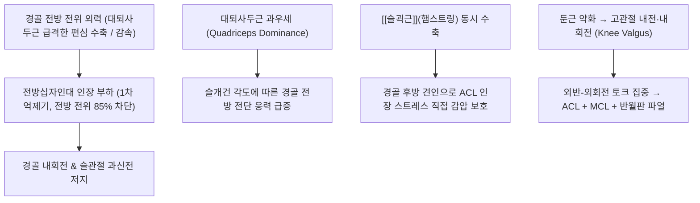

# 🦴 [[전방십자인대]] (Anterior Cruciate Ligament, ACL)

> **핵심 요약 (Key Summary)**:
> - 📍 **해부 & 주행**: [[대퇴골]] 외과 내측면 후상방에서 기시하여 [[경골]] 과간융기 전방에 정지하는 관절낭 내(Intracapsular), 활액막 외(Extrasynovial) 인대로, **전내측 다발(AM bundle)**과 **후외측 다발(PL bundle)**의 2중 다발 구조로 이루어져 있다.
> - ⚙️ **생체역학적 핵심 기능**: 경골의 전방 전위를 약 85% 차단하는 1차 억제기(Primary restraint)이자 슬관절 내회전 및 과신전을 억제하는 핵심 수동 안정자이다. [[대퇴사두근]]은 인장 스트레스를 가중시키는 길항근이며, [[슬괵근]](햄스트링)은 경골을 후방 견인하여 인대를 보호하는 협동근이다.
> - 🛠️ **임상 평가 & 한·양방 치료**: 비접촉 감속·피벗 손상 시 '툭(Pop)'하는 파열음과 급성 혈관절증이 호발한다. [[라크만 검사]](Lachman test, 민감도 85%, 특이도 94%)가 표준 진단법이며, 부분 파열 및 저활동군은 침·약침·햄스트링 강화 보존 치료를, 완전 파열 및 젊은 활동군은 관절경적 재건술(Reconstruction)을 시행한다.

---

## 📌 목차
1. [해부학적 정밀 구조 및 지배 신경/혈관](#1-해부학적-정밀-구조-및-지배-신경혈관)
2. [생체역학·토크 분석 & 근막 사슬 (Biomechanical Synergy)](#2-생체역학토크-분석--근막-사슬-biomechanical-synergy)
3. [근막통증증후군(TP) & 연관통 패턴 및 이학적 검사](#3-근막통증증후군tp--연관통-패턴-및-이학적-검사)
4. [초음파 및 MRI 영상의학적 평가 랜드마크](#4-초음파-및-mri-영상의학적-평가-랜드마크)
5. [⭐ 원장님 심층 임상 고찰 및 원본 필기 (Clinical Pearls)](#5--원장님-심층-임상-고찰-및-원본-필기-clinical-pearls)
6. [관련 임상 질환 및 운동손상 증후군 총괄](#6-관련-임상-질환-및-운동손상-증후군-총괄)
7. [추나·도수치료 & 침구·약침·재활 프로토콜 (+ 양방 치료·의뢰 기준)](#7-추나도수치료--침구약침재활-프로토콜--양방-치료의뢰-기준)
8. [출처 및 학술 참고 문헌 (References)](#8-출처-및-학술-참고-문헌-references)

---

## 1. 해부학적 정밀 구조 및 지배 신경/혈관

| 항목 | 상세 내용 |
| :--- | :--- |
| **기시 (Origin)** | [[대퇴골]] 외측 과(Lateral femoral condyle) 내측면의 후상방 관절면 |
| **정지 (Insertion)** | [[경골]] 과간융기(Intercondylar eminence) 전방 함요부 및 내측 반월상연골 전각 외측 |
| **신경 지배** | [[경골신경]](Tibial nerve) 유래 후관절 신경지 (루피니·파치니 고유수용기 풍부) |
| **혈관 공급** | [[중슬동맥]](Middle genicular artery) 분지망 (윤활막 반사막 경유 혈류 공급) |

![[전방십자인대_01_해부도해_십자인대_Gray348.png|450]]
> [그림 1: ① 해부 도해 — 슬관절 심부 십자인대(전방십자인대 및 후방십자인대)와 반월상연골의 해부학적 부착 관계. 출처: Gray's Anatomy (Public Domain)]

### 🔬 2중 다발(Double-Bundle) 구조와 주행 특성
* **전내측 다발 (Anteromedial, AM Bundle)**:
  * 대퇴 기시부의 가장 근위-후방에서 시작하여 경골 정지부의 전내측에 부착.
  * **기능**: 무릎이 **굴곡(Flexion)될 때 팽팽해지며(Taut)**, 굴곡 각도에서 경골의 전방 전위를 차단하는 주력 다발.
* **후외측 다발 (Posterolateral, PL Bundle)**:
  * 대퇴 기시부의 원위-전방에서 시작하여 경골 정지부의 후외측에 부착.
  * **기능**: 무릎이 **신전(Extension)될 때 팽팽해지며(Taut)**, 신전 부근에서 슬관절의 회전 안정성(Rotational stability)과 과신전 방지를 담당.
* **활액막외 주행 (Intracapsular, Extrasynovial)**:
  * 인대 자체는 섬유성 관절낭(Capsule) 내부에 깊숙이 위치하지만, 활액막(Synovium)의 반출막에 싸여 있어 활액강 내 액체와 직접 접촉하지 않는 독특한 형태를 띰. 이로 인해 파열 시 자연 치유에 필요한 혈종 및 섬유아세포 증식이 활액에 의해 씻겨 나가 자연 유합이 극히 어렵다.

---

## 2. 생체역학·토크 분석 & 근막 사슬 (Biomechanical Synergy)

![[전방십자인대_파열병태_3D일러스트.jpg|450]]
> [그림 2: ② 파열 병태 도해 — 착지 및 피벗 동작 시 슬관절 외반과 외회전 토크가 가해져 전방십자인대가 파열되는 생체역학적 기전. 출처: Wikimedia Commons (CC BY-SA 4.0)]

* **1차 억제기 (Primary Restraint)**:
  * 경골이 대퇴골에 대해 전방으로 이동하는 전단력의 **85~87%를 단독으로 부담**함.
  * 슬관절 30도 굴곡 상태에서 가장 큰 전방 전위 억제 장력을 발휘함.
* **근육 협동근과 길항근의 토크 짝힘**:
  * **길항근 (Antagonist)**: [[대퇴사두근]](특히 대퇴직근)은 슬관절 0~45도 신전 범위에서 수축 시 슬개건을 통해 경골 조면을 전방으로 강하게 잡아당겨 ACL 파열 스트레스를 극대화함.
  * **협동 보호근 (Synergist)**: [[반막양근]], [[반건양근]], [[대퇴이두근]](햄스트링)은 수축 시 경골 근위부를 뒤로 당겨 ACL의 인장 부하를 직접 감압함. 따라서 ACL 재활의 핵심은 **햄스트링/대퇴사두근 근력 비율(H:Q ratio > 60~70%)** 유지에 있다.
* **근막 사슬 연계 (Kinetic Chain)**:
  * [[중둔근]] 및 [[대둔근]]의 약화는 착지 시 고관절 내전·내회전을 유발하여 무릎이 안쪽으로 꺾이는 **동적 외반(Dynamic Knee Valgus)**을 초래하며, 이는 ACL 비접촉 손상의 가장 결정적인 생체역학적 원인이다.

---

## 3. 근막통증증후군(TP) & 연관통 패턴 및 이학적 검사

### 1) 관련 근육 트리거포인트 및 연관통
* 전방십자인대 손상 후 만성 무릎 불안정성이 지속되면 보상 작용으로 인접 근육군에 과부하 TrP가 발생함:
  * **[[대퇴직근]] & [[외측광근]] TrP**: 슬개골 상부 및 전면부 뻐근한 연관통 유발.
  * **[[슬와근]](Popliteus) TrP**: 슬관절 후외측 깊은 부위 통증을 유발하며, 무릎 완전 신전을 방해함.
  * **[[비복근]] 외측두 TrP**: 오금 부위 통증 및 야간 쥐내림.

### 2) 필수 이학적 검사 (Physical Examination)

![[십자인대손상_라크만검사_실사.jpg|420]]
> [그림 3: ③ 이학적 검사 시연 실사 — 슬관절 20~30도 굴곡 상태에서 경골 전방 전위를 평가하는 라크만 검사(Lachman Test). 출처: Wikimedia Commons (CC BY-SA 3.0)]

* **1. [[라크만 검사]](Lachman Test) — 진단의 표준 (Gold Standard)**:
  * **방법**: 환자를 앙와위로 눕히고 무릎을 20~30도 굴곡시킨 상태에서, 한 손으로 대퇴골 원위부를 단단히 고정하고 다른 손으로 경골 근위부를 잡고 앞쪽으로 당김.
  * **양성 판정**: 정상적인 '단단한 종말감(Firm endpoint)'이 소실되고 **부드럽고 덜컥거리는 무른 종말감(Soft/Mushy endpoint)**과 함께 경골이 3~5mm 이상 전방으로 전위될 때.
  * **진단 정확도**: 민감도 **85~87%**, 특이도 **94~97%**로 급성 손상 시 가장 정확함.
* **2. [[피벗 시프트 검사]](Pivot-Shift Test) — 회전 불안정성 평가**:
  * **방법**: 무릎을 완전히 편 상태에서 발목을 내회전시키고 무릎에 외반(Valgus) 스트레스를 가하면서 천천히 굴곡시킴.
  * **양성 판정**: 굴곡 20~30도 지점에서 전방 아탈구되었던 외측 경골 평선이 '툭' 소리와 함께 후방으로 정복됨. 특이도(98%)가 매우 높아 재건술 필요 여부 판정에 핵심적임.
* **3. [[전방 전위 검사]](Anterior Drawer Test)**:
  * 무릎을 90도 굴곡하고 발바닥을 침대에 고정한 상태에서 경골을 전방 견인. 만성 파열에서는 유용하나 급성기에는 햄스트링 근경련으로 위음성 빈번.

---

## 4. 초음파 및 MRI 영상의학적 평가 랜드마크

* **MRI 자기공명영상 (진단 정확도 >95%)**:
  * **시상면(Sagittal View)**: 과간와 천장선(Blumensaat 선)과 평행하게 주행하는 저신호 강도의 연속성 있는 밴드가 소실되고, 미만성 고신호 강도 또는 불연속성이 관찰됨.
  * **간접 징후 (Secondary Signs)**:
    * 외측 대퇴과 및 경골 외측 평선의 골좌상(Bone bruise / Kissing contusion).
    * 경골 전방 아탈구 징후 (>5mm).
    * 후방십자인대 각도 꺾임(Buckling of PCL).
* **초음파 평가 (Sonoanatomy)**:
  * 슬관절 심부에 위치하여 인대 실질의 직접 관찰은 제한적이나, 슬개상낭(Suprapatellar bursa) 내 혈관절증(Hemarthrosis) 및 과간와 부종을 확인하는 데 보조적으로 활용.

---

## 5. ⭐ 원장님 심층 임상 고찰 및 원본 필기 (Clinical Pearls)

> [!IMPORTANT]
> **🛡️ 원문 융합(Melt-In) 및 진료실 노하우 집약**:
> - 기존 골격/하지 및 인대 노트의 임상적 관찰을 전면 융합하여 체계화하였습니다.

* **손상 직후의 전형적 3대 문진 단서**:
  1. **"다칠 때 무릎 안에서 '툭' 또는 '뚝' 하는 소리(Popping sound)를 들었거나 느꼈습니까?"** (환자의 70% 이상이 파열음 인지).
  2. **"다치고 나서 2~3시간 이내에 무릎이 풍선처럼 부어올랐습니까?"** (인대 파열로 인한 중슬동맥 출혈로 2~4시간 내 급격한 혈관절증 발생. 반월상연골 단독 손상은 24시간 후 서서히 부어오름).
  3. **"무릎이 흔들리거나 어긋나는 느낌(Giving way) 때문에 디딜 수가 없었습니까?"**
* **진료실 라크만 검사 손맛 팁**:
  * 환자의 허벅지 굵기가 시술자 손보다 굵을 때는 시술자의 무릎을 환자의 허벅지 아래에 받쳐 지렛대 받침점으로 활용하면 대퇴골 고정이 훨씬 견고해져 정확한 종말감을 느낄 수 있다.
* **불행삼총사(O'Donoghue's Triad) 감별 직관**:
  * 비접촉 감속 손상이라도 외반력이 극심했을 때는 [[내측측부인대]](MCL) 압통과 반월판 관절열 압통을 반드시 동시에 촉진하여 복합 손상을 배제해야 한다.

---

## 6. 관련 임상 질환 및 운동손상 증후군 총괄

| 임상 질환 / 손상 | 병리적 연관 기전 | 주요 증상 및 이학적 검사 | 핵심 치료 타깃 |
| :--- | :--- | :--- | :--- |
| **[[전방십자인대 파열]]** (단독 파열) | 비접촉 급정지, 점프 착지 시 외반-외회전 토크 | 급성 파열음, 혈관절증, [[라크만 검사]] 양성 | 햄스트링 강화, 안정화 재활 또는 수술 |
| **[[불행삼총사]] (O'Donoghue's Triad)** | 강한 외반 외력에 의한 복합 손상 | ACL + MCL + [[내측반월상연골]] 동시 파열 | 즉각적 정형외과 전원 및 단계적 수술 |
| **[[외상성 관절염]] (Post-traumatic OA)** | 인대 파열 후 지속된 만성 미세 전방 전위 및 마찰 | 5~10년 후 조기 골관절염, 관절열 협착 | 골반-하지 정렬 교정, 신바로약침 |
| **[[슬개대퇴통증증후군]] (PFPS)** | ACL 손상 후 대퇴사두근 위축 및 슬개골 트래킹 장애 | 계단 보행 시 전면부 통증, 극돌기 압통 | VMO(내측광근) 강화, 슬개골 활주 추나 |

---

## 7. 추나·도수치료 & 침구·약침·재활 프로토콜 (+ 양방 치료·의뢰 기준)

### 1) 한의 보존 치료 및 추나 수기요법
* **급성기 (1~2주)**:
  * 절대 안정 및 PRICE 요법, 압박 고정(Bledsoe 보조기 0~30도 고정).
  * **침구 치료**: 슬안([[독비]], 내슬안), [[양릉천]], [[음릉천]], [[혈해]], [[양구]] 자침으로 관절강 내 삼출액 배출 및 염증 완화.
  * **약침 치료**: [[황련해독탕]] 약침 또는 [[중성어혈약침]]을 관절 주위 압통처 및 슬안혈에 1~2cc 주입하여 혈종 흡수 촉진.
* **아급성기 및 재활 회복기 (3주 이후)**:
  * **슬관절 미세 관절가동 추나**: 슬개골 상하·좌우 글라이딩으로 반흔 유착을 방지하고, 대퇴골에 대한 경골의 미세 외회전 아탈구를 바로잡는 중립위 관절 가동술 적용.
  * **약침 치료**: 조직 재생과 관절 연골 보호를 위해 [[자하거약침]] 또는 [[신바로약침]] 투여.
  * **한약 치료**: 급성기 [[당귀수산]](어혈 제거), 회복기 [[독활기생탕]] 또는 [[대강활탕]](인대 결합조직 강화).

### 2) 단계별 재활 운동 프로토콜
* **1단계 (0~2주)**: 대퇴사두근 등척성 수축(Quad set), 족관절 펌핑, 능동보조 슬관절 굴곡 (0~90도).
* **2단계 (3~6주)**: **폐쇄사슬 운동(Closed Kinetic Chain, CKC)** 중심 — 미니 스쿼트(0~45도), 레그 프레스, 햄스트링 컬. (⚠️ 0~45도 범위의 개방사슬 대퇴사두근 신전 운동인 Leg extension은 경골 전방 전위를 유발하므로 금기).
* **3단계 (7~12주)**: 고유수용성 밸런스 운동(보수볼, 한 발 서기), 외측 밴드 워크(중둔근 강화).

### 3) 양방 치료 & 의뢰 기준 (Conventional Treatment & Referral)
* **약물 치료**: 급성 통증기 경구 NSAIDs(세레콕시브 200mg qd, 록소프로펜 60mg tid) 단기 처방, 아세트아미노펜 병용.
* **수술 적응증 (Surgical Indication)**:
  * **절대적/우선적 수술 적응증 (ACL 재건술 - Reconstruction)**:
    1. 고강도 피벗/회전 스포츠(축구, 농구, 스키 등)로 복귀를 원하는 젊은 활동적 환자.
    2. 봉합 가능한 봉합성 반월상연골 파열이 동반된 경우 (연골 봉합부 보호를 위해 조기 ACL 재건 필수).
    3. 일상생활 보행 중에도 무릎이 빠지는 현상(Giving way)이 반복되는 고도 불안정성 환자.
  * **보존적 치료 대상**:
    * 50세 이상의 고령자, 좌식 생활 위주의 비활동성 성인, 단독 부분 파열(Partial tear)로 Lachman 검사상 종말감이 유지되는 경우.
  * **수술 기법**: 자가건(자가 골-슬개건-골, 햄스트링건) 또는 동종건(타가건)을 이용한 관절경적 전방십자인대 단일/이중 다발 재건술.
* **의뢰 트리거 (Referral Criteria)**:
  * 손상 후 24시간 이내 극심한 관절 팽만 및 관절 천자 시 지방 방울(Fat droplet)이 뜬 혈관절증 확인 시 (골절 동반 가능성으로 즉시 X-ray/MRI 의뢰).
  * 외반 스트레스 검사 시 슬관절 내측 간격이 10mm 이상 벌어지는 완전 복합 인대 파열 의심 환자.

---

## 8. 출처 및 학술 참고 문헌 (References)

1. **Petersen W, Zantop T**. (2007). Anatomy of the anterior cruciate ligament with regard to its two bundles. *Clin Orthop Relat Res*, 454:35-47. [PMID 17075382](https://pubmed.ncbi.nlm.nih.gov/17075382/)
   - **[연구 요약]**: 전방십자인대 전내측(AM) 및 후외측(PL) 다발의 굴곡 각도별 장력 변화와 미세 해부학적 부착부를 규명하고, 해부학적 재건술의 생체역학적 근거를 제시함.
2. **Neumann, D. A**. (2017). *Kinesiology of the Musculoskeletal System: Foundations for Rehabilitation* (3rd ed.). Elsevier. 무릎 관절 생체역학 단원 (pp. 520-565).
3. **대한정형외과학회**. (2020). *정형외과학 제8판*. 최신의학사. 슬관절 인대 손상 단원 (pp. 950-975).
