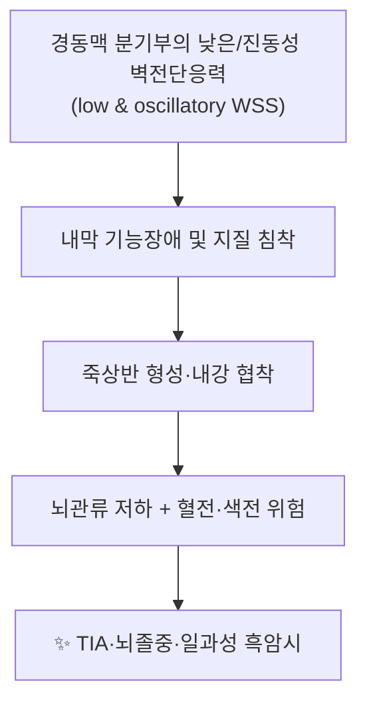

# 🩸 [[구조물/혈관/총경동맥]] (Common Carotid Artery, CCA)

> **핵심 요약 (Key Summary)**:
> [[총경동맥]]은 좌측은 [[대동맥궁]], 우측은 [[완두동맥]]에서 기시하여 [[경동맥초]] 내를 상행하다 [[상갑상연골]] 상연 높이에서 [[내경동맥]]과 [[외경동맥]]으로 분기하는 경부 및 뇌혈류의 최종 공급 관문이다.
> 경부 주행 중 정상적으로 분지를 내지 않으며, 분기부의 [[경동맥동]](압수용체)과 [[경동맥체]](화학수용체)가 자율신경성 혈압·호흡 조절에 관여한다.
> 임상적으로는 [[경동맥 죽상동맥경화]], [[경동맥 박리]], [[경동맥 폐색]], [[경동맥 동맥류]] 및 경부 도수치료·자침 시의 [[혈관성 합병증]] 위험이 핵심 관리 지점이다.

---
## 📌 목차
1. [해부학적 정밀 구조 및 지배 신경/혈관](#1-해부학적-정밀-구조-및-지배-신경혈관)
2. [생체역학·토크 분석 & 근막 사슬 (Biomechanical Synergy)](#2-생체역학토크-분석--근막-사슬-biomechanical-synergy)
3. [근막통증증후군(TP) & 연관통 패턴 (Travell & Simons)](#3-근막통증증후군tp--연관통-패턴-travell--simons)
4. [초음파 해부학(Sonoanatomy) 및 중재 시술 랜드마크](#4-초음파-해부학sonoanatomy-및-중재-시술-랜드마크)
5. [⭐ 원장님 심층 임상 고찰 및 원본 필기 (Clinical Pearls)](#5-⭐-원장님-심층-임상-고찰-및-원본-필기-clinical-pearls)
6. [관련 임상 질환 및 운동손상 증후군 총괄](#6-관련-임상-질환-및-운동손상-증후군-총괄)
7. [추나·도수치료(MET/PIR) & 침구·약침·재활 프로토콜](#7-추나도수치료metpir--침구약침재활-프로토콜)
8. [출처 및 학술 참고 문헌 (References)](#8-출처-및-학술-참고-문헌-references)

---
## 1. 해부학적 정밀 구조 및 지배 신경/혈관

> ※ 총경동맥은 근육이 아닌 **혈관(탄성동맥)**이므로, 템플릿의 "기시–정지–신경지배" 항목을 혈관 해부에 맞추어 재해석하여 기재한다.

| 항목 | 상세 내용 |
| :--- | :--- |
| **기시 (Origin)** | **좌측 CCA**: [[대동맥궁]](aortic arch)에서 직접 기시. **우측 CCA**: [[완두동맥]](brachiocephalic trunk, 무명동맥)에서 기시. 좌우 모두 상종격에서 시작하여 [[흉곽상구]]를 지나 경부로 진입한다. |
| **종지 (Termination)** | [[상갑상연골]](thyroid cartilage) 상연 높이, 통상 **C3–C4 또는 C4 추체 높이**에서 [[내경동맥]](ICA)과 [[외경동맥]](ECA)으로 분기한다. 분기 높이는 개인차가 크며 대략 C2–C5 범위까지 변이한다. |
| **주행 및 주요 인접 구조** | [[경동맥초]](carotid sheath) 내를 상행하며, **내측**에는 기관·식도·갑상선, **외측**에는 [[내경정맥]](IJV), **후방(혈관 사이 후측)**에는 [[미주신경]](CN X)이 위치한다. 전방으로는 [[흉쇄유돌근]]·견갑설골근·흉골갑상근이 덮고, 경동맥삼각(carotid triangle; 흉쇄유돌근 전연 + 상복근 + 악이복근 후복)에서 촉진이 용이하다. |
| **분지 (Branches)** | 정상적으로 **경부 주행 중에는 분지를 내지 않는다**. 분기부에서 ICA·ECA로 나뉘며, 분기부 팽대부에 [[경동맥동]](carotid sinus, 압수용체)과 분기부 후내측에 [[경동맥체]](carotid body, 화학수용체)가 존재한다. (드물게 CCA에서 상갑상동맥 등이 기시하는 변이가 보고되나 세부 빈도는 **근거 미확인**) |
| **신경 지배 (자율신경)** | 혈관 자체는 [[미주신경]](CN X)과 [[설인신경]](CN IX)의 가지인 **Hering 신경**(경동맥동 신경)에 의해 지배된다. 경동맥초 내 동반 구조는 **CCA + IJV + 미주신경 + 심경부림프절 + 경신경고리(ansa cervicalis)** 이다. |
| **혈관 공급 (영양혈관)** | 대동맥에서 기시하는 탄성형 동맥(elastic artery)으로, 자체 영양혈관(vasa vasorum)과 신경(vasa nervorum)을 갖는다. 직경·길이의 정확한 평균 수치는 본 노트에서 1차 자료로 확인하지 못하여 **근거 미확인**으로 표기한다. |

### 🔬 해부학 도해 및 단면도

> 🖼️ **(이미지 없음 — 이미지 자리 비워둠)**

* 참고: [[경동맥초]]의 내부 구성과 경부 혈관 주행 관계는 PMID 37081926, PMID 30137861에서 해부학 및 임상적 고려사항으로 다루어졌다.

---
## 2. 생체역학·토크 분석 & 근막 사슬 (Biomechanical Synergy)

* **혈류역학적 부하 (모멘트 암의 혈관판 대응 개념)**: 분기부에서는 혈류가 두 갈래로 나뉘면서 유속이 감소하고 유동 방향이 변하여, 국소적으로 **낮은 벽전단응력(low wall shear stress)** 과 **진동성 전단응력**이 형성된다. 이 부위가 죽상동맥경화 호발부이며, 이후 내강 협착에 따라 저항이 상승하고 뇌관류가 저하되는 악순환이 만들어진다. (일반 혈역학 원리)
* **탄성동맥으로서의 기능**: CCA는 탄성섬유가 풍부한 대혈관으로, 심수축기 압력을 저장하고 확장기에 방출하는 **Windkessel 효과**에 기여하여 뇌혈류를 연속적·박동성 낮은 상태로 유지한다. 이 탄성은 연령 및 동맥경화에 따라 감소한다.
* **근막 사슬 연계 (Myers Anatomy Trains 관점)**: CCA 자체는 근막사슬의 "주행 근육"이 아니지만, 혈관을 둘러싼 **경동맥초**와 [[경근막]](deep cervical fascia), [[흉쇄유돌근]]·[[사각근]]·설골상하근군의 근막이 연속되어 **경부 심부 전방선(Deep Front Line)의 결합조직 통로**를 형성한다. 따라서 경부 심부 근막의 과긴장은 이론상 신경혈관 다발(neurovascular bundle)의 이동성(mobility)을 제한할 수 있다는 개념적 모델이 적용된다. (임상적 인과관계의 정도는 **근거 미확인**)
* **경추 운동과의 관계**: 경부 회전·신전 시 CCA는 경동맥초 내에서 [[내경정맥]] 및 [[미주신경]]과 함께 이동하며, 주변 근육(흉쇄유돌근, 사각근)의 긴장도에 따라 주행 공간의 여유가 달라진다. 이는 도수치료 시 **안전 마진 확보**가 필요한 해부학적 근거가 된다.

---
## 3. 근막통증증후군(TP) & 연관통 패턴 (Travell & Simons)

> 🖼️ **(이미지 없음 — 이미지 자리 비워둠)**

* **결론: 총경동맥 자체에는 근막 발통점(TrP)이 존재하지 않는다** (혈관은 골격근이 아니므로 TrP 개념이 적용되지 않음).
* 그러나 **경동맥 주위 근육의 TrP 연관통이 경동맥성/혈관성 통증과 감별 대상**이 된다. 감별에 중요한 인접 근육은 다음과 같다 (Travell & Simons 기준의 일반적 서술):

| 인접 근육 | 발통점 위치 | 연관통(유발통) 패턴 | 감별 포인트 |
| :--- | :--- | :--- | :--- |
| [[흉쇄유돌근]] (SCM) | 흉골두·쇄골두·근복 중간 | 안와주위, 이개부, 이부, 전두부, 심지어 안구 후방 | 경동맥 박동 촉진 위치와 근접 → 압통과 박동을 반드시 구분 |
| [[사각근]] (Scalenus) | 전·중·후 사각근 근복 | 견갑부, 상완 요측, 전완, 수지 | [[흉곽출구증후군]]·[[사각근증후군]] 감별, 상지 방사 증상 동반 |
| [[승모근]] 상부섬유 | 견정부 상부 | 후두부, 측두부, 경부 | 후두부 두통의 흔한 원인 |
| [[후두하근군]] | 후두골 하부 | 후두부, 안와부 | 경부 회전 제한 및 두통 패턴 |

* **⚠️ 감별 원칙**: 경부 통증·두통 환자에서 **경동맥 주행 부위의 압통**이 확인되면, 단순 근막통으로 단정하지 말고 **혈관 병변(박리·협착·동맥류)** 을 먼저 배제해야 한다 (→ 5번 항목 Clinical Pearls 참조).

---
## 4. 초음파 해부학(Sonoanatomy) 및 중재 시술 랜드마크

* **탐촉자 및 스캔 뷰**: 고주파 선형 탐촉자(7–15 MHz)를 사용하여 [[경동맥삼각]] 또는 윤상연골~상갑상연골 높이에서 **횡단(transverse) / 종단(longitudinal) 스캔**을 시행한다.
* **횡단 스캔 표준 소견**:
  * [[총경동맥]]은 **내측(medial)에 원형(round), 박동성(phasic), 압박에 저항**하는 구조로 보인다.
  * [[내경정맥]]은 **외측(lateral)에 타원형, 압박 시 붕괴(compressible), 호흡성 변동**을 보이는 구조로 보인다.
  * 두 혈관 사이 후방에 [[미주신경]]이 작은 저에코 점상 구조로 관찰되어 **"bull's-eye / honeycomb" 형태**를 이룬다.
* **종단 스캔 및 분기부 확인**: CCA를 따라 상행하면 분기부에서 내경동맥·외경동맥으로 나뉘는 것이 확인된다. **총경동맥 내막-중막 두께(CCA-IMT)** 는 심혈관 위험의 대리 지표로 측정되며, 일반적으로 1.0 mm 미만을 정상 범위로 보지만 **정확한 절단값은 적용 진료지침별로 상이**하다(근거 미확인).
* **안전 마진 및 위험 구조물 회피**:
  * 경동맥 주행부 자침·약침 시 **혈관 천자 → 혈종, 가성동맥류, 미주신경 자극(서맥·실신)** 위험이 있다.
  * 시술 전 반드시 **박동 촉진 및 가능하면 초음파 확인**을 하고, 자입 시 **흡입(aspiration) 확인**, **혈관 내 주입 절대 금지**.
  * [[경동맥동]] 부위(분기부 팽대)는 **직접 압박 금지** — 압박성 반사(서맥, 저혈압, 실신) 유발 가능.
  * 항응고제·항혈소판제 복용자, 출혈 소인 환자에서는 경부 심자침 및 약침을 최소화하거나 시행하지 않는다.
* **경동맥 접근 중재 시술(양방 영역)**: 경동맥 스텐트·혈전제거술 등은 초음파 및 혈관조영 유도하에 시행되며, 이때 경동맥초 해부가 주요 랜드마크가 된다 (PMID 37081926, PMID 30137861).

---
## 5. ⭐ 원장님 심층 임상 고찰 및 원본 필기 (Clinical Pearls)

* **① "경동맥 주행을 항상 머릿속에 그려놓고 손을 대라."**
  경부 전측방은 근육·림프절·혈관이 밀집한 구역이다. [[흉쇄유돌근]] 전연을 기준으로 **박동이 느껴지는 선**을 먼저 확인하고, 그 선상 및 주변 1–2 cm는 자침·압박의 **고위험 구역**으로 설정한다.
* **② 경동맥 잡음(bruit) 청진 습관화.**
  상갑상연골 높이, 흉쇄유돌근 전연에서 청진기를 대어 **잡음(bruit)** 을 확인한다. 잡음이 들리면 경동맥 협착 가능성이 있으므로 한방 치료로 시간을 지연시키지 말고 **혈관 초음파·CTA 등 즉시 평가 의뢰**한다.
* **③ 혈관성 증상의 적색 신호(Red Flag)**:
  * 일과성 **흑암시(amaurosis fugax)**, 한쪽 눈 시력 저하
  * 일측성 감각·운동 마비, 구음장애, 안면 편측 저하 (TIA/뇌졸중 의심)
  * 경부 외상 후 발생한 **편측 경부·안면 통증 + Horner 증후군 양상** (경동맥 박리 의심, PMID 8326665)
  * 경동맥 분기부의 **박동성 종괴** (경동맥 동맥류 또는 경동맥체 종양 감별, PMID 36681487)
  → 위 소견이 있으면 **즉시 응급/혈관 전문 진료 의뢰**가 원칙이다.
* **④ 경부 도수치료의 안전 원칙.**
  고속 저진폭(HVLA) 경추 회전·신전 조작은 **척추동맥·내경동맥 박리와의 연관성**이 논란이 되어 온 영역이다. 정확한 발생률·인과관계는 **근거 미확인**이나, 임상적으로는 다음을 준수한다:
  * 고령, 고혈압, 동맥경화, 편두통, 결합조직질환, 최근 경부 외상 병력자는 **고속 조작을 회피**하고 저속·저진폭 기법(MET/PIR, 관절가동술 Grade I–II)을 우선한다.
  * 시술 전 **경추 혈관 검사(vertebral–basilar insufficiency test 등) 및 신경학적 선별**을 시행한다.
  * 시술 중 어지럼·복시·구음장애·이명 발생 시 **즉시 중단**한다.
* **⑤ 경동맥 폐색의 치료 공백(gap in guidelines).**
  총경동맥 폐색은 증상 발현 양상이 다양하고 **현재 진료지침에서 치료 표준이 명확히 정립되지 않은 영역**으로 지적되었다 (PMID 23870716). 따라서 무증상 우연 발견례에서도 **혈관외과 협진**이 필요하다.
* **⑥ 경동맥 결찰의 역사적 교훈.**
  과거 두경부 종양·출혈 조절을 위해 총경동맥 결찰이 시행된 바 있으며 (PMID 35762282), 이는 경동맥이 **뇌혈류의 단일 통로**에 준하는 중요성을 가짐을 보여준다. 즉 경동맥 영역에서의 **모든 침습적 처치는 보수적으로 접근**해야 한다.
* **⑦ 경동맥초 = "경부의 안전 상자(safe box)" 개념.**
  경동맥초는 CCA·IJV·미주신경을 하나의 결합조직 초로 묶는 구조로, 경부 수술·시술 시 **구획 경계**이자 **보호막**이다 (PMID 37081926, PMID 30137861). 림프절 종대·경부 종괴 평가 시 이 초의 변위 여부가 중요한 단서가 된다.

---
## 6. 관련 임상 질환 및 운동손상 증후군 총괄

| 임상 질환 / 증후군 | 병리적 연관 기전 | 주요 증상 및 이학적 검사 | 핵심 교정 타깃 |
| :--- | :--- | :--- | :--- |
| [[경동맥 동맥류]] (Common carotid artery aneurysm) | 혈관벽 약화·국소 확장, 드문 질환으로 보고됨 (PMID 36681487) | 경부 박동성 종괴, 압박 증상, 신경학적 합병증 | 외과적 평가·수술적 치료 우선, 한방 침습 시술 금지 |
| [[총경동맥 폐색]] (CCA occlusion) | 죽상동맥경화·혈전에 의한 내강 폐쇄, 치료 표준 미정립 (PMID 23870716) | 무증상~TIA/뇌졸중, 도플러·CTA/MRA로 진단 | 혈관외과 협진, 혈관 위험인자 관리 |
| [[경동맥 박리]] (Spontaneous CCA dissection) | 내막 파열로 인한 혈관벽 층간 혈종 및 진성/가성 내강 형성 (PMID 8326665) | 편측 경부·두부 통증, Horner 증후군, TIA/뇌졸중 | 항혈전 치료 등 전문 진료, 경부 도수치료 절대 회피 |
| [[경동맥 결찰]] (Carotid ligation) | 종양·출혈 조절 목적의 혈류 차단 (PMID 35762282) | 뇌허혈 위험, 결찰 후 신경학적 합병증 | 역사적·수술적 개념 이해, 임상 적용은 전문 영역 |
| [[경동맥초 병변]] (Carotid sheath lesion) | 경동맥초 내 림프절·신경·혈관 병변, 초의 해부학적 이해 필수 (PMID 37081926, PMID 30137861) | 경부 종괴, 연하곤란, 뇌신경 증상 | 경부 종괴 감별진단, 영상 검사 의뢰 |
| [[경동맥 죽상동맥경화 / 협착]] | 분기부 저전단응력 → 내막 손상 → 플라크 형성 | 무증상 잡음, 흑암시, TIA | 혈관 위험인자(고혈압·당뇨·이상지질혈증·흡연) 관리 |

---
## 7. 추나·도수치료(MET/PIR) & 침구·약침·재활 프로토콜

### 1) 한의학 경혈 매핑 (경동맥 주행과의 관계)

| 경혈 | 소속 경락 | 해부학적 위치 | 총경동맥과의 관계 및 주의 |
| :--- | :--- | :--- | :--- |
| [[인영]](人迎, ST9) | 족양명위경 | 후두융기 높이, 흉쇄유돌근 전연 | **총경동맥 박동부 바로 위**. 고전에서도 深刺를 경계. 촉진 후 혈관을 피해 얕게 자침, 직접 압박 금지 |
| [[천정]](天鼎, LI17) | 수양명대장경 | 후두융기 높이, 흉쇄유돌근 후연 | 경동맥초 후방부와 근접, 심자 시 미주신경·경신경총 자극 주의 |
| [[부돌]](扶突, LI18) | 수양명대장경 | 설골 높이, 흉쇄유돌근 흉골두·쇄골두 사이 | 경동맥삼각 내 위치, 박동 확인 필수 |
| [[천창]](天窓, SI16) | 수태양소장경 | 설골 높이, 흉쇄유돌근 후연 | 경동맥 박동부 후방, 자침 깊이 제한 |
| [[수돌]](水突, ST10) | 족양명위경 | 윤상연골 높이, 흉쇄유돌근 전연 | 갑상선·경동맥 인접 |
| [[결분]](缺盆, ST12) | 족양명위경 | 쇄골상와 중앙 | [[쇄골하동맥]]·[[완두동맥]]·[[폐첨]] 인접, **심자 금지** |

* **⚠️ 공통 원칙**: 경부 전측방 경혈은 **혈관·신경·기관과의 거리가 매우 짧다.** 자침 전 촉진으로 박동을 확인하고, **0.3–0.5寸 이내의 얕은 자침, 사자 또는 횡자**를 원칙으로 하며, 시술 후 국소 혈종 여부를 반드시 관찰한다. 약침은 해당 부위 **직접 주입을 피하고** 근육층(흉쇄유돌근, 승모근, 사각근) 내로 한정한다.

### 2) 근에너지기법 (MET) / 수용성 억제(PIR) 프로토콜

총경동맥 자체는 도수 치료의 대상이 아니며, **경동맥의 안전한 주행 공간을 확보하기 위한 주변 근육 이완**이 목표이다.

1. **흉쇄유돌근 MET (경부 회전 제한 개선)**
   * 환자 앙와위 또는 좌위. 치료수는 손바닥으로 환자 측두부에 접촉, 반대손은 흉쇄유돌근 흉골두 하부에 접촉.
   * 환자가 **경부를 반대 방향으로 회전·측굴(등척성 수축, 20–30% 강도, 5–7초)** → 호기 시 부드럽게 신장.
   * 3–5회 반복. **경동맥을 직접 압박·견인하지 않는다**.
2. **사각근 PIR (흉곽출구 감압)**
   * 환자 앙와위, 치료수로 상부 경추 측방과 제1늑골 상면에 접촉.
   * 등척성 측굴 수축(5–7초) → 이완 시 호기와 함께 미세 신장. 3–5회.
3. **경부 심부 굴곡근 안정화 (Deep Cervical Flexor Training)**
   * 크랜-서비컬 굴곡(chin tuck) 유지 10초 × 10회, 점진적으로 20초까지.
   * 표재성 굴근([[흉쇄유돌근]])의 과활성화를 억제하고 심부 굴곡근을 활성화한다.
4. **경부 심부 근막·경동맥초 이동성(mobility) 접근 (간접 기법)**
   * 후두하근·상부 경추 심부에 대한 **저속·저진폭 관절가동술(Grade I–II)** 또는 기능적 기법을 적용한다.
   * **고속 저진폭(HVLA) 경추 회전 조작은 경동맥·추골동맥 위험을 고려하여 선택적으로, 또는 회피**한다 (→ 5번 ④).

### 3) 침구·약침·재활 통합 프로토콜 (경부 통증 환자 기준)

| 단계 | 목표 | 적용 |
| :--- | :--- | :--- |
| 1. 평가 | 혈관 병변 배제 | 적색 신호 확인(5번 ③), 경동맥 잡음 청진, 필요 시 초음파/CTA 의뢰 |
| 2. 침 치료 | 근육성 통증 이완 | 흉쇄유돌근·사각근·승모근 상부·후두하근 대상, 원위 취혈(합곡 LI4, 외관 TE5, 후계 SI3 등) 병용 |
| 3. 약침 | 국소 근육층 | 경부 근육 내 농도로 시행, **혈관 내·혈관 주위 직접 주입 금지**, 생리식염수/약침 희석 농도 준수 |
| 4. 수기 치료 | 관절·근막 이동성 회복 | MET/PIR → 저속 관절가동술 → 필요시 선택적 HVLA |
| 5. 재활/운동 | 재발 방지 | 경부 심부 굴곡근 강화, 견갑 안정화, 흉추 가동성 확보, 자세 교육(전방 머리 자세 교정) |
| 6. 환자 교육 | 자가 관리 | 장시간 화면 사용 시 30–40분마다 미세 휴식, 경부 전측방 자가 압박 금지, Red Flag 증상 시 즉시 내원 |

---
## 8. 출처 및 학술 참고 문헌 (References)

> **인용 원칙 안내**: 본 노트는 제공된 PubMed 서지 정보의 **제목·저자·연도·PMID 범위 내에서만** 인용하였으며, 초록·본문의 세부 수치를 확인하지 못한 항목은 본문에 **"근거 미확인"** 으로 표기하였다. 아래 문헌 외의 PMID·논문은 창작하지 않았다.

1. **Ilyas S, Powell RJ. (2023)**. Primary common carotid artery aneurysm. *J Vasc Surg*. **PMID: 36681487**
2. **Klonaris C, Kouvelos GN. (2013)**. Common carotid artery occlusion treatment: revealing a gap in the current guidelines. *Eur J Vasc Endovasc Surg*. **PMID: 23870716**
3. **Ellis H. (2022)**. Ligation of the common carotid artery. *J Perioper Pract*. **PMID: 35762282**
4. **Humphrey PW, Keller MP. (1993)**. Spontaneous common carotid artery dissection. *J Vasc Surg*. **PMID: 8326665**
5. **Bond JD, Zheng F. (2023)**. The carotid sheath: Anatomy and clinical considerations. *World Neurosurg X*. **PMID: 37081926**
6. **Garner DH, Kortz MW. (2023)**. Anatomy, Head and Neck: Carotid Sheath. *StatPearls*. **PMID: 30137861**

### 표준 참고 교재 (템플릿 기본 참고)
7. **Standring, S. (2020)**. *Gray's Anatomy: The Anatomical Basis of Clinical Practice* (42nd ed.). Elsevier.
8. **Travell, J. G., & Simons, D. G. (1999)**. *Myofascial Pain and Dysfunction: The Trigger Point Manual*, Vol. 1.

---
### 🔗 관련 노트
* [[경동맥초]] · [[내경동맥]] · [[외경동맥]] · [[미주신경]] · [[내경정맥]]
* [[흉쇄유돌근]] · [[사각근]] · [[승모근]] · [[후두하근군]]
* [[인영]](ST9) · [[천정]](LI17) · [[부돌]](LI18) · [[결분]](ST12)
* [[경동맥 박리]] · [[경동맥 폐색]] · [[경동맥 동맥류]] · [[뇌졸중]] · [[일과성 뇌허혈발작]]