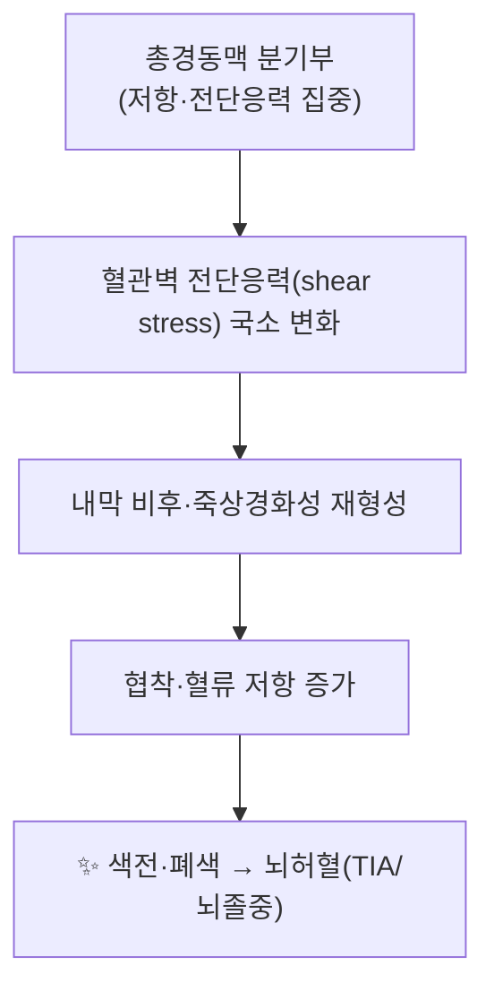

![[내경동맥_1.jpg|540]]
> [그림 1: Case of wound of internal carotid artery successfully ligatured (IA b30560858).pdf]

# 🫁 [[구조물/혈관/내경동맥]] (Internal Carotid Artery, ICA)

> **핵심 요약 (Key Summary)**:
> [[내경동맥]](ICA)은 [[총경동맥]] 분기부에서 기시하여 경부→두개저→두개내를 관통하는 뇌·안구의 주된 전방 순환 혈관이다. 경부 분절에서는 분지를 내지 않으며 [[경동맥초]](carotid sheath) 내에서 [[내경정맥]], [[미주신경]]과 동반 주행한다. [[경동맥박리]], [[죽상경화성 협착]], [[내경동맥 무형성]](agenesis) 등의 임상질환과 밀접하며, [[인영]](ST9) 등 경부 경혈 자침 시 천자 위험 구조물로서 [[자침안전]]의 핵심 감시 대상이다.

---
## 📌 목차
1. [해부학적 정밀 구조 및 지배 신경/혈관](#1-해부학적-정밀-구조-및-지배-신경혈관)
2. [생체역학·토크 분석 & 근막 사슬 (Biomechanical Synergy)](#2-생체역학토크-분석--근막-사슬-biomechanical-synergy)
3. [근막통증증후군(TP) & 연관통 패턴 (Travell & Simons)](#3-근막통증증후군tp--연관통-패턴-travell--simons)
4. [초음파 해부학(Sonoanatomy) 및 중재 시술 랜드마크](#4-초음파-해부학sonoanatomy-및-중재-시술-랜드마크)
5. [⭐ 원장님 심층 임상 고찰 및 원본 필기 (Clinical Pearls)](#5--원장님-심층-임상-고찰-및-원본-필기-clinical-pearls)
6. [관련 임상 질환 및 운동손상 증후군 총괄](#6-관련-임상-질환-및-운동손상-증후군-총괄)
7. [추나·도수치료(MET/PIR) & 침구·약침·재활 프로토콜](#7-추나도수치료metpir--침구약침재활-프로토콜)
8. [출처 및 학술 참고 문헌 (References)](#8-출처-및-학술-참고-문헌-references)

---
## 1. 해부학적 정밀 구조 및 지배 신경/혈관

| 항목 | 상세 내용 |
| :--- | :--- |
| **기시 (Origin)** | [[총경동맥]](common carotid artery) 분기부. 통상 경부 C3–C4(또는 C4) 높이, [[갑상연골]] 상연 부근에서 [[외경동맥]](ECA)과 분기한다. 분기 높이는 개인차가 크며 Rudnay 등(PMID: 34983265)은 내경동맥 해부가 "항상 교과서적이지 않다(not always straightforward)"고 보고하였다. |
| **주행 (Course)** | 경부를 거의 수직으로 상행 → [[두개저]] [[경동맥관]](carotid canal) 진입 → [[해면정맥동]] 통과 → [[전상상동굴]](clinoid) 상방 → [[지주막하강]]으로 나와 [[시신경]] 외측에서 분지. |
| **분지 (Branches)** | **경부 분절(cervical)에서는 분지가 없다(no branches).** 두개내 분절에서 [[안동맥]](ophthalmic a.), [[후교통동맥]](PComA), [[전맥락총동맥]](anterior choroidal a.), 그리고 종말분지인 [[전대뇌동맥]](ACA)·[[중대뇌동맥]](MCA)을 낸다 (Wolman & Moraff, PMID: 35843665). |
| **신경 지배 (Innervation)** | 혈관 자체의 수축·이완은 [[경동맥신경총]](carotid plexus)을 통한 [[교감신경]] 및 [[부교감신경]]성 혈관운동섬유가 지배한다. 근육과 달리 체성 운동신경 지배는 없음. |
| **동반 구조 (Neurovascular bundle)** | [[경동맥초]] 내에서 [[내경정맥]](IJV, 외측), [[미주신경]](CN X, 후방)과 동반. 두개저에서는 [[설인신경]](CN IX), [[설하신경]](CN XII), [[삼차신경]](CN V) 등 뇌신경과 근접한다 (Prasad & Gupta, PMID: 34725000). |

### 🔬 Bouthillier 분절 분류 (PMID: 8837792)
내경동맥은 두개저와 두개내를 통과하며 **Bouthillier 등(1996)의 7분절 분류**가 임상·수술 해부의 표준으로 널리 쓰인다.

| 분절 | 명칭 | 위치·특징 |
| :--- | :--- | :--- |
| **C1** | Cervical (경부) | 총경동맥 분기부 → 경동맥관 입구. 분지 없음. |
| **C2** | Petrous (추체) | 경동맥관 내 주행. |
| **C3** | Lacerum (열공) | 열공 위를 지나며 이 구간의 실제 주행은 논쟁의 여지가 있음. |
| **C4** | Cavernous (해면) | 해면정맥동 내에서 S자형 주행, 다수의 뇌신경과 근접. |
| **C5** | Clinoid (상상돌기) | 전상상동굴(clinoid) 상방, 경막 고리 통과. |
| **C6** | Ophthalmic (안) | [[안동맥]] 분지, 지주막하강 시작. |
| **C7** | Communicating (교통) | [[후교통동맥]] 분지 → 종말분지(ACA/MCA)로 이어짐. |

### 🔬 해부학 도해 및 단면도
* 상기 [[경동맥초]] 3구조(ICA·IJV·CN X)의 단면 배치는 **경부 초음파 스캔의 기본 랜드마크**이며, [[인영]](ST9) 등의 경부 자침 시 천자 위험 평가에 직결된다.
* 두개저 미세수술 해부(Prasad & Gupta, PMID: 34725000)는 내경동맥이 다수의 뇌신경 및 정맥 구조와 매우 근접해 있음을 보여준다.

---
## 2. 생체역학·토크 분석 & 근막 사슬 (Biomechanical Synergy)

내경동맥은 근육이 아니므로 토크·모멘트 암 개념 대신 **혈역학(hemodynamics) 및 혈류역학적 스트레스** 관점으로 서술한다. 다만 본 노트는 근골격계(해부·질환) 템플릿을 따르므로 구조적 유사성을 함께 정리한다.

* **분기부 전단응력**: 총경동맥 분기부는 혈류역학적으로 전단응력이 국소 변동하는 부위로, [[죽상경화]] 병변이 호발하는 것으로 알려져 있다(일반 혈역학 지식, 구체 수치 **근거 미확인**).
* **해면정맥동 내 S자 주행**: C4 분절의 굴곡 주행은 혈류 방향을 바꾸며, 외상·박리 시 취약점이 될 수 있다.
* **근막 사슬 대응(해당 없음)**: 내경동맥은 [[근막]]·[[건]] 구조가 아니므로 Myers Anatomy Trains 등 근막 사슬 개념은 **적용 대상이 아니다**(근-골격 구조가 아닌 혈관성 구조).

---
## 3. 근막통증증후군(TP) & 연관통 패턴 (Travell & Simons)

* **해당 없음(Not applicable)**: [[내경동맥]]은 근육·근막이 아니므로 Travell & Simons의 [[발통점]](TrP)·[[연관통]] 개념은 적용되지 않는다.
* 다만 내경동맥 병변(박리 등)은 **경부·안면·두부의 통증/신경학적 증상**으로 발현될 수 있으므로, "경부 통증 감별진단" 관점에서 근막통증증후군과 감별이 필요하다(Hayashi & Kumai, PMID: 36764863 — 신장된 [[경돌기]]에 의한 내경동맥 박리 증례).
* 임상적 감별 포인트: 목의 통증·압통이 근막성인지 혈관성(박리)인지 구분하기 위한 [[신경학적 검사]] 및 영상 감별은 **필수이며, 세부 프로토콜은 근거 미확인**.

---
## 4. 초음파 해부학(Sonoanatomy) 및 중재 시술 랜드마크

* **경동맥초 3구조 스캔**: 경부 종단·횡단 초음파에서 [[총경동맥]] → 분기부 → [[내경동맥]]·[[외경동맥]]을 확인한다. 내경동맥은 외경동맥보다 **직경이 크고 분지가 없는 저항혈관(low-resistance)** 파형을 보이며, 외경동맥은 안면·표재 분지를 낸다.
* **자침 안전 마진 (Acupuncture Safety Margin)**:
  * [[인영]](ST9)은 [[갑상연골]] 상연 높이, [[흉쇄유돌근]] 전연에서 촉지되는 **[[총경동맥]] 박동부**와 근접한다. 이 부위는 분기부·[[경동맥동]](carotid sinus)과 겹쳐, 과도한 압박·천자 시 [[미주신경]] 반사성 [[실신]]·혈종 위험이 있다.
  * 따라서 고위험 경부 혈(穴) 자침 시 **박동 촉지 → 혈관 주행 회피 → 천자 깊이·각도 제한**이 필수이다. 구체적 천자 각도·깊이 수치는 표준화된 **근거 미확인**.
* **초음파 유도 중재**: 경동맥 주변 병변·약침 시술 시 US 유도하에 [[경동맥초]]를 회피하는 접근이 권장된다(일반 원칙).
* **두개저·두개내 분절**: 초음파 창(window)이 제한적이어서 두개저·두개내 분절은 주로 **CTA/MRA/DSA**로 평가한다(Wolman & Moraff, PMID: 35843665).

---
## 5. ⭐ 원장님 심층 임상 고찰 및 원본 필기 (Clinical Pearls)

* **경부 자침의 최우선 원칙**: 경부 전외측에서 박동을 확인한 뒤에는 그 위를 침으로 직접 찌르지 않는다. [[인영]](ST9), [[천정]](天鼎), [[부돌]](扶突) 등은 경동맥초·미주신경과 근접하므로 촉진-회피를 습관화한다.
* **혈관성 vs 근막성 경부 통증**: 외상력·급성 발병·국소 신경학적 결손이 동반된 경부통은 [[경동맥박리]] 등 혈관성 원인을 먼저 배제한다. 특히 [[경돌기]]가 신장된 [[이글증후군]]에서는 경돌기가 내경동맥을 압박·손상시켜 박리를 유발할 수 있다(Hayashi & Kumai, PMID: 36764863).
* **해부 변이 경계**: 내경동맥 해부는 "항상 교과서적이지 않다"(Rudnay et al., PMID: 34983265). 분기 높이·주행·분지 변이가 있으므로 시술 전 영상 확인이 안전하다.
* **무형성(agenesis) 감별**: [[내경동맥 무형성]]은 드물지만 선천성 뇌혈관 변이로, 뇌졸중·측부순환 평가와 감별이 필요하다(Li & Hooda, PMID: 28424012).
* **수술·시술 해부**: 두개저 미세수술에서 내경동맥 주변 뇌신경·정맥과의 관계는 합병증 예방의 핵심이며(Prasad & Gupta, PMID: 34725000), 두개내 분절의 분지 순서(안→후교통→전맥락총→ACA/MCA)를 숙지한다(Wolman & Moraff, PMID: 35843665).

*(※ "원장님 원본 필기" 영역은 실제 임상 메모가 확보되면 그대로 보존하여 기재한다. 현재는 상기 일반 원칙으로 대체하며, 세부 개인 노하우는 근거 미확인.)*

---
## 6. 관련 임상 질환 및 운동손상 증후군 총괄

| 임상 질환 / 증후군 | 병리적 연관 기전 | 주요 증상 및 이학적 검사 | 핵심 교정 타깃 |
| :--- | :--- | :--- | :--- |
| [[경동맥박리]](Carotid dissection) | 혈관벽 내막 파열·혈종으로 협착/폐색 | 경부통, 두통, [[호너증후군]], TIA/뇌졸중. [[경돌기]] 신장 시 유발 가능(Hayashi & Kumai, PMID: 36764863) | 즉시 영상평가·혈관 평가(자침·도수 금기) |
| [[내경동맥 무형성]](ICA agenesis) | 선천성 혈관 미형성 | 무증상~뇌졸중, 측부순환 의존. 영상(CTA/MRA) 진단(Li & Hooda, PMID: 28424012) | 감별진단·혈관 평가 |
| [[죽상경화성 경동맥 협착]] | 분기부 전단응력·내막 비후 | 무증상 잡음(bruit), TIA/뇌졸중 | 위험인자 관리·혈관 평가(수치 근거 미확인) |
| [[이글증후군]](Eagle syndrome) | 신장된 경돌기–경상인대가 경동맥 자극 | 경부·인후통, 두통, 드물게 박리(Hayashi & Kumai, PMID: 36764863) | 경돌기 평가·감별 |
| [[경동맥동 과민]](Carotid sinus hypersensitivity) | 경동맥동 압박 반사 | 실신, 서맥. 경부 자침 시 압박 유발 가능 | 자침 시 압박 회피 |

---
## 7. 추나·도수치료(MET/PIR) & 침구·약침·재활 프로토콜

* **한의학 경혈 매핑**: 경부 전외측의 [[인영]](ST9), [[천정]](天鼎), [[부돌]](扶突), 그리고 두개저·경항부의 [[풍지]](GB20), [[완골]](GB12) 등은 [[경동맥초]]·[[미주신경]]·[[경동맥동]]과 해부학적으로 근접하다.
* **자침 안전 프로토콜(권고)**:
  1. 시술 전 [[경동맥]] 박동 촉지 및 필요 시 초음파 확인.
  2. 경동맥 주행 방향을 회피하여 **천자 각도·깊이를 보수적으로** 설정.
  3. 시술 중 어지럼·실신·이명 등 [[미주신경]] 반사 증상 모니터링.
  4. 시술 후 국소 혈종·부종 확인.
  * (구체적 침 자침 깊이·각도에 대한 표준화된 수치는 **근거 미확인**.)
* **약침·주입 시술**: 경동맥 주변은 **고위험 부위**로, 초음파 유도 없이 맹목적 주입은 권장되지 않는다(일반 원칙).
* **도수치료(MET/PIR)**: 경부 혈관성 병변이 배제된 경우에 한해 [[흉쇄유돌근]]·[[사각근]]·[[경항근]]에 대한 부드러운 등척성 이완을 적용한다. 혈관성 병변(박리 의심 등)에서는 경부 강·수동 조작을 **금기**로 한다.
* **재활 방향**: 경부 자세·심부 굴곡근 안정화와 함께, 혈관 위험인자(혈압·지질 등) 관리가 병행되어야 한다(세부 프로토콜 **근거 미확인**).

---
## 8. 출처 및 학술 참고 문헌 (References)

1. **Li S, Hooda K. (2017)**. Internal carotid artery agenesis: A case report and review of literature. *Neuroradiol J*. PMID: 28424012
2. **Wolman DN, Moraff AM. (2022)**. Anatomy of the Intracranial Arteries: The Internal Carotid Artery. *Neuroimaging Clin N Am*. PMID: 35843665
3. **Rudnay M, Rjašková G. (2023)**. Internal carotid artery anatomy - not always straightforward. *Vascular*. PMID: 34983265
4. **Hayashi S, Kumai T. (2023)**. Internal carotid artery dissection caused by elongated styloid process. *Auris Nasus Larynx*. PMID: 36764863
5. **Bouthillier A, van Loveren HR. (1996)**. Segments of the internal carotid artery: a new classification. *Neurosurgery*. PMID: 8837792
6. **Prasad KC, Gupta A. (2022)**. Microsurgical anatomy of the internal carotid artery at the skull base. *J Laryngol Otol*. PMID: 34725000
7. **Standring, S. (2020)**. *Gray's Anatomy: The Anatomical Basis of Clinical Practice* (42nd ed.). Elsevier.
8. **Travell, J. G., & Simons, D. G. (1999)**. *Myofascial Pain and Dysfunction: The Trigger Point Manual*, Vol. 1.