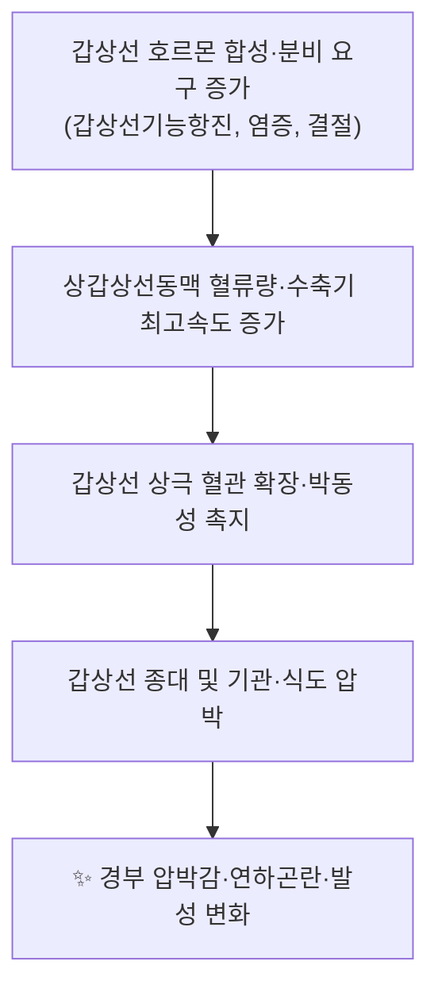
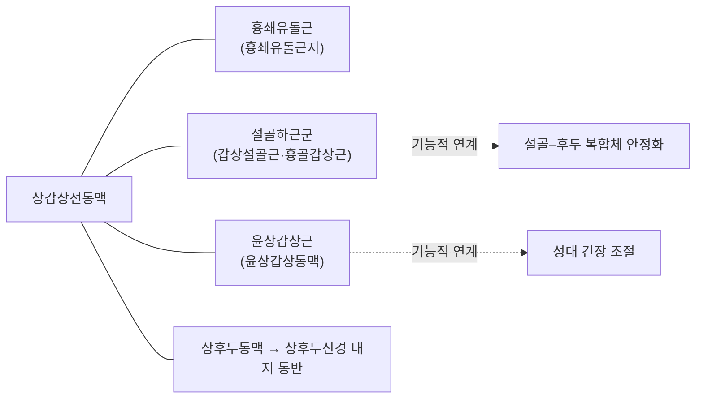

# 🩸 [[상갑상선동맥]] (Superior Thyroid Artery)

> **핵심 요약 (Key Summary)**:
> [[상갑상선동맥]]은 [[외경동맥]]의 첫 번째 전방 분지로, 주행 중 [[상후두동맥]]·[[윤상갑상동맥]]·흉쇄유돌근지를 내고 [[갑상선]] 상극으로 들어가 [[하갑상선동맥]] 및 반대측과 문합하는 경부의 대표적 동맥이다.
> 기시 양상은 외경동맥이 가장 흔하나 [[총경동맥 분지부]]·[[총경동맥]]·[[내경동맥]] 기시 등 변이가 빈번하여, 체계적 고찰들에서 "일관된 기시 패턴이 없다"고 보고되었다(PMID: 37190996, 39043951, 37061377, 21438023).
> 임상적으로는 [[갑상선 절제술]] 시 출혈 조절과 [[상후두신경 외지(EBSLN)]] 보존의 핵심 랜드마크이며, 초음파 유도 [[약침]]·[[침]] 시술 시 천자 위험 구조물로 반드시 인지해야 한다.

---
## 📌 목차
1. [해부학적 정밀 구조 및 지배 신경/혈관](#1-해부학적-정밀-구조-및-지배-신경혈관)
2. [생체역학·토크 분석 & 근막 사슬 (Biomechanical Synergy)](#2-생체역학토크-분석--근막-사슬-biomechanical-synergy)
3. [근막통증증후군(TP) & 연관통 패턴 (Travell & Simons)](#3-근막통증증후군tp--연관통-패턴-travell--simons)
4. [초음파 해부학(Sonoanatomy) 및 중재 시술 랜드마크](#4-초음파-해부학sonoanatomy-및-중재-시술-랜드마크)
5. [⭐ 원장님 심층 임상 고찰 및 원본 필기 (Clinical Pearls)](#5-원장님-심층-임상-고찰-및-원본-필기-clinical-pearls)
6. [관련 임상 질환 및 운동손상 증후군 총괄](#6-관련-임상-질환-및-운동손상-증후군-총괄)
7. [추나·도수치료(MET/PIR) & 침구·약침·재활 프로토콜](#7-추나도수치료metpir--침구약침재활-프로토콜)
8. [출처 및 학술 참고 문헌 (References)](#8-출처-및-학술-참고-문헌-references)

---
## 1. 해부학적 정밀 구조 및 지배 신경/혈관

> ※ 본 항목은 근육 노트의 「기시–정지–신경 지배」 틀을 **혈관 구조에 맞게 재구성**한 것이다(혈관에는 근육의 정지부·운동신경 지배 개념이 적용되지 않음).

| 항목 | 상세 내용 |
| :--- | :--- |
| **기시 (Origin)** | [[외경동맥]]의 **첫 번째 전방 분지(anterior branch)**. 통상 [[경동맥 분지부]] 직상방, [[설골]] 대각(greater horn) 높이에서 기시하여 전내측으로 하방 주행한다. 단, [[총경동맥 분지부]], [[총경동맥]] 자체, 드물게 [[내경동맥]]에서 기시하는 변이가 다수 보고되며, 체계적 고찰에서는 단일한 "표준 기시 패턴"이 성립하지 않는다고 결론지었다(PMID: 37190996, 39043951, 37061377, 21438023). **각 변이형의 병합 유병률(%) 수치는 원문 대조 필요 — 근거 미확인.** |
| **주행 (Course)** | 외경동맥의 전내측면을 따라 하방 주행 → [[갑상선]] 상극 부근에서 외측·하방으로 굽어 갑상선 피막에 도달 → 상극에서 전지·후지로 분지. |
| **분지 (Branches)** | ① [[설골하동맥]](infrahyoid a.) — 설골하근군 공급 ② 흉쇄유돌근지(sternocleidomastoid branch) ③ [[상후두동맥]](superior laryngeal a.) — [[상후두신경]] 내지와 동반하여 [[갑상설골막]]을 관통 ④ [[윤상갑상동맥]](cricothyroid a.) ⑤ 갑상선지(glandular branches) — 갑상선 상극 실질로 진입. |
| **종말 및 문합 (Anastomosis)** | 갑상선 내에서 전·후지로 나뉘어 **반대측 상갑상선동맥** 및 **[[하갑상선동맥]]**([[갑상경동맥]] 기원)과 풍부하게 문합 → 갑상선은 대표적인 **이중 혈류공급 기관**. |
| **동반 정맥** | [[상갑상선정맥]](superior thyroid v.) → [[내경정맥]]으로 유출. |
| **주요 신경 관계** | ⓐ [[상후두신경]] **내지** — [[상후두동맥]]과 함께 갑상설골막을 관통(감각·연하 반사 관련). ⓑ [[상후두신경]] **외지(EBSLN)** — 갑상선 상극 근처에서 상갑상선동맥과 근접·교차할 수 있어 **갑상선 수술 시 최대 위험 지점**으로 취급된다(교과서적 지식, 제공 논문 범위 외 — 근거 미확인). ⓒ [[하갑상선동맥]]–[[반회후두신경]] 관계는 하방 랜드마크로 별도 정리. |

### 🔬 국소 해부 및 단면 관계 (도해 대체 서술)

제공된 이미지 블록이 없어 임베드는 생략하고, 대신 단면·주행 관계를 서술로 정리한다.

* **경동맥 삼각(carotid triangle) 내 위치**: 상갑상선동맥은 [[외경동맥]] 기시부에서 가장 먼저 전방으로 갈라지므로, 경부 전방 접근 시 **가장 먼저 만나는 동맥**이다.
* **인접 구조**: 외측으로 [[내경정맥]], 내측으로 [[갑상선]]·[[기관]], 후방으로 [[경동맥초]]와 [[미주신경]].
* **피막 관계**: 갑상선 상극에서 동맥은 **피막 직상방에서 분지**하므로, 상극 결찰 시 피막에 근접시켜 결찰하는 것이 EBSLN 보존에 유리하다는 것이 외과학교과서의 고전적 원칙이다(근거 미확인).
* **변이 분류사**: Natsis 등(2011)은 Caucasian Greek 표본을 대상으로 상갑상선동맥 기시에 대한 **새로운 분류 제안**과 문헌 고찰을 보고하였다(PMID: 21438023). Tzortzis 등(2023)은 상갑상선동맥의 해부학적 변이를 체계적 고찰로 정리하였다(PMID: 37061377).

---
## 2. 생체역학·토크 분석 & 근막 사슬 (Biomechanical Synergy)

> ※ 동맥에는 근육의 모멘트 암·토크 개념을 적용할 수 없으므로, 본 항목을 **혈류역학(hemodynamics)과 근막·근육 사슬과의 해부학적 연계**로 대체한다.

* **혈류역학적 특징**: 갑상선은 체중 대비 혈류량이 매우 큰 기관으로, 상갑상선동맥과 하갑상선동맥이 이를 담당한다. **구체적 mL/min 수치는 제공 논문 범위 외 — 근거 미확인.**
* **박동성 촉진**: 갑상선 상극에서 동맥 박동이 촉지되며, 기능항진 상태에서는 현저해진다(임상 관찰 소견, 정량 근거 미확인).
* **근막 사슬 연계 (Myers / McGill 관점의 응용)**: 상갑상선동맥은 **근육을 지배하는 운동혈관이 아니라 통과·공급혈관**이지만, 그 분지가 경부 심부 근군과 직접 맞닿아 있어 경부 근긴장·흉곽상부 호흡패턴과 해부학적으로 밀접하다.

* **임상적 함의**: 흉곽상부 호흡(상부 승모근·흉쇄유돌근·설골하근 과활성)은 전경부 근긴장을 유발하고, 이는 전경부 통증·이물감(globus)으로 이어질 수 있다. 상갑상선동맥 자체의 "토크"는 존재하지 않으나, **주변 근군의 긴장이 갑상선 상극 촉진·천자 난이도에 영향을 준다**는 것이 임상적 요점이다(근거 미확인).

---
## 3. 근막통증증후군(TP) & 연관통 패턴 (Travell & Simons)

> ⚠️ **동맥은 근막통증증후군의 발통점(TrP)을 형성하지 않는다.** 따라서 본 항목은 "상갑상선동맥을 지표로 하는 전경부 근군의 TrP 및 감별진단"으로 재구성한다.

* **전제**: TrP는 골격근의 과활성 운동종판에서 발생하는 국소 과민성 결절이며, 혈관 구조 자체에는 TrP 개념이 적용되지 않는다(Travell & Simons 기준).
* **상갑상선동맥과 해부학적으로 겹치는 전경부 근군**:
  * [[흉쇄유돌근]] — 흉쇄유돌근지가 공급되며, TrP 시 동측 전두부·안와주위·이개부 연관통.
  * [[흉골갑상근]]·[[갑상설골근]]·[[견갑설골근]] — 설골하근군, TrP 시 전경부·설골 부위 압통 및 연하 시 이물감.
  * [[윤상갑상근]] — 윤상갑상동맥이 공급, 성대 긴장·발성 피로와 연관.
* **감별 포인트 (중요)**:
  * 전경부 압통이 **국소 압통점 범위를 넘어 확산**되거나, **박동성 종괴**로 촉지되면 근막성 통증이 아니라 [[갑상선 결절]]·[[갑상선염]]·[[림프절 병증]]·[[혈관 병변]]을 먼저 배제해야 한다.
  * 상갑상선동맥 박동과 TrP 결절은 촉진상 혼동될 수 있으므로, **박동성 여부**로 감별한다.
* **연관통 패턴의 정량적 기술(어느 근육이 어디로 방사되는가)은 Travell & Simons 원서 대조가 필요하며, 본 노트에서는 상갑상선동맥과 무관한 항목은 기재하지 않는다.**

---
## 4. 초음파 해부학(Sonoanatomy) 및 중재 시술 랜드마크

* **주요 스캔 뷰**: 갑상선 횡단면(transverse) 및 종단면(longitudinal) 뷰에서 갑상선 상극에 접근하는 동맥을 색도플러로 확인한다. 상갑상선동맥은 갑상선 상극의 **상방·외측**에서 실질로 진입하는 양상으로 관찰된다(일반적 초음파 소견, 제공 논문 범위 외 — 근거 미확인).
* **해부학적 랜드마크**: [[갑상선 연골]] 상연, [[설골]] 대각, [[경동맥 분지부]]가 외부 랜드마크이며, 초음파상 [[외경동맥]] 기시부에서 첫 전방 분지를 추적하는 것이 가장 확실하다.
* **위험 구조물 회피**:
  * [[경동맥 분지부]]·[[경동맥동]] — 천자 시 혈종·미주신경 반사(실신, 서맥) 위험.
  * [[내경정맥]] — 상갑상선동맥 주행의 외측에 위치.
  * [[기관]]·[[식도]] — 심자 시 천공 위험.
  * EBSLN 및 [[반회후두신경]] — 직접 천자 손상 시 발성 장애.
* **중재 시술 시 함의**:
  * 전경부 [[약침]]·[[침]] 시술은 **혈관 풍부 구역**이므로 흡인(aspiration) 후 주입, 가능하면 초음파 유도가 권장된다.
  * 갑상선 결절 고주파열치료(RFA) 등에서 상갑상선동맥은 **공급혈관(feeding vessel)** 으로 인지되며, 시술 전 색도플러 평가가 필수적이다(구체적 프로토콜 수치 — 근거 미확인).
* **정량적 초음파 지표(저항지수, 최고수축기속도 등)의 정상 참고치는 본 노트에서 단정하지 않으며, 검사실 표준값 대조가 필요하다 — 근거 미확인.**

---
## 5. ⭐ 원장님 심층 임상 고찰 및 원본 필기 (Clinical Pearls)

> ⚠️ **원본 필기 미제공**: 본 세션에는 원장님의 원본 임상 필기 데이터가 전달되지 않았다. 따라서 아래는 **제공 논문 및 표준 해부학에 근거한 임상적 정리**이며, 원장님 고유의 경험적 치료 노하우는 추후 해당 섹션에 그대로 보존·기입한다.

* **변이 인식이 곧 안전**: 상갑상선동맥은 "외경동맥 첫 전방 분지"라는 교과서 공식이 실제로는 상당히 자주 깨진다. 체계적 고찰 5,488예 분석에서도 기시의 일관성이 부정되었으므로(PMID: 37190996), 시술·수술 전에는 **개별 해부를 영상으로 확인하는 것이 원칙**이다.
* **임상적으로 중요한 이유 세 가지**:
  1. **출혈**: 갑상선 상극은 혈관이 밀집된 구역으로, 천자·절개 시 혈종이 생기면 기도를 압박할 수 있다.
  2. **신경 보존**: 갑상선 상극에서 상갑상선동맥과 EBSLN이 근접하므로, 이 구역 시술은 발성 변화(고음역 저하)를 유발할 수 있다.
  3. **촉진 감별**: 전경부 박동성 촉지는 동맥, 비박동성 결절은 근육 TrP 또는 갑상선 결절로 감별한다.
* **한의 임상 적용 시 주의**: [[인영]](ST9)·[[수돌]](ST10)·[[천돌]](CV22) 등 전경부 혈위는 경동맥계와 근접하므로 **직자·심자는 원칙적으로 지양**하고, 자침 시 반드시 박동 촉지 후 회피한다(교과서적 안전 원칙).
* **향후 기입 항목(placeholder)**: 원장님 고유의 ① 전경부 이물감(globus) 치료 프로토콜, ② 갑상선 질환 한방 접근 시 혈위 선택 기준, ③ 초음파 유도 약침 시 실제 사용하는 안전 각도·심도 — **원본 필기 제공 시 본 항목에 100% 보존 기입.**

---
## 6. 관련 임상 질환 및 운동손상 증후군 총괄

| 임상 질환 / 증후군 | 병리적 연관 기전 | 주요 증상 및 이학적 검사 | 핵심 교정 타깃 |
| :--- | :--- | :--- | :--- |
| [[갑상선 절제술 중 출혈]] | 갑상선 상극 혈관 밀집부에서의 손상 | 수술 시야 혈종, 목 부종, 기도 압박 | 상극 결찰 위치, 피막 근접 결찰(근거 미확인) |
| [[상후두신경 외지 손상]] | 상갑상선동맥과 EBSLN의 근접 주행 | 고음 발성 곤란·음역 저하·발성 피로, 후두경/근전도 평가 | 상극 혈관 처리 시 신경 보존 |
| [[갑상선기능항진증]] | 갑상선 혈류량 증가 및 실질 비대 | 색도플러 과혈류, 갑상선 종대, 갑상선 기능검사 | 항갑상선제, 한방 보조치료, 전경부 근긴장 이완 |
| [[경동맥 분지부 죽상경화]] | 상갑상선동맥이 분지부 직상방에서 기시 → 분지부 병변과 위치적 근접 | 경동맥 협착·색전, 경동맥 초음파 추적 | 혈관 위험인자 관리, 경부 도수 조작 시 과신전 회피 |
| [[상갑상선동맥 기시 변이]] | 총경동맥·내경동맥 기시 등 변이 | 혈관조영·색전술 중 카테터 위치 오인, 술 전 평가 누락 | 술 전 CT 혈관조영/초음파 확인 |
| [[상부 부갑상선 혈류 저하]] | 상갑상선동맥이 상부 부갑상선에 분지를 공급 | 술 후 일시적 저칼슘혈증(감각이상, Chvostek/Trousseau) | 미세혈관 보존(근거 미확인) |
| [[전경부 근막통증(설골하근군·흉쇄유돌근)]] | 상부 호흡패턴·자세성 과활성 | 압통점 촉지, 연하 시 이물감 | 근에너지기법(MET), 호흡 재교육 |

> ※ 위 표에서 특정 논문으로 뒷받침되지 않는 항목은 교과서적 지식이며, 정량 근거가 필요한 경우 "근거 미확인"으로 표기하였다.

---
## 7. 추나·도수치료(MET/PIR) & 침구·약침·재활 프로토콜

### 7-1. 한의학 경혈 매핑

* **전경부 국소**: [[천돌]](CV22), [[염천]](CV23), [[수돌]](CV21), [[인영]](ST9), [[부돌]](ST10), [[기사]](ST11)
* **원위 배합**: [[합곡]](LI4), [[열결]](LU7), [[조해]](KI6), [[족삼리]](ST36), [[태충]](LR3)
* **⚠️ 안전 원칙**: 전경부 혈위는 [[경동맥동]]·[[경동맥]]·[[기관]]과 근접하므로 **박동 촉지 후 자침**하고, 심자·직자는 지양한다. 상갑상선동맥 주행 구역(갑상선 상극 상외측)은 천자 시 혈종 위험이 있어 초음파 유도 없이 깊게 자침하지 않는다.

### 7-2. 도수치료 / MET·PIR

* **대상 근군**: [[흉쇄유돌근]], [[흉골갑상근]], [[갑상설골근]], [[견갑설골근]], [[윤상갑상근]].
* **근에너지기법(MET)**: 등척성 수축 20~30% 강도로 5~10초 유지 → 호기 시 부드러운 신장, 3~5회 반복(일반적 프로토콜, 개별 논문 근거 미확인).
* **주의**: 경부 혈관계 병변이 의심되는 경우(경동맥 협착, 박동성 종괴) 경부 신연·회전 도수는 금기 또는 최소화한다.
* **호흡 재교육**: 흉곽상부 호흡 교정을 통해 설골하근군 과활성을 간접적으로 감소시킨다.

### 7-3. 약침·침·재활

* **약침**: 전경부는 혈관·신경 밀집부이므로 소량·천천히, 흡인 후 주입. 가능하면 초음파 유도 하에 시행한다(구체적 약침 처방·용량은 본 노트 근거 범위 외 — 근거 미확인).
* **재활**: 경부 심부 굴근 안정화 + 견갑대 안정화 + 상부 승모근 이완을 병행하여 전경부 긴장을 간접 조절.
* **추적 관찰**: 갑상선 질환이 의심되면 갑상선 기능검사·초음파를 우선 시행하여 한방 치료와 병행 여부를 결정한다.

---
## 8. 출처 및 학술 참고 문헌 (References)

1. **Triantafyllou G, Paschopoulos I (2024).** The superior thyroid artery origin pattern: a systematic review with meta-analysis. *Surg Radiol Anat.* **PMID: 39043951**
2. **Tzortzis AS, Antonopoulos I (2023).** Anatomical variations of the superior thyroid artery: A systematic review. *Morphologie.* **PMID: 37061377**
3. **Natsis K, Raikos A (2011).** Superior thyroid artery origin in Caucasian Greeks: A new classification proposal and review of the literature. *Clin Anat.* **PMID: 21438023**
4. **Poutoglidis A, Savvakis S (2023).** Is the origin of the superior thyroid artery consistent? A systematic review of 5488 specimens. *Am J Otolaryngol.* **PMID: 37190996**
5. **Standring, S. (2020).** *Gray's Anatomy: The Anatomical Basis of Clinical Practice* (42nd ed.). Elsevier. — 본문 중 교과서적 해부 서술 및 수술학적 원칙의 근거.
6. **Travell, J. G., & Simons, D. G. (1999).** *Myofascial Pain and Dysfunction: The Trigger Point Manual*, Vol. 1. — TrP 및 연관통 개념의 근거(단, 동맥 자체에는 TrP 개념이 적용되지 않음).

> **근거 표기 원칙**: 본 노트에서 수치·기전이 원문으로 확인되지 않은 항목은 "근거 미확인"으로 명시하였으며, 제공된 4편(중복 제외)의 PubMed 논문 외에 새로운 논문·PMID를 임의로 추가하지 않았다.