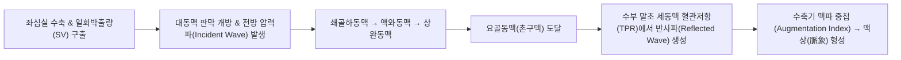

# 🩸 [[요골동맥]] (Radial Artery / 橈骨動脈)

> **핵심 요약 (Key Summary)**:
> - 📍 **해부 & 주행**: [[상완동맥]]에서 분지하여 전완 전외측의 [[완요골근]]과 [[요측수근굴근]] 사이(요골구)를 주행한 후, **해부학적 코담배갑(Anatomical snuffbox)**을 통과하여 손바닥의 **심장궁(Deep palmar arch)**을 형성하는 상지의 주혈관.
> - 🩺 **한의학적 핵심 가치 — 촌구맥(寸口脈)**: 요골 경상돌기를 랜드마크로 하여 **촌(寸)·관(關)·척(尺)** 부위에서 오장육부의 기혈 상태를 진단하는 맥진(脈診)의 절대적 해부학적 실체.
> - 🛠️ **임상 평가 & 현대의학적 의의**: [[알렌 검사]](Modified Allen test)로 척골동맥과의 측부 순환을 평가하며, 동맥혈 가스분석(ABGA) 및 동맥관(A-line) 삽입, 관상동맥 조영술(PCI) 카테터 진입 통로이자 [[흉곽출구증후군]](애드슨·늑쇄검사)의 맥박 감약 평가 표적.

---

## 📌 목차
1. [해부학적 정밀 구조 및 주행/분지](#1-해부학적-정밀-구조-및-주행분지)
2. [생체역학·혈역학 & 맥파 전파 (Biomechanical Synergy)](#2-생체역학혈역학--맥파-전파-biomechanical-synergy)
3. [임상 평가 및 이학적 검사 (알렌 검사 & 촌구맥진)](#3-임상-평가-및-이학적-검사-알렌-검사--촌구맥진)
4. [초음파 해부학(Sonoanatomy) 및 중재 시술 랜드마크](#4-초음파-해부학sonoanatomy-및-중재-시술-랜드마크)
5. [⭐ 원장님 심층 임상 고찰 및 원본 필기 (Clinical Pearls)](#5--원장님-심층-임상-고찰-및-원본-필기-clinical-pearls)
6. [관련 임상 질환 및 손상 총괄](#6-관련-임상-질환-및-손상-총괄)
7. [추나·도수치료 & 침구·약침 프로토콜 (+ 양방 처치·의뢰 기준)](#7-추나도수치료--침구약침-프로토콜--양방-처치의뢰-기준)
8. [출처 및 학술 참고 문헌 (References)](#8-출처-및-학술-참고-문헌-references)

---

## 1. 해부학적 정밀 구조 및 주행/분지

| 항목 | 상세 내용 |
| :--- | :--- |
| **기시 (Origin)** | [[상완동맥]](Brachial artery) — 주관절 와(Cubital fossa) 요골두 경부 전방에서 분지 |
| **종지 (Termination)** | 제1 배측 골간근 사이를 통과하여 수장부에서 **심장궁(Deep palmar arch)** 형성 |
| **동행 신경** | 전완 상·중부에서 [[요골신경]] 천지(Superficial branch of radial nerve)와 외측 동행 |
| **동행 정맥** | 한 쌍의 요골 정맥(Venae comitantes)이 동맥을 감싸며 주행 |

![[요골동맥_01_해부도해_Gray527.png|420]]
> [그림 1: ① 해부 도해 — 전완부 및 수부 요골동맥 주행과 주요 분지(요골순환동맥, 표재수장지, 심장궁). 출처: Gray's Anatomy (Public Domain)]

### 🔬 주행 경로별 3대 해부학적 구역
1. **전완부 주행 (Forearm Course)**:
   * 주관절 하방에서 시작하여 [[완요골근]](Brachioradialis) 내측연과 [[요측수근굴근]](Flexor carpi radialis, FCR) 건 외측연 사이의 구(Sulcus)를 따라 주행.
   * 원위부 전완에서는 피하지방층 바로 아래에 노출되어 요골(Radius) 원위 전면을 압박 지지대로 삼아 맥박 촉지가 가장 용이한 구역을 형성함.
2. **손목 후외측 주행 (Anatomical Snuffbox)**:
   * 요골 경상돌기(Styloid process)를 감아 돌아 외측 측부인대 위를 가로지른 후, **해부학적 코담배갑** 바닥(주상골 및 대능형골 표면)을 통과.
   * 경계: 외측은 [[단무지신근]]건 & [[장무지외전근]]건, 내측은 [[장무지신근]]건.
3. **수부 종지 (Palmar Course)**:
   * 제1 배측 골간근(First dorsal interosseous muscle)의 두 기시 두 사이를 뚫고 손바닥 깊은 층으로 진입.
   * 척골동맥의 심장지와 문합하여 **심장궁(Deep palmar arch)**을 완성함.
* **주요 분지군**:
  * **요골순환동맥 (Radial recurrent a.)**: 외측 상과 주위 측부 동맥망 형성.
  * **천장지 (Superficial palmar branch)**: 척골동맥과 함께 천장궁(Superficial arch)에 기여.
  * **수근배측지 & 수근장측지**: 손목뼈 그물망 형성.
  * **무지주동맥 (Princeps pollicis a.)** & **요측시지동맥 (Radialis indicis a.)**: 엄지 및 검지 손가락 주요 혈류 공급.

---

## 2. 생체역학·혈역학 & 맥파 전파 (Biomechanical Synergy)

* **촌구맥(寸口脈) 맥파의 혈역학적 기저**:
  * 심장에서 박출된 전방 압력파는 혈관벽의 탄성도와 내경에 따라 특정 속도(Pulse Wave Velocity, PWV)로 요골동맥에 전달됨.
  * 말초 세동맥 수축(저항 증가) 시 반사파가 조기에 도달하여 맥파의 정점이 뾰족해지고 긴장도가 높아지며, 한의학에서는 이를 **현맥(弦脈)** 또는 **긴맥(緊脈)**으로 인지함.
  * 심박출량 감소 및 혈관 긴장도 저하 시에는 파형의 크기가 작고 부드러워져 **약맥(弱脈)** 또는 **세맥(細脈)**으로 나타남.

---

## 3. 임상 평가 및 이학적 검사 (알렌 검사 & 촌구맥진)

![[요골동맥_03_맥박촉진_실사.jpg|420]]
> [그림 2: ② 맥박 촉지 실사 — 요골 경상돌기 내측 요측수근굴근건 외측에서 시행하는 요골동맥 맥박 촉지. 출처: Wikimedia Commons (CC BY 3.0)]

![[요골동맥_05_촌구맥진_목판화.jpg|400]]
> [그림 3: ③ 전통 맥진 사료 — 요골동맥을 촌·관·척 3부위로 나누어 오장육부 병리를 진단하는 촌구맥진 목판화 (1817). 출처: Wellcome Collection / Wikimedia Commons (CC BY 4.0)]

### 1) 알렌 검사 (Modified Allen's Test) — 손의 측부 순환 평가
* **목적**: 요골동맥 천자(ABGA), 동맥관 삽입, 동맥 채취 전 척골동맥(Ulnar artery)의 손바닥 혈류 공급 보상 능력을 확인.
* **시행 방법**:
  1. 검사자가 양손 엄지로 환자의 요골동맥과 척골동맥을 동시에 강하게 압박.
  2. 환자에게 주먹을 5~10회 쥐었다 폈다 반복하게 하여 손바닥의 피를 짜내어 창백하게 만듦.
  3. 요골동맥 압박은 유지한 채 **척골동맥의 압박만 해제**하고 손바닥 색조 회복 시간을 측정.
* **판정 기준 (Romeu-Bordas et al., [PMID 28825257](https://pubmed.ncbi.nlm.nih.gov/28825257/))**:
  * **정상 (양호)**: **5~7초 이내**에 손바닥 전체에 붉은 혈색이 완전히 회복됨 (충분한 척골동맥 측부 순환).
  * **비정상 (부전)**: 색조 회복에 **10초 이상** 소요되거나 창백함이 지속됨 $\rightarrow$ 요골동맥 폐색 시 수부 허혈 괴사 위험이 극도로 높으므로 **요골동맥 천자 및 수술적 채취 절대 금기**.

### 2) 흉곽출구증후군(TOS) 요골동맥 맥박 감약 유발 검사
* **[[애드슨 검사]](Adson Test)**: 경부를 환측으로 회전하고 신전한 채 심흡기 시 요골동맥 맥박 소실 평가 (전사각근 공간 압박).
* **[[늑쇄 검사]](Costoclavicular / Eden Test)**: 군대 차려 자세로 양 어깨를 후하방 견인 시 요골동맥 맥박 소실 평가 (쇄골-제1늑골 간격 협착).
* **[[과외전 검사]](Wright Test)**: 팔을 90도 이상 외전·외회전 시 소흉근 하부에서 맥박 소실 평가.

---

## 4. 초음파 해부학(Sonoanatomy) 및 중재 시술 랜드마크

* **초음파 스캔 뷰 (Sonoanatomy)**:
  * 원위 전완부 횡단 스캔(Transverse view) 시, 완요골근건과 요측수근굴근건 사이에서 피하지방층 직하부의 둥근 저반향/무반향(Anechoic) 박동성 관상 구조물로 관찰됨.
  * 컬러 도플러(Color Doppler) 적용 시 수축기-이완기 박동성 와류 혈류 신호 명확.
* **침구 시술 안전 마진**:
  * **[[태연]](LU9)**: 요골 경상돌기와 요골동맥 사이 함요처. 직자 시 동맥벽을 관통하지 않도록 동맥을 검지로 살짝 내측으로 밀어젖힌 후 요골 뼈 방향으로 0.2~0.3촌 천자.
  * **[[경거]](LU8)** & **[[열결]](LU7)**: 요골동맥 주행선 외측 1~2mm 여유를 두고 사자하여 동맥 천자성 혈종 예방.

---

## 5. ⭐ 원장님 심층 임상 고찰 및 원본 필기 (Clinical Pearls)

> [!IMPORTANT]
> **🛡️ 진료실 핵심 노하우 집약**:
> - 요골동맥은 한의 진료에서 가장 빈번하게 접촉하는 맥진의 해부학적 현장입니다.

* **촌·관·척(寸關尺) 해부학적 정위 팁**:
  * **관(關)**: 요골 경상돌기(Radial styloid process)의 가장 높은 정점을 기준으로 검사자의 중지를 정확히 거치.
  * **촌(寸)**: 관의 원위부(손목 주름 방향)에 검지 거치.
  * **척(尺)**: 관의 근위부(팔꿈치 방향)에 약지 거치.
* **진맥 시 혈관벽 탄성 감별 (진맥의 혈관학적 해석)**:
  * 가볍게 대었을 때 뛰는 맥(**부맥 浮脈**): 말초 혈관 저항 감소, 교감신경 흥분성 저하.
  * 뼈 가까이 깊이 눌러야 겨우 뛰는 맥(**침맥 沉脈**): 유효 순환 혈류량 부족, 심박출력 저하, 한랭성 혈관 수축.
  * 혈관벽이 파이프처럼 팽팽하고 단단한 맥(**현맥 弦脈**): 혈관 내피세포 탄성 저하, 죽상동맥경화 초기, 고혈압 환자.

---

## 6. 관련 임상 질환 및 손상 총괄

| 임상 질환 / 손상 | 병인 및 기전 | 주요 증상 및 소견 | 진단 및 처치 |
| :--- | :--- | :--- | :--- |
| **요골동맥 가성동맥류** (Pseudoaneurysm) | 동맥 천자(ABGA) 또는 외상 후 혈관벽 파열로 혈종 형성 | 박동성 종괴, 팽창성 잡음(Bruit), 동통 | 혈관초음파 확진, 압박 요법 또는 외과적 결찰 |
| **요골동맥 연축** (Radial Artery Spasm) | 카테터 삽입, 한랭 자극, 카테콜아민 과분비로 혈관 급수축 | 손끝 창백, 극심한 통증, 맥박 급감 | 보온, 칼슘채널차단제(Diltiazem), 교감신경 이완 |
| **[[구획 증후군]]** (Compartment Syndrome) | 요골 골절 후 출혈로 전완 전방 구획 내압 급상승 | 5P 징후(Pain, Pallor, Pulselessness, Paresthesia, Paralysis) | 즉각적 근막절개술(Fasciotomy) 필수 |
| **버거병** (Buerger's / TAO) | 흡연 유발 비죽상경화성 말초 동맥 염증 및 혈전 | 손가락 괴사, 레이노 현상, 요골동맥 박동 소실 | 금연, 혈관 확장제, 한의 활혈통경 요법 |

---

## 7. 추나·도수치료 & 침구·약침 프로토콜 (+ 양방 처치·의뢰 기준)

### 1) 한의 혈액순환 개선 및 침구 치료
* **침구 치료**:
  * [[태연]](LU9 - 맥회 脈會): 모든 맥의 으뜸 혈위로 전신 기혈 순환 촉진.
  * [[곡지]](LI11), [[척택]](LU5), [[열결]](LU7), [[내관]](PC6): 전완부 혈류 저항 완화.
* **추나 치료**:
  * **전완 굴근군 근막이완수기(MFR)**: 완요골근, 회내근, 요측수근굴근의 과긴장을 풀어 요골동맥 주행 경로상의 근막 압박 해소.
  * **상지 신경혈관 신연 추나**: 경추 5~8번 분절의 가동 추나를 통해 상완신경총 및 쇄골하-요골 혈관망 이완.

### 2) 양방 처치 & 의뢰 기준 (Conventional Management & Referral)
* **동맥 천자(ABGA) 후 압박 처치**:
  * 천자 후 최소 5~10분간 비비지 말고 직접 압박하여 혈종 및 가성동맥류 발생 방지.
* **🚨 즉각적 응급 의뢰 트리거 (Red Flags)**:
  * 외상 또는 석고 붕대 착용 후 **손가락 수동 신전 시 극심한 통증** 및 요골동맥 맥박 소실 $\rightarrow$ **급성 전완 구획증후군** 의심으로 즉시 응급 감압술 의뢰.
  * 알렌 검사상 비정상 상태에서 요골동맥 손상 후 손가락 청색증 및 괴사 진행 시 즉시 혈관외과 미세수술 의뢰.

---

## 8. 출처 및 학술 참고 문헌 (References)

1. **Romeu-Bordas Ó, Ballesteros-Peña S**. (2017). Reliability and validity of the modified Allen test: a systematic review and metanalysis. *Emergencias*, 29(2):126-135. [PMID 28825257](https://pubmed.ncbi.nlm.nih.gov/28825257/)
   - **[연구 요약]**: 변형 알렌 검사(Modified Allen test)의 진단적 신뢰도와 타당도를 체계적 문헌고찰 및 메타분석으로 검증. 척골동맥 측부 순환 평가 시 10초 이상의 회복 지연이 요골동맥 폐색 후 손 허혈을 예측하는 표준 기준임을 확립함.
2. **Standring, S**. (2020). *Gray's Anatomy: The Anatomical Basis of Clinical Practice* (42nd ed.). Elsevier. 전완부 및 수부 혈관 해부학 단원 (pp. 850-875).
3. **전국한의과대학 생리학·진단학교실**. (2021). *한방진단학*. 군자출판사. 촌구맥진 및 맥상 혈역학 단원 (pp. 140-185).
