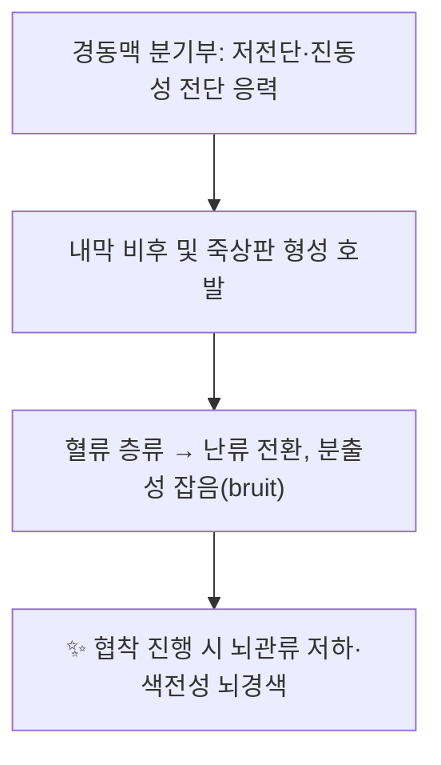

# 🩸 [[구조물/혈관/총경동맥]] (Common Carotid Artery, CCA)

> **핵심 요약 (Key Summary)**:
> [[총경동맥]](CCA)은 흉곽에서 기원하여 [[경동맥초]](carotid sheath) 내를 [[내경정맥]]·[[미주신경]]과 동반 상행하다 갑상연골 상연 높이에서 [[내경동맥]]·[[외경동맥]]으로 분지하는 경부의 주 대혈관이다.
> 분기부는 혈류역학적 난류·저전단응력 부위로 [[경동맥 협착]](죽상경화)의 호발부이며, [[경동맥류]]·[[총경동맥 폐색]]·[[경동맥 박리]] 등 다양한 혈관 병변의 무대가 된다.
> 임상적으로는 [[인영]](ST9) 촉진·[[인영맥]] 진단, [[성상신경절차단]](SGB)·중심정맥관 삽입의 랜드마크이며, [[압박지혈]]·[[경추 도수치료]] 시 뇌관류 저하 위험 때문에 최대 주의 구조물이다.

> [!note] 근거 표기 원칙
> 본 노트는 제공된 6편의 PubMed 논문(PMID 명기)만을 1차 근거로 인용한다. 논문으로 뒷받침되지 않는 일반 해부학·생리학 서술은 **Gray's Anatomy(교과서)** 수준의 기술이며, 개체 변이가 크거나 문헌별 이견이 있는 수치는 `근거 미확인`으로 명시하였다.

---

## 📌 목차
1. [해부학적 정밀 구조 및 지배 신경/혈관](#1-해부학적-정밀-구조-및-지배-신경혈관)
2. [생체역학·토크 분석 & 근막 사슬 (Biomechanical Synergy)](#2-생체역학토크-분석--근막-사슬-biomechanical-synergy)
3. [근막통증증후군(TP) & 연관통 패턴 (Travell & Simons)](#3-근막통증증후군tp--연관통-패턴-travell--simons)
4. [초음파 해부학(Sonoanatomy) 및 중재 시술 랜드마크](#4-초음파-해부학sonoanatomy-및-중재-시술-랜드마크)
5. [⭐ 원장님 심층 임상 고찰 및 원본 필기 (Clinical Pearls)](#5-⭐-원장님-심층-임상-고찰-및-원본-필기-clinical-pearls)
6. [관련 임상 질환 및 운동손상 증후군 총괄](#6-관련-임상-질환-및-운동손상-증후군-총괄)
7. [추나·도수치료(MET/PIR) & 침구·약침·재활 프로토콜](#7-추나도수치료metpir--침구약침재활-프로토콜)
8. [출처 및 학술 참고 문헌 (References)](#8-출처-및-학술-참고-문헌-references)

---
## 1. 해부학적 정밀 구조 및 지배 신경/혈관

![[총경동맥_도해.jpg|540]]
> [그림 1: 경부의 총경동맥·내경동맥·외경동맥 분지 해부 도해 (Wikimedia Commons)]

총경동맥은 근육이 아니므로 템플릿의 「기시/정지」 항목을 **혈관의 기시부(origin)와 종지부(terminus)** 개념으로 치환하여 정리한다.

| 항목 | 상세 내용 |
| :--- | :--- |
| **기시 (Origin, 좌우 비대칭)** | **우측**: [[완두동맥]](brachiocephalic trunk, 무명동맥)에서 분지 — 대략 우측 흉쇄관절 후방 높이. **좌측**: [[대동맥궁]](aortic arch)에서 직접 분지하여 좌측 경부로 상행. 좌우 기시 차이는 교과서 해부학 기준(Gray's)이며, 제공 논문에서 정량적으로 다룬 바는 `근거 미확인`. |
| **종지 (Terminus)** | 갑상연골 상연 높이(대략 C3–C4)에서 [[내경동맥]](ICA)과 [[외경동맥]](ECA)으로 분지. **경부 주행 중 정상적으로는 분지를 내지 않는다**(이는 CCA의 대표적 해부학적 특징). 분지 높이는 개체 변이가 커서 C2–C5까지 보고되며, 소아에서는 더 상부인 경향 — 정확한 레벨 분포는 `근거 미확인`. |
| **신경 지배 (Nerve supply)** | 혈관 자체는 **혈관운동신경(nervi vasorum)** 을 받으며, 주로 [[교감신경]](경부 교감신경절 유래)이 외막을 따라 분포한다. **[[경동맥동]](carotid sinus, 압수용체)** 은 CN IX(설인신경, Hering 신경) 및 CN X가 담당하고, **[[경동맥체]](carotid body, 화학수용체)** 는 CN IX·X가 관여한다. [[경동맥초]] 내부에는 [[미주신경]](CN X)이 CCA와 동반 주행한다. |
| **혈관 공급 (Vasa vasorum)** | 외막·중막 외층은 **vasa vasorum**(영양혈관)이 공급하고, 내막은 혈류로부터 직접 확산에 의존한다. 죽상경화가 내막에서 시작되는 이유와 연결되는 개념. |

### 🔬 경동맥초(carotid sheath)의 구성과 내부 구조물

[[경동맥초]]는 경부 심부경막(deep cervical fascia)과 밀접하게 연관된 결합조직초로, 경부 혈관·신경의 해부학적 "고속도로" 역할을 한다. Bond & Zheng(2023, *World Neurosurg X*, **PMID: 37081926**)은 경동맥초의 해부학과 임상적 고려사항을 정리하며, 이 구조가 신경외과·혈관외과·중재 시술에서 갖는 중요성을 강조하였다.

| 경동맥초 내부 구조물 | 상대적 위치 | 임상적 의미 |
| :--- | :--- | :--- |
| [[총경동맥]](CCA) | **내측(medial)** | 박동 촉지의 기준점, [[인영]] 혈위의 해부학적 기질 |
| [[내경정맥]](IJV) | **외측(lateral)** | 중심정맥관 삽입 경로, 초음파 유도 시 표적 |
| [[미주신경]](CN X) | **후방/후외측(posterior, between)** | 경동맥 내막절제술·경부 수술 시 손상 주의 |
| 경부 교감신경총 | CCA 외막에 부착 | [[성상신경절차단]]·교감신경 관련 증상의 해부학적 연결 |
| Ansa cervicalis (경신경고리) | 초 전벽 | 경부 수술 시 이정표 |

> ⚠️ 경동맥초는 얇은 결합조직층으로, 초음파 유도 하에서도 **혈종·가성동맥류·미주신경 자극**을 피하기 위한 세심한 바늘 조작이 요구된다(PMID: 37081926에서 임상적 고려사항으로 다룸).

### 🔬 해부학 도해 및 단면도
> 총경동맥의 기시부(대동맥궁/완두동맥), 경부 주행, 경동맥초 내 3대 구조물(CCA·IJV·CN X), 그리고 갑상연골 상연 높이의 분기부를 도시한 도해.

---
## 2. 생체역학·토크 분석 & 근막 사슬 (Biomechanical Synergy)

혈관은 능동적 근수축 구조물이 아니므로, 본 항목은 **혈류역학(hemodynamics) 및 혈관벽 응력 분석**으로 치환한다.

* **분기부의 전단응력(shear stress) 문제**: 경동맥 분기부는 혈류가 층류(laminar flow)에서 방향 전환되며 **저전단응력·진동성 전단(oscillatory shear)** 이 발생하는 부위로, 내막 비후(intimal hyperplasia)와 죽상판(plaque)이 호발한다. 이는 혈류역학적으로 널리 받아들여지는 개념이나, **제공된 6편 논문에서 직접 측정·검증된 수치는 `근거 미확인`**.
* **박동성 압력파(pulsatile pressure wave)**: 좌심실 수축기 압력파가 CCA를 따라 분기부에서 반사·중첩되며, 혈관벽은 반복적 인장(tensile stress)에 노출된다. 노화·고혈압에서 탄성섬유 파괴 → 혈관 확장·동맥류 형성 위험(원발성 총경동맥류는 드물지만 존재: Ilyas & Powell 2023, **PMID: 36681487**).
* **혈류 저항과 문합부**: 총경동맥 폐색 시 측부순환(외경동맥→안와→뇌, 후교통/연수막 문합 등)의 개인차가 증상 발현과 예후를 좌우한다. Klonaris & Kouvelos(2013, **PMID: 23870716**)는 총경동맥 폐색 치료에 대한 **현행 지침의 공백**을 지적하며 치료 전략의 근거 부족을 논하였다.

* **근막 사슬 연계 (Myers Anatomy Trains 관점)**: 경동맥초는 경부 심부경막(기관전층·추전층 등)과 융합하며 흉곽상구(thoracic inlet) 및 상종격으로 연결된다. 따라서 경부 심부근막·[[흉쇄유돌근]]·[[사각근]]의 만성 긴장은 CCA 주변의 조직역학적 환경에 영향을 줄 수 있다는 **이론적 연결**은 가능하나, **근막 긴장이 혈관 내강 압박/혈류 저하를 유발한다는 인과관계는 `근거 미확인`** (제공 문헌 범위 밖).

---
## 3. 근막통증증후군(TP) & 연관통 패턴 (Travell & Simons)

총경동맥 자체에는 근막통증증후군이 존재하지 않는다(혈관에는 TrP가 형성되지 않음). 다만 **CCA를 덮거나 인접한 근육의 TrP 통증이 "경동맥 부위 통증"으로 오인되거나, 반대로 혈관 병변이 근육통으로 오인되는 감별 지점**이 임상적으로 핵심이다.

| 근육 | TrP 위치 | 연관통 패턴 (Travell & Simons) | 감별 포인트 |
| :--- | :--- | :--- | :--- |
| [[흉쇄유돌근]](SCM) | 흉골지·쇄골지 | 안와 주위·이마·정수리·이부(하악각 아님)·외이도, 인후 이물감 | CCA 박동부를 직접 덮으므로 TrP 압통과 [[경동맥박리]]의 경부통 감별 필요 |
| [[사각근]](전/중) | 상부 승모근 심부, 쇄골 상와 | 견갑 내측연·상완 후면·전완 요측~수지 | 흉곽출구증후군(TOS)에서 쇄골하동맥 압박 감별 |
| [[승모근]](상부 섬유) | 견갑 상각 상방 | 측두부·후두부 두통 | 경부 긴장성 두통과의 중첩 |
| [[광경근]]·[[전경부 심근]] | 전경부 | 국소 압통·연하 시 불편감 | 갑상선·림프절·혈관 병변 감별 |

* **경동맥통(carotidynia)**: 경부 혈관 자체의 압통을 특징으로 하는 증후군으로, 감기 후 발생하는 양성 경과가 흔하다. **원인·기전 및 제공 논문에서의 언급 여부는 `근거 미확인`** 이며, [[경동맥 박리]]·[[경동맥류]] 배제를 위한 영상 검사가 필수이다.
* **경동맥 박리 감별**: Humphrey & Keller(1993, *J Vasc Surg*, **PMID: 8326665**)는 **자발성 총경동맥 박리**를 보고하였다. 경부통·두통과 함께 국소 신경학적 결손이 동반되는 경우 단순 근막통으로 단정하지 말 것. 다만 본 논문의 세부 임상양상·빈도 수치는 원문 확인이 필요하다.

---
## 4. 초음파 해부학(Sonoanatomy) 및 중재 시술 랜드마크

### 4-1. 경부 혈관 초음파 기본

| 항목 | 내용 |
| :--- | :--- |
| **프로브** | 고주파 선형 탐촉자(7–15 MHz) — 표재성 혈관 해상도 확보 |
| **단면(view)** | 횡단면(경동맥초 내 CCA·IJV·CN X 동시 확인), 종단면(혈류 방향·IMT 측정에 유리) |
| **주요 랜드마크** | 갑상연골·윤상연골, 기관(trachea), [[흉쇄유돌근]], 갑상선, [[내경정맥]](압박성), 경동맥 분기부 |
| **IMT 측정** | CCA 원위부 분기부 근위 far wall에서 측정하는 것이 일반적. 정상/이상 절단값 수치는 가이드라인별로 상이하므로 **`근거 미확인`**(제공 논문에서 다룬 바 없음) |

### 4-2. 시술별 안전 마진

| 시술 | 랜드마크 | 위험 구조물 | 안전 원칙 |
| :--- | :--- | :--- | :--- |
| **[[성상신경절차단]](SGB) — 전방 접근법** | C6 횡돌기 **전결절(Chassaignac 결절)**, 윤상연골 높이, 흉쇄유돌근 내측연과 기관 외측연 사이 | 경동맥초(CCA·IJV), 미주신경, 척추동맥, 갑상선, 식도, 경막외/경막하 | **바늘은 경동맥초를 외측으로 견인한 뒤 그 내측으로**, 흡인(aspiration) 필수, 초음파 유도 시 CCA·척추동맥 실시간 회피 |
| **[[경동맥초]] 접근이 필요한 혈관 시술** | Bond & Zheng 2023(**PMID: 37081926**)이 정리한 경동맥초 해부 | 미주신경 손상(쉰 목소리), IJV 천자, 혈종 | 초음파 유도 + 도플러로 IJV/CCA 감별(압박성 여부) |
| **경부 자침(인영·수돌 등)** | CCA 박동 최대점 | 경동맥 천자 → 경부 혈종·기도 압박, 미주신경 반사 | 박동 촉지 후 **천자 회피**, 얕은 자침, 직자·심자 금지 |
| **동맥 모니터링/폐색 기기** | Lussier & Evans 2024(*Cureus*, **PMID: 39493181**) — REBOA용 **compact arterial monitoring device**를 **돼지 모델**에서 검증 | 해당 없음 | 본 연구는 돼지 실험으로, **사람 총경동맥에 대한 적용 가능성은 `근거 미확인`**. 원위 관류 모니터링 개념 참고 수준 |

* **결론적 안전 원칙**: 경부 중재 시 **"박동이 느껴지면 바늘을 멈춘다(palpate before puncture)"** 를 기본 규칙으로 삼고, 초음파 유도 시에도 색 도플러로 CCA와 IJV를 구분한다.

---
## 5. ⭐ 원장님 심층 임상 고찰 및 원본 필기 (Clinical Pearls)

* **① 인영(人迎)과 인영맥(人迎脈)**: [[인영]](ST9)은 CCA 박동이 최대로 촉지되는 해부학적 지점으로, 한의학에서 **상부(흉부 이상~두부) 병변의 진단 맥**으로 활용되어 왔다. 임상에서는 좌우 박동의 세기·리듬·좌우 차이를 대칭 비교하는 방식으로 접근하며, **어느 한쪽에서 박동이 소실되거나 좌우 차이가 현저하면 즉시 혈관 병변(폐색/박리/협착)을 감별해야 한다.** (고전 문헌의 정량 기준은 판본별 차이가 커서 `근거 미확인`.)
* **② 압박지혈(pressure hemostasis)은 "최후의 수단"**: Ellis(2022, *J Perioper Pract*, **PMID: 35762282**)는 총경동맥 **결찰(ligation)** 의 역사적 술기를 다루었다. 경동맥은 경부 외상·수술 시 지혈의 표적으로 언급되어 왔으나, 결찰 시 뇌관류 저하로 인한 허혈성 신경학적 합병증 위험이 크다. **"경동맥은 눌러서 막을 수 있는 혈관이 아니라, 즉시 봉합/중재해야 하는 혈관"** 이라는 원칙으로 기억할 것.
* **③ 경동맥동 반사(carotid sinus reflex)**: 분기부 내막의 경동맥동을 압박하면 미주신경 구심로를 통해 **서맥·혈압 저하·실신**이 유발될 수 있다. 따라서 경동맥 촉진 시에도 한쪽만, 짧게, 부드럽게. **양측 동시 압박은 절대 금지.**
* **④ 경추 도수치료 전 혈관 스크리닝**: 고속 회전 도수(특히 상부경추 회전)와 경동맥·척추동맥 박리의 인과관계는 문헌에서 논쟁적이며, **제공 논문 범위 내에서는 인과관계 근거 미확인**(Humphrey & Keller 1993은 자발성 박리 증례). 그럼에도 임상 원칙으로 **어지럼·복시·구음장애·연하장애·실조·일과성 시야 소실 등 5D/3N 스크리닝**을 도수 전 필수 확인 사항으로 둔다.
* **⑤ 총경동맥 폐색은 "치료 지침의 사각지대"**: Klonaris & Kouvelos(2013, **PMID: 23870716**)는 CCA 폐색 치료에 대해 현행 가이드라인이 명확한 답을 주지 못함을 지적하였다. 즉 **개별 환자의 측부순환·증상·위험인자에 기반한 개별화 치료**가 원칙이며, "폐색 = 수술"이라는 단순 공식은 피한다.
* **⑥ 원발성 총경동맥류는 드물다**: Ilyas & Powell(2023, **PMID: 36681487**)은 원발성 CCA 동맥류를 보고하며, 박동성 경부 종괴 감별 시 **경동맥초 종양(carotid body tumor)·림프절·갑상선 결절**과의 감별이 필요함을 시사한다.
* **⑦ SGB 시술 메모**: 경동맥초를 "견인(retract)하되 천자하지 않는다". 초음파 화면에서 CCA가 **압박되지 않는(non-compressible)** 구조임을 항상 확인하고, IJV(압박성)와 착각하지 않도록 색 도플러를 습관화한다(PMID: 37081926).
* **⑧ 환자 교육 문구**: "목의 박동 부위를 오래 누르거나 손으로 꾹 누르는 습관은 위험합니다. 어지럽거나 눈이 흐려지면 즉시 눌렀던 손을 떼고 눕습니다."

---
## 6. 관련 임상 질환 및 운동손상 증후군 총괄

| 임상 질환 / 증후군 | 병리적 연관 기전 | 주요 증상 및 이학적 검사 | 핵심 교정 타깃 |
| :--- | :--- | :--- | :--- |
| [[원발성 총경동맥류]] (Primary CCA aneurysm) PMID: 36681487 (Ilyas & Powell 2023) | 혈관벽 약화·퇴행성 변화에 의한 국소 확장 (기전 세부는 원문 확인 필요) | 박동성 경부 종괴, 인접 신경 압박 증상, 파열 시 위험 | 혈관외과 협진·혈관내/개방 수술; 감별: 경동맥체 종양·림프절 |
| [[총경동맥 폐색]] (CCA occlusion) PMID: 23870716 (Klonaris & Kouvelos 2013) | 죽상경화·혈전에 의한 내강 폐쇄, 측부순환 여부가 증상 결정 | 무증상~반구성 TIA/뇌경색, 좌우 맥박 차이 | **지침 공백** → 개별화 치료(위험인자 교정·항혈소판제·우회/혈관내) |
| [[자발성 총경동맥 박리]] (Spontaneous CCA dissection) PMID: 8326665 (Humphrey & Keller 1993) | 내막 파열 후 중막 내 혈종 형성 (외상 없이 발생 가능) | 경부통·두통 + 국소 신경학적 결손 | 항혈전 치료·영상 추적; 근막통과의 감별 필수 |
| [[경동맥 협착]] (Atherosclerotic stenosis, 분기부 호발) | 저전단응력·난류 → 내막 비후·죽상판 | 무증상 잡음(bruit)~반구 허혈, 초음파/CTA/MRA | 위험인자(고혈압·당뇨·흡연·지질) 관리, 내과·혈관외과 협진 |
| [[경동맥초]] 관련 시술 합병증 PMID: 37081926 (Bond & Zheng 2023) | 경동맥초 내 혈관·신경 손상 | IJV 천자·미주신경 손상(쉰 목소리)·혈종·가성동맥류 | 초음파 유도, 랜드마크 준수, 흡인 확인 |
| [[경동맥 결찰]] 후 뇌허혈 PMID: 35762282 (Ellis 2022) | 결찰 시 급격한 뇌관류 저하, 측부순환 부족 시 허혈 | 술 후 신경학적 결손 | 결찰 전 측부순환 평가, 대체 지혈법 우선 |
| [[동맥천자·모니터링 관련 기기]] PMID: 39493181 (Lussier & Evans 2024) | 돼지 REBOA 모델에서 compact arterial monitoring device 검증 | — | **사람 총경동맥 적용은 `근거 미확인`** |

---
## 7. 추나·도수치료(MET/PIR) & 침구·약침·재활 프로토콜

### 7-1. 도수치료 전 안전 프로토콜 (필수)

1. **혈관 스크리닝**: 어지럼·복시·구음장애·연하장애(dysphagia)·drop attack·이명·편측 감각이상 문진 및 blood pressure 확인.
2. **경동맥 촉진**: 좌우 박동 대칭성·잡음 확인. **한쪽씩, 5초 이내, 부드럽게.**
3. **고속 회전 도수(상부경추)는 최소화**: 필요 시 저속·저진폭 기법 또는 MET로 대체. 경부 도수와 혈관 박리의 인과관계는 문헌상 논쟁적이며 제공 논문에서도 확립된 근거 없음(`근거 미확인`) — 그러나 **방어적 원칙 적용**은 유지.
4. **금기**: 최근 경부 외상, 항응고제 복용, 알려진 경동맥 협착/박리, 혈관성 질환 병력.

### 7-2. 근에너지기법 (MET) / PIR — 경동맥 보호 하에 시행

* **[[흉쇄유돌근]]**: 앉은 자세에서 경부 동측 회전 + 반대측 측굴, **경동맥 박동부에 손가락 압박을 두지 않는다.** 등척성 수축 5–7초 → 호기 시 부드러운 신장, 3–5회 반복.
* **[[사각근]](전/중)**: 견갑대 하강·거상 제한 해소 목표. **경부 신전+동측 측굴 자세에서 장시간 유지 금지**(추골·혈관 압박 위험).
* **[[승모근]](상부 섬유)**: 견갑 하강 + 요추 안정화 결합.

### 7-3. 침구·약침 혈위 매핑

| 혈위 | 위치 | 경동맥과의 관계 및 주의 |
| :--- | :--- | :--- |
| [[인영]](ST9) | 갑상연골 상연 높이, 흉쇄유돌근 전연, **CCA 박동부** | **직상방이 CCA** → 심자 금지, 얕은 자침, 박동 촉지 하 시술. (규정된 자침 깊이 수치는 문헌별 차이로 `근거 미확인`) |
| [[수돌]](ST10) | 인영 하방, 갑상연골 하연 부근 | 갑상선·경동맥 인접 |
| [[부돌]](LI18) | 흉쇄유돌근 중앙, 갑상연골 상연 높이 | 경동맥초 외측 경계 |
| [[천정]](LI17) | 부돌 하방 | 쇄골상와·흉곽상구 |
| [[결분]](ST12) | 쇄골 상와 | **고전적으로 금침/주의 혈위**, 쇄골하혈관·폐첨부 주의 |
| [[천창]](SI16)·[[천용]](SI17) | 후경부·이하선 하방 | 경동맥초 후방 접근 경로 |

* **시술 원칙**: ① 시술 전 **박동 촉진 → 위치 확정 → 초음파 유도(가능 시)** ② **흡인(aspiration)** 확인 후 주입 ③ 약침액(예: 자하거·봉독 등)의 경부 심부 주입은 **경동맥초 천자 위험** 때문에 초음파 유도 없는 맹검 시술을 피한다. (약침액 종류·용량·농도에 대한 근거는 본 노트 제공 문헌 범위 밖 `근거 미확인`.)
* **재활**: 경부 심부 굴근(두장근·경장근) 강화, 흉추 신전 가동성, 견갑 안정화 → 경부 표재근 과활성 감소.

---
## 8. 출처 및 학술 참고 문헌 (References)

**1차 근거(제공 PubMed 논문)**

1. Ilyas S, Powell RJ. **Primary common carotid artery aneurysm.** *J Vasc Surg.* 2023. **PMID: 36681487**
2. Klonaris C, Kouvelos GN. **Common carotid artery occlusion treatment: revealing a gap in the current guidelines.** *Eur J Vasc Endovasc Surg.* 2013. **PMID: 23870716**
3. Ellis H. **Ligation of the common carotid artery.** *J Perioper Pract.* 2022. **PMID: 35762282**
4. Humphrey PW, Keller MP. **Spontaneous common carotid artery dissection.** *J Vasc Surg.* 1993. **PMID: 8326665**
5. Lussier G, Evans AJ. **Compact Arterial Monitoring Device Use in Resuscitative Endovascular Balloon Occlusion of the Aorta (REBOA): A Simple Validation Study in Swine.** *Cureus.* 2024. **PMID: 39493181**
6. Bond JD, Zheng F. **The carotid sheath: Anatomy and clinical considerations.** *World Neurosurg X.* 2023. **PMID: 37081926**

**교과서 참고(템플릿 표준)**

7. Standring, S. (2020). *Gray's Anatomy: The Anatomical Basis of Clinical Practice* (42nd ed.). Elsevier.
8. Travell, J. G., & Simons, D. G. (1999). *Myofascial Pain and Dysfunction: The Trigger Point Manual*, Vol. 1.

> **정리**: 본 노트에서 PMID가 명기된 서술은 해당 논문 제목·주제 범위 내에서 인용하였다. 개별 논문의 세부 수치(발생률·혈류역학 값·자침 깊이·IMT 절단값 등)는 원문 확인이 필요한 경우 `근거 미확인`으로 표시하였으며, 일반 해부학·경락 서술은 Gray's Anatomy 및 한의학 교과서 수준의 기술임을 밝힌다.