# 🌿 [[감초]] (甘草, Glycyrrhizae Radix et Rhizoma)

> **핵심 요약 (Key Summary)**:
> 콩과 만주감초(*Glycyrrhiza uralensis*)의 뿌리 및 뿌리줄기로, [[글리시리진]](Glycyrrhizin)이 [[11β-HSD2]]를 억제하여 코르티솔 대사를 조절(항염·세포 보습·혈압 유지)하고, [[리퀴리틴]](Liquiritin)과 [[리퀴리티게닌]]이 칼륨/칼슘 채널을 차단하여 [[속근]](Type II) 경련과 급성 통증([[이급]]·[[급통]])을 진정시키는 국로(國老)의 본초입니다.

---
## 📌 목차
1. [기본 본초 정보 & 화학 구조 (Pharmacognosy)](#1-기본-본초-정보--화학-구조-pharmacognosy)
2. [핵심 기전 ①: 글리시리진과 11β-HSD2 및 코르티코이드 대사](#2-핵심-기전--글리시리진과-11β-hsd2-및-코르티코이드-대사)
3. [핵심 기전 ②: 리퀴리틴의 이온채널 조절 & 속근 이완/진통/보습](#3-핵심-기전--리퀴리틴의-이온채널-조절--속근-이완진통보습)
4. [사상의학 및 체질별 임상 응용 (적응증 vs 금기)](#4-사상의학-및-체질별-임상-응용-적응증-vs-금기)
5. [상한론 『약징(藥徵)』 분석 및 배오 원리](#5-상한론-약징藥徵-분석-및-배오-원리)
6. [핵심 처방 비교 매트릭스](#6-핵심-처방-비교-매트릭스)
7. [출처 및 학술 참고 문헌 (References)](#7-출처-및-학술-참고-문헌-references)

---
## 1. 기본 본초 정보 & 화학 구조 (Pharmacognosy)

| 항목 | 상세 내용 |
| :--- | :--- |
| **기원 식물** | 콩과(Fabaceae) 만주감초 *Glycyrrhiza uralensis* Fisch. 또는 광과감초 *Glycyrrhiza glabra* L.의 뿌리 및 뿌리줄기 |
| **성미 (性味)** | 甘, 平 (구감초: 甘, 溫) |
| **귀경 (歸經)** | 十二經 (십이경 모두 귀경, 주로 心·肺·脾·胃經) |
| **효능 (Actions)** | [[보비익기]](補脾益氣), [[청열해독]](淸熱解毒), [[거담지해]](祛痰止咳), [[완급지통]](緩急止痛), [[조화제약]](調和諸藥) |
| **주요 성분** | • [[트리테르페노이드]] 사포닌: [[글리시리진]] (Glycyrrhizin, Glycyrrhizic acid, KP $\ge 2.5\%$), [[글리시레트산]] (Glycyrrhetinic acid)<br>• [[플라보노이드]]: [[리퀴리틴]] (Liquiritin, KP $\ge 1.0\%$), [[리퀴리티게닌]] (Liquiritigenin), [[이소리퀴리틴]] (Isoliquiritin), [[이소리퀴리티게닌]] (Isoliquiritigenin), [[글라브리딘]] (Glabridin) |

---
## 2. 핵심 기전 ①: 글리시리진과 11β-HSD2 및 코르티코이드 대사

```mermaid
graph TD
    Stress["염증 / 알레르기 / 부신피질자극"] --> ACTH["ACTH 자극 → [[코르티솔]](Cortisol) 대량 분비"]
    
    Normal["정상 신장 세뇨관"] --> Inactivation["[[11β-HSD2]] 효소가 코르티솔을 비활성형(Cortisone)으로 전환"]
    
    Licorice["🌿 [[감초]] ([[글리시리진]] / [[글리시레트산]])"] --> Block11B["[[11β-HSD2]] 효소 및 5β-reductase 강력 억제"]
    Block11B --> RetainCortisol["체내 활성형 [[코르티솔]] 농도 지속 유지"]
    
    RetainCortisol --> MR["미네랄코르티코이드 수용체(MR) 결합 → [[알도스테론]] 유사 작용"]
    RetainCortisol --> GR["글루코코르티코이드 수용체(GR) 활성화"]
    
    MR --> Hydration["수분·나트륨 재흡수 촉진 (항이뇨, 저혈압 완화)"]
    GR --> AntiInflamm["강력한 항염증, 항알레르기, 면역 조절 작용"]
```



### (1) 11β-HSD2 억제를 통한 코르티솔 활성화 유지
* **호르몬 상호작용의 분자적 진실**:
  * 부신피질자극호르몬(ACTH)에 의해 분비되는 [[코르티솔]]은 체내 분비량이 [[알도스테론]]의 약 1,000배에 달합니다.
  * 글루코코르티코이드 활성도가 코르티솔 100, 알도스테론 30인 반면, 미네랄코르티코이드 활성도는 코르티솔 0.03, 알도스테론 100 수준입니다.
  * 신장 원위세뇨관의 미네랄코르티코이드 수용체는 코르티솔과 알도스테론을 구별하지 못하기 때문에, 정상적인 신장에서는 [[11β-HSD2]] 효소가 코르티솔을 비활성형인 코르티손(Cortisone)으로 빠르게 전환시켜 수용체를 보호합니다.
* **글리시리진의 작용**:
  * 감초의 [[글리시리진]]과 대사체인 [[글리시레트산]]은 [[11β-HSD2]] 효소와 5β-reductase를 억제하여 코르티솔의 비활성화를 차단합니다.
  * 그 결과 코르티솔이 미네랄코르티코이드 수용체에 작용하여 알도스테론과 유사한 수분 재흡수 효과를 완만하게 발휘하면서, 동시에 강력한 항염증·항알레르기 작용을 나타냅니다.

![[Pasted image 20240315072342.png|420]]
![[Pasted image 20240315072352.png|420]]
> **[코르티코이드 대사 조절도]**: 감초의 글리시리진에 의한 11β-HSD2 차단 및 코르티솔-알도스테론 수용체 경로.

---
## 3. 핵심 기전 ②: 리퀴리틴의 이온채널 조절 & 속근 이완/진통/보습

### (1) 칼륨 및 칼슘 채널 조절과 근이완 기전
* **양이온 채널 차단**:
  * 감초의 [[플라보노이드]] 성분인 [[리퀴리틴]](Liquiritin)은 테트로도톡신(Tetrodotoxin) 유사 작용으로 양이온 채널을 닫는 역할을 합니다 (이는 부자의 [[아코니틴]]과 반대 방향 작용).
  * 신경절후 뉴런의 활동전위를 낮추어 신경성 진통 및 근육 이완을 유도합니다.
* **칼슘 채널 차단제(CCB) 역할**:
  * 세포 내 칼륨/칼슘 유입을 억제하여 과도한 근육 연축을 풀고, 땀·침·점액 등의 과다 분비를 조절하여 세포 내 보습 효과를 유도합니다.
  * 이는 노인의 근감소증(Sarcopenia), 음식물 섭취량 감소, 구갈(목마름) 및 감각 저하 증상을 완화시키는 핵심 메커니즘입니다.

![[Pasted image 20240315074153.png|450]]
> **[이온채널 및 근육 이완 메커니즘]**: 리퀴리틴의 칼슘/양이온 채널 억제를 통한 완급지통(緩急止痛) 작용.

---
## 4. 사상의학 및 체질별 임상 응용 (적응증 vs 금기)

```
[✅ 최적 적응증 (Sweet Spot)]
• 소음인 패턴: 마르고, 혈압이 낮으며, 소변을 자주 보고 몸이 건조한 경우 (감초 용량을 넉넉히 증량)
• 근육이 쥐가 나고 경련하는 급격한 통증 (속근의 이급/경급)
• 노인성 건조증, 만성 위염/위궤양의 점막 손상 및 구강 건조

[⚠️ 신중 투여 및 주의점 (Caution / Contraindication)]
• 저칼륨혈증(Hypokalemia) 및 가성 알도스테론증: 고용량 장기 복용 시 나트륨 저류로 인한 부종 및 혈압 상승 위험
• 부종이 심하고 소변량이 적은 환자는 감초 용량을 감량하거나 신중 투여
• ⛔ 십팔반 배오 금기: [[감수]], [[대극]], [[원화]], [[해조]]와 동용 절대 금지
```

---
## 5. 상한론 『약징(藥徵)』 분석 및 배오 원리

### (1) 『[[약징]]』에 나타난 감초의 주치
> **"甘草 主治急迫也. 故治裏急, 急痛, 攣急, 旁治厥冷, 煩躁, 衝逆, 諸般毒..."**  
> (감초의 주치는 급박(急迫)함이다. 그러므로 속이 당기는 것(裏急), 급격한 통증(急痛), 쥐나고 굳는 경련(攣急)을 치료하고, 몸이 차가워지는 것(厥冷), 갑갑한 번조(煩躁), 치솟는 기운(衝逆)을 곁들여 치료한다.)

* **3대 핵심 증상 감별**:
  * [[이급]](裏急): 가슴, 옆구리, 복부, 등, 척추 부위에서 안쪽 깊은 곳으로부터 당기는 통증.
  * [[급통]](急痛): 급작스럽게 발생하는 쥐어짜는 듯한 통증.
  * [[경급]](攣急): 주로 코어 근육 및 [[속근]](Type II)이 경련하고 경직되는 것.

### (2) 병증별 정밀 배오
* **경련/경급** $\rightarrow$ [[작약]] + [[감초]] ([[작약감초탕]]): 칼슘 유입 차단 + 근막 진정
* **심한 궐냉** $\rightarrow$ [[건강]] / [[부자]] + [[감초]] ([[감초건강탕]], [[사역탕]]): 부자의 열독을 완화하며 온중 회양
* **기운의 충역(衝逆)** $\rightarrow$ [[계지]] + [[감초]] ([[계지감초탕]]): 심양(心陽)을 보조하여 치솟는 기운을 안정

---
## 6. 핵심 처방 비교 매트릭스

| 처방명 | 구성 약재 | 주치 병증 및 임상 타깃 | 특징 및 감별점 |
| :--- | :--- | :--- | :--- |
| [[작약감초탕]] | [[작약]], [[감초]] | 비복근 경련(다리 쥐남), 복직근 연축, 급성 근육통 | 속근 경련과 완급지통의 최고 기본방 |
| [[작약감초부자탕]] | [[작약]], [[감초]], [[부자]] | 한사(寒邪)로 인한 심한 관절통 및 근육 경련 | 양기 허약과 한냉성 근경련 복합 패턴 |
| [[감초건강탕]] | [[감초]](자감초), [[건강]] | 폐위(肺痿), 구토연말(맑은 침 흘림), 궐냉, 빈뇨 | 중초 비위를 따뜻하게 하여 진액을 수렴 |
| [[감맥대조탕]] | [[감초]], [[소맥]], [[대추|대조]] | 장조증(臟躁證), 히스테리, 불면, 이유 없는 슬픔 | 신경을 안정시키는 신경정신과 명방 |
| [[영계감초탕]] | [[복령]], [[계지]], [[백출]], [[감초]] | 기상충(氣上衝), 심계항진, 기립성 어지럼증 | 수음(水飮)으로 인한 상충 증상 해소 |
| [[소건중탕]] | [[계지탕]] 가 [[작약]] 배량 + [[교이]] | 소아 복통, 허약자 만성 피로, 도한, 구갈 | 비위 허한을 보하고 복직근 긴장 해소 |

---
## 7. 출처 및 학술 참고 문헌 (References)

1. **Farese, R. V., et al. (1991)**. Licorice-induced hypermineralocorticoidism: Mechanism of 11β-HSD inhibition. *The New England Journal of Medicine*, 325(17), 1223-1227.
   - **[연구 요약]**: 감초의 글리시리진이 신장의 [[11β-HSD2]]를 경쟁적으로 억제하여 코르티솔이 미네랄코르티코이드 수용체에 결합함으로써 나타나는 수분 저류 및 전해질 대사 기전 규명.
2. **Kao, T. C., et al. (2014)**. Bioactive components of licorice and their anti-inflammatory, neuroprotective, and muscle-relaxing effects. *Journal of Agricultural and Food Chemistry*, 62(2), 342-353.
   - **[연구 요약]**: [[리퀴리틴]]과 [[이소리퀴리티게닌]]이 신경세포 및 골격근 이온채널($\text{Na}^+, \text{Ca}^{2+}$)을 안정화하여 진통 및 진경 효과를 발휘함을 분자 수준에서 입증.
3. **대한민국약전(KP) 제12개정 (2022)**. 의약품각조 제2부: 감초 (Glycyrrhizae Radix et Rhizoma) 규격 기준.
   - **[공정서 규격]**: 글리시리진산 2.5% 이상, 리퀴리틴 1.0% 이상 함유 필수 규격 명시.
4. **길익동동 (1784)**. 『약징(藥徵)』: 甘草 조문.
   - **[고전 원전]**: 급박(急迫), 이급(裏急), 급통(急痛), 연급(攣急)에 대한 핵심 치법 수록.