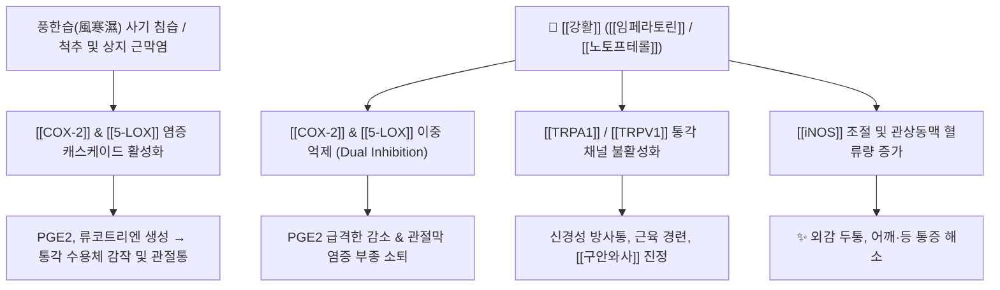

# 🌿 [[강활]] (羌活, Notopterygii / Osterici Rhizoma et Radix)

> **핵심 요약 (Key Summary)**:
> 산형과 강활(*Ostericum koreanum*) 또는 중국강활(*Notopterygium incisum*)의 뿌리 및 뿌리줄기로, [[임페라토린]](Imperatorin), [[노토프테롤]](Notopterol), [[오스톨]](Osthole) 등의 푸라노쿠마린 성분이 [[COX-2]] 및 [[5-LOX]] 경로를 이중 억제하여 척추 기립근 및 상지 관절막의 염증과 신경통을 강력히 진정시킵니다. 한의학적으로 [[거풍산한]](祛風散寒), [[승습지통]](勝濕止痛)의 대표약으로 상반신·독맥(督脈) 통증 및 [[소양인]] 표한병의 핵심 군약입니다.

---
## 📌 목차
1. [기본 본초 정보 & 화학 구조 (Pharmacognosy)](#1-기본-본초-정보--화학-구조-pharmacognosy)
2. [핵심 분자약리 기전 & 신경·염증 대사](#2-핵심-분자약리-기전--신경염증-대사)
3. [해부생체역학: 강활 vs 독활의 상하지 분절 타깃](#3-해부생체역학-강활-vs-독활의-상하지-분절-타깃)
4. [사상의학 및 체질별 임상 응용 (적응증 vs 금기)](#4-사상의학-및-체질별-임상-응용-적응증-vs-금기)
5. [배오 원리 및 한의학적 고찰](#5-배오-원리-및-한의학적-고찰)
6. [핵심 처방 비교 매트릭스](#6-핵심-처방-비교-매트릭스)
7. [출처 및 학술 참고 문헌 (References)](#7-출처-및-학술-참고-문헌-references)

---
## 1. 기본 본초 정보 & 화학 구조 (Pharmacognosy)

| 항목 | 상세 내용 |
| :--- | :--- |
| **기원 식물** | 산형과(Apiaceae) 강활 *Ostericum koreanum* Maxim. (한국강활) 또는 *Notopterygium incisum* Ting ex H.T.Chang (중국강활), 관엽강활 *Notopterygium forbesii* Boiss.의 뿌리줄기 및 뿌리 |
| **성미 (性味)** | 辛·苦, 溫 |
| **귀경 (歸經)** | 膀胱·腎經 (방광경, 신경) |
| **효능 (Actions)** | [[해표산한]](解表散寒), [[거풍승습]](祛風勝濕), [[지통]](止痛) |
| **주요 성분** | • [[푸라노쿠마린]]: [[임페라토린]] (Imperatorin), [[노토프테롤]] (Notopterol), [[오스톨]] (Osthole), [[안겔리틴]] (Angelicin), Isoimperatorin, Nodakenetin<br>• [[정유 성분]]: [[리모넨]] (Limonene), $\alpha$-Pinene, Terpineol, $\beta$-Ocimene |

### 🔬 주요 지표물질 화학 구조
![[image-10.png|500]]
> **[구조적 특징]**: 강활의 주요 쿠마린계 성분인 [[임페라토린]]과 [[노토프테롤]]은 친유성 [[푸라노쿠마린]] 골격을 지녀 근막 및 신경막 지질층을 신속히 통과하며, [[NF-κB]] 활성 억제와 [[iNOS]] 발현 차단을 통해 강력한 혈관 이완 및 진통 활성을 발휘합니다.

---
## 2. 핵심 분자약리 기전 & 신경·염증 대사



### (1) 이중 염증 경로 억제 및 진통 작용
* **항염 및 진통**:
  * [[노토프테롤]]과 [[임페라토린]]은 아라키돈산 대사의 양대 축인 [[COX-2]]와 [[5-LOX]] 경로를 동시에 억제하여 관절 활액막과 척추 기립근 근막의 염증성 부종을 신속히 가라앉힙니다.
* **혈관 및 심근 순환**:
  * 혈관 평활근의 긴장을 풀어 말초 및 심장 근육의 혈류량을 증가시키며, 피부진균 억제 작용을 함께 가집니다.

---
## 3. 해부생체역학: 강활 vs 독활의 상하지 분절 타깃

```
[🌿 [[강활]] (Ostericum)]
• 약성: 기운이 웅맹하고 준렬(峻烈)하며 상승(上升) 발산
• 해부학적 타깃: 두경부, [[후두하근]], [[독맥]](督脈, 척추 중심선), 어깨 죽지 및 상지 관절·근육통

[🌿 [[독활]] (Aralia)]
• 약성: 기운이 침착하고 완만(緩慢)하며 하행(下行) 거습
• 해부학적 타깃: 요추 하부, 골반, 천장관절, 하지 관절·인대·골 질환
```

* **유래와 성질**:
  * '굳셀 강(羌)', '물 흐를 활(活)'로 계곡의 거친 환경에서 자라 기운이 강하므로 풍(風)을 날려보내는 거풍작용이 탁월합니다.
  * 통증이 고정되지 않고 여기저기 옮겨 다니며(游走性) 무겁고 쑤시는 풍한습비(風寒濕痺)에 필수적입니다.

---
## 4. 사상의학 및 체질별 임상 응용 (적응증 vs 금기)

```
[✅ 최적 적응증 (Sweet Spot)]
• [[소양인]] 표한병(表寒病): 열이 살짝 뜨면서 점막이 붓고, 몸살과 관절통이 심한 패턴
• 상지 관절통, 어깨와 등 근육의 뻐근한 경직 ([[승모근]], [[능형근]], [[견갑거근]])
• 감기로 인한 후두통, 목덜미 뻣뻣함, 독맥을 따라 발생하는 척추통

[⚠️ 신중 투여 및 금기 (Caution / Contraindication)]
• 음허두통(陰虛頭痛) 및 혈허관절통: 진액과 혈이 부족하여 마르고 쑤시는 만성 통증에는 단독 사용을 피함
• 땀이 너무 많이 나는 표허(表虛) 환자
```

---
## 5. 배오 원리 및 한의학적 고찰

### (1) 핵심 방제 배오
* [[강활]] + [[독활]]: 상반신(강활)과 하반신(독활)의 풍습(風濕)을 동시에 다스려 전신 관절통을 치료.
* [[강활]] + [[방풍]]: 풍사(風邪)를 흩뜨리는 표증(表證) 발산의 명배오.

---
## 6. 핵심 처방 비교 매트릭스

| 처방명 | 구성 약재 | 주치 병증 및 임상 타깃 | 특징 및 감별점 |
| :--- | :--- | :--- | :--- |
| [[구미강활탕]] | [[강활]], [[방풍]], [[창출]], [[황금]], [[백지]] 등 | 사시감모, **발열오한, 심한 전신 근육통, 두통** | 외감 몸살과 풍한습 관절통의 대표 처방 |
| [[형방패독산]] | [[강활]], [[독활]], [[시호]], [[전호]], [[형개]], [[방풍]] 등 | [[소양인]] 외감 표한증, 발열, 인후통, 두드러기 | 소양인의 풍한을 발산하고 열을 내림 |
| [[회수산]] | [[강활]], [[독활]], [[당귀]], [[천궁]], [[진피]] 등 | 감기 후 두통, **디스크/협착증/좌골신경통** | 어혈과 풍습을 함께 풀어 신경통 완화 |
| [[오약순기산]] | [[마황]], [[진피]], [[오약]], [[천궁]], [[지각]], [[강활]] 등 | 풍습으로 인한 **사지마비, 관절염, 신경통** | 기를 순환시키며 상지 저림 치료 |
| [[독활기생탕]] | [[독활]], [[상기생]], [[두충]], [[우슬]], [[당귀]], [[숙지황]] 등 | 만성 간신허약, **요슬냉통, 척추관 협착증** | 마른 체형의 하지 관절통 보익방 |

---
## 7. 출처 및 학술 참고 문헌 (References)

1. **Okuyama, T., et al. (1993)**. Analgesic and anti-inflammatory effects of notopterol and imperatorin from *Notopterygium incisum*. *Planta Medica*, 59(6), 509-514.
   - **[연구 요약]**: 강활의 [[노토프테롤]]과 [[임페라토린]]이 프로스타글란딘 E2(PGE2) 생성을 유의하게 억제하여 관절막 염증과 통각 감작을 억제함을 동물 모델에서 입증.
2. **Kim, Y. S., et al. (2011)**. Ostericum koreanum inhibits inflammatory responses through down-regulation of NF-κB and MAPK pathways in RAW 264.7 cells. *Journal of Ethnopharmacology*, 136(3), 444-450.
   - **[연구 요약]**: 한국강활 추출물이 [[NF-κB]] 활성화를 차단하여 [[iNOS]], [[COX-2]] 발현을 감소시키고 관절염 염증을 완화하는 분자 기전 제시.
3. **대한민국약전(KP) 제12개정 (2022)**. 의약품각조 제2부: 강활 (Notopterygii / Osterici Rhizoma et Radix) 규격 기준.
   - **[공정서 규격]**: 노토프테롤(Notopterol) 및 임페라토린(Imperatorin) 함량 기준 명시.