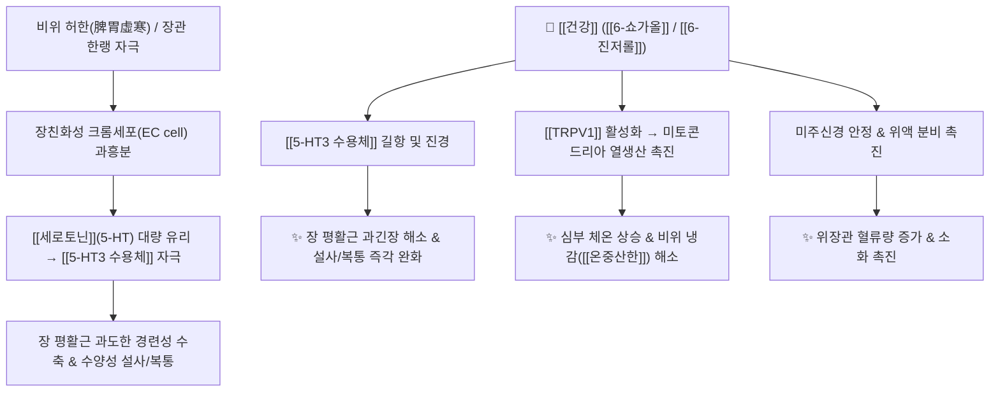

# 🌿 [[건강]] (乾薑, Zingiberis Rhizoma)

> **핵심 요약 (Key Summary)**:
> 생강과 생강(*Zingiber officinale*)의 말린 뿌리줄기로, [[6-쇼가올]](6-Shogaol)과 [[6-진저롤]](6-Gingerol) 성분이 [[TRPV1]] 수용체를 활성화하여 심부 체온과 미토콘드리아 열생산을 촉진하고, 장친화성 크롬세포(EC cell)의 [[세로토닌]](5-HT) 과분비를 억제하여 장 평활근 과연축성 설사와 복통을 진정시킵니다. [[상한론]] [[온중축한]](溫中逐寒), [[온폐화음]](溫肺化飮), [[회양통맥]](回陽通脈)의 핵심 군약입니다.

---
## 📌 목차
1. [기본 본초 정보 & 화학 구조 (Pharmacognosy)](#1-기본-본초-정보--화학-구조-pharmacognosy)
2. [핵심 분자약리 기전: 쇼가올과 세로토닌/장관 평활근 대사](#2-핵심-분자약리-기전-쇼가올과-세로토닌장관-평활근-대사)
3. [본초 감별: 건강 vs 생강 vs 부자의 온열 작용](#3-본초-감별-건강-vs-생강-vs-부자의-온열-작용)
4. [사상의학 및 체질별 임상 응용 (적응증 vs 금기)](#4-사상의학-및-체질별-임상-응용-적응증-vs-금기)
5. [상한론 『약징(藥徵)』 분석 및 배오 원리](#5-상한론-약징藥徵-분석-및-배오-원리)
6. [핵심 처방 비교 매트릭스](#6-핵심-처방-비교-매트릭스)
7. [출처 및 학술 참고 문헌 (References)](#7-출처-및-학술-참고-문헌-references)

---
## 1. 기본 본초 정보 & 화학 구조 (Pharmacognosy)

| 항목 | 상세 내용 |
| :--- | :--- |
| **기원 식물** | 생강과(Zingiberaceae) 생강 *Zingiber officinale* Roscoe의 말린 뿌리줄기(Dried Rhizome) |
| **성미 (性味)** | 辛, 熱 |
| **귀경 (歸經)** | 脾·胃·心·肺·腎經 (비경, 위경, 심경, 폐경, 신경) |
| **효능 (Actions)** | [[온중축한]](溫中逐寒), [[회양통맥]](回陽通脈), [[온폐화음]](溫肺化飮), [[온경지혈]](溫經止血) |
| **주요 성분** | • [[바닐로이드]] 페놀계 (KP $\ge 0.4\%$): [[6-쇼가올]] (6-Shogaol), [[6-진저롤]] (6-Gingerol), 8-Shogaol, 10-Gingerol, [[진게론]] (Zingerone)<br>• [[세스퀴테르펜]] 정유: $\alpha$-[[진기베렌]] ($\alpha$-Zingiberene), $\beta$-Sesquiphellandrene, ar-Curcumene, Camphene |

### 🔬 주요 지표물질 화학 구조
> **[구조적 특징]**: 건조 및 가열 과정에서 생강의 [[6-진저롤]]이 탈수(Dehydration)되어 형성되는 [[6-쇼가올]]은 친유성이 대폭 증가하여 [[TRPV1]] 수용체 결합력과 중추성 온열·진통·장관 운동 조절능력이 생강보다 3~5배 강력해집니다.

---
## 2. 핵심 분자약리 기전: 쇼가올과 세로토닌/장관 평활근 대사



### (1) 장관 연동 조절 및 설사 억제 기전
* **세로토닌 방출 억제**:
  * 장 평활근이 과도하게 수축하면 장벽의 크롬친화세포(Enterochromaffin cell)가 [[세로토닌]](5-HT)을 쏟아내어 극심한 산통과 설사를 유발합니다.
  * 건강의 [[6-쇼가올]]은 위장관 평활근의 과긴장을 직접 이완시키고 [[5-HT3 수용체]] 결합을 차단하여 한랭성 설사와 쥐어짜는 복통을 신속히 완화합니다.
* **복진 랜드마크**:
  * 환자의 복진 시 배꼽 주변(신궐, 수분, 기해 부위)이 차갑고 얼음장 같으며 눌렀을 때 꾸르륵 소리가 날 때 가장 확실한 적응증이 됩니다.

---
## 3. 본초 감별: 건강 vs 생강 vs 부자의 온열 작용

```
[🌿 [[생강]] (Zingiberis Rhizoma Recens)]
• 기미: 辛, 微溫 (상대적으로 순함)
• 주치: 표한증(表寒證), 외감 발한, 위기(胃氣) 불화로 인한 구토 억제

[🌿 [[건강]] (Zingiberis Rhizoma)]
• 기미: 辛, 熱 (진저롤이 쇼가올로 전환되어 온열력 지속)
• 주치: 리한증(裏寒證), 상·중초(비위·폐)의 지속적 온중산한, 만성 한랭 설사 및 가래

[🌿 [[부자]] (Aconiti Radix Lateralis)]
• 기미: 辛·甘, 大熱, 有毒
• 주치: 중·하초(신·비)의 급박한 회양구역(回陽救逆), 전신 혈류를 폭발적으로 올리나 지속력은 짧음
```

---
## 4. 사상의학 및 체질별 임상 응용 (적응증 vs 금기)

```
[✅ 최적 적응증 (Sweet Spot)]
• [[소음인]] 비위허한(脾胃虛寒): 찬 음식을 먹으면 바로 체하고 설사하며, 배가 차가운 패턴
• 폐한(肺寒)으로 인해 맑은 가래와 기침이 멎지 않고 숨이 찬 병증
• 혈액순환 저하로 인한 수족냉증, 저혈압성 어지럼증

[⚠️ 신중 투여 및 금기 (Caution / Contraindication)]
• 음허내열(陰虛內熱) 및 실열(實熱)로 인한 갈증과 변비
• 열성 출혈(토혈, 혈뇨, 코피 등) 환자는 생용(生用)을 금하며, 포제([[포건강]] 炮乾薑)하여 지혈 목적으로 활용
```

---
## 5. 상한론 『약징(藥徵)』 분석 및 배오 원리

### (1) 『[[약징]]』에 나타난 건강의 주치
> **"乾薑 主治結嘔咳, 旁治厥冷, 煩躁, 腹痛, 下利, 唾沫..."**  
> (건강의 주치는 결(結), 구역(嘔), 기침(咳)이다. 곁들여 사지 궐냉(厥冷), 번조, 복통, 설사, 맑은 침 흘림을 치료한다.)

* **핵심 배오 원리**:
  * [[건강]] + [[부자]]: 온중산한과 회양구역의 최강 조합 ([[사역탕]])
  * [[건강]] + [[백출]]: 비위 한습을 말리고 수분을 소통 ([[이중탕]])
  * [[건강]] + [[세신]] / [[오미자]]: 폐의 찬 기운을 흩뜨리고 맑은 가래를 삭임 ([[소청룡탕]], [[영감오미강신탕]])

---
## 6. 핵심 처방 비교 매트릭스

| 처방명 | 구성 약재 | 주치 병증 및 임상 타깃 | 특징 및 감별점 |
| :--- | :--- | :--- | :--- |
| [[이중탕]] (인삼탕) | [[인삼]], [[백출]], [[건강]], [[감초]] | 비위 허한, 완복냉통, 소화불량성 설사 | 중초를 따뜻하게 덥히는 최고의 기본방 |
| [[사역탕]] | [[부자]], [[건강]], [[감초]] | **소음병 궐역(厥逆), 맥미욕절(脈微欲絶)** | 쇼크, 저체온, 극한의 양기 쇠약 회양방 |
| [[감초건강탕]] | [[감초]](자감초), [[건강]] | 폐위(肺痿), 다타연말(맑은 침), 빈뇨 | 비폐(脾肺)의 양기를 회복하여 진액 수렴 |
| [[반하사심탕]] | [[반하]], [[황금]], [[황련]], [[건강]], [[인삼]] 등 | **심하비(心下痞), 장명하리(소리나는 설사)** | 건강의 온성 + 황련·황금의 한성 한열배오 |
| [[소청룡탕]] | [[마황]], [[계지]], [[작약]], [[건강]], [[세신]] 등 | **외한내음(外寒內飮), 수포성 콧물, 기침** | 건강·세신이 폐의 찬 수음을 데워 배출 |

---
## 7. 출처 및 학술 참고 문헌 (References)

1. **Dugasani, S., et al. (2010)**. Comparative antioxidant and anti-inflammatory effects of [6]-gingerol, [8]-gingerol, [10]-gingerol and [6]-shogaol. *Journal of Ethnopharmacology*, 127(2), 515-520.
   - **[연구 요약]**: [[6-쇼가올]]이 [[6-진저롤]] 대비 [[iNOS]] 및 [[COX-2]] 발현 억제능이 우수하며, 강한 지질 과산화 억제 및 항염증 활성을 나타냄을 비교 규명.
2. **Kikuzaki, H., & Nakatani, N. (1993)**. Antioxidant effects of ginger constituents and their thermogenic and gastrointestinal motility properties. *Journal of Food Science*, 58(6), 1407-1410.
   - **[연구 요약]**: 건강의 진저롤 및 쇼가올 화합물이 장관 평활근 [[세로토닌]] 경로를 조절하고 심부 열생산을 자극함을 입증.
3. **대한민국약전(KP) 제12개정 (2022)**. 의약품각조 제2부: 건강 (Zingiberis Rhizoma) 규격 기준.
   - **[공정서 규격]**: 6-진저롤 0.4% 이상 함유 규격 및 건조감량 기준 수록.
4. **길익동동 (1784)**. 『약징(藥徵)』: 乾薑 조문.
   - **[고전 원전]**: 온중(溫中), 축한(逐寒), 결구해(結嘔咳)에 대한 상한론적 용법 명시.