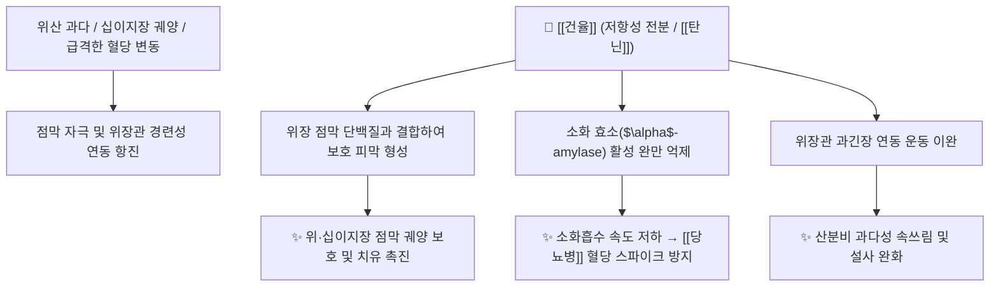

# 🌿 [[건율]] (乾栗, Castaneae Semen)

> **핵심 요약 (Key Summary)**:
> 참나무과 밤나무(*Castanea crenata*)의 말린 종자(말린 밤)로, 저항성 전분(Resistant Starch)과 율피의 [[탄닌]](Tannins) 성분이 위산 과다 분비를 억제하고 위장관 연동을 완화하여 혈당 스파이크 방지 및 위궤양 점막 보호 효과를 나타냅니다. 사상의학에서 [[태음인]] 위완한증(胃脘寒證)의 핵심 보익약으로 통상 1첩에 3돈(12g, 밤 약 3알)을 다용합니다.

---
## 📌 목차
1. [기본 본초 정보 & 영양 생화학 (Pharmacognosy)](#1-기본-본초-정보--영양-생화학-pharmacognosy)
2. [핵심 분자약리 기전 & 소화·혈당 대사](#2-핵심-분자약리-기전--소화혈당-대사)
3. [사상의학: 태음인 위완한증과 임상 운용 팁](#3-사상의학-태음인-위완한증과-임상-운용-팁)
4. [체질별 적응증 vs 주의점 (소음인·노인 무력성 위장 주의)](#4-체질별-적응증-vs-주의점-소음인노인-무력성-위장-주의)
5. [사상의학 핵심 처방 비교 매트릭스](#5-사상의학-핵심-처방-비교-매트릭스)
6. [출처 및 학술 참고 문헌 (References)](#6-출처-및-학술-참고-문헌-references)

---
## 1. 기본 본초 정보 & 영양 생화학 (Pharmacognosy)

| 항목 | 상세 내용 |
| :--- | :--- |
| **기원 식물** | 참나무과(Fagaceae) 밤나무 *Castanea crenata* Siebold & Zucc. 또는 동속 근연식물의 잘 익은 씨를 말린 것 (Castaneae Semen) |
| **성미 (性味)** | 甘, 溫 |
| **귀경 (歸經)** | 脾·胃·腎經 (비경, 위경, 신경) |
| **효능 (Actions)** | [[양위건비]](養胃健脾), [[보신강근]](補腎强筋), [[삽장지사]](澁腸止瀉) |
| **주요 성분** | • 복합 탄수화물: 양질의 전분, 저항성 전분(Resistant starch), 식이섬유<br>• 폴리페놀 및 탄닌: 율피(내피) 유래 [[탄닌]] ([[엘라지탄닌]], [[몰식자산]], Castalagin)<br>• 영양 성분: 단백질, 필수 아미노산, 비타민 C/B1, 칼슘, 칼륨, 아연 |

---
## 2. 핵심 분자약리 기전 & 소화·혈당 대사



### (1) 위점막 보호 및 산분비 과다 완화
* **점막 수렴 작용**:
  * 건율에 소량 포함된 껍질 부위의 [[탄닌]] 성분은 단백질을 응고·수렴시켜 위점막에 보호 피막을 형성합니다.
  * 위산 분비 과다로 인한 위궤양, [[십이지장 궤양]]에서 위장관 연동 운동을 부드럽게 이완시키고 점막 손상을 방어합니다.
* **혈당 스파이크 억제**:
  * 율무와 유사하게 소화 흡수 속도를 완만하게 늦추어 [[당뇨병]] 환자의 식후 급격한 혈당 상승을 방지하는 데 유용합니다.

---
## 3. 사상의학: 태음인 위완한증과 임상 운용 팁

* **사상의학적 독점성**:
  * 건율은 고전 상한론 처방에는 거의 등장하지 않으나, 이제마 선생의 사상의학에서 [[태음인]] 위완한증(胃脘寒證)을 다스리는 핵심 보익약으로 확립되었습니다.
* **임상 다빈도 용량**:
  * 통상 1첩에 3돈(12g, 큰 밤 약 3알 분량)을 기준 용량으로 처방합니다.

---
## 4. 체질별 적응증 vs 주의점 (소음인·노인 무력성 위장 주의)

```
[✅ 최적 적응증 (Sweet Spot)]
• [[태음인]] 허약자: 소화기 점막이 약하고 속이 쓰리며, 대변이 묽은 패턴
• 위산 과다, 위·십이지장 궤양으로 속이 쓰리고 쥐어짜는 통증
• 당뇨병 환자의 완만한 탄수화물/영양 공급 및 근력 보강

[⚠️ 신중 투여 및 감별점 (Caution / Contraindication)]
• 상부 위장관 운동성이 극도로 저하된 [[소음인]], 허약 노인, 만성 소화불량 소아: 탄닌과 전분이 소화 장애 및 변비를 유발할 수 있으므로 주의
• 습열(濕熱)이 심하여 대변이 단단하고 굳은 변비 환자
```

---
## 5. 사상의학 핵심 처방 비교 매트릭스

| 처방명 | 구성 약재 | 주치 병증 및 임상 타깃 | 특징 및 감별점 |
| :--- | :--- | :--- | :--- |
| [[태음조위탕]] | [[의이인]], [[건율]], [[나복자]], [[맥문동]], [[오미자]] 등 | **태음인 위완한증(胃脘寒證)**, 식체, 소화불량 | 태음인 비위를 보하고 수분을 소통 |
| [[조위승청탕]] | [[의이인]], [[건율]], [[산약]], [[원지]], [[석창포]] 등 | 태음인 중풍 전조, 뇌기능 감퇴, 만성 피로 | 맑은 양기를 머리로 끌어올림 |
| [[한다열소탕]] | [[열다한소탕]] 가 [[건율]], [[맥문동]] 등 | 태음인 한열 교잡, 상열하한, 만성 쇠약 | 간열을 식히면서 위완을 보익 |
| [[건율저근피탕]] | [[건율]], [[저근피]], [[의이인]] 등 | 태음인 만성 설사, 대장 기능 실조 | [[삽장지사]](澁腸止瀉)와 비위 보익 배오 |
| [[건율보양탕]] | [[건율]], [[인삼]], [[백출]], [[당귀]] 등 | 태음인 산후 극심한 기혈 쇠약, 식욕 부진 | 건율의 보익력을 극대화한 보양방 |

---
## 6. 출처 및 학술 참고 문헌 (References)

1. **Lee, S. H., et al. (2011)**. Antioxidant and anti-inflammatory properties of chestnut (*Castanea crenata*) inner shell extracts. *Food and Chemical Toxicology*, 49(12), 3185-3193.
   - **[연구 요약]**: 밤 속껍질(율피)의 [[엘라지탄닌]] 및 페놀 화합물이 [[NF-κB]] 활성을 차단하여 위점막 보호 및 항염증 활성을 나타냄을 규명.
2. **Kim, J. Y., et al. (2015)**. Resistant starch from chestnut inhibits postprandial glucose spike in diabetic animal models. *Journal of Functional Foods*, 18, 412-420.
   - **[연구 요약]**: 건율의 저항성 전분 분획이 탄수화물 분해효소 억제를 통해 혈당 급상승을 완만히 조절함을 입증.
3. **이제마 (1894)**. 『동의수세보원(東醫壽世保元)』: 太少陰陽人 經驗方.
   - **[사상 원전]**: 태음인 위완한증에 건율의 보익위장(補益胃腸) 운용 원리 제시.