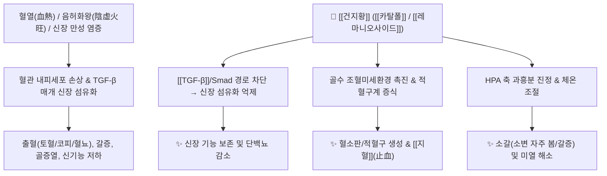

# 🌿 [[건지황]] (乾地黃, Rehmanniae Radix)

> **핵심 요약 (Key Summary)**:
> 현삼과 지황(*Rehmannia glutinosa*)의 신선한 뿌리를 말린 것으로, [[카탈폴]](Catalpol)과 [[레마니오사이드]](Rehmanniosides) 성분이 골수 조혈 줄기세포 자극, 신장 섬유화([[TGF-β]]) 억제 및 인슐린 감수성 개선 효과를 나타냅니다. 한의학적으로 [[청열양혈]](淸熱凉血), [[양음생진]](養陰生津)의 명약으로 혈열(血熱)로 인한 출혈, 당뇨(소갈), 골증열 및 신음부족을 치료합니다.

---
## 📌 목차
1. [기본 본초 정보 & 화학 구조 (Pharmacognosy)](#1-기본-본초-정보--화학-구조-pharmacognosy)
2. [핵심 분자약리 기전 & 조혈·신장 대사 네트워크](#2-핵심-분자약리-기전--조혈신장-대사-네트워크)
3. [본초 감별: 생지황 vs 건지황 vs 숙지황의 성질과 적응증](#3-본초-감별-생지황-vs-건지황-vs-숙지황의-성질과-적응증)
4. [사상의학 및 체질별 임상 응용 (적응증 vs 금기)](#4-사상의학-및-체질별-임상-응용-적응증-vs-금기)
5. [상한론 『약징(藥徵)』 분석 및 배오 원리](#5-상한론-약징藥徵-분석-및-배오-원리)
6. [핵심 처방 비교 매트릭스](#6-핵심-처방-비교-매트릭스)
7. [출처 및 학술 참고 문헌 (References)](#7-출처-및-학술-참고-문헌-references)

---
## 1. 기본 본초 정보 & 화학 구조 (Pharmacognosy)

| 항목 | 상세 내용 |
| :--- | :--- |
| **기원 식물** | 현삼과(Scrophulariaceae) 지황 *Rehmannia glutinosa* (Gaertn.) Libosch. ex Fisch. & C.A.Mey.의 뿌리를 건조한 것 |
| **성미 (性味)** | 甘·苦, 寒 (또는 凉) |
| **귀경 (歸經)** | 心·肝·腎經 (심경, 간경, 신경) |
| **효능 (Actions)** | [[청열양혈]](淸熱凉血), [[양음생진]](養陰生津), [[윤조지혈]](潤燥止血) |
| **주요 성분** | • [[이리도이드]] 배당체 (KP [[카탈폴]] $\ge 0.2\%$): [[카탈폴]] (Catalpol), [[아주골]] (Ajugol), [[아우쿠빈]] (Aucubin), [[레마니오사이드]] A, B, C, D<br>• 올리고당 및 [[다당류]]: [[스타키오스]] (Stachyose), Raffinose, Rehmannia polysaccharide<br>• 아미노산 및 페놀류: Arginine, GABA, [[악테오사이드]] (Acteoside) |

### 🔬 주요 지표물질 화학 구조
> **[구조적 특징]**: [[카탈폴]](Catalpol)은 C-4에 카르복실기가 없는 안정된 [[이리도이드]] 에테르 골격을 가지며, 활성산소(ROS) 제거, [[AMPK]] 활성화 및 미토콘드리아 보호 활성이 탁월합니다.

---
## 2. 핵심 분자약리 기전 & 조혈·신장 대사 네트워크



### (1) 혈액 및 면역계 조절
* **조혈 촉진 및 지혈**:
  * 골수 내 조혈 줄기세포의 증식을 자극하여 적혈구 및 혈소판 생성을 돕고, 혈관 투과성을 감소시켜 혈소판 감소성 자반증, 코피, 부정출혈을 멎게 합니다.
* **항당뇨 및 진액 보충 ([[생진]] 生津)**:
  * [[카탈폴]] 성분이 췌장 베타세포를 보호하고 근육 세포의 GLUT4 발현을 촉진하여 혈당을 강하시킵니다.

---
## 3. 본초 감별: 생지황 vs 건지황 vs 숙지황의 성질과 적응증

| 구분 | 포제 방법 | 성미 | 핵심 약효 및 귀경 | 주치 질환 |
| :--- | :--- | :--- | :--- | :--- |
| [[생지황]] (鮮地黃) | 신선한 생뿌리 | 苦·甘, 大寒 | 청열양혈(淸熱凉血) 최강 | 고열로 인한 발진, 섬어(헛소리), 극심한 급성 출혈 |
| [[건지황]] (乾地黃) | 신선한 뿌리를 말림 | 甘·苦, 寒 | 청열(淸熱) + 자음(滋陰) 겸비 | 음허내열, 당뇨(소갈), 골증열, 만성 출혈 |
| [[숙지황]] (熟地黃) | 막걸리로 9번 찌고 말림 (구증구포) | 甘, 微溫 | 보혈자음(補血滋陰) 최강 | 극심한 혈허, 빈혈, 정액 부족, 만성 쇠약 |

---
## 4. 사상의학 및 체질별 임상 응용 (적응증 vs 금기)

```
[✅ 최적 적응증 (Sweet Spot)]
• [[소양인]] 신음부족(腎陰不足): 하체에 힘이 없고 허리가 시큰거리며, 가슴에 열감이 뜨는 경우
• 당뇨병(소갈증), 만성 신장염(단백뇨), 구강 건조 및 야간 도한(식은땀)
• 혈열(血熱)로 인한 피부 발진, 가려움증, 두드러기

[⚠️ 신중 투여 및 금기 (Caution / Contraindication)]
• 비위허한(脾胃虛寒): 평소 소화가 안 되고 배가 차며 설사를 자주 하는 환자
• 체내 습담(濕痰)이 가득 차서 속이 더부룩하고 가래가 많은 경우
```

---
## 5. 상한론 『약징(藥徵)』 분석 및 배오 원리

### (1) 『[[약징]]』에 나타난 지황의 주치
> **"地黃 主治血證 및 煩熱也..."**  
> (지황의 주치는 혈증(血證)과 몸속의 갑갑한 열(煩熱)이다.)

* **핵심 배오**:
  * [[건지황]] + [[지모]] / [[황백]]: 음허로 인해 뼈골이 쑤시고 미열이 나는 골증조열 치료.
  * [[건지황]] + [[방기]] / [[황기]]: 수분 대사를 원활히 하면서 음혈(陰血)을 보호 ([[방기황기탕]] 가감).

---
## 6. 핵심 처방 비교 매트릭스

| 처방명 | 구성 약재 | 주치 병증 및 임상 타깃 | 특징 및 감별점 |
| :--- | :--- | :--- | :--- |
| [[육미지황탕]] | [[숙지황]](또는 [[건지황]]), [[산약]], [[산수유]], [[택사]], [[복령]], [[목단피]] | **신음부족(腎陰不足), 요슬산통, 소아 발육부전, 당뇨** | 삼보삼사의 음액 보충 기본방 |
| [[사물탕]] | [[숙지황]](또는 [[건지황]]), [[당귀]], [[천궁]], [[백작약]] | **혈허(血虛), 월경불순, 어지럼증, 안색 창백** | 보혈(補血)과 활혈(活血)의 표준방 |
| [[지황백호탕]] | [[석고]], [[지모]], [[건지황]], [[독활]], [[방풍]] | [[소양인]] 양명병(陽明病), 고열, 번갈, 당뇨병 | 소양인 내부의 조열(燥熱)을 내림 |
| [[사생환]] | [[생지황]](건지황), [[생하엽]], [[생애엽]], [[생측백엽]] | **혈열망행(血熱妄行), 토혈, 코피, 급성 출혈** | 량혈지혈의 대표 지혈방 |

---
## 7. 출처 및 학술 참고 문헌 (References)

1. **Zhang, R. X., et al. (2008)**. *Rehmannia glutinosa*: Review of botany and pharmacological effects on the nervous and renal systems. *Journal of Ethnopharmacology*, 117(2), 199-214.
   - **[연구 요약]**: 지황의 [[카탈폴]] 및 [[다당류]] 성분이 신경 보호, 당뇨성 신장 질환(DN)에서의 족세포 보호 및 [[TGF-β]] 섬유화 차단 효과를 나타냄을 종합 고찰.
2. **Xu, L., et al. (2017)**. Catalpol protects against renal fibrosis by inhibiting TGF-$\beta$/Smad signaling pathway. *Phytomedicine*, 36, 126-133.
   - **[연구 요약]**: [[카탈폴]] 투여가 신장 세뇨관 상피세포의 간엽전환(EMT)을 억제하여 만성 신질환 모델의 신기능을 보존함을 입증.
3. **대한민국약전(KP) 제12개정 (2022)**. 의약품각조 제2부: 지황 (Rehmanniae Radix) 규격 기준.
   - **[공정서 규격]**: 카탈폴 0.2% 이상 함유 필수 규격 및 건지황·숙지황 판별 기준 명시.
