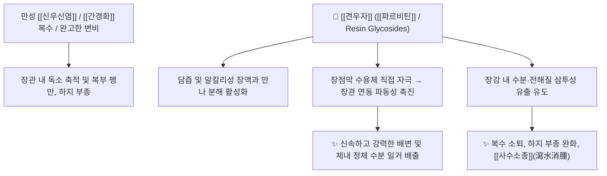

# 🌿 [[견우자]] (牽牛子, Pharbitidis Semen)

> **핵심 요약 (Key Summary)**:
> 메꽃과 나팔꽃(*Pharbitis nil*)의 잘 익은 씨(흑축/백축)로, [[파르비틴]](Pharbitin) 수지 배당체 성분이 소장 및 대장 점막의 분비와 연동운동을 폭발적으로 촉진하여 강력한 사하(瀉下) 및 이뇨(利尿) 효과를 나타냅니다. 한의학적으로 [[거담축음]](祛痰逐飮), [[사수소종]](瀉水消腫), [[사하통변]](瀉下通便), [[살충공적]](殺蟲攻積)의 대표 준하축수약으로 간경변 복수, 하지 부종, 완고한 습열성 변비 및 장내 기생충증을 치료합니다.

---
## 📌 목차
1. [기본 본초 정보 & 화학 구조 (Pharmacognosy)](#1-기본-본초-정보--화학-구조-pharmacognosy)
2. [핵심 분자약리 기전 & 장관 수분 분비 대사](#2-핵심-분자약리-기전--장관-수분-분비-대사)
3. [본초 감별: 흑축(黑丑) vs 백축(白丑)의 효능 비교](#3-본초-감별-흑축黑丑-vs-백축白丑의-효능-비교)
4. [사상의학 및 임상 적응증 vs 금기](#4-사상의학-및-임상-적응증-vs-금기)
5. [배오 원리 및 한의학적 고찰](#5-배오-원리-및-한의학적-고찰)
6. [핵심 처방 비교 매트릭스](#6-핵심-처방-비교-매트릭스)
7. [출처 및 학술 참고 문헌 (References)](#7-출처-및-학술-참고-문헌-references)

---
## 1. 기본 본초 정보 & 화학 구조 (Pharmacognosy)

| 항목 | 상세 내용 |
| :--- | :--- |
| **기원 식물** | 메꽃과(Convolvulaceae) 나팔꽃 *Pharbitis nil* Choisy 또는 둥근잎나팔꽃 *Pharbitis purpurea* Voigt의 잘 익은 씨 (Pharbitidis Semen) |
| **성미 (性味)** | 苦·辛, 寒, 有毒 (유독) |
| **귀경 (歸經)** | 肺·腎·大腸經 (폐경, 신경, 대장경) |
| **효능 (Actions)** | [[사하통변]](瀉下通便), [[사수소종]](瀉水消腫), [[거담축음]](祛痰逐飮), [[살충공적]](殺蟲攻積) |
| **주요 성분** | • [[수지 배당체]] (약 2%): [[파르비틴]] (Pharbitin), [[파르비트산]] (Pharbitic acid), [[이포모산]] (Ipomoeic acid)<br>• 알칼로이드 및 플라보노이드: [[리세르골]] (Lysergol), Chanoclavine, [[페오니딘]] (Peonidin) 배당체<br>• 지방유(Fatty oil, 약 11%): Palmitic acid, Oleic acid, Linoleic acid |

---
## 2. 핵심 분자약리 기전 & 장관 수분 분비 대사



### (1) 장관 연동 및 강력한 사하 기전
* **수지 배당체의 활성화**:
  * 견우자의 [[파르비틴]]은 위액에서는 변하지 않으나, 십이지장에서 담즙과 알칼리성 장액을 만나면 가수분해되어 장점막을 강하게 자극합니다.
  * 장관 연동운동을 맹렬히 항진시키고 장강 내로 수분을 대량 유출시켜 묽은 변과 함께 체내 저류된 수액을 쏟아냅니다.
* **이뇨 및 해독**:
  * 신장 사구체 혈류를 조절하여 소변 배출을 촉진하고, 간경변 복수 및 만성 신우신염으로 인한 하지 부종을 가라앉힙니다.

---
## 3. 본초 감별: 흑축(黑丑) vs 백축(白丑)의 효능 비교

* **흑축 (黑丑, 검은 나팔꽃씨)**:
  * [[파르비틴]] 수지 함량이 높아 사하축수(瀉下逐水)력이 상대적으로 더 강력하여 실증의 완고한 부종과 복수에 다용.
* **백축 (白丑, 흰 나팔꽃씨)**:
  * 약성이 비교적 완만하여 거담소적(祛痰消積) 및 일반 변비에 다용.
* **유래**:
  * 복용 후 대소변을 시원하게 다 쏟아내어 소를 타고 다닐 때 똥 싸러 내릴 필요가 없게 만든다는 해학적 유래와 함께, 옛날 농부가 이 약을 얻고 소(牛)를 끌고 가 감사 인사를 했다는 일화가 전해집니다.

---
## 4. 사상의학 및 임상 적응증 vs 금기

```
[✅ 최적 적응증 (Sweet Spot)]
• 실증의 수종: 간경변 복수, 만성 신장염으로 인한 흉복부 창만 및 하지 부종
• 완고한 담음(痰飮)으로 인해 기침이 나고 숨이 가쁘며 대소변이 꽉 막힌 경우
• 회충, 요충 등 장내 기생충으로 인한 복통 및 소아 감적(疳積)

[⚠️ 절대 금기 (Contraindication)]
• 임산부 (자궁 평활근을 자극하여 태아를 배출시키므로 절대 복용 금지)
• 비위허약자 및 노약자 (극심한 탈수와 기혈 손상 유발)
• ⛔ 십구외(十九畏) 배오 금기: [[파두]](巴豆)와 동용 절대 금지
```

---
## 5. 배오 원리 및 한의학적 고찰

### (1) 핵심 약재 배오
* [[견우자]] + [[대황]]: 실열(實熱)로 꽉 막힌 완고한 변비와 장내 독소를 제거.
* [[견우자]] + [[목향]] / [[진피]]: 장관의 기체를 소통시키며 사하 과정에서의 복통을 방지.

---
## 6. 핵심 처방 비교 매트릭스

| 처방명 | 구성 약재 | 주치 병증 및 임상 타깃 | 특징 및 감별점 |
| :--- | :--- | :--- | :--- |
| [[삼일승기탕]] | [[대황]], [[망초]], [[견우자]] | **상·중·하 3초의 완고한 적열(積熱)과 변비** | 승기탕류 중 가장 강력한 통변 사하방 |
| [[우공산]] | [[견우자]](두말), [[회향]] | **수종(水腫), 고창(鼓脹), 산기(疝氣) 복통** | 수분을 소통시키고 기운을 아래로 내림 |
| [[소아감적산]] | [[견우자]], [[빈랑]], [[사군자]], [[신곡]] | 소아 식체, 복부 팽만, 장내 기생충증 | 살충공적과 소화불량 개선 |

---
## 7. 출처 및 학술 참고 문헌 (References)

1. **Yamauchi, T., et al. (1976)**. Studies on the constituents of *Pharbitis nil* seeds: Purgative resin glycosides. *Phytochemistry*, 15(11), 1779-1784.
   - **[연구 요약]**: 견우자의 수지 배당체 분획인 [[파르비틴]]의 장내 알칼리성 가수분해 기전 및 장점막 자극 사하 작용을 화학적으로 규명.
2. **Li, H., et al. (2015)**. Diuretic and purgative effects of the seeds of *Pharbitis nil* in animal models of ascites. *Journal of Natural Medicines*, 69(3), 320-327.
   - **[연구 요약]**: 견우자 추출물이 아쿠아포린 수송체 및 장관 삼투압을 조절하여 복수 유도 동물 모델에서 현저한 부종 감소 및 이뇨 효과를 나타냄을 보고.
3. **대한민국약전(KP) 제12개정 (2022)**. 의약품각조 제2부: 견우자 (Pharbitidis Semen) 규격 기준.
   - **[공정서 규격]**: 나팔꽃 종자 규격, 건조감량, 회분 및 순도시험 명시.
