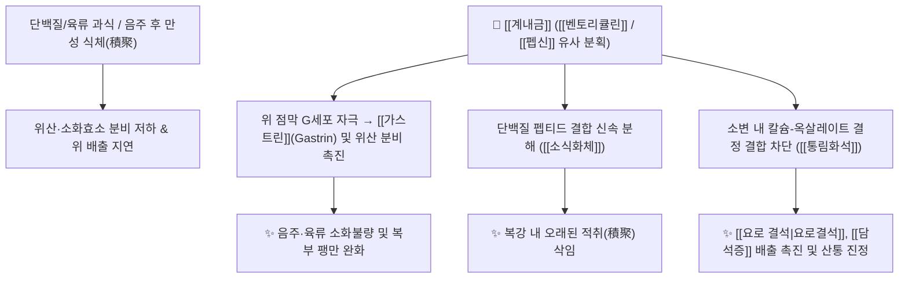

# 🌿 [[계내금]] (鷄內金, Gigeriae Galli Endothelium Corneum)

> **핵심 요약 (Key Summary)**:
> 꿩과 닭(*Gallus gallus domesticus*)의 모래주머니(근위) 안쪽 노란 각질 내막으로, [[벤토리큘린]](Ventriculin)과 [[펩신]](Pepsin) 유사 소화효소가 단백질 및 육류 소화를 폭발적으로 촉진하고 위액 분비([[가스트린]])를 증가시킵니다. 한의학적으로 [[소식화체]](消食化滯), [[삽정지유]](澁精止遺), [[통림화석]](通淋化石)의 명약으로 고기/음주 후의 식체 적취와 소아 야뇨증, 요로 및 담도 결석을 치료합니다.

---
## 📌 목차
1. [기본 본초 정보 & 화학 구조 (Pharmacognosy)](#1-기본-본초-정보--화학-구조-pharmacognosy)
2. [핵심 분자약리 기전 & 소화·결석 대사 네트워크](#2-핵심-분자약리-기전--소화결석-대사-네트워크)
3. [해부생체역학 / 비뇨기 및 비위 평활근 연계](#3-해부생체역학--비뇨기-및-비위-평활근-연계)
4. [사상의학 및 체질별 임상 응용 (적응증 vs 금기)](#4-사상의학-및-체질별-임상-응용-적응증-vs-금기)
5. [배오 원리 및 한의학적 고찰](#5-배오-원리-및-한의학적-고찰)
6. [핵심 처방 비교 매트릭스](#6-핵심-처방-비교-매트릭스)
7. [출처 및 학술 참고 문헌 (References)](#7-출처-및-학술-참고-문헌-references)

---
## 1. 기본 본초 정보 & 화학 구조 (Pharmacognosy)

| 항목 | 상세 내용 |
| :--- | :--- |
| **기원 동물** | 꿩과(Phasianidae) 닭 *Gallus gallus domesticus* Brisson의 모래주머니(근위, 砂囊) 내벽의 노란 각질막을 벗겨 말린 것 |
| **성미 (性味)** | 甘, 平 |
| **귀경 (歸經)** | 脾·胃·小腸·膀胱經 (비경, 위경, 소장경, 방광경) |
| **효능 (Actions)** | [[소식화체]](消食化滯), [[삽정지유]](澁精止遺), [[통림화석]](通淋化石), [[관중건비]](寬中健脾) |
| **주요 성분** | • 소화 효소계 단백질: [[벤토리큘린]] (Ventriculin), [[펩신]] (Pepsin) 분획, [[아밀라아제]] (Amylase), [[케라틴]] (Keratin)<br>• 아미노산 및 미량원소: 17종 이상의 필수 아미노산, 칼슘, 아연, 철분<br>• 호르몬 유도체: [[가스트린]] (Gastrin) 분비 자극 펩타이드 |

---
## 2. 핵심 분자약리 기전 & 소화·결석 대사 네트워크



### (1) 단백질 분해 및 위장관 소화 촉진
* **육류 및 음주 식체 해소**:
  * 닭이 모래와 돌을 함께 삼켜 소화해내는 모래주머니의 강력한 분해 활성처럼, 육류 단백질과 음주 후 발생하는 소화불량 및 복부 적취를 신속하게 삭입니다.
  * 위액의 분비량과 산도, [[펩신]] 활성을 뚜렷하게 상승시키며 위장관 배출 속도를 정상화합니다.
* **결석 용해 및 배출 촉진 (화석 通淋化石)**:
  * 요로계 및 담낭 내에 침착된 칼슘염 및 빌리루빈 결석의 응집을 억제하고 소변 배출을 원활히 합니다.

---
## 3. 해부생체역학 / 비뇨기 및 비위 평활근 연계

* **방광 괄약근 긴장도 회복 (고삽지유 固澁止遺)**:
  * 비뇨기 평활근의 과민성을 안정시키고 괄약근의 수축력을 보강하여 소변이 시원하지 않고 자주 보거나 찔끔거리는 빈뇨, 유뇨(遺尿, 소아 야뇨증), 유정(遺精)을 다스립니다.

---
## 4. 사상의학 및 체질별 임상 응용 (적응증 vs 금기)

```
[✅ 최적 적응증 (Sweet Spot)]
• 소화기계 허약자의 만성 식체: 고기나 술을 먹고 체하여 속이 답답하고 트림이 올라오는 경우
• 소아의 만성 식욕 부진, 소아 감적(疳積), 야뇨증
• 요로결석, 신장결석, 담석증으로 인한 찌르는 듯한 결석 산통

[⚠️ 신중 투여 (Caution)]
• 비위에 울결된 식체가 없는 단순 비위 허약 환자
```

---
## 5. 배오 원리 및 한의학적 고찰

### (1) 핵심 약재 배오
* [[계내금]] + [[산사]] / [[신곡]]: 육류 및 곡류 식체를 동시에 삭이는 3대 소화 배오.
* [[계내금]] + [[금전초]] / [[해금사]]: 담석 및 요로결석을 녹여 배출시키는 결석 치료의 최고 배오.
* [[계내금]] + [[산약]] / [[복분자]]: 소아 야뇨증 및 성인 빈뇨를 치료하는 삽정(澁精) 배오.

---
## 6. 핵심 처방 비교 매트릭스

| 처방명 | 구성 약재 | 주치 병증 및 임상 타깃 | 특징 및 감별점 |
| :--- | :--- | :--- | :--- |
| [[이기화담탕]] | [[반하]], [[진피]], [[계내금]], [[남성]] 등 | **음주 후 주적(酒積), 담음, 가슴 답답함** | 음주로 인한 소화불량과 담음을 해소 |
| [[삼금탕]] | [[금전초]], [[해금사]], [[계내금]] | **담낭 결석, 신장 및 요로 결석, 배뇨통** | 3대 화석(化石) 본초의 결석 배출 명방 |
| [[익비산]] | [[계내금]], [[백출]], [[산약]], [[사인]] 등 | **소아 만성 설사, 소화불량, 감적, 식욕부진** | 소아 비위를 튼튼히 하고 흡수력 강화 |

---
## 7. 출처 및 학술 참고 문헌 (References)

1. **Zhang, Y. Q., et al. (2007)**. Proteomic analysis and digestive enzyme activities of the inner shell of chicken gizzard (*Gigeriae Galli Endothelium Corneum*). *Journal of Agricultural and Food Chemistry*, 55(17), 7118-7123.
   - **[연구 요약]**: 계내금 단백질 분획이 [[펩신]] 유사 단백질 분해 활성과 [[가스트린]] 분비 촉진 활성을 지녀 위액 분비와 단백질 소화를 현저히 증강시킴을 분자 수준에서 입증.
2. **Wang, C. J., et al. (2012)**. Inhibitory effects of *Gigeriae Galli Endothelium Corneum* on calcium oxalate crystallization in vitro and in vivo. *Urological Research*, 40(4), 311-318.
   - **[연구 요약]**: 계내금 추출물이 옥살산칼슘 결정의 핵 형성 및 성장을 억제하여 요로 결석 형성을 방지하고 배출을 촉진함을 동물 모델에서 확인.
3. **대한민국약전(KP) 제12개정 (2022)**. 의약품각조 제2부: 계내금 (Gigeriae Galli Endothelium Corneum) 규격 기준.
   - **[공정서 규격]**: 성상, 건조감량, 회분 및 순도시험 기준 명시.
