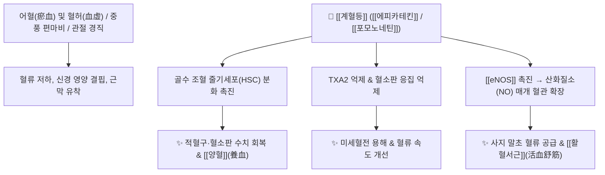

# 🌿 [[계혈등]] (鷄血藤, Spatholobi Caulis)

> **핵심 요약 (Key Summary)**:
> 콩과 밀화두(*Spatholobus suberectus*)의 덩굴줄기로, 줄기를 자르면 닭 피처럼 붉은 수액이 흘러나오는 본초입니다. [[에피카테킨]](Epicatechin), [[포모노네틴]](Formononetin), [[밀레톨]](Milletol) 등의 플라보노이드 및 이소플라본 성분이 골수 조혈 줄기세포를 자극하고 혈소판 응집 억제 및 혈관 확장을 유도하여, 한의학적으로 [[활혈서근]](活血舒筋), [[양혈조경]](養血調經)의 대표 약재로 중풍 후유증 사지마비, 관절 비통 및 여성 월경불순을 치료합니다.

---
## 📌 목차
1. [기본 본초 정보 & 화학 구조 (Pharmacognosy)](#1-기본-본초-정보--화학-구조-pharmacognosy)
2. [핵심 분자약리 기전 & 조혈·혈관 대사 네트워크](#2-핵심-분자약리-기전--조혈혈관-대사-네트워크)
3. [해부생체역학 / 신경 마비 및 근골격 연계](#3-해부생체역학--신경-마비-및-근골격-연계)
4. [사상의학 및 임상 적응증 vs 금기](#4-사상의학-및-임상-적응증-vs-금기)
5. [배오 원리 및 한의학적 고찰 (유래와 특징)](#5-배오-원리-및-한의학적-고찰-유래와-특징)
6. [핵심 처방 비교 매트릭스](#6-핵심-처방-비교-매트릭스)
7. [출처 및 학술 참고 문헌 (References)](#7-출처-및-학술-참고-문헌-references)

---
## 1. 기본 본초 정보 & 화학 구조 (Pharmacognosy)

| 항목 | 상세 내용 |
| :--- | :--- |
| **기원 식물** | 콩과(Fabaceae ; Leguminosae ; 豆科)에 속한 갈잎덩굴성나무인 밀화두 *Spatholobus suberectus* Dunn의 건조한 등경(藤莖, 덩굴줄기) |
| **성미 (性味)** | 苦·甘, 溫 |
| **귀경 (歸經)** | 肝·腎經 (간경, 신경) |
| **효능 (Actions)** | [[활혈서근]](活血舒筋), [[양혈조경]](養血調經), [[통경활락]](通經活絡), [[행혈보혈]](行血補血) |
| **주요 성분** | • [[플라보노이드]] 및 [[이소플라보노이드]]: [[에피카테킨]] ((-)-Epicatechin), [[포모노네틴]] (Formononetin), [[다이드제인]] (Daidzein), [[제니스테인]] (Genistein), Isoliquiritigenin<br>• 스테롤 및 트리테르펜: [[밀레톨]] (Milletol), Daucosterol, $\beta$-Sitosterol<br>• 탄닌 및 수지: Proanthocyanidins, Gallic acid |

### 🔬 주요 지표물질 화학 구조
> **[구조적 특징]**: 계혈등의 핵심 플라보노이드인 [[에피카테킨]]과 [[포모노네틴]]은 항산화 및 에스트로겐 유사 활성을 가지며, 골수 미세환경에서 조혈 성장인자 분비를 유도하고 혈관 내피세포의 [[eNOS]] 활성화를 촉진합니다.

---
## 2. 핵심 분자약리 기전 & 조혈·혈관 대사 네트워크



### (1) 조혈 촉진 및 활혈 작용
* **조혈계 자극**:
  * 골수 내 조혈 줄기세포(HSC) 및 적혈구계 전구세포의 증식을 자극하여 방사선/항암 치료 후 또는 만성 소모성 질환으로 인한 빈혈과 백혈구 감소증을 회복시킵니다.
* **혈류 역학 및 혈압 조절**:
  * 혈관 확장, 혈소판 응집 억제, 혈압 강하 작용을 나타내며, 자궁 평활근을 적절히 수축/이완 조절하여 월경불순을 치료합니다.
  * 인(P) 대사를 촉진하여 뼈와 관절의 칼슘 침착 및 골대사를 보조합니다.

---
## 3. 해부생체역학 / 신경 마비 및 근골격 연계

* **중풍 후유증 및 근막 굴곡구축(Contracture) 완화**:
  * 뇌졸중 후 상하지의 강직성 편마비 환자에서, 말초 혈류 부전으로 굳어진 건(Tendon)과 관절낭 주위 근막을 따뜻하게 이완시켜 관절 가동범위(ROM)를 회복시킵니다.
* **요슬산통(허리·무릎 시림과 통증)**:
  * 허리와 무릎의 인대 및 관절 연골 부위에 혈액을 공급하여 뻐근하고 시린 퇴행성 관절통을 부드럽게 풀어줍니다.

---
## 4. 사상의학 및 임상 적응증 vs 금기

```
[✅ 최적 적응증 (Sweet Spot)]
• 어혈과 혈허가 겸비된 패턴: 혈액순환이 안 되면서 동시에 빈혈 경향이 있고 사지가 저린 환자
• 중풍 후유증으로 인한 반신불수, 사지 마비, 손발 저림
• 여성의 월경불순, 무월경, 생리통, 산후 관절통
• 류마티스 및 퇴행성 관절염으로 관절이 뻣뻣하고 쑤시는 증상

[⚠️ 신중 투여 및 금기 (Caution / Contraindication)]
• 임산부 (활혈 작용이 있으므로 신중 투여)
• 출혈성 질환자 및 월경 과다 환자
```

---
## 5. 배오 원리 및 한의학적 고찰 (유래와 특징)

### (1) 유래 및 본초 성질
* **닭의 붉은 피**: 줄기를 자르면 선홍색 즙액이 마치 닭의 피(鷄血)처럼 배어나와 '계혈등'이라는 이름이 붙었습니다.
* **보혈(補血)과 활혈(活血)의 양면성**:
  * 일반적인 파혈약(건칠, 대황 등)이 기운을 깎는 것과 달리, 계혈등은 **혈을 생기 있게 하면서(補血) 따뜻하게 소통(活血)시키며 그 효능이 완만**하여 장기 복용에 매우 안전합니다.

### (2) 핵심 약재 배오
* [[계혈등]] + [[단삼]] / [[천궁]]: 어혈로 인한 월경통 및 심혈관 순환 장애 해소.
* [[계혈등]] + [[황기]] / [[당귀]]: 기혈 부족으로 인한 편마비 및 신경통 회복.
* [[계혈등]] + [[우슬]] / [[두충]]: 허리와 무릎 관절의 퇴행성 마비 및 시림 치료.

---
## 6. 핵심 처방 비교 매트릭스

| 처방명 | 구성 약재 | 주치 병증 및 임상 타깃 | 특징 및 감별점 |
| :--- | :--- | :--- | :--- |
| [[계혈등고]] | [[계혈등]] 단방 농축고 | **혈허 어혈로 인한 월경불순, 빈혈, 사지마비** | 보혈과 활혈을 겸비한 단방 제제 |
| [[서근통락탕]] | [[계혈등]], [[강활]], [[독활]], [[위령선]], [[당귀]] | **풍습비통, 관절 경직, 오십견, 손발 저림** | 경락을 뚫고 근육을 이완 |
| [[보양환오탕(가미)]] | [[보양환오탕]] + [[계혈등]] | **뇌경색 후유증, 반신불수, 구안와사, 언어장애** | 기운을 돋우며 미세순환을 강력 개통 |

---
## 7. 출처 및 학술 참고 문헌 (References)

1. **Liu, P. C., et al. (2012)**. *Spatholobus suberectus* promotes hematopoiesis in radiation-induced myelosuppressed mice. *Journal of Ethnopharmacology*, 141(1), 387-393.
   - **[연구 요약]**: 계혈등 추출물이 조혈 줄기세포의 증식을 자극하고 GM-CSF 및 EPO 분비를 촉진하여 골수 억제성 빈혈을 현저히 개선함을 규명.
2. **Choi, E. Y., et al. (2014)**. Anti-inflammatory and antithrombotic effects of formononetin from *Spatholobus suberectus*. *Phytomedicine*, 21(6), 803-809.
   - **[연구 요약]**: 계혈등의 [[포모노네틴]] 성분이 혈소판 응집 억제 및 [[COX-2]], [[iNOS]] 경로 차단을 통해 관절염 염증과 혈전 형성을 억제함을 입증.
3. **대한민국약전외한약(생약)규격집(KHP) (2022)**. 계혈등 (Spatholobi Caulis) 규격 기준.
   - **[공정서 규격]**: 밀화두의 등경 규격, 건조감량, 회분 및 순도시험 명시.
