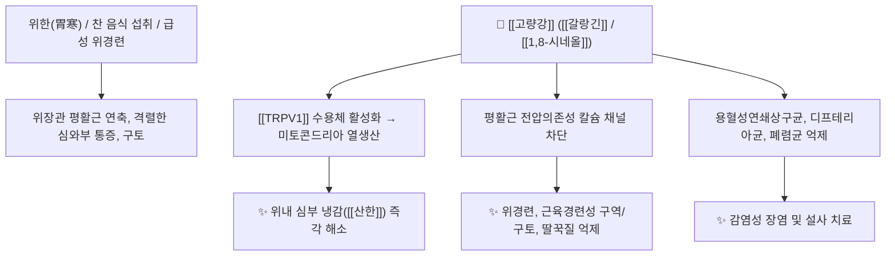

# 🌿 [[고량강]] (高良薑, Alpiniae Officinarum Rhizoma)

> **핵심 요약 (Key Summary)**:
> 생강과 양강(*Alpinia officinarum*)의 뿌리줄기로, [[갈랑긴]](Galangin)과 [[카에페라이드]](Kaempferide), [[1,8-시네올]](1,8-Cineole) 성분이 [[TRPV1]] 수용체 활성화 및 위점막 혈류 촉진, 위산 분비 조절을 통해 강력한 항구토·진경·온중 효과를 발휘합니다. 한의학적으로 [[산한지통]](散寒止痛), [[온중지구]](溫中止嘔), [[행기도체]](行氣導滯)의 맹렬한 온리약으로 속이 차서 생기는 근육경련성 구토설사, 심와부 냉통, 딸꾹질 및 세균성 장감염을 치료하며 [[건강]](乾薑)과 연관지어 운용합니다.

---
## 📌 목차
1. [기본 본초 정보 & 화학 구조 (Pharmacognosy)](#1-기본-본초-정보--화학-구조-pharmacognosy)
2. [핵심 분자약리 기전 & 위장관 대사 네트워크](#2-핵심-분자약리-기전--위장관-대사-네트워크)
3. [본초 감별: 고량강 vs 건강 vs 향부자 배오](#3-본초-감별-고량강-vs-건강-vs-향부자-배오)
4. [사상의학 및 체질별 임상 응용 (적응증 vs 금기)](#4-사상의학-및-체질별-임상-응용-적응증-vs-금기)
5. [배오 원리 및 한의학적 고찰 (유래와 특징)](#5-배오-원리-및-한의학적-고찰-유래와-특징)
6. [핵심 처방 비교 매트릭스](#6-핵심-처방-비교-매트릭스)
7. [출처 및 학술 참고 문헌 (References)](#7-출처-및-학술-참고-문헌-references)

---
## 1. 기본 본초 정보 & 화학 구조 (Pharmacognosy)

| 항목 | 상세 내용 |
| :--- | :--- |
| **기원 식물** | 생강과(Zingiberaceae) 식물인 양강 *Alpinia officinarum* Hance의 뿌리줄기를 말린 것 |
| **성미 (性味)** | 辛, 熱 |
| **귀경 (歸經)** | 脾·胃經 (비경, 위경) |
| **효능 (Actions)** | [[산한지통]](散寒止痛), [[온중지구]](溫中止嘔), [[행기도체]](行氣導滯), [[벽예절학]](辟穢截瘧) |
| **주요 성분** | • [[플라보놀]] (KP [[갈랑긴]] $\ge 0.7\%$): [[갈랑긴]] (Galangin), [[카에페라이드]] (Kaempferide), Quercetin, Kaempferol<br>• 디아릴헵타노이드: 1,7-Diphenylheptan-3,5-diol<br>• [[정유 성분]] (약 0.5~1.5%): [[1,8-시네올]] (1,8-Cineole), [[메틸신나메이트]] (Methyl cinnamate), $\alpha$-Pinene, Eugenol |

### 🔬 주요 지표물질 화학 구조
> **[구조적 특징]**: 주성분인 [[갈랑긴]](Galangin)은 B링에 수산기(-OH)가 없는 독특한 플라보놀 구조를 가지며, 위장관 평활근의 $\text{Ca}^{2+}$ 유입을 강력히 억제하여 급성 산통과 경련을 즉각적으로 진정시킵니다.

---
## 2. 핵심 분자약리 기전 & 위장관 대사 네트워크



### (1) 항경련 및 항구토 (온중지구 溫中止嘔)
* **진경 및 진통**:
  * [[갈랑긴]] 성분이 위장관 평활근의 과도한 수축을 억제하여 쥐어짜는 듯한 복통과 위경련을 신속히 완화합니다.
  * 구토 중추 및 미주신경 말단의 과흥분을 가라앉혀 맑은 물을 토하거나 딸꾹질이 멎지 않는 증상을 다스립니다.
* **항균 및 항병원체 활성**:
  * 용혈성연쇄상구균, 디프테리아균, 폐렴균 및 이질균의 발육을 억제하는 강력한 항균 활성을 지닙니다.

---
## 3. 본초 감별: 고량강 vs 건강 vs 향부자 배오

```
[🌿 [[고량강]] (Alpiniae Officinarum Rhizoma)]
• 특징: 매운맛과 열기가 매우 강하며, 주로 위(胃)에 작용하여 차가운 기운으로 인한 급성 위경련과 통증을 흩뜨림(散寒止痛).

[🌿 [[건강]] (Zingiberis Rhizoma)]
• 특징: 중초 비위(脾胃) 전체를 지속적으로 덥혀 진액을 수렴하고 한랭성 만성 설사를 멈추게 함(溫中逐寒).

[🌿 [[고량강]] + [[향부자]] ([[량부환]])]
• 기와 혈, 한열의 완벽한 조화: 고량강의 산한지통(散寒止痛) + 향부자의 이기해울(理氣解鬱)이 결합하여 신경성/한랭성 위통의 최고 특효방 형성.
```

---
## 4. 사상의학 및 체질별 임상 응용 (적응증 vs 금기)

```
[✅ 최적 적응증 (Sweet Spot)]
• [[소음인]] 위한(胃寒)증: 찬 바람을 쐬거나 찬 음식을 먹은 뒤 명치가 쥐어짜듯 아프고 토하는 경우
• 근육경련을 동반한 급성 곽란(霍亂, 구토설사) 및 멎지 않는 딸꾹질
• 찬 기운으로 인해 소화가 전혀 되지 않고 배에서 물소리가 나며 트림이 나는 증상

[⚠️ 신중 투여 및 금기 (Caution / Contraindication)]
• 위열(胃熱)로 인한 구토 및 궤양성 출혈 환자 (혀가 붉고 입이 바짝 마르는 경우)
• 음허(陰虛)로 화가 치솟는 환자
```

---
## 5. 배오 원리 및 한의학적 고찰 (유래와 특징)

### (1) 유래 및 고전적 의미
* **산지 유래**: 옛날 고량군(高良郡) 지역에서 주로 생산되어 '고량강'이라는 이름이 붙여졌습니다.
* **건강과의 연계**: 기미와 효능이 [[건강]]과 유사하나, 고량강은 방향성이 더욱 강하여 기운을 뚫어주고(行氣導滯) 통증을 멎게 하는 작용이 특히 빠릅니다.

### (2) 핵심 약재 배오
* [[고량강]] + [[향부자]]: 위한(胃寒)과 간기울결(肝氣鬱結)로 인한 심와부 통증의 명방 ([[량부환]]).
* [[고량강]] + [[반하]] / [[생강]]: 위기상역으로 인한 구토와 딸꾹질 진정.

---
## 6. 핵심 처방 비교 매트릭스

| 처방명 | 구성 약재 | 주치 병증 및 임상 타깃 | 특징 및 감별점 |
| :--- | :--- | :--- | :--- |
| [[량부환]] | [[고량강]], [[향부자]] | **위한기체(胃寒氣滯), 심복냉통, 신경성 위경련** | 한산(寒散)과 이기(理氣)의 대표 2미 방제 |
| [[이중탕(가미)]] | [[이중탕]] + [[고량강]] | 만성 비위허한에 **극심한 심와부 냉통** 동반 | 온중건비력에 산한지통 강화 |
| [[온위탕]] | [[고량강]], [[부자]], [[건강]], [[감초]] | 비위 양기 극한 쇠약, 구토설사, 사지궐냉 | 심한 냉증과 쇼크 상태 방어 |

---
## 7. 출처 및 학술 참고 문헌 (References)

1. **Honmore, V. S., et al. (2016)**. Galangin isolated from *Alpinia officinarum* inhibits gastric spasm and inflammation. *Phytomedicine*, 23(14), 1745-1753.
   - **[연구 요약]**: 고량강의 지표성분인 [[갈랑긴]]이 위장관 평활근 칼슘 이온 통로를 억제하여 진경 및 진통 효과를 나타내고, 위점막 염증을 억제함을 규명.
2. **Zhang, B. B., et al. (2010)**. Antibacterial and anti-ulcer activities of diarylheptanoids from *Alpinia officinarum*. *Journal of Ethnopharmacology*, 132(3), 603-608.
   - **[연구 요약]**: 고량강 정유 및 디아릴헵타노이드 분획이 소화관 병원균(연쇄상구균, 폐렴균 등)에 대한 강력한 발육 억제 및 위궤양 억제 작용을 발휘함을 입증.
3. **대한민국약전(KP) 제12개정 (2022)**. 의약품각조 제2부: 고량강 (Alpiniae Officinarum Rhizoma) 규격 기준.
   - **[공정서 규격]**: 갈랑긴 0.7% 이상 함유 기준 및 건조감량, 회분 기준 명시.
