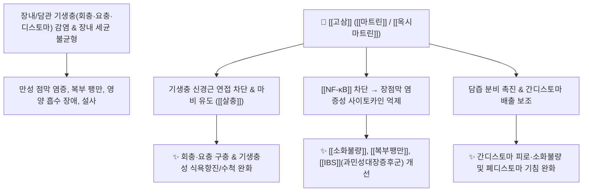

# 🌿 [[고삼]] (苦蔘, Sophorae Flavescentis Radix)

> **핵심 요약 (Key Summary)**:
> 콩과 고삼(*Sophora flavescens*)의 말린 뿌리로, 매우 쓴맛을 내는 [[퀴놀리지딘]] 알칼로이드인 [[마트린]](Matrine)과 [[옥시마트린]](Oxymatrine)이 풍부한 대표적인 [[청열조습약]](淸熱燥濕藥)입니다. 천연 [[마트린]]은 인체 부작용이 적으면서도 강력한 항미생물·항기생충(회충, 요충, 편충, 간디스토마, 폐디스토마) 및 항부정맥, 항알레르기 활성을 나타내어 만성 소화불량, 과민성대장증후군([[IBS]]), 복부팽만, 습진, 피부 가려움증을 치료합니다.

---
## 📌 목차
1. [기본 본초 정보 & 화학 구조 (Pharmacognosy)](#1-기본-본초-정보--화학-구조-pharmacognosy)
2. [핵심 기전 ①: 마트린의 항기생충·항미생물 & 소화기 대사](#2-핵심-기전--마트린의-항기생충항미생물--소화기-대사)
3. [핵심 기전 ②: 항부정맥(심근 이온채널) & 피부 항알레르기(지양)](#3-핵심-기전--항부정맥심근-이온채널--피부-항알레르기지양)
4. [사상의학 및 체질별 임상 응용 (적응증 vs 금기)](#4-사상의학-및-체질별-임상-응용-적응증-vs-금기)
5. [배오 원리 및 기생충 감염에 대한 한의학적 고찰](#5-배오-원리-및-기생충-감염에-대한-한의학적-고찰)
6. [핵심 처방 비교 매트릭스](#6-핵심-처방-비교-매트릭스)
7. [출처 및 학술 참고 문헌 (References)](#7-출처-및-학술-참고-문헌-references)

---
## 1. 기본 본초 정보 & 화학 구조 (Pharmacognosy)

| 항목 | 상세 내용 |
| :--- | :--- |
| **기원 식물** | 콩과(Fabaceae) 도둑놈의지팡이(고삼) *Sophora flavescens* Aiton의 주피를 벗겨 말린 뿌리 |
| **성미 (性味)** | 苦, 寒 |
| **귀경 (歸經)** | 心·肝·胃·大腸·膀胱經 (심경, 간경, 위경, 대장경, 방광경) |
| **효능 (Actions)** | [[청열조습]](淸熱燥濕), [[살충]](殺蟲), [[이뇨]](利尿), [[지양]](止痒) |
| **주요 성분** | • [[퀴놀리지딘]] [[알칼로이드]] (KP [[마트린]]+[[옥시마트린]] $\ge 1.2\%$): [[마트린]] (Matrine), [[옥시마트린]] (Oxymatrine), Sophoridine, Sophocarpine<br>• 플라보노이드: [[쿠라리디논]] (Kuraridinone), Kurarinone, Kushenol, Xanthohumol |

### 🔬 주요 지표물질 화학 구조 & 살충 약리
![[Pasted image 20240510011246.png|150]] ![[image 1.png|240]]
> **[구조적 특징]**: 주성분인 [[마트린]](Matrine)은 4개의 고리가 결합된 퀴놀리지딘 알칼로이드로 강렬한 쓴맛을 나타냅니다. 인공 합성 시 농약(천연 살충제/제초제)으로도 활용될 만큼 강력한 항미생물 활성을 지니며, 천연 마트린은 적정 용량에서 인체 독성이 매우 낮아 안전하게 응용됩니다.

---
## 2. 핵심 기전 ①: 마트린의 항기생충·항미생물 & 소화기 대사



### (1) 항기생충 및 미생물 억제 작용
* **다양한 기생충 질환 치료**:
  * **회충, 요충, 편충**: 장내 기생충으로 인한 식욕항진, 이유 없는 체중 감소, 소아 복통 치료.
  * **간디스토마(간흡충)**: 담관 염증으로 인한 만성 피로, 소화불량, 식욕부진 완화.
  * **폐디스토마(폐흡충)**: 폐 실질 자극으로 인한 만성 기침, 가래, 객혈(피섞인 가래) 치료.
* **소화기 만성 염증 개선**:
  * 현대 임상에서 기생충 및 장내 유해균 과증식으로 인한 만성 [[소화불량]], [[복부팽만]], 과민성대장증후군([[IBS]])에 필수적인 항균·항염 역할을 수행합니다.

---
## 3. 핵심 기전 ②: 항부정맥(심근 이온채널) & 피부 항알레르기(지양)

* **항부정맥 및 심근 보호**:
  * 마트린과 옥시마트린은 심근 세포의 $\text{Na}^+$ 및 $\text{Ca}^{2+}$ 채널을 조절하여 심방세동, 심실성 기외수축 및 빈맥을 안정시킵니다.
* **피부 가려움증 억제 ([[지양]] 止痒)**:
  * 비만세포의 히스타민 유리를 차단하고 $\text{Th2}$ 사이토카인(IL-4, IL-13)을 억제하여 습진, 음부 가려움증(음양 陰痒), 트리코모나스 질염을 치료합니다.

---
## 4. 사상의학 및 체질별 임상 응용 (적응증 vs 금기)

```
[✅ 최적 적응증 (Sweet Spot)]
• 습열(濕熱)이 하초(下焦)와 피부에 울체된 경우: 급성/만성 습진, 두드러기, 음부 소양증, 황달
• 장내 습열로 인한 세균성 이질, 점액변, 과민성대장증후군(IBS), 복부 팽만통
• 심장 두근거림을 동반한 빈맥성 부정맥

[⚠️ 신중 투여 및 금기 (Caution / Contraindication)]
• 비위허한(脾胃虛寒): 쓴맛과 찬 성질이 강하여 소화력이 매우 약하고 묽은 변을 보는 환자는 주의
• ⛔ 십구외(十九畏) 배오 금기: [[인삼]](人蔘), [[사삼]](沙蔘), [[현삼]](玄蔘)과 동용 시 효능 감쇄 주의
```

---
## 5. 배오 원리 및 기생충 감염에 대한 한의학적 고찰

### (1) 고대 기생충 치료의 핵심 본초
* 현대에는 위생 개선으로 드물지만, 고대 의서와 본초 처방에서 고삼은 기생충 감염(충적 蟲積, 회충, 간/폐디스토마)을 다스리는 핵심적인 구충·살충 본초로 기록되었습니다.

### (2) 핵심 약재 배오
* [[고삼]] + [[당귀]]: 혈액을 맑게 하고 피부 가려움증과 습진을 치료하는 명배오 ([[당귀고삼환]]).
* [[고삼]] + [[황련]] / [[황백]]: 대장 습열성 이질 및 복통, 트리코모나스 질염 치료.

---
## 6. 핵심 처방 비교 매트릭스

| 처방명 | 구성 약재 | 주치 병증 및 임상 타깃 | 특징 및 감별점 |
| :--- | :--- | :--- | :--- |
| [[고삼탕]] | [[고삼]], [[사상자]], [[백반]], [[황백]] | **피부 습진, 음부 가려움(음양), 트리코모나스 질염** | 외용 세정 및 피부 지양의 대표방 |
| [[당귀고삼환]] | [[당귀]], [[고삼]] | **혈열(血熱)성 피부 발진, 여드름, 주사비(딸기코)** | 청열조습과 양혈(養血) 배오 |
| [[삼물황금탕]] | [[황금]], [[고삼]], [[건지황]] | **부인 산후 건열, 사지 번열, 뼈마디 열감** | 하초 습열을 내리고 음혈 보존 |
| [[소풍산]] | [[형개]], [[방풍]], [[고삼]], [[우방자]], [[석고]] 등 | **급만성 두드러기, 습진, 진물 나는 아토피 피부염** | 거풍청열조습의 피부과 최고 명방 |

---
## 7. 출처 및 학술 참고 문헌 (References)

1. **Liu, J. Y., et al. (2014)**. Anti-inflammatory and antiparasitic mechanisms of matrine and oxymatrine from *Sophora flavescens*. *Phytomedicine*, 21(5), 654-662.
   - **[연구 요약]**: 고삼 알칼로이드인 [[마트린]]과 [[옥시마트린]]이 기생충 신경 마비 및 대장 점막 [[NF-κB]] 억제를 통해 장염과 복부팽만을 완화함을 규명.
2. **Long, Y., et al. (2018)**. Antiarrhythmic and cardioprotective effects of *Sophora flavescens* alkaloids: Mechanism of ion channel modulation. *Biomedicine & Pharmacotherapy*, 97, 1022-1031.
   - **[연구 요약]**: 마트린의 심근 칼륨/나트륨 이온통로 조절을 통한 항부정맥 활성 및 허혈 재관류 심근 보호 작용 입증.
3. **대한민국약전(KP) 제12개정 (2022)**. 의약품각조 제2부: 고삼 (Sophorae Flavescentis Radix) 규격 기준.
   - **[공정서 규격]**: 마트린 및 옥시마트린 합계 1.2% 이상 함유 규격 명시.
