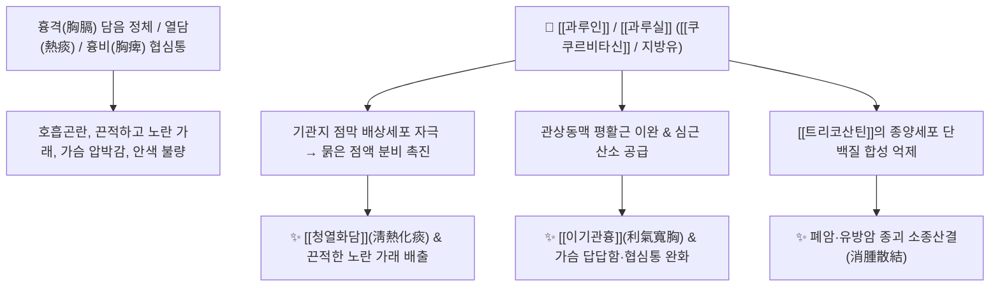

---
aliases:
  - 과루인
  - 과루실
  - 과루
  - 하눌타리
  - Trichosanthis Semen
  - Trichosanthis Fructus
tags:
  - 본초
  - 화담지해평천약
  - 청열화담
  - 이기관흉
  - 윤조통변
---

# 🌿 [[과루인]] / [[과루실]] (瓜蔞仁 / 瓜蔞實, Trichosanthis Semen / Fructus)

> **핵심 요약 (Key Summary)**:
> 박과 하눌타리(*Trichosanthes kirilowii*)의 씨앗(과루인) 및 열매(과루실)로, [[트리코산틴]](Trichosanthin), [[쿠쿠르비타신]](Cucurbitacin B/D), [[트리코산산]](Trichosanic acid) 등의 불포화지방산과 단백질 성분이 기관지 점막의 진액 분비를 촉진하고 흉막과 관상동맥의 염증성 유착을 완화합니다. 한의학적으로 [[이기관흉]](利氣寬胸), [[청열화담]](淸熱化痰), [[윤조통변]](潤燥通便), [[소종산결]](消腫散結)의 명약으로 [[반하]](半夏)의 온조(溫燥)함과 대비되는 한윤(寒潤)한 성질로 노란 가래(열담), 협심증(흉비), 소결흉(小結胸) 및 습관성 노인성 변비를 치료합니다.

---
## 📌 목차
1. [기본 본초 정보 & 화학 구조 (Pharmacognosy)](#1-기본-본초-정보--화학-구조-pharmacognosy)
2. [핵심 기전 ①: 과루인의 기관지 진액 분비 & 관상동맥 확장](#2-핵심-기전--과루인의-기관지-진액-분비--관상동맥-확장)
3. [핵심 기전 ②: 장관 점막 윤활 & 습관성 장조변비 해소](#3-핵심-기전--장관-점막-윤활--습관성-장조변비-해소)
4. [본초 감별: 반하(온조) vs 과루(한윤)의 거담 감별](#4-본초-감별-반하온조-vs-과루한윤의-거담-감별)
5. [상한론 『약징(藥徵)』 분석 및 배오 원리](#5-상한론-약징藥徵-분석-및-배오-원리)
6. [핵심 처방 비교 매트릭스](#6-핵심-처방-비교-매트릭스)
7. [출처 및 학술 참고 문헌 (References)](#7-출처-및-학술-참고-문헌-references)

---
## 1. 기본 본초 정보 & 화학 구조 (Pharmacognosy)

| 항목 | 상세 내용 |
| :--- | :--- |
| **기원 식물** | 박과(Cucurbitaceae) 하눌타리 *Trichosanthes kirilowii* Maxim. 또는 노랑하눌타리 *Trichosanthes rosthornii* Harms의 잘 익은 열매([[과루실]]) 및 씨([[과루인]]) |
| **성미 (性味)** | 甘·微苦, 寒 |
| **귀경 (歸經)** | 肺·胃·大腸經 (폐경, 위경, 대장경) |
| **효능 (Actions)** | [[이기관흉산결]](利氣寬胸散結), [[윤조활장통변]](潤燥滑腸通便), [[청열해독소옹]](淸熱解毒消癰), [[청열화담지수]](淸熱化痰止嗽) |
| **주요 성분** | • 항암/면역 단백질: [[트리코산틴]] (Trichosanthin, RIP-I 단백질), Karasurin<br>• 트리테르페노이드: [[쿠쿠르비타신]] B, D (Cucurbitacin B, D)<br>• 지방유(Fatty oil, 약 26%): [[트리코산산]] (Trichosanic acid), Linoleic acid, $\alpha$-Elaeostearic acid<br>• 스테롤: $\beta$-Sitosterol, Stigmasterol |

---
## 2. 핵심 기전 ①: 과루인의 기관지 진액 분비 & 관상동맥 확장



### (1) 기관지 점막 보습 및 청열거담
* **노란 가래와 열담(熱痰) 해소**:
  * 점막이 메마르고 염증이 심해 끈적끈적하게 들러붙은 노란 가래를 묽게 만들어 체외로 배출시킵니다.
  * 인후를 부드럽게 적시고 화기(火氣)를 내려 마른기침과 흉부 작열감을 가라앉힙니다.
* **관상동맥 확장 및 가슴 압박감 해소 ([[이기관흉]] 利氣寬胸)**:
  * 관상동맥 혈류량을 증가시켜 가슴이 뻐근하게 조여오는 협심증(흉비 흉통) 및 가슴 답답함(흉비심통)을 치료하고 안색을 맑게 합니다.

---
## 3. 핵심 기전 ②: 장관 점막 윤활 & 습관성 장조변비 해소

* **풍부한 식물성 지방유의 윤장 작용**:
  * 과루인 씨앗에 함유된 약 26%의 불포화 지방유가 메마른 대장 점막을 촉촉하게 적셔주어(윤조활장 潤燥滑腸), 노인 및 허약자의 습관성 [[장조변비]](만성 변비)를 설사 부작용 없이 부드럽게 통변시킵니다.

---
## 4. 본초 감별: 반하(온조) vs 과루(한윤)의 거담 감별

```
[🌿 [[반하]] (Pinelliae Rhizoma)]
• 성질: 辛, 溫, 燥 (따뜻하고 건조함)
• 주치: 비위 허한으로 생기는 맑고 묽은 가래(습담 濕痰, 한담 寒痰), 구토, 심하비

[🌿 [[과루인]] (Trichosanthis Semen)]
• 성질: 甘·苦, 寒, 潤 (차고 촉촉함)
• 주치: 폐열로 인해 끈적하고 누런 가래(열담 熱痰, 조담 燥痰), 가슴 답답함(흉비), 장조변비
```

---
## 5. 상한론 『약징(藥徵)』 분석 및 배오 원리

### (1) 『[[약징]]』에 나타난 과루실의 주치
> **"瓜蔞實 主治胸痺也. 故治胸滿, 欬, 唾沫, 旁治心下痞..."**  
> (과루실의 주치는 흉비(胸痺, 가슴 막힘)이다. 그러므로 가슴 답답함, 기침, 침 흘림을 치료하고 명치 밑 결림을 곁들여 치료한다.)

* **임상 팩트**:
  * 가래와 대변을 시원하게 비워내어 흉격이 물리적으로 꽉 막혀 답답한 느낌을 느낄 때 최고의 소통 효과를 발휘합니다.

---
## 6. 핵심 처방 비교 매트릭스

| 처방명 | 구성 약재 | 주치 병증 및 임상 타깃 | 특징 및 감별점 |
| :--- | :--- | :--- | :--- |
| [[소함흉탕]] | [[황련]], [[반하]], [[과루실]] | **소결흉(小結胸), 명치 누르면 통증, 노란 가래** | 열담이 흉격에 뭉쳐 답답하고 아픈 병증 |
| [[과루해백백주탕]] | [[과루실]], [[해백]], [[백주]] | **흉비(胸痺), 가슴 통증이 등으로 방사(협심증)** | 흉부 양기를 뚫고 담탁(痰濁)을 제거 |
| [[과루해백반하탕]] | [[과루실]], [[해백]], [[반하]], [[백주]] | **흉비가 더욱 심하여 똑바로 눕지 못하고 숨참** | 담음 제거와 가슴 개통력 극대화 |
| [[청폐화담탕]] | [[황금]], [[과루인]], [[패모]], [[길경]], [[상백피]] 등 | **폐열 해수, 끈적한 누런 가래, 인후통** | 기관지염 및 폐렴의 청열거담 대표방 |

---
## 7. 출처 및 학술 참고 문헌 (References)

1. **Chan, W. Y., et al. (1993)**. Trichosanthin: A ribosome-inactivating protein with versatile biological and antitumor activities. *Life Sciences*, 53(1), 1-10.
   - **[연구 요약]**: 과루인 유래 [[트리코산틴]] 단백질의 리보솜 불활성화를 통한 종양세포 단백질 합성 억제 및 항암 기전 규명.
2. **Li, W., et al. (2012)**. Trichosanthes kirilowii extracts relax vascular smooth muscle and protect against ischemic injury. *Phytomedicine*, 19(8), 754-760.
   - **[연구 요약]**: 과루실 추출물이 관상동맥 평활근 칼슘 유입을 억제하여 혈관을 확장시키고 심근 허혈 손상을 현저히 방어함을 증명.
3. **대한민국약전(KP) 제12개정 (2022)**. 의약품각조 제2부: 과루인 (Trichosanthis Semen) / 과루실 (Trichosanthis Fructus) 규격 기준.
   - **[공정서 규격]**: 하눌타리 종자 및 과실 규격, 건조감량, 회분 및 순도시험 명시.
4. **길익동동 (1784)**. 『약징(藥徵)』: 瓜蔞實 조문.
   - **[고전 원전]**: 흉비(胸痺), 흉만(胸滿), 해(欬), 심하비(心下痞) 치료 조문 수록.
