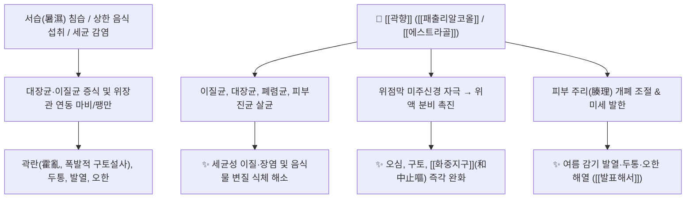

# 🌿 [[곽향]] (藿香, Agastachis / Pogostemonis Herba)

> **핵심 요약 (Key Summary)**:
> 꿀풀과 배초향(*Agastache rugosa*, 토곽향) 또는 광곽향(*Pogostemon cablin*)의 지상부로, [[패출리알코올]](Patchouli alcohol), [[에스트라골]](Estragole), [[아카세틴]](Acacetin), [[로즈마린산]](Rosmarinic acid) 등의 방향성 정유와 플라보노이드가 위액 분비를 촉진하고 장관 병원균(이질균, 대장균, 연쇄상구균, 피부진균)을 강력히 억제합니다. 한의학적으로 [[방향화습]](芳香化濕), [[화중지구]](和中止嘔), [[발표해서]](發表解暑)의 으뜸 약재로 여름철 서습감모(여름 감기), 곽란(霍亂, 구토설사), 세균성 식중독·이질 및 [[목향]](木香)과 유사한 위장관 기체 복통을 치료합니다.

---
## 📌 목차
1. [기본 본초 정보 & 화학 구조 (Pharmacognosy)](#1-기본-본초-정보--화학-구조-pharmacognosy)
2. [핵심 분자약리 기전 & 항균·위장관 대사 네트워크](#2-핵심-분자약리-기전--항균위장관-대사-네트워크)
3. [본초 감별: 토곽향 vs 광곽향 & 곽향 vs 목향](#3-본초-감별-토곽향-vs-광곽향--곽향-vs-목향)
4. [사상의학 및 체질별 임상 응용 (적응증 vs 금기)](#4-사상의학-및-체질별-임상-응용-적응증-vs-금기)
5. [배오 원리 및 한의학적 고찰 (유래와 특징)](#5-배오-원리-및-한의학적-고찰-유래와-특징)
6. [핵심 처방 비교 매트릭스](#6-핵심-처방-비교-매트릭스)
7. [출처 및 학술 참고 문헌 (References)](#7-출처-및-학술-참고-문헌-references)

---
## 1. 기본 본초 정보 & 화학 구조 (Pharmacognosy)

| 항목 | 상세 내용 |
| :--- | :--- |
| **기원 식물** | 꿀풀과(Labiatae ; Lamiaceae) 배초향 *Agastache rugosa* (Fisch. & C.A.Mey.) Kuntze (토곽향) 또는 광곽향 *Pogostemon cablin* (Blanco) Benth.의 지상부 |
| **성미 (性味)** | 辛, 微溫 |
| **귀경 (歸經)** | 肺·脾·胃經 (폐경, 비경, 위경) |
| **효능 (Actions)** | [[발표해서]](發表解暑), [[방향화습]](芳香化濕), [[화중지구]](和中止嘔), [[벽예화탁]](辟穢化濁) |
| **주요 성분** | • [[정유 성분]]: [[에스트라골]] (Estragole, 토곽향 주성분), [[패출리알코올]] (Patchouli alcohol, 광곽향 주성분), Pogostone, [[리모넨]] (Limonene)<br>• [[플라보노이드]]: [[아카세틴]] (Acacetin), Tilroside, Agastachoside<br>• 페놀산: [[로즈마린산]] (Rosmarinic acid), Caffeic acid |

---
## 2. 핵심 분자약리 기전 & 항균·위장관 대사 네트워크



### (1) 광범위 항병원체 및 살균 작용
* **세균성 이질 및 식중독 억제**:
  * 음식물 변질, 위생 불량(손을 제대로 안 씻은 경우), 해충 감염으로 발생하는 세균성 이질(Shigella) 및 병원성 대장균, 폐렴균, 용혈성연쇄상구균의 증식을 강력하게 차단합니다.
  * 피부 진균 억제 작용을 함께 가집니다.
* **소화액 분비 및 구토 억제 ([[지구]] 止嘔)**:
  * 위 점막을 온화하게 자극하여 위액 분비를 돕고 위장관 평활근 경련을 풀어 멀미, 식체 구토, 임신오조를 진정시킵니다.

---
## 3. 본초 감별: 토곽향 vs 광곽향 & 곽향 vs 목향

```
[🌿 [[토곽향]] (Agastachis Herba)]
• 기원: 한국 토종 배초향 (방아풀)
• 특징: 에스트라골 함량이 높아 향이 맑고 시원하며, 외감 서습감모 및 두통 발산에 우수.

[🌿 [[광곽향]] (Pogostemonis Herba)]
• 기원: 동남아 원산 패출리 (Pogostemon)
• 특징: 패출리알코올 함량이 높아 온중화습(溫中化濕) 및 심한 곽란 구토설사 억제에 우수.

[🌿 [[곽향]] vs [[목향]]]
• 곽향: 상초와 중초에 작용하여 향기로 습을 날리고 구토와 표증을 풂(芳香化濕).
• 목향: 중초와 하초에 작용하여 장관의 꽉 막힌 기체를 뚫고 복통과 뒤무직(이급후중)을 풂(行氣止痛).
```

---
## 4. 사상의학 및 체질별 임상 응용 (적응증 vs 금기)

```
[✅ 최적 적응증 (Sweet Spot)]
• 여름철 냉방병 및 서습감모: 에어컨 바람을 쐬고 찬 음료를 마신 후 두통, 오한, 메스꺼움, 묽은 설사
• 급성 위장염, 식중독으로 인한 구토와 설사가 동시에 일어나는 곽란(霍亂)
• 비위습탁(脾胃濕濁)으로 혀에 백태가 두껍게 끼고 입안이 텁텁하며 밥맛이 없는 경우

[⚠️ 신중 투여 및 금기 (Caution / Contraindication)]
• 음허화왕(陰虛火旺)으로 혀가 붉고 진액이 마른 환자
• 위열(胃熱)로 인한 구토 (황련, 죽여 등 청열약과 배오 필요)
```

---
## 5. 배오 원리 및 한의학적 고찰 (유래와 특징)

### (1) 유래 및 고전적 의미
* **시누이 '곽향'의 일화**: 옛날 곽향이라는 착한 시누이가 더위와 식체로 구토와 두통을 앓던 올케를 위해 산에서 향기로운 풀을 캐어 달여 먹여 낫게 했다는 설화에서 유래했습니다.
* **온성 발표약**: 성질이 약간 따뜻하여(微溫) 여름철 찬 기운에 상한 외감증(상한 傷寒)을 흩뜨려 땀을 내는 명약입니다.

### (2) 핵심 약재 배오
* [[곽향]] + [[반하]] / [[생강]]: 비위 허냉 및 식체로 인한 구토를 멈추는 최고 배오.
* [[곽향]] + [[자소엽]] / [[백지]]: 여름철 냉방병 및 풍한서습 감모 치료.
* [[곽향]] + [[황련]] / [[목향]]: 세균성 이질 및 복통 설사 치료.

---
## 6. 핵심 처방 비교 매트릭스

| 처방명 | 구성 약재 | 주치 병증 및 임상 타깃 | 특징 및 감별점 |
| :--- | :--- | :--- | :--- |
| [[곽향정기산]] | [[곽향]], [[소엽]], [[백지]], [[대복피]], [[반하]], [[백출]], [[진피]] 등 | **여름 감기, 냉방병, 식중독, 수토불복(물갈이 설사), 곽란** | 서습감모와 위장염의 여름철 제1방 |
| [[불환금정기산]] | [[곽향]], [[후박]], [[진피]], [[반하]], [[창출]], [[감초]] | **외감 풍한내습, 오한 발열, 구토, 복부 팽만** | 평위산에 곽향·반하를 가미한 건비화습방 |
| [[육화탕]] | [[곽향]], [[후박]], [[사인]], [[편두]], [[향유]], [[적복령]] 등 | **여름철 더위 먹음, 설사, 부종, 번갈** | 서습을 풀고 수분을 소통 |

---
## 7. 출처 및 학술 참고 문헌 (References)

1. **Jun, W. J., et al. (2010)**. Antibacterial and anti-inflammatory activities of *Agastache rugosa* essential oil against enteric pathogens. *Journal of Ethnopharmacology*, 130(2), 362-367.
   - **[연구 요약]**: 배초향 정유 및 에스트라골 성분이 이질균, 대장균 등 소화기 병원균의 세포막을 파괴하고 장점막 염증 반응을 억제함을 규명.
2. **Li, Y. C., et al. (2012)**. Gastroprotective effects of patchouli alcohol from *Pogostemon cablin* against gastric ulcer and hypermotility. *Phytomedicine*, 19(13), 1162-1168.
   - **[연구 요약]**: 광곽향의 [[패출리알코올]]이 위점막 혈류량을 증가시키고 위산 분비와 장관 평활근 과연축을 정상화하여 항구토 및 항궤양 효과를 나타냄을 입증.
3. **대한민국약전(KP) 제12개정 (2022)**. 의약품각조 제2부: 곽향 (Agastachis Herba / Pogostemonis Herba) 규격 기준.
   - **[공정서 규격]**: 배초향 및 광곽향 지상부 규격, 정유 함량 및 순도시험 명시.
