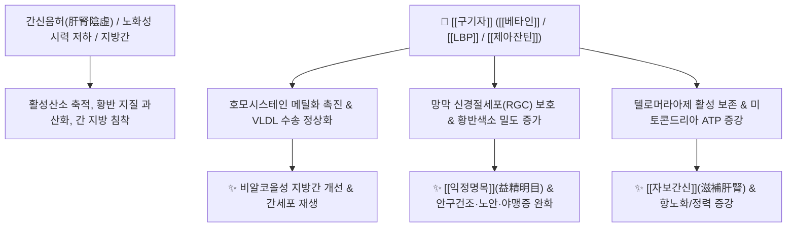

# 🌿 [[구기자]] (枸杞子, Lycii Fructus)

> **핵심 요약 (Key Summary)**:
> 가지과 구기자나무(*Lycium chinense*) 또는 영하구기(*Lycium barbarum*)의 잘 익은 열매로, [[베타인]](Betaine), [[구기자 다당류]](LBP, Lycium barbarum polysaccharides), [[제아잔틴]](Zeaxanthin) 등의 성분이 간세포 지방 침착 억제, 시망막 황반 보호, 인슐린 감수성 개선 및 항노화 작용을 나타냅니다. 한의학적으로 [[자보간신]](滋補肝腎), [[익정명목]](益精明目)의 상약(上藥)으로 간신음허(肝腎陰虛)로 인한 시력 감퇴, 안구 건조, 당뇨(소갈), 요슬산통(허리·무릎 무력감) 및 만성 피로를 치료합니다.

---
## 📌 목차
1. [기본 본초 정보 & 화학 구조 (Pharmacognosy)](#1-기본-본초-정보--화학-구조-pharmacognosy)
2. [핵심 분자약리 기전 & 간·망막 대사 네트워크](#2-핵심-분자약리-기전--간망막-대사-네트워크)
3. [해부생체역학 / 시신경·망막 & 생식축 연계](#3-해부생체역학--시신경망막--생식축-연계)
4. [사상의학 및 체질별 임상 응용 (적응증 vs 금기)](#4-사상의학-및-체질별-임상-응용-적응증-vs-금기)
5. [배오 원리 및 한의학적 고찰](#5-배오-원리-및-한의학적-고찰)
6. [핵심 처방 비교 매트릭스](#6-핵심-처방-비교-매트릭스)
7. [출처 및 학술 참고 문헌 (References)](#7-출처-및-학술-참고-문헌-references)

---
## 1. 기본 본초 정보 & 화학 구조 (Pharmacognosy)

| 항목 | 상세 내용 |
| :--- | :--- |
| **기원 식물** | 가지과(Solanaceae) 구기자나무 *Lycium chinense* Mill. 또는 영하구기 *Lycium barbarum* L.의 잘 익은 열매 (Lycii Fructus) |
| **성미 (性味)** | 甘, 平 |
| **귀경 (歸經)** | 肝·腎·肺經 (간경, 신경, 폐경) |
| **효능 (Actions)** | [[자보간신]](滋補肝腎), [[익정명목]](益精明目), [[윤폐지갈]](潤肺止渴), [[연년익수]](延年益壽) |
| **주요 성분** | • 알칼로이드 및 아미노산 (KP [[베타인]] $\ge 0.5\%$): [[베타인]] (Betaine), Choline<br>• 다당류 분획: [[구기자 다당류]] (Lycium Barbarum Polysaccharides, LBP I~IV)<br>• 카로티노이드: [[제아잔틴]] (Zeaxanthin dipalmitate), $\beta$-Carotene, Lutein<br>• 비타민 및 미네랄: 비타민 C, $\text{B}_1$, $\text{B}_2$, Rutin, Scopoline |

### 🔬 주요 지표물질 화학 구조
> **[구조적 특징]**: 주성분인 [[베타인]](Betaine, Trimethylglycine)은 간 내 메티오닌-호모시스테인 회로에서 메틸기 공여체(Methyl donor)로 작용하여 간세포의 중성지방 축적을 방지하고 지방간을 억제하며, [[제아잔틴]]은 망막 황반에 직접 축적되어 청색광 손상을 방어합니다.

---
## 2. 핵심 분자약리 기전 & 간·망막 대사 네트워크



### (1) 간 기능 보호 및 지질 대사 개선
* **항지방간 및 간세포 재생**:
  * [[베타인]]이 간 내 메틸화 경로를 활성화하여 중성지방의 축적을 막고 간경변 및 알코올/비알코올성 지방간 손상을 방어합니다.
* **항산화 및 면역 조절**:
  * [[구기자 다당류]](LBP)는 T세포 및 대식세포 활성을 높이고 항산화 효소(SOD, Catalase)를 활성화하여 노화로 인한 면역력 저하와 만성 피로를 회복시킵니다.

### (2) 시신경 및 망막 황반 보호 (명목 明目)
* [[제아잔틴]]과 루테인이 망막의 중심와(Fovea)에 고농도로 축적되어 자외선과 청색광(Blue light) 산화 손상을 차단하고 시력 감퇴, 안구 건조, 황반변성을 예방합니다.

---
## 3. 해부생체역학 / 시신경·망막 & 생식축 연계

* **시축-간장 연계(肝開竅於目)**:
  * 간혈(肝血)이 부족해지면 안구 미세순환이 저하되어 눈이 침침하고 뻑뻑해집니다. 구기자는 간과 망막에 항산화 성분을 공급하여 시신경의 피로를 풀어줍니다.
* **시상하부-뇌하수체-생식선(HPG Axis) 활성화**:
  * 신정(腎精)을 보하여 남성의 정자 수 및 운동성을 향상시키고 여성의 갱년기 질 건조와 골다공증을 완화합니다.

---
## 4. 사상의학 및 체질별 임상 응용 (적응증 vs 금기)

```
[✅ 최적 적응증 (Sweet Spot)]
• [[소양인]] 신음부족(腎陰不足): 허리와 무릎이 시큰거리고, 눈이 침침하며, 오후에 미열이 뜨는 패턴
• 당뇨병(소갈증) 환자의 혈당 조절 및 다음(多飮), 다뇨(多尿) 완화
• 컴퓨터/스마트폰 과사용으로 인한 현대인의 만성 안정피로, 안구건조증

[⚠️ 신중 투여 및 금기 (Caution / Contraindication)]
• 외감 발열 초기 및 급성 장염
• 비위허약으로 인해 묽은 설사를 자주 하는 환자 (대변활설 大便滑泄)
```

---
## 5. 배오 원리 및 한의학적 고찰

### (1) 핵심 약재 배오
* [[구기자]] + [[숙지황]] / [[산수유]]: 간신의 음액과 정을 채워주는 보음의 최고 기본 배오 ([[육미지황탕]] 가미, [[좌귀환]]).
* [[구기자]] + [[국화]]: 간열을 식히고 눈을 맑게 하는 안과 최고의 명배오 ([[기간탕]], [[기국지황환]]).
* [[구기자]] + [[복분자]] / [[토사자]]: 남성 생식기능과 신양(腎陽)을 보하는 배오 ([[오자연종환]]).

---
## 6. 핵심 처방 비교 매트릭스

| 처방명 | 구성 약재 | 주치 병증 및 임상 타깃 | 특징 및 감별점 |
| :--- | :--- | :--- | :--- |
| [[기국지황환]] | [[육미지황환]] + [[구기자]], [[국화]] | **간신음허, 안구 건조, 시력 감퇴, 눈부심, 두통** | 안과 및 뇌신경 보호의 대표 처방 |
| [[좌귀환]] | [[숙지황]], [[구기자]], [[산수유]], [[산약]], [[우슬]] 등 | **신음 극도 부족, 골증열, 도한, 요슬무력** | 삼보삼사 없이 순수한 보음제제 |
| [[오자연종환]] | [[구기자]], [[토사자]], [[복분자]], [[오미자]], [[차전자]] | **남성 난임, 정자 무력증, 조루, 유정, 빈뇨** | 5대 보신 종자약의 생식기능 강화방 |

---
## 7. 출처 및 학술 참고 문헌 (References)

1. **Amagase, H., & Farnsworth, N. R. (2011)**. A review of botanical characteristics, phytochemistry, clinical relevance in efficacy and safety of *Lycium barbarum* fruit (Goji). *Food Research International*, 44(7), 1702-1717.
   - **[연구 요약]**: 구기자 다당류([[LBP]])와 [[베타인]]의 항산화, 신경 보호, 시망막 황반 보호 및 대사증후군 개선 효과를 종합 검증.
2. **대한민국약전(KP) 제12개정 (2022)**. 의약품각조 제2부: 구기자 (Lycii Fructus) 규격 기준.
   - **[공정서 규격]**: 베타인 0.5% 이상 함유 규격 및 건조감량, 회분 명시.
