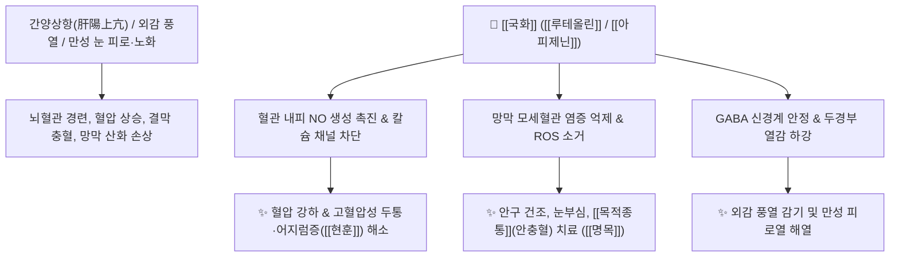

# 🌿 [[국화]] / [[감국]] (菊花 / 甘菊, Chrysanthemi Flos)

> **핵심 요약 (Key Summary)**:
> 국화과 국화(*Chrysanthemum morifolium*) 또는 감국(*Chrysanthemum indicum*)의 꽃송이로, "국민 한약은 오래 복용할 수 있어야 한다"는 임상적 지혜처럼 독성이 없고 약성이 순하여 장기 복용(장복)이 가능한 대표적인 상약(上藥)입니다. [[루테올린]](Luteolin), [[아피제닌]](Apigenin), [[클로로겐산]](Chlorogenic acid) 등의 플라보노이드 성분이 뇌혈관을 확장시켜 혈압을 낮추고, 망막과 시신경의 산화 스트레스를 억제하여 눈을 맑게 합니다. 한의학적으로 [[소산풍열]](疏散風熱), [[평간명목]](平肝明目), [[청열해독]](淸熱解毒)의 명약으로 외감 풍열 두통, 피로열, 고혈압성 두성현훈(어지럼증) 및 눈의 충혈과 통증(목적종통)을 치료합니다.

---
## 📌 목차
1. [기본 본초 정보 & 화학 구조 (Pharmacognosy)](#1-기본-본초-정보--화학-구조-pharmacognosy)
2. [핵심 분자약리 기전 & 안구·뇌혈관 대사 네트워크](#2-핵심-분자약리-기전--안구뇌혈관-대사-네트워크)
3. [본초 감별: 백국(안과·장복) vs 황국(발표) vs 야국화(해독)](#3-본초-감별-백국안과장복-vs-황국발표-vs-야국화해독)
4. [사상의학 및 체질별 임상 응용 (적응증 vs 금기)](#4-사상의학-및-체질별-임상-응용-적응증-vs-금기)
5. [배오 원리 및 한의학적 고찰 (유래와 특징)](#5-배오-원리-및-한의학적-고찰-유래와-특징)
6. [핵심 처방 비교 매트릭스](#6-핵심-처방-비교-매트릭스)
7. [출처 및 학술 참고 문헌 (References)](#7-출처-및-학술-참고-문헌-references)

---
## 1. 기본 본초 정보 & 화학 구조 (Pharmacognosy)

| 항목 | 상세 내용 |
| :--- | :--- |
| **기원 식물** | 국화과(Compositae ; Asteraceae) 국화 *Chrysanthemum morifolium* Ramat. 또는 감국 *Chrysanthemum indicum* L.의 두상화서(꽃송이) |
| **성미 (性味)** | 辛·甘·苦, 微寒 (순하고 자극이 없음) |
| **귀경 (歸經)** | 肺·肝經 (폐경, 간경) |
| **효능 (Actions)** | [[소산풍열]](疏散風熱), [[평간명목]](平肝明目), [[청열해독]](淸熱解毒), [[강압]](降壓) |
| **주요 성분** | • [[플라본]] 및 [[플라보놀]] 배당체: [[루테올린]] (Luteolin-7-O-glucoside, KP $\ge 0.20\%$), [[아피제닌]] (Apigenin), [[아카세틴]] (Acacetin), Quercetin<br>• 페놀산: 3,5-Dicaffeoylquinic acid ([[클로로겐산]]), Caffeic acid<br>• 정유: Borneol, Camphor, Chrysanthenone |

---
## 2. 핵심 분자약리 기전 & 안구·뇌혈관 대사 네트워크



### (1) 시신경 및 안구 보호 (평간명목 平肝明目)
* **외감·내상을 불문한 안과 질환 치료**:
  * 간열을 식히고 진액을 보충하여, 컴퓨터나 책을 오래 보아 눈이 침침하고 피로한 증상, 안구건조증, 각막염, 결막 충혈 및 통증(목적종통 目赤腫痛)을 맑게 치료합니다.
* **혈압 강하 및 뇌혈류 개선**:
  * 뇌혈관 저항을 낮추고 관상동맥 혈류량을 증가시켜 고혈압, 동맥경화, 긴장성 두통과 어지럼증을 안정시킵니다.

---
## 3. 본초 감별: 백국(안과·장복) vs 황국(발표) vs 야국화(해독)

```
[🌿 백국화 (白菊花)]
• 특징: 맛이 달고 성질이 가장 순함.
• 주치: 간을 평정하고 눈을 밝게 하는 평간명목(平肝明目), 시력 보호 및 장기 복용 차(Tea)로 최적.

[🌿 황국화 (黃菊花)]
• 특징: 쓴맛과 매운맛이 상대적으로 강함.
• 주치: 풍열을 발산하는 소산풍열(疏散風熱), 감기로 인한 발열, 인후통, 두통.

[🌿 [[야국화]] (野菊花)]
• 특징: 쓴맛과 찬 성질이 맹렬함.
• 주치: 청열해독(淸熱解毒)력이 극대화되어 악성 종기, 인후염, 급성 고혈압 응급.
```

---
## 4. 사상의학 및 체질별 임상 응용 (적응증 vs 금기)

```
[✅ 최적 적응증 (Sweet Spot)]
• 간열(肝熱)이 떠서 눈이 뻑뻑하고 충혈되며, 뒷목이 뻐근하고 혈압이 오르는 현대인
• 감기로 인한 두통, 발열, 목 통증 및 미열이 가시지 않는 피로열
• 수험생, 직장인의 장기적인 시력 보호 및 뇌피로 회복

[⚠️ 신중 투여 (Caution)]
• 약성이 순하여 금기가 거의 없으나, 비위가 극도로 차서 만성 설사를 하는 환자는 소량 복용
```

---
## 5. 배오 원리 및 한의학적 고찰 (유래와 특징)

### (1) 유래 및 본초 성질
* **오래 복용하는 국민 본초 (장수약)**: 예로부터 불로장생을 돕는 '상약(上藥)' 중의 상약으로 분류되어, 독성이 없고 부작용이 없어 차나 환으로 수개월 이상 장기 복용(장복)할 수 있는 대표 약재입니다.

### (2) 핵심 약재 배오
* [[국화]] + [[구기자]]: 간신을 보하고 눈을 밝게 하는 안과 최고의 황금 배오 ([[기국지황환]]).
* [[국화]] + [[상엽]] / [[박하]]: 풍열 감기 초기 두통과 인후통을 흩뜨리는 배오 ([[상국음]]).

---
## 6. 핵심 처방 비교 매트릭스

| 처방명 | 구성 약재 | 주치 병증 및 임상 타깃 | 특징 및 감별점 |
| :--- | :--- | :--- | :--- |
| [[상국음]] | [[상엽]], [[국화]], [[연교]], [[박하]], [[길경]], [[갈근]] 등 | **풍열 감기 초기, 기침, 발열, 눈 충혈, 인후통** | 온병 초기 풍열을 가볍게 흩뜨리는 명방 |
| [[기국지황환]] | [[육미지황환]] + [[구기자]], [[국화]] | **간신음허, 노안, 안구 건조, 눈부심, 어지럼증** | 시력 보호와 보음의 최고 기본방 |
| [[국화다]] | [[국화]] 단방 우림차 | **고혈압, 만성 두통, 눈 피로, 불면** | 일상에서 안전하게 마시는 항노화 약차 |

---
## 7. 출처 및 학술 참고 문헌 (References)

1. **Lin, L. Z., & Harnly, J. M. (2010)**. Identification of the phenolic components of chrysanthemum flower (*Chrysanthemum morifolium* Ramat). *Food Chemistry*, 120(1), 319-326.
   - **[연구 요약]**: 국화의 플라보노이드([[루테올린]], [[아피제닌]]) 및 디카페오일퀸산 성분이 모세혈관 염증 차단 및 강력한 뇌신경 항산화 활성을 가짐을 분석.
2. **대한민국약전(KP) 제12개정 (2022)**. 의약품각조 제2부: 감국 (Chrysanthemi Indici Flos) / 국화 (Chrysanthemi Flos) 규격 기준.
   - **[공정서 규격]**: 루테올린-7-O-글루코시드 0.20% 이상 함유 규격 및 순도시험 명시.
