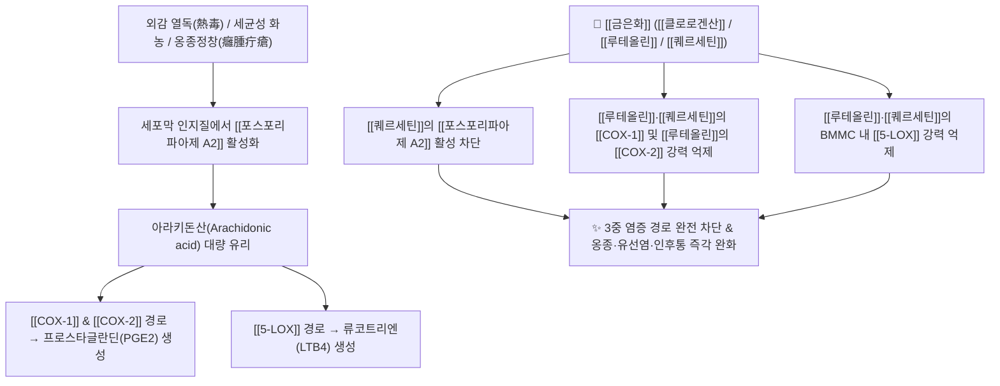

# 🌿 [[금은화]] (金銀花, Lonicerae Flos) / [[인동등]] (忍冬藤)

> **핵심 요약 (Key Summary)**:
> 인동과 인동(*Lonicera japonica*)의 꽃봉오리(금은화) 및 줄기·잎(인동등)으로, 처음 필 때 은색(백색)이다가 점차 금색(황색)으로 변하여 '금은화'라 불립니다. [[클로로겐산]](Chlorogenic acid), [[루테올린]](Luteolin), [[퀘르세틴]](Quercetin) 성분이 [[포스포리파아제 A2]](PLA2), [[COX-1]]/[[COX-2]], [[5-LOX]]를 다중 차단하고 그람양성균(황색포도상구균 등)에 대한 강력한 천연 항생 작용을 발휘합니다. 한의학적으로 [[청열해독]](淸熱解毒), [[양산풍열]](凉散風熱)의 으뜸 해독약으로 옹종정창(화농성 종기/고름), 유선염, 인후통, 급성 열병 및 열독혈리를 치료합니다.

---
## 📌 목차
1. [기본 본초 정보 & 화학 구조 (Pharmacognosy)](#1-기본-본초-정보--화학-구조-pharmacognosy)
2. [핵심 분자약리 기전 ①: PLA2, COX-1/2, 5-LO 다중 염증 차단](#2-핵심-분자약리-기전--pla2-cox-12-5-lo-다중-염증-차단)
3. [핵심 분자약리 기전 ②: HaCaT 각질세포 항산화 & 천연 항생/고름 기전](#3-핵심-분자약리-기전--hacat-각질세포-항산화--천연-항생고름-기전)
4. [본초 감별 및 면역 기전: 금은화(항생제) vs 인동등(소염진통제)](#4-본초-감별-및-면역-기전-금은화항생제-vs-인동등소염진통제)
5. [사상의학 및 체질별 임상 응용 (적응증 vs 금기)](#5-사상의학-및-체질별-임상-응용-적응증-vs-금기)
6. [배오 원리 및 한의학적 고찰 (유래와 특징)](#6-배오-원리-및-한의학적-고찰-유래와-특징)
7. [핵심 처방 비교 매트릭스](#7-핵심-처방-비교-매트릭스)
8. [출처 및 학술 참고 문헌 (References)](#8-출처-및-학술-참고-문헌-references)

---
## 1. 기본 본초 정보 & 화학 구조 (Pharmacognosy)

| 항목 | 상세 내용 |
| :--- | :--- |
| **기원 식물** | 인동과(Caprifoliaceae) 인동 *Lonicera japonica* Thunb.의 꽃봉오리([[금은화]]) 또는 줄기와 잎([[인동등]]) |
| **성미 (性味)** | 甘, 寒 |
| **귀경 (歸經)** | 肺·心·胃·大腸經 (폐경, 심경, 위경, 대장경) |
| **효능 (Actions)** | [[청열해독]](淸熱解毒), [[양산풍열]](凉散風熱), [[소종료창]](消腫療瘡), [[청열지리]](淸熱止痢) |
| **주요 성분** | • 페놀산 (KP [[클로로겐산]] $\ge 1.50\%$): [[클로로겐산]] (Chlorogenic acid), Isochlorogenic acid A, B, C, Caffeic acid<br>• [[플라보노이드]] (KP [[루테올린]] $\ge 0.10\%$): [[루테올린]] (Luteolin), [[루테올린-7-글루코시드]], [[퀘르세틴]] (Quercetin), Hyperoside<br>• 이리도이드 배당체: Loniceroside A~C, Secoxyloganin, Sweroside<br>• 기타: [[탄닌]] (Tannin), Inositol |

---
## 2. 핵심 분자약리 기전 ①: PLA2, COX-1/2, 5-LO 다중 염증 차단



### (1) 3중 아라키돈산 염증 캐스케이드 차단
* [[포스포리파아제 A2]](PLA2) 억제:
  * [[퀘르세틴]] 성분이 세포막 인지질에서 아라키돈산이 유리되는 첫 단계를 차단합니다.
* [[COX-1]], [[COX-2]] 및 [[5-LOX]] 복합 억제:
  * [[루테올린]]과 [[퀘르세틴]]은 [[COX-1]]과 비만세포(BMMC)의 [[5-LOX]] 경로를 강하게 저해하며, 특히 [[루테올린]]은 염증 유도성 [[COX-2]]를 강력히 억제하여 비스테로이드성 소염진통제 수준의 항염증 작용을 나타냅니다.

---
## 3. 핵심 분자약리 기전 ②: HaCaT 각질세포 항산화 & 천연 항생/고름 기전

* **HaCaT 각질형성세포 보호**:
  * [[클로로겐산]](Chlorogenic acid)은 사람 각질형성세포인 HaCaT keratinocyte에서 자외선(UVB)으로 유도된 산화적 스트레스 상황 시 활성산소(ROS) 생성을 억제하고 DNA 분절을 막아 피부 장벽을 보호합니다.
* **고름(Pus) 형성과 천연 항생제 역할**:
  * 고름의 본질은 침입한 세균과 이를 막아선 호중구(Neutrophil)의 사체가 엉켜 만들어진 방어 결계입니다.
  * 금은화는 고름을 형성하는 그람양성균(황색포도상구균, 연쇄상구균 등)에 대한 호중구 면역 반응에 관여하여 화농성 염증을 신속히 삭이고 배출시킵니다.

---
## 4. 본초 감별 및 면역 기전: 금은화(항생제) vs 인동등(소염진통제)

### (1) 인동등 vs 금은화
* [[금은화]] (꽃): 항균 및 항바이러스 작용이 특히 뛰어나 천연 항생제에 가깝습니다.
* [[인동등]] (줄기·잎): 관절 활액막과 근막의 통증을 가라앉히는 소염진통제에 가깝습니다.

### (2) 항생 기전과 세균/바이러스 감별
* **면역 인지 범위**:
  * 인체 면역계는 나노미터 단위의 분자(알러젠, 독소)부터 수십 센티미터의 기생충까지 병원체로 인식하여 내재면역과 적응면역을 발동합니다.
* **바이러스 vs 세균 침투 방식**:
  * 바이러스는 인간 세포 내로 침투하여 증식하고, 세균은 세포 외 조직에 침투하여 독소를 분비합니다(피부 상태를 관찰하여 바이러스성인지 세균성인지 감별 가능).
* **항생제 작용 원리**:
  * 인간 세포에는 없고 세균 세포에만 존재하는 세포벽(펩티도글리칸) 합성을 차단하여 세균을 사멸시킵니다.
  * **그람양성균**: 외부 환경에 적응하기 위해 두꺼운 펩티도글리칸 세포벽으로 둘러싸여 있으며(구균 형태), 금은화의 주요 타깃입니다.
  * **그람음성균**: 몸 안쪽에 주로 서식하며 지질다당류(LPS) 외막과 편모를 지닙니다.

---
## 5. 사상의학 및 체질별 임상 응용 (적응증 vs 금기)

```
[✅ 최적 적응증 (Sweet Spot)]
• 화농성 피부 감염: 모낭염, 종기, 옹저(癰疽), 여드름, 급성 유선염(젖몸살)
• 인후두염, 편도선염, 급성 상기도 감염으로 목이 붓고 타는 듯이 아픈 증상
• 이질(세균성 장염), 열독으로 인한 피섞인 설사(열독혈리)
• 실열·허열과 무관하게 열상이 뭉쳐 독이 되어 나타나는 모든 염증

[⚠️ 신중 투여 및 복용법 (Caution / Usage Tip)]
• 약성이 순하고 부드러워 적게 쓰면 피를 맑게 하고(淸血), 많이 쓰면 음을 보(補陰)하므로 염증 시에는 충분한 용량(15~30g)을 다용해야 함
• 비위가 몹시 허한하여 만성 설사를 하는 환자는 단독 과량 복용 주의
```

---
## 6. 배오 원리 및 한의학적 고찰 (유래와 특징)

### (1) 유래 및 고전적 의미
* **열증 치료의 상징**: "열나는 화농성 피부질환에 차가운 금이나 은을 올려놓으면 시원해진다"는 민간적 유래처럼, 은빛으로 피어나 금빛으로 익어가는 꽃송이가 전신의 열독을 식혀줍니다.

### (2) 핵심 약재 배오
* [[금은화]] + [[연교]]: 온병 및 화농성 종기를 치료하는 청열해독의 최고 명배오 ([[은교산]]).
* [[금은화]] + [[포공영]] / [[자화지정]]: 유선염 및 악성 종창을 치료하는 4대 해독 배오 ([[오미소독음]]).
* [[금은화]] + [[당귀]] / [[감초]]: 옹저를 삭이고 새살을 돋게 하는 배오 ([[탁리소독음]]).

---
## 7. 핵심 처방 비교 매트릭스

| 처방명 | 구성 약재 | 주치 병증 및 임상 타깃 | 특징 및 감별점 |
| :--- | :--- | :--- | :--- |
| [[은교산]] | [[금은화]], [[연교]], [[박하]], [[길경]], [[우방자]], [[죽엽]] 등 | **온병 초기, 인후통, 급성 편도선염, 발열, 오풍** | 상초 풍열과 인후 염증의 제1 표준 처방 |
| [[오미소독음]] | [[금은화]], [[야국화]], [[포공영]], [[자화지정]], [[지배모]] | **각종 악성 종기, 옹저정창, 급성 화농성 염증** | 외과 및 피부과 최고의 청열해독방 |
| [[탁리소독음]] | [[금은화]], [[황기]], [[당귀]], [[백출]], [[천산갑]] 등 | **만성 화농성 피부 궤양, 고름 배출 및 기혈 보강** | 화농 후 기혈이 허해진 상처 치유 |

---
## 8. 출처 및 학술 참고 문헌 (References)

1. **Shang, X., et al. (2011)**. *Lonicera japonica* Thunb.: Ethnopharmacology, phytochemistry, and pharmacology of an important traditional Chinese medicine. *Journal of Ethnopharmacology*, 138(1), 1-21.
   - **[연구 요약]**: 금은화의 [[클로로겐산]] 및 [[루테올린]]이 인플루엔자 바이러스, 황색포도상구균 및 [[COX-2]] 염증 경로를 강력히 억제함을 포괄 규명.
2. **Kim, J. A., et al. (2014)**. Chlorogenic acid protects human HaCaT keratinocytes from UVB-induced oxidative stress and apoptosis. *Molecular Medicine Reports*, 9(6), 2415-2420.
   - **[연구 요약]**: 금은화 유래 클로로겐산이 피부 각질세포에서 UVB 산화 스트레스에 의한 ROS 생성과 DNA 손상을 차단함을 분자 수준에서 확인.
3. **대한민국약전(KP) 제12개정 (2022)**. 의약품각조 제2부: 금은화 (Lonicerae Flos) 규격 기준.
   - **[공정서 규격]**: 클로로겐산 1.50% 이상, 루테올린-7-글루코시드 0.10% 이상 함유 규격 명시.