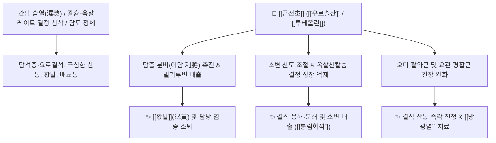

# 🌿 [[금전초]] (金錢草, Glechomae / Lysimachiae Herba)

> **핵심 요약 (Key Summary)**:
> 꿀풀과 긴병꽃풀(*Glechoma hederacea* var. *longituba*) 또는 앵초과 과로황(*Lysimachia christinae*)의 전초로, 잎 모양이 동전(金錢)을 닮았으며 담석 환자가 동전을 모아 사 먹고 나았다는 유래가 전해집니다. [[글레코민]](Glechomine), [[우르솔산]](Ursolic acid), [[루테올린]](Luteolin) 등의 성분이 담즙 분비를 촉진(이담)하고 소변을 산성화하여 옥살산칼슘 및 콜레스테롤 결석을 용해·배출시킵니다. 한의학적으로 [[청열이습통림]](淸熱利濕通淋), [[퇴황]](退黃), [[소종해독]](消腫解毒)의 명약으로 [[담석증]], 요로결석, [[황달]], [[방광염]], 기관지천식 및 타박상 어혈을 치료합니다.

---
## 📌 목차
1. [기본 본초 정보 & 화학 구조 (Pharmacognosy)](#1-기본-본초-정보--화학-구조-pharmacognosy)
2. [핵심 분자약리 기전 & 담도·비뇨기 결석 대사 네트워크](#2-핵심-분자약리-기전--담도비뇨기-결석-대사-네트워크)
3. [해부생체역학 / 오디 괄약근 & 요관 평활근 이완 연계](#3-해부생체역학--오디-괄약근--요관-평활근-이완-연계)
4. [사상의학 및 체질별 임상 응용 (적응증 vs 금기)](#4-사상의학-및-체질별-임상-응용-적응증-vs-금기)
5. [배오 원리 및 한의학적 고찰 (유래와 특징)](#5-배오-원리-및-한의학적-고찰-유래와-특징)
6. [핵심 처방 비교 매트릭스](#6-핵심-처방-비교-매트릭스)
7. [출처 및 학술 참고 문헌 (References)](#7-출처-및-학술-참고-문헌-references)

---
## 1. 기본 본초 정보 & 화학 구조 (Pharmacognosy)

| 항목 | 상세 내용 |
| :--- | :--- |
| **기원 식물** | 꿀풀과(Labiatae ; Lamiaceae) 병꽃풀(긴병꽃풀, 적설초) *Glechoma hederacea* L. var. *longituba* Nakai 또는 앵초과(Primulaceae) 과로황 *Lysimachia christinae* Hance의 건조한 지상부 |
| **성미 (性味)** | 苦·辛, 微寒 |
| **귀경 (歸經)** | 肝·膽·腎·膀胱經 (간경, 담경, 신경, 방광경) |
| **효능 (Actions)** | [[청열이습통림]](淸熱利濕通淋), [[퇴황]](退黃), [[소종해독]](消腫解毒), [[화석지통]](化石止痛) |
| **주요 성분** | • 테르페노이드 및 쓴맛 배당체: [[글레코민]] (Glechomine), [[우르솔산]] (Ursolic acid), [[올레아놀산]] (Oleanolic acid)<br>• [[플라보노이드]]: [[루테올린]] (Luteolin), [[아피제닌]] (Apigenin), Quercetin<br>• 정유 및 페놀산: [[1,8-시네올]] (1,8-Cineole), L-pinocamphone, [[로즈마린산]] (Rosmarinic acid) |

---
## 2. 핵심 분자약리 기전 & 담도·비뇨기 결석 대사 네트워크



### (1) 결석 용해 및 이담(利膽)·이뇨 작용
* **담석 및 요로결석 배출 (화석 通淋化石)**:
  * 담즙 생성을 촉진하고 담즙산 농도를 높여 콜레스테롤 담석을 용해시키며, 오디 괄약근(Oddi sphincter)을 이완시켜 담석의 장관 배출을 돕습니다.
  * 소변 배출을 늘리고 칼슘염 결정의 핵 형성을 차단하여 신장·방광 요로결석을 배출시킵니다.
* **항염, 해열 및 평활근 진경**:
  * 장관과 요관의 과도한 긴장도를 낮추어 경련성 복통을 진정시키고, 간담습열로 인한 [[황달]], 만성 기관지염, 천식의 기침을 완화합니다.

---
## 3. 해부생체역학 / 오디 괄약근 & 요관 평활근 연계

* **담관-십이지장 접합부(오디 괄약근) 이완**:
  * 담석 산통 발생 시 십이지장 유두부 괄약근의 경련을 풀어주어 담즙과 미세 담석이 십이지장으로 부드럽게 빠져나가도록 유도합니다.
* **요관 연동 리듬 정상화**:
  * 요관의 불수의적 연축을 억제하여 결석 이동 시 발생하는 찌르는 듯한 측복부 방사통을 완화합니다.

---
## 4. 사상의학 및 체질별 임상 응용 (적응증 vs 금기)

```
[✅ 최적 적응증 (Sweet Spot)]
• 간담 습열성 담석증, 담낭염, 황달로 우측 갈비뼈 아래가 뻐근하고 입이 쓴 경우
• 신장결석, 요관결석, 방광결석으로 소변에 모래가 섞여 나오고 배뇨통이 극심한 경우
• 급성 방광염, 부종, 타박상 어혈 종창, 습진

[⚠️ 신중 투여 (Caution)]
• 비위가 허한하여 찬 음식을 먹으면 설사하는 환자는 온중보비약과 배오
```

---
## 5. 배오 원리 및 한의학적 고찰 (유래와 특징)

### (1) 유래 및 고전적 의미
* **동전과 아내의 지극한 정성**: 『본초강목습유』에 처음 수록되었으며, 잎이 동전(金錢)을 닮았을 뿐 아니라 심한 담석통으로 죽어가던 남편을 살리기 위해 아내가 동전을 모아 사온 풀을 달여 먹이고 결석을 배출시켜 살려냈다는 감동적인 유래가 전해집니다.

### (2) 핵심 약재 배오
* [[금전초]] + [[해금사]] / [[계내금]]: 담석과 요로결석을 녹여 배출시키는 결석 치료의 3대 황금 배오 ([[삼금탕]]).
* [[금전초]] + [[인진호]] / [[치자]]: 습열성 황달 및 급성 담낭염 치료.

---
## 6. 핵심 처방 비교 매트릭스

| 처방명 | 구성 약재 | 주치 병증 및 임상 타깃 | 특징 및 감별점 |
| :--- | :--- | :--- | :--- |
| [[삼금탕]] | [[금전초]], [[해금사]], [[계내금]] | **담낭 결석, 요로 결석, 신장 결석, 극심한 결석 산통** | 결석 용해 및 배출의 최고 명방 |
| [[인진금전초탕]] | [[인진호]], [[금전초]], [[치자]], [[대황]] | **양황(陽黃), 급성 간염, 황달, 담낭염** | 청열이습과 퇴황(退黃) |
| [[금전초음]] | [[금전초]] 단방 달임차 | **요로결석 예방, 가벼운 배뇨통, 만성 방광염** | 일상에서 결석 재발을 방지하는 약차 |

---
## 7. 출처 및 학술 참고 문헌 (References)

1. **Wang, X. Q., et al. (2012)**. Choleretic and anti-cholelithiasis effects of *Lysimachia christinae* extract in gallstone animal models. *Journal of Ethnopharmacology*, 144(3), 682-687.
   - **[연구 요약]**: 금전초 추출물이 담즙산 분비를 촉진하고 콜레스테롤 포화도를 낮추어 담석 형성을 억제하고 기존 담석을 용해시킴을 규명.
2. **대한민국약전외한약(생약)규격집(KHP) (2022)**. 금전초 (Glechomae / Lysimachiae Herba) 규격 기준.
   - **[공정서 규격]**: 긴병꽃풀 및 과로황 지상부 규격, 건조감량, 회분 명시.
