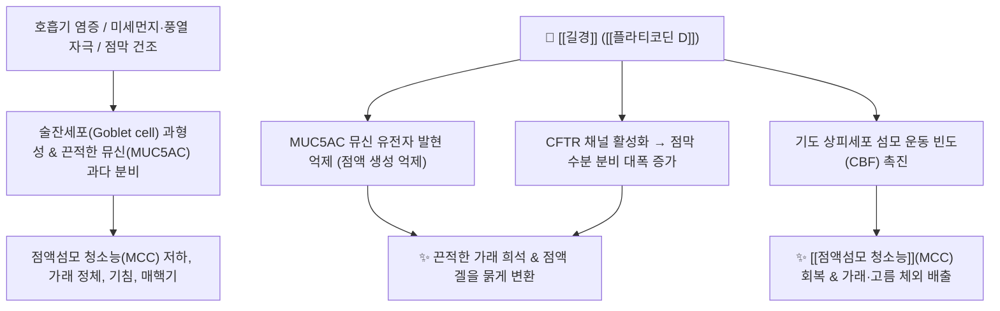

# 🌿 [[길경]] (桔梗, Platycodonis Radix)

> **핵심 요약 (Key Summary)**:
> 초롱꽃과 도라지(*Platycodon grandiflorum*)의 뿌리로, 물빠짐이 좋은 척박한 토양에서도 잘 자라는 내건성(耐乾性)을 지녀 건조에 취약한 인체 안점막과 호흡기 점막을 촉촉하게 적셔줍니다. 트리테르페노이드 사포닌인 [[플라티코딘 D]](Platycodin D)가 호흡기 술잔세포(Goblet cell)의 과도한 뮤신 생성을 억제하면서 수분 분비를 늘려 **점액섬모 청소능(Mucociliary Clearance)**을 획기적으로 개선합니다. 한의학적으로 [[선폐거담]](宣肺祛痰), [[이인]](利咽), [[배농소종]](排膿消腫)의 명약으로 상초(上焦)로 기운을 이끄는 인경약(引經藥)이며 인후통, 급만성 기관지염, 매핵기, 비염 및 화농성 농양([[배농산급탕]])을 치료합니다.

---
## 📌 목차
1. [기본 본초 정보 & 화학 구조 (Pharmacognosy)](#1-기본-본초-정보--화학-구조-pharmacognosy)
2. [핵심 기전 ①: 플라티코딘 D와 술잔세포 점액 분비 & 점액섬모 청소능](#2-핵심-기전--플라티코딘-d와-술잔세포-점액-분비--점액섬모-청소능)
3. [핵심 기전 ②: 인경(引經) 작용 (길경 상초 vs 우슬 하초) & 배농 기전](#3-핵심-기전--인경引經-작용-길경-상초-vs-우슬-하초--배농-기전)
4. [사상의학 및 체질별 임상 응용 (태음인 표한병 & 비염)](#4-사상의학-및-체질별-임상-응용-태음인-표한병--비염)
5. [상한론 『약징(藥徵)』 분석: 길경 vs 반하의 담음 감별](#5-상한론-약징藥徵-분석-길경-vs-반하의-담음-감별)
6. [핵심 처방 비교 매트릭스](#6-핵심-처방-비교-매트릭스)
7. [출처 및 학술 참고 문헌 (References)](#7-출처-및-학술-참고-문헌-references)

---
## 1. 기본 본초 정보 & 화학 구조 (Pharmacognosy)

| 항목 | 상세 내용 |
| :--- | :--- |
| **기원 식물** | 초롱꽃과(Campanulaceae) 도라지 *Platycodon grandiflorum* (Jacq.) A.DC.의 뿌리 또는 주피를 벗긴 것 (Platycodonis Radix) |
| **성미 (性味)** | 苦·辛, 平 (온화하며 상행) |
| **귀경 (歸經)** | 肺經 (폐경의 전속 인경약) |
| **효능 (Actions)** | [[선폐거담]](宣肺祛痰), [[이인배농]](利咽排膿), [[소종산결]](消腫散結), [[개음]](開音), [[선통흉격]](宣通胸膈) |
| **주요 성분** | • [[트리테르페노이드]] 사포닌 (3~5%): [[플라티코딘 D]] (Platycodin D, KP 지표물질), [[플라티코딘 A]], C, [[플라티코디제닌]] (Platycodigenin), Polygalacin D<br>• 다당류 및 이눌린: [[이눌린]] (Inulin, 과당 중합체), Platycodon polysaccharide<br>• 스테롤: $\alpha$-Spinasterol, Stigmasterol |

### 🔬 주요 지표물질 화학 구조
![[길경-20241011194022542.webp|480]]
> **[구조적 특징]**: 주성분인 [[플라티코딘 D]](Platycodin D)는 올레아난형 사포닌 골격에 당 사슬이 결합된 구조로, 기관지 점막 상피세포의 수분 분비를 촉진하고 점액의 유동성을 높여 배농 및 거담 작용을 주도합니다.

---
## 2. 핵심 기전 ①: 플라티코딘 D와 술잔세포 점액 분비 & 점액섬모 청소능



### (1) 점막 방어 체계와 술잔세포(Goblet Cell) 조절
* **점막의 4대 방어선**:
  * 코 및 호흡기 점막은 ① 점액 분비, ② 섬모 운동, ③ 분비 효소(Lysozyme), ④ 분비형 IgA 면역의 림프 면역으로 방어합니다.
* **점액 구성과 길경의 분자 조절**:
  * 정상 점액은 90% 수분, 5% 당단백질(뮤신), 지질, 무기질의 겔(Gel) 상태입니다.
  * 염증 시 점막 세포가 술잔세포로 과도하게 치환되면 끈적한 가래가 넘쳐나고 흡수력이 떨어집니다 (호흡기계=[[길경]] / 소화기계=[[후박]]).
  * 길경은 **염증 상태에서 뮤신(MUC5AC) 생성을 억제하면서, 수분 분비를 늘려 점액을 묽게 만들어 섬모 청소능(Mucociliary Clearance)을 극대화**합니다.

![[Pasted image 20240227152935.png|316]]
![[Pasted image 20240227152946.png|304]]
> **[술잔세포 점액 분비 및 점막 세포 조절도]**: 길경의 호흡기 점막 섬모청소능 개선 및 수분 분비 조절 경로.

### (2) 안점막·비점막 건조 및 만성 비염 치료
* 눈물이 자주 흐르고 눈곱이 끼거나, 콧물이 흐르다가도 코 안이 말라 코딱지가 생기고 마른기침, 매핵기(목에 이물감)가 있을 때 탁월합니다.
* **임상 꿀팁**: 만성 감기 후 코가 막히고 마르며 콧물을 풀어도 안 나오는 상태에서는 [[길경]] + [[맥문동]]을 배오하여 점막을 촉촉하게 적시며 소통시킵니다.

![[길경-20241011191725840.webp|450]]
> **[점액 수분 조절 및 호흡기 배출 작용]**: 식약처 자료 기반 점액 생성 억제 및 수분 분비 촉진 기전.

---
## 3. 핵심 기전 ②: 인경(引經) 작용 (길경 상초 vs 우슬 하초) & 배농 기전

```
[🌿 [[길경]] (Platycodonis Radix)]
• 인경 방향: 주작용이 상행(上行)하여 모든 약 기운을 **가슴·목·머리(상초 上焦)**로 이끄는 뱃사공(舟楫) 역할.

[🌿 [[우슬]] (Achyranthis Radix)]
• 인경 방향: 주작용이 하행(下行)하여 모든 약 기운을 **허리·무릎·생식기(하초 下焦)**로 이끄는 역할.
```

* **배농소종(排膿消腫) 기전**:
  * 폐옹(폐농양), 기관지확장증, 편도선 화농 및 피부 종창에서 국소 혈류를 증가시키고 고름(괴사 조직과 호중구)을 신속히 밖으로 밀어내어 새살을 돋게 합니다.

---
## 4. 사상의학 및 체질별 임상 응용 (태음인 표한병 & 비염)

```
[✅ 최적 적응증 (Sweet Spot)]
• [[태음인]] 위완한증 및 표한병: 기관지가 건조하고 목이 칼칼하며 가래가 붙어 떨어지지 않는 경우
• 급만성 인두염, 후두염, 편도선염, 목소리가 쉬어 안 나오는 실음(失音)
• 비염, 축농증(부비동염), 기관지확장증, 폐렴성 흉통
• 각종 화농성 종기, 여드름 농포, 피지낭종 ([[배농산급탕]])

[⚠️ 신중 투여 및 주의점 (Caution)]
• 음허(陰虛)로 인해 피를 토하는 각혈(咯血) 환자에는 단독 투여를 피함
```

---
## 5. 상한론 『약징(藥徵)』 분석: 길경 vs 반하의 담음 감별

### (1) 『[[약징]]』에 나타난 길경의 주치
> **"桔梗 主治濁唾, 腫膿也. 故治咽喉痛, 旁治胸脇痛..."**  
> (길경의 주치는 탁한 가래(濁唾)와 붓고 곪은 고름(腫膿)이다. 그러므로 인후통을 치료하고 흉협통을 곁들여 치료한다.)

* **길경 vs 반하의 담(痰) 감별**:
  * [[반하]](半夏): 체내에 끈끈하게 응고되어 정체된 담음(속에 맺힌 담).
  * [[길경]](桔梗): 응고된 담이 밖으로 배출되어 나타나는 **탁한 가래와 고름(밖으로 뿜어져 나오는 농과 가래)**.

---
## 6. 핵심 처방 비교 매트릭스

| 처방명 | 구성 약재 | 주치 병증 및 임상 타깃 | 특징 및 감별점 |
| :--- | :--- | :--- | :--- |
| [[길경탕]] | [[길경]], [[감초]] | **인후종통(咽喉腫痛), 목구멍 작열감, 편도염, 실음** | 상한론 인후통의 최고 기본 처방 |
| [[배농탕]] | [[길경]], [[감초]], [[생강]], [[대추|대조]] | **폐옹(폐농양), 흉통, 피고름 섞인 가래 배출** | 폐와 흉격의 화농성 농양 배농 |
| [[배농산급탕]] | [[길경]], [[백작약]], [[지실]], [[황금]], [[길경]], [[감초]], [[생강]] 등 | **각종 피부 화농성 종기, 여드름 농포, 옹저 초기** | 소염과 배농을 동시에 해결하는 외과 명방 |
| [[은교산]] | [[금은화]], [[연교]], [[길경]], [[박하]], [[우방자]] 등 | **온병 초기, 인후통, 급성 감기 발열** | 길경이 인경약으로 인후부 염증 소통 |

---
## 7. 출처 및 학술 참고 문헌 (References)

1. **Ryu, C. S., et al. (2014)**. Platycodin D, a natural saponin from *Platycodon grandiflorum*, enhances mucociliary clearance via airway hydration. *Phytomedicine*, 21(4), 529-537.
   - **[연구 요약]**: 길경의 [[플라티코딘 D]]가 기도 상피세포의 CFTR 염소 채널을 자극하여 수분 분비를 늘리고 뮤신 유전자(MUC5AC)를 억제하여 섬모 청소능을 현저히 증강시킴을 규명.
2. **대한민국약전(KP) 제12개정 (2022)**. 의약품각조 제2부: 길경 (Platycodonis Radix) 규격 기준.
   - **[공정서 규격]**: 플라티코딘 D 함량 기준 및 건조감량, 회분 명시.
3. **길익동동 (1784)**. 『약징(藥徵)』: 桔梗 조문.
   - **[고전 원전]**: 탁타(濁唾), 종농(腫膿), 인후통(咽喉痛) 치료 조문 수록.