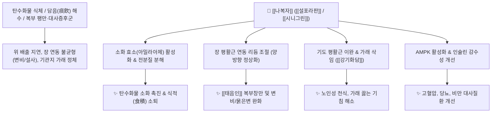

# 🌿 [[나복자]] (萊菔子, Raphani Semen)

> **핵심 요약 (Key Summary)**:
> 십자화과 무(*Raphanus sativus*)의 잘 익은 씨앗으로, [[설포라판]](Sulforaphane), [[시니그린]](Sinigrin), [[라파닌]](Raphanin), [[에루크산]](Erucic acid) 등의 성분이 소화 효소 활성화, 대장 연동 리듬 조절 및 기도 평활근 이완을 유도합니다. 한의학적으로 [[소식제창]](消食除脹), [[강기화담]](降氣化痰)의 대표 소식약으로 특히 사상의학에서 [[태음인]]의 핵심 약재입니다. 탄수화물 식체, 복부 창만, 만성 기침·가래([[삼자양친탕]]), 고혈압·당뇨·비만 등 대사질환과 함께 태음인의 변비와 설사를 양방향으로 조절합니다.

---
## 📌 목차
1. [기본 본초 정보 & 화학 구조 (Pharmacognosy)](#1-기본-본초-정보--화학-구조-pharmacognosy)
2. [핵심 분자약리 기전 & 대사·소화관 네트워크](#2-핵심-분자약리-기전--대사소화관-네트워크)
3. [사상의학: 태음인 소식약 & 변비/설사 양방향 조절](#3-사상의학-태음인-소식약--변비설사-양방향-조절)
4. [본초 감별 및 임상 팁 (나복자 vs 맥아)](#4-본초-감별-및-임상-팁-나복자-vs-맥아)
5. [배오 원리 및 주요 관련 처방군](#5-배오-원리-및-주요-관련-처방군)
6. [핵심 처방 비교 매트릭스](#6-핵심-처방-비교-매트릭스)
7. [출처 및 학술 참고 문헌 (References)](#7-출처-및-학술-참고-문헌-references)

---
## 1. 기본 본초 정보 & 화학 구조 (Pharmacognosy)

| 항목 | 상세 내용 |
| :--- | :--- |
| **기원 식물** | 십자화과(Cruciferae ; Brassicaceae) 무 *Raphanus sativus* L.의 잘 익은 씨 (Raphani Semen) |
| **성미 (性味)** | 辛·甘, 平 |
| **귀경 (歸經)** | 肺·脾·胃·大腸經 (폐경, 비경, 위경, 대장경) |
| **효능 (Actions)** | [[소식제창]](消食除脹), [[강기화담]](降氣化痰), [[통변]](通便), [[하기]](下氣) |
| **주요 성분** | • [[이소티오시아네이트]]: [[설포라판]] (Sulforaphane), Sulforaphene, [[라파닌]] (Raphanin)<br>• 글루코시놀레이트: [[시니그린]] (Sinigrin), Glucoraphanin<br>• 지방산 및 에스테르: [[에루크산]] (Erucic acid), Linoleic acid, Sinapine, 글리세린시나픽산 에스테르<br>• 소화 효소: 디아스타아제 활성 촉진 인자 |

---
## 2. 핵심 분자약리 기전 & 대사·소화관 네트워크



### (1) 소화 효소 활성화 및 탄수화물 소화
* **전분질 소화 촉진**:
  * 무 뿌리의 디아스타아제(아밀라아제)처럼, 씨앗인 나복자는 발아 효소 시스템을 자극하여 탄수화물 분해를 촉진하고 밥이나 떡을 먹고 체한 것을 시원하게 뚫어줍니다.
* **항균, 소염 및 혈압 강하**:
  * 황색포도상구균, 피부진균을 억제하며, 혈관 확장을 통해 혈압을 강하시키고 항산화·항염증 작용을 나타냅니다.

---
## 3. 사상의학: 태음인 소식약 & 변비/설사 양방향 조절

* **태음인 대장 기능 정상화**:
  * 대장의 연동 속도가 비정상적으로 빨라 묽은 변을 자주 보는 패턴에서는 장 운동을 차분하게 조절하여 설사를 멎게 합니다.
  * 반대로 장관 내 가스가 차고 복부 팽만과 함께 대변이 굳은 **태음인 변비**에서는 장관 기체를 아래로 통하게 하여 시원하게 배변을 유도합니다.

---
## 4. 본초 감별 및 임상 팁 (나복자 vs 맥아)

```
[🌿 [[맥아]] (Hordei Fructus Germinatus)]
• 특징: 순수하게 소화 흡수력을 높이고 식욕을 돋우는 소식 작용이 뛰어남.

[🌿 [[나복자]] (Raphani Semen)]
• 특징: 소화와 더불어 기운을 아래로 내리는 하기(下氣) 작용과 가래 삭임(化痰)이 강력함.
• 임상 팁: 단순 소화불량에는 맥아가 우수하나, [[태음인]] 체형에서 복부 팽만과 가래, [[변비]]가 동반될 때는 나복자를 반드시 추가 배오.
```

---
## 5. 배오 원리 및 주요 관련 처방군

### (1) 10대 핵심 임상 배오 처방군
1. [[삼자양친탕]]: 체기가 있으면서 해수천식(노인 기침·천식의 최고 명방).
2. [[청기화담환]]: 담음으로 인한 기침과 가래.
3. [[향부환]]: 식적으로 인한 만성 담음 기침.
4. [[소빈랑환]] / [[가비소창산]]: 복부 팽만 및 더부룩함.
5. [[안중조기환]]: 비위 담음 정체.
6. [[삼풍윤장환]]: 복창만 및 만성 [[변비]].
7. [[목통산]]: 흉협고만(가슴과 옆구리 결림).
8. [[가미고본환]]: 말이 잘 안 나올 때.
9. [[석고강활산]]: 풍열성 안과 눈 질환.

---
## 6. 핵심 처방 비교 매트릭스

| 처방명 | 구성 약재 | 주치 병증 및 임상 타깃 | 특징 및 감별점 |
| :--- | :--- | :--- | :--- |
| [[삼자양친탕]] | [[자소자]], [[백개자]], [[나복자]] | **노인 식체 해수, 가래 끓는 천식, 소화불량** | 3대 씨앗 약재의 하기화담 최고 명방 |
| [[열다한소탕(가미)]] | [[열다한소탕]] + [[나복자]] | [[태음인]] 간열조열, 변비, 복부 팽만 | 태음인 대장 조열과 변비 소통 |
| [[보화환]] | [[산사]], [[신곡]], [[반하]], [[복령]], [[진피]], [[연교]], [[나복자]] | **일체 음식물 식체, 완복창만, 트림, 설사** | 모든 식적을 삭이는 제1 소화방 |

---
## 7. 출처 및 학술 참고 문헌 (References)

1. **Beevi, S. S., et al. (2010)**. Hexane extract of *Raphanus sativus* seed exhibits potent antiproliferative and antioxidant properties. *Plant Foods for Human Nutrition*, 65(1), 8-17.
   - **[연구 요약]**: 나복자의 [[설포라판]] 및 이소티오시아네이트 성분이 지질 과산화 억제, 대사증후군 개선 및 항염증 활성을 발휘함을 입증.
2. **대한민국약전(KP) 제12개정 (2022)**. 의약품각조 제2부: 나복자 (Raphani Semen) 규격 기준.
   - **[공정서 규격]**: 무 종자 규격, 건조감량, 회분 및 순도시험 명시.