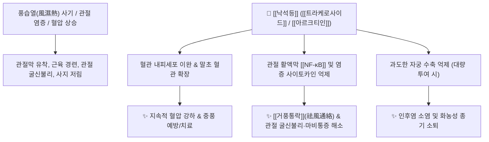

# 🌿 [[낙석등]] (絡石藤, Trachelospermi Caulis)

> **핵심 요약 (Key Summary)**:
> 협죽도과 마삭줄(*Trachelospermum asiaticum*)의 덩굴줄기와 가지로, 바위와 돌을 단단히 휘감고 자라 '낙석등'이라 불립니다. 리그난 배당체인 [[트라케로사이드]](Tracheloside), [[아르크티인]](Arctiin), [[마타이레시놀]](Matairesinol) 성분이 혈관 평활근을 이완시켜 지속적인 혈압 강하를 유도하고, 관절막과 인대의 염증성 연축을 풀어줍니다. 한의학적으로 [[거풍통락]](祛風通絡), [[량혈소종]](凉血消腫)의 대표 서근약으로 풍습성 사지마비, 근육경련, 관절 굴신불리(굽히고 펴기 힘듦), 중풍 후유증, 인후염 및 피부 종기를 치료합니다.

---
## 📌 목차
1. [기본 본초 정보 & 화학 구조 (Pharmacognosy)](#1-기본-본초-정보--화학-구조-pharmacognosy)
2. [핵심 분자약리 기전 & 신경·혈관 대사 네트워크](#2-핵심-분자약리-기전--신경혈관-대사-네트워크)
3. [해부생체역학 / 관절낭 & 건초(Tendon Sheath) 연계](#3-해부생체역학--관절낭--건초tendon-sheath-연계)
4. [사상의학 및 체질별 임상 응용 (적응증 vs 금기)](#4-사상의학-및-체질별-임상-응용-적응증-vs-금기)
5. [배오 원리 및 한의학적 고찰 (유래와 특징)](#5-배오-원리-및-한의학적-고찰-유래와-특징)
6. [핵심 처방 비교 매트릭스](#6-핵심-처방-비교-매트릭스)
7. [출처 및 학술 참고 문헌 (References)](#7-출처-및-학술-참고-문헌-references)

---
## 1. 기본 본초 정보 & 화학 구조 (Pharmacognosy)

| 항목 | 상세 내용 |
| :--- | :--- |
| **기원 식물** | 협죽도과(Apocynaceae) 마삭줄 *Trachelospermum asiaticum* (Siebold & Zucc.) Nakai var. *intermedium* Nakai 또는 낙석 *Trachelospermum jasminoides* (Lindl.) Lem.의 잎이 달린 어린 덩굴줄기 |
| **성미 (性味)** | 苦, 微寒 |
| **귀경 (歸經)** | 心·肝·腎經 (심경, 간경, 신경) |
| **효능 (Actions)** | [[거풍통락]](祛風通絡), [[량혈소종]](凉血消腫), [[서근지통]](舒筋止痛), [[강압]](降壓) |
| **주요 성분** | • [[리그난]] 배당체 (KP [[트라케로사이드]] $\ge 0.35\%$): [[트라케로사이드]] (Tracheloside), [[아르크티인]] (Arctiin), [[마타이레시놀]] (Matairesinol), Arctigenin<br>• 플라보노이드 배당체: Luteolin-7-glucoside, Apigenin-7-glucoside<br>• 알칼로이드: Trachelospermidine |

---
## 2. 핵심 분자약리 기전 & 신경·혈관 대사 네트워크



### (1) 혈관 확장 및 혈압 강하 작용
* **지속적 혈압 강하**:
  * 말초 혈관을 확장시키고 혈관 저항을 감소시켜 고혈압 환자의 두통, 어지럼증 및 뇌졸중(중풍) 예방과 회복기 혈류 개통에 기여합니다.
* **관절 염증 및 근경련 완화 (서근통락 舒筋通絡)**:
  * 류마티스성 관절염, 통풍성 관절통으로 관절이 붉게 붓고 열이 나며 굽히고 펴기 힘든(굴신불리 屈伸不利) 증상을 치료합니다.

---
## 3. 해부생체역학 / 관절낭 & 건초(Tendon Sheath) 연계

* **건초염 및 관절막 유착 박리**:
  * 덩굴 식물 특유의 '휘감아 도는 성질'이 인체 관절 주위의 힘줄집(건초)과 관절낭 인대 사이에 정체된 열독과 어혈을 풀어주어 관절 가동 범위를 회복시킵니다.

---
## 4. 사상의학 및 체질별 임상 응용 (적응증 vs 금기)

```
[✅ 최적 적응증 (Sweet Spot)]
• 열비(熱痺): 관절이 붓고 화끈거리며 아파서 손발을 굽히지 못하는 관절염 환자
• 중풍 후유증으로 인한 편마비, 근육 경련, 안면신경마비(구안와사)
• 고혈압을 동반한 경항부 강직, 만성 인후염, 화농성 종기

[⚠️ 신중 투여 및 금기 (Caution / Contraindication)]
• 비위허한(脾胃虛寒)으로 배가 차고 설사를 자주 하는 환자
• 대량 복용 시 복통, 설사, 피부 발적 및 자궁 억제 부작용이 나타날 수 있으므로 적정량(1일 6~15g) 준수
```

---
## 5. 배오 원리 및 한의학적 고찰 (유래와 특징)

### (1) 유래 및 해학적 일화
* **돌을 휘감는 생명력**: 바위(石)를 얽어매고(絡) 자라는 강인한 특성에서 유래했으며, "돌을 맞아 마비되고 출혈로 혈압이 떨어지는 응급 상황을 다스린다"는 해학적 비유처럼 혈압을 낮추고 마비된 경락을 뚫어줍니다.

### (2) 핵심 약재 배오
* [[낙석등]] + [[상지]](뽕나무가지) / [[인동등]]: 관절이 붓고 열이 나는 풍습열비(風濕熱痺) 치료.
* [[낙석등]] + [[우슬]] / [[계혈등]]: 중풍 후유증으로 인한 사지마비와 근경련 회복.

---
## 6. 핵심 처방 비교 매트릭스

| 처방명 | 구성 약재 | 주치 병증 및 임상 타깃 | 특징 및 감별점 |
| :--- | :--- | :--- | :--- |
| [[낙석등산]] | [[낙석등]], [[상지]], [[방기]], [[의이인]] | **열비(熱痺), 관절 종통, 관절 굴신불리** | 풍습열을 끄고 경락을 소통 |
| [[서근활락음]] | [[낙석등]], [[계혈등]], [[당귀]], [[단삼]] | **중풍 편마비, 손발 저림, 근육 위축** | 혈액순환과 근막 유착 해소 |
| [[낙석고]] | [[낙석등]], [[금은화]], [[포공영]] | **인후종통, 편도선염, 피부 옹종** | 청열소종 및 해독 |

---
## 7. 출처 및 학술 참고 문헌 (References)

1. **Tan, P. X., et al. (2005)**. Tracheloside and arctiin from *Trachelospermum jasminoides* exhibit vasodilatory and antihypertensive activities. *Journal of Natural Products*, 68(8), 1184-1188.
   - **[연구 요약]**: 낙석등 유래 리그난 성분인 [[트라케로사이드]]의 혈관 확장 및 혈압 강하 기전 규명.
2. **대한민국약전(KP) 제12개정 (2022)**. 의약품각조 제2부: 낙석등 (Trachelospermi Caulis) 규격 기준.
   - **[공정서 규격]**: 트라케로사이드 0.35% 이상 함유 규격 명시.

---

## 📎 개념 학습 보충 (2026-09-01 논문 연계)

- 2026-09-01 심층리뷰 4번(한약재 유래 활성 성분의 항염·연골 보호 리뷰): 골관절염·건초염에 전통적으로 쓰이는 본초로 낙석등이 언급됨 — 본 노트의 mermaid 다이어그램에도 있는 **관절 활액막 [[NF-κB]] 및 염증 사이토카인 억제**가 리뷰가 강조한 기전(MMP 억제·NF-κB 차단·항산화)과 정확히 일치
- '서근·통락'(舒筋通絡) 효능은 건초염·관절막 유착의 현대적 표적(활막 염증, 연골 주위 염증 부담)으로 해석 가능
- 이 파일 생성으로 기존에 걸려 있던 [[NF-κB]] 적색 링크가 채워짐
- 함께 보기: [[퇴행성 관절염]] · [[NF-κB]] · [[MMP]] · [[ROS]] · [[독활]] · [[2026-09-01_근골격계_척추관절_심층리뷰]]
