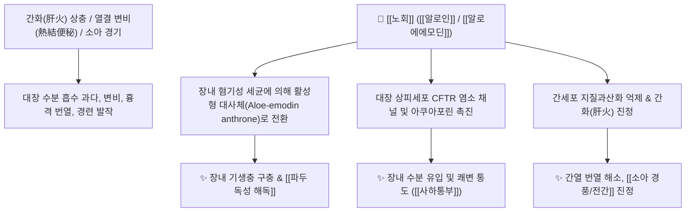

# 🌿 [[노회]] / [[알로에]] (蘆薈, Aloe)

> **핵심 요약 (Key Summary)**:
> 아스포델루스과(백합과) 알로에속 식물(*Aloe ferox*, *Aloe barbadensis*)의 잎에서 흘러나오는 즙액을 농축·건조한 수지로, 안트라퀴논 배당체인 [[알로인]](Aloin A/B, Barbaloin, 최대 20% 함유)과 [[알로에에모딘]](Aloe-emodin), [[아세만난]](Acemannan)이 풍부합니다. 대장 점막을 직접 자극하여 수분 분비와 연동을 유도하는 공하약(攻下藥)이자 간열(肝熱)을 식히는 청열약입니다. 한의학적으로 [[사하통부]](泄下通腑), [[청간진심]](淸肝鎭心), [[살충료감]](殺蟲療疳)의 명약으로 완고한 실열성 변비, 소아 경풍(간질성 경기), 기생충증, 간기능 장애 및 파두(巴豆)의 맹렬한 독성을 해독합니다.

---
## 📌 목차
1. [기본 본초 정보 & 화학 구조 (Pharmacognosy)](#1-기본-본초-정보--화학-구조-pharmacognosy)
2. [핵심 분자약리 기전 & 대장·간 대사 네트워크](#2-핵심-분자약리-기전--대장간-대사-네트워크)
3. [본초 감별 및 해독: 노회 vs 대황 & 파두 독성 중화](#3-본초-감별-및-해독-노회-vs-대황--파두-독성-중화)
4. [사상의학 및 체질별 임상 응용 (적응증 vs 금기)](#4-사상의학-및-체질별-임상-응용-적응증-vs-금기)
5. [배오 원리 및 한의학적 고찰 (유래와 특징)](#5-배오-원리-및-한의학적-고찰-유래와-특징)
6. [핵심 처방 비교 매트릭스](#6-핵심-처방-비교-매트릭스)
7. [출처 및 학술 참고 문헌 (References)](#7-출처-및-학술-참고-문헌-references)

---
## 1. 기본 본초 정보 & 화학 구조 (Pharmacognosy)

| 항목 | 상세 내용 |
| :--- | :--- |
| **기원 식물** | 아스포델루스과(Asphodelaceae ; Liliaceae) 식물인 케이프알로에 *Aloe ferox* Miller 또는 퀴라소알로에 *Aloe barbadensis* Miller 등의 잎에서 흘러나오는 즙액(汁液)을 건조한 것 (Aloe) |
| **성미 (性味)** | 苦, 寒 |
| **귀경 (歸經)** | 肝·胃·大腸經 (간경, 위경, 대장경) |
| **효능 (Actions)** | [[사하통부]](泄下通腑), [[청간진심]](淸肝鎭心), [[살충료감]](殺蟲療疳), [[조습척담]](燥濕滌痰) |
| **주요 성분** | • [[안트론 C-글루코시드]] (KP 무수에모딘 환산 $\ge 16.0\%$): [[알로인]] A, B (Aloin A, B / Barbaloin), Isobarbaloin<br>• 유리 안트라퀴논: [[알로에에모딘]] (Aloe-emodin), Chrysophanol<br>• 크로몬 및 다당류: [[알로에신]] (Aloesin), [[아세만난]] (Acemannan), Aloeresin A~D |

---
## 2. 핵심 분자약리 기전 & 대장·간 대사 네트워크



### (1) 장내 세균 활성화에 의한 자극성 사하
* **알로인의 표적 활성화**:
  * [[알로인]](Barbaloin)은 소장에서 흡수되지 않고 대장으로 이동하여, 장내 세균의 $\beta$-글루코시다아제에 의해 활성형 안트론 물질로 전환됩니다.
  * 대장 점막의 염소 및 수분 분비를 급격히 늘리고 연동 운동을 자극하여 완고한 열성 변비를 시원하게 해결합니다.
* **간열 청열 및 중추신경 안정 (청간진심 淸肝鎭心)**:
  * 간화(肝火)가 치솟아 가슴이 답답하고 눈이 붉어지며 어지러운 증상과 소아의 경기(경풍), 간질(전간 癲癎)을 진정시킵니다.
* **항미생물, 항바이러스 및 파두(巴豆) 해독**:
  * 장내 기생충을 구충하며, 맹독성 약재인 파두의 독성을 중화시키는 특효 작용이 있습니다.

---
## 3. 본초 감별 및 해독: 노회 vs 대황 & 파두 독성 중화

```
[🌿 [[노회]] (Aloe)]
• 약효 특성: 간경(肝經)과 대장경(大腸經)에 동시 작용하여 간열(肝火)을 식히면서 배변을 유도.
• 주치: 간화 변비, 소아 경기, 구충, 파두 해독.

[🌿 [[대황]] (Rhei Rhizoma)]
• 약효 특성: 비위·대장의 적열(積熱)을 맹렬히 쏟아내는 사하력 최강.
• 주치: 실열 양명부증, 어혈, 황달.
```

---
## 4. 사상의학 및 체질별 임상 응용 (적응증 vs 금기)

```
[✅ 최적 적응증 (Sweet Spot)]
• 간화상충으로 인한 열성 변비: 변이 돌처럼 굳고, 얼굴이 붉고, 가슴이 답답하며 머리가 아픈 경우
• 소아의 식체 감적(疳積), 복통, 기생충 감염, 열성 경련
• 파두(巴豆) 복용 후 극심한 설사 및 중독 증상

[⚠️ 절대 금기 (Contraindication)]
• 임산부 (자궁 수축 및 골반강 충혈로 유산 유발, 절대 복용 금지)
• 수유부 (알로인이 모유로 이행하여 영아에게 설사 유발)
• 비위허한(脾胃虛寒) 환자 및 만성 장염/치질 출혈 환자
```

---
## 5. 배오 원리 및 한의학적 고찰 (유래와 특징)

### (1) 유래 및 고전적 의미
* 아랍어 'Alloeh(빛나고 쓴 물질)'에서 유래하여 음역어로 '노회(蘆薈)'라 불렸으며, 흑갈색의 쓴맛 덩어리로 동서양을 막론하고 최고의 변비 및 해독제로 쓰였습니다.

### (2) 핵심 약재 배오
* [[노회]] + [[주사]] / [[용뇌]]: 소아의 간열 경기와 불면, 번조를 진정.
* [[노회]] + [[사군자]] / [[빈랑]]: 소아 기생충증 및 소화불량 감적 치료 ([[당귀노회환]]).

---
## 6. 핵심 처방 비교 매트릭스

| 처방명 | 구성 약재 | 주치 병증 및 임상 타깃 | 특징 및 감별점 |
| :--- | :--- | :--- | :--- |
| [[당귀노회환]] | [[당귀]], [[노회]], [[대황]], [[황련]], [[황백]], [[용담초]] 등 | **간담 실화(實火), 극심한 변비, 어지럼증, 광조** | 간화와 대장열을 동시에 사하하는 명방 |
| [[노회환]] | [[노회]], [[사군자]], [[백출]], [[감초]] 등 | **소아 감적, 복통, 소화불량, 영양 흡수 부전** | 구충과 비위 보익 배오 |
| [[해독방]] | [[노회]] 단방 분말 | **파두(巴豆) 복용 후 급성 중독, 복통, 설사** | 파두 열독을 중화시키는 해독 요법 |

---
## 7. 출처 및 학술 참고 문헌 (References)

1. **Choi, S., & Chung, M. H. (2003)**. A review on the relationship between *Aloe vera* components and their biological effects. *Seminars in Integrative Medicine*, 1(1), 53-62.
   - **[연구 요약]**: 노회의 안트라퀴논([[알로인]], [[알로에에모딘]]) 및 다당류 성분의 자극성 사하, 간 보호, 항염증 및 혈당 조절 메커니즘을 종합 정리.
2. **대한민국약전(KP) 제12개정 (2022)**. 의약품각조 제2부: 노회 (Aloe) 규격 기준.
   - **[공정서 규격]**: 무수에모딘 환산 16.0% 이상 함유 규격 및 건조감량, 회분 명시.
