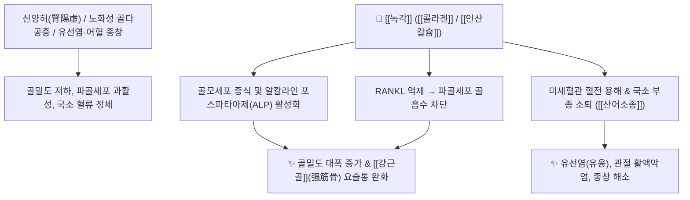

# 🌿 [[녹각]] (鹿角, Cervi Cornu)

> **핵심 요약 (Key Summary)**:
> 사슴과 매화록(*Cervus nippon*) 또는 마록(*Cervus elaphus*)의 완전히 골질화(骨質化)된 뿔로, 풍부한 [[콜라겐]](아교질)과 인산칼슘, 탄산칼슘 성분이 골밀도를 높이고 파골세포 활성을 억제합니다. [[녹용]](鹿茸)이 전신 원양(元陽)을 보하는 데 치중한다면, [[녹각]]은 칼슘과 콜라겐을 통해 근골을 직접 보충하면서 **활혈(活血), 산어(散瘀), 소종(消腫)**에 특화되어 있습니다. 한의학적으로 [[온신양]](溫腎陽), [[강근골]](强筋骨), [[행혈소종]](行血消腫)의 명약으로 허리·무릎 골다공증, 유선염(유옹), 관절통 및 어혈성 종창을 치료합니다.

---
## 📌 목차
1. [기본 본초 정보 & 화학 구조 (Pharmacognosy)](#1-기본-본초-정보--화학-구조-pharmacognosy)
2. [핵심 분자약리 기전 & 골대사·활혈 네트워크](#2-핵심-분자약리-기전--골대사활혈-네트워크)
3. [본초 감별: 녹용 vs 녹각 vs 녹각교 vs 녹각상 효능 서열](#3-본초-감별-녹용-vs-녹각-vs-녹각교-vs-녹각상-효능-서열)
4. [사상의학 및 체질별 임상 응용 (적응증 vs 금기)](#4-사상의학-및-체질별-임상-응용-적응증-vs-금기)
5. [배오 원리 및 한의학적 고찰 (유래와 특징)](#5-배오-원리-및-한의학적-고찰-유래와-특징)
6. [핵심 처방 비교 매트릭스](#6-핵심-처방-비교-매트릭스)
7. [출처 및 학술 참고 문헌 (References)](#7-출처-및-학술-참고-문헌-references)

---
## 1. 기본 본초 정보 & 화학 구조 (Pharmacognosy)

| 항목 | 상세 내용 |
| :--- | :--- |
| **기원 동물** | 사슴과(Cervidae ; 鹿科) 매화록 *Cervus nippon* Temminck 또는 마록 *Cervus elaphus* L., 대록 *Cervus canadensis* Erxleben의 골질화(骨質化)된 뿔 (Cervi Cornu) |
| **성미 (性味)** | 鹹, 溫 |
| **귀경 (歸經)** | 肝·腎經 (간경, 신경) |
| **효능 (Actions)** | [[온신양]](溫腎陽), [[강근골]](强筋骨), [[행혈소종]](行血消腫), [[산어지통]](散瘀止痛) |
| **주요 성분** | • [[아교질]] 단백질 (약 25%): Type I [[콜라겐]], 오세인(Ossein), 아미노산 17종<br>• 무기질 (약 50~60%): [[인산칼슘]] ($\text{Ca}_3(\text{PO}_4)_2$), [[탄산칼슘]] ($\text{CaCO}_3$), 마그네슘, 아연, 인<br>• 지질 및 스테롤: Cholesterol, Chondroitin sulfate |

---
## 2. 핵심 분자약리 기전 & 골대사·활혈 네트워크



### (1) 골 기질 보충 및 골다공증 개선
* **칼슘과 유기 기질 공급**:
  * 골질화된 뿔에 다량 함유된 생체 흡수성 [[인산칼슘]]과 [[콜라겐]]이 골 기질을 직접 보충하여 골밀도를 높이고 골절 회복 및 관절염을 개선합니다.
* **조양활혈 및 산어소종 (散瘀消腫)**:
  * 따뜻한 기운으로 혈행을 촉진하여 유선염(유옹 乳癰), 유방 결절, 임파선염 및 타박상 어혈 부종을 삭이고 통증을 멎게 합니다.

---
## 3. 본초 감별: 녹용 vs 녹각 vs 녹각교 vs 녹각상 효능 서열

```
[보신양(補腎陽) 및 정혈(精血) 보익력 순서]
👑 [[녹용]](鹿茸) > 🥈 [[녹각교]](鹿角膠) > 🥉 [[녹각]](鹿角) > 🏅 [[녹각상]](鹿角霜)

• [[녹용]]: 미골질화 어린 뿔로 생장인자(IGF-1), 강글리오사이드 풍부 → 원양(元陽) 보익 최강.
• [[녹각]]: 골질화된 뿔로 칼슘과 콜라겐 풍부 → 활혈(活血), 산어(散瘀), 소종(消腫) 및 근골 보충.
• [[녹각교]]: 녹각을 끓여 농축한 순수 아교질 → 보혈, 익정, 지혈.
• [[녹각상]]: 녹각에서 교질을 추출하고 남은 뼈 성분 → 섭정(澁精), 수렴지혈.
```

---
## 4. 사상의학 및 체질별 임상 응용 (적응증 vs 금기)

```
[✅ 최적 적응증 (Sweet Spot)]
• 신양허약으로 허리와 무릎이 시리고 힘이 없으며 골다공증이 있는 환자
• 여성의 수유기 급성 유선염(유옹) 초기 붓고 멍울진 증상
• 만성 어혈성 관절염, 산후 관절통, 만성 화농성 궤양

[⚠️ 신중 투여 및 금기 (Caution / Contraindication)]
• 음허화왕(陰虛火旺)으로 열감이 뜨고 혀가 붉은 환자
• 실열(實熱)성 염증 질환 초기
```

---
## 5. 배오 원리 및 한의학적 고찰 (유래와 특징)

### (1) 유래 및 본초 성질
* 녹용과 기원이 같으나 완전히 뼈로 굳어진(골질화) 것으로, 칼슘 무기질과 교질이 풍부하여 뼈와 근육의 기질을 직접 채워주는 온보간신의 약재입니다.

### (2) 핵심 약재 배오
* [[녹각]] + [[육계]] / [[부자]]: 양기를 덥히고 요슬냉통을 치료.
* [[녹각]] + [[포공영]] / [[몰약]]: 유선염과 어혈성 멍울을 삭이는 배오.

---
## 6. 핵심 처방 비교 매트릭스

| 처방명 | 구성 약재 | 주치 병증 및 임상 타깃 | 특징 및 감별점 |
| :--- | :--- | :--- | :--- |
| [[녹각산]] | [[녹각]](초황), [[당귀]], [[육계]], [[백작약]] | **산후 어혈 복통, 요통, 골다공증, 사지 무력** | 온경활혈과 근골 보강 |
| [[양화통영탕]] | [[숙지황]], [[녹각]], [[육계]], [[백계자]], [[마황]] 등 | **음저(陰疽), 만성 골관절 결핵, 림프절염** | 한응(寒凝)된 음성 종창을 치료하는 외과 명방 |
| [[녹각교환]] | [[녹각교]], [[숙지황]], [[당귀]], [[산수유]] 등 | **정혈 부족, 극심한 요슬산통, 빈혈** | 골수 정혈을 채우는 최고 보약 |

---
## 7. 출처 및 학술 참고 문헌 (References)

1. **Lee, H. S., et al. (2011)**. Effects of Cervi Cornu (Deer Antler Bone) on osteoblast proliferation and bone mineralization. *Journal of Ethnopharmacology*, 137(3), 1319-1325.
   - **[연구 요약]**: 녹각 추출물이 골모세포의 증식과 칼슘 침착(Mineralization)을 유의미하게 촉진하여 골다공증 모델의 골밀도를 개선함을 입증.
2. **대한민국약전(KP) 제12개정 (2022)**. 의약품각조 제2부: 녹각 (Cervi Cornu) 규격 기준.
   - **[공정서 규격]**: 사슴 뿔 골질 규격, 건조감량, 회분 및 순도시험 명시.
