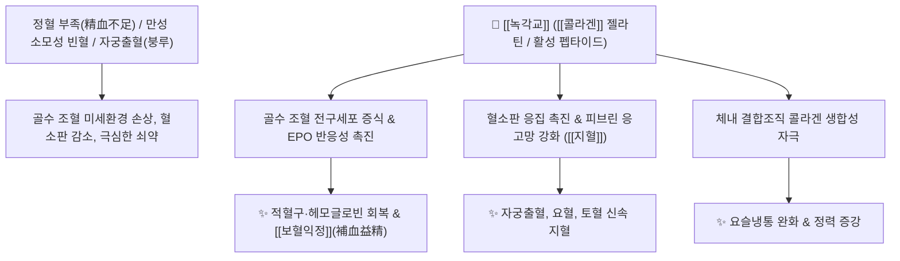

# 🌿 [[녹각교]] (鹿角膠, Cervi Cornus Colla)

> **핵심 요약 (Key Summary)**:
> 사슴과 매화록 또는 마록의 [[녹각]](鹿角)을 절단하여 물로 오랜 시간 끓여 추출·농축하여 만든 순수한 아교질(Gelatin) 덩어리입니다. 고순도 [[콜라겐]] 단백질과 필수 아미노산, 펩타이드 성분이 골수 조혈 작용을 자극하고 혈관 투과성을 억제하여 강력한 지혈 및 보혈 효과를 발휘합니다. [[녹용]]보다는 보하는 힘이 완만하나 [[녹각]]보다 보신(補腎)·자양 효능이 훨씬 우수합니다. 한의학적으로 [[보혈익정]](補血益精), [[보신양]](補腎陽), [[지혈안태]](止血安胎)의 명약으로 허로(虛勞) 쇠약, 요슬산통, 만성 빈혈, 자궁출혈(붕루) 및 요혈을 치료합니다.

---
## 📌 목차
1. [기본 본초 정보 & 화학 구조 (Pharmacognosy)](#1-기본-본초-정보--화학-구조-pharmacognosy)
2. [핵심 분자약리 기전 & 조혈·지혈 대사 네트워크](#2-핵심-분자약리-기전--조혈지혈-대사-네트워크)
3. [본초 감별: 사슴 뿔 제제 4대 효능 서열 비교](#3-본초-감별-사슴-뿔-제제-4대-효능-서열-비교)
4. [사상의학 및 체질별 임상 응용 (적응증 vs 금기)](#4-사상의학-및-체질별-임상-응용-적응증-vs-금기)
5. [배오 원리 및 한의학적 고찰 (유래와 특징)](#5-배오-원리-및-한의학적-고찰-유래와-특징)
6. [핵심 처방 비교 매트릭스](#6-핵심-처방-비교-매트릭스)
7. [출처 및 학술 참고 문헌 (References)](#7-출처-및-학술-참고-문헌-references)

---
## 1. 기본 본초 정보 & 화학 구조 (Pharmacognosy)

| 항목 | 상세 내용 |
| :--- | :--- |
| **기원 동물** | 사슴과(Cervidae) 매화록 *Cervus nippon* Temminck 또는 마록 *Cervus elaphus* L.의 골질화된 뿔을 절단하여 물로 끓여서 농축하여 만든 아교질 덩어리 (Cervi Cornus Colla) |
| **성미 (性味)** | 甘·鹹, 溫 |
| **귀경 (歸經)** | 肝·腎經 (간경, 신경) |
| **효능 (Actions)** | [[보신양]](補腎陽), [[보혈익정]](補血益精), [[지혈]](止血), [[안태]](安胎) |
| **주요 성분** | • [[아교질]] 젤라틴(Gelatin, 약 80% 이상): Type I [[콜라겐]], Glycine, Proline, Hydroxyproline, Glutamic acid<br>• 미네랄: 칼슘, 인, 마그네슘, 아연<br>• 생리활성 펩타이드: Deer antler bioactive peptides |

---
## 2. 핵심 분자약리 기전 & 조혈·지혈 대사 네트워크



### (1) 조혈 촉진 및 보혈 작용
* **골수 조혈계 증강**:
  * 아교질 아미노산과 펩타이드가 골수 조혈 미세환경을 복구하여 적혈구와 혈색소(Hb) 수치를 빠르게 상승시킵니다.
* **수렴성 지혈 및 안태 (止血安胎)**:
  * 모세혈관의 투과성을 안정시키고 혈액 응고를 도와 부인과 자궁 부정출혈(붕루), 혈뇨, 변혈을 멎게 합니다.

---
## 3. 본초 감별: 사슴 뿔 제제 4대 효능 서열 비교

```
[👑 보신양(補腎陽) 및 정혈(精血) 보익력 공식 서열]
鹿茸 (녹용)  >  鹿角膠 (녹각교)  >  鹿角 (녹각)  >  鹿角霜 (녹각상)

• [[녹용]]: 양기와 정혈을 폭발적으로 북돋우는 보양약의 으뜸.
• [[녹각교]]: 녹각을 농축하여 보혈, 익정, 지혈력이 매우 뛰어난 순수 아교 제제.
• [[녹각]]: 칼슘 무기질 중심의 강근골 및 활혈 산어 소종.
• [[녹각상]]: 교질이 빠져나가 보신력은 약하나 비위를 상하지 않고 수렴 지혈.
```

---
## 4. 사상의학 및 체질별 임상 응용 (적응증 vs 금기)

```
[✅ 최적 적응증 (Sweet Spot)]
• 만성 피로와 정혈 부족으로 인한 빈혈, 안색 창백, 어지럼증, 요슬산통
• 부인과 만성 붕루(자궁출혈), 생리과다, 임신 중 복통 및 절박유산
• 노인성 골다공증, 정력 감퇴, 양위(발기부전)

[⚠️ 신중 투여 및 금기 (Caution / Contraindication)]
• 음허화왕(陰虛火旺)으로 몸에 열이 많고 갈증이 심한 환자
• 비위습체(脾胃濕滯)로 소화가 잘 안 되고 설태가 두꺼운 경우
```

---
## 5. 배오 원리 및 한의학적 고찰 (유래와 특징)

### (1) 유래 및 본초 성질
* 녹각을 오랜 시간 푹 고아 농축해 굳힌 것으로, 약성이 녹각보다 부드럽고 몸에 깊숙이 흡수되어 정혈(精血)을 채워주는 귀한 보약입니다.

### (2) 핵심 약재 배오
* [[녹각교]] + [[숙지황]] / [[구기자]]: 정수(精髓)와 혈액을 채우는 최고 배오 ([[우귀환]]).
* [[녹각교]] + [[아교]] / [[애엽]]: 부인과 만성 자궁출혈과 절박유산을 다스리는 지혈안태 배오.

---
## 6. 핵심 처방 비교 매트릭스

| 처방명 | 구성 약재 | 주치 병증 및 임상 타깃 | 특징 및 감별점 |
| :--- | :--- | :--- | :--- |
| [[녹각교환]] | [[녹각교]], [[숙지황]], [[당귀]], [[산약]], [[백출]] 등 | **신양허약, 정혈 부족, 허리·다리 무력, 만성 피로** | 정혈을 보하고 양기를 돋움 |
| [[우귀환]] | [[숙지황]], [[산약]], [[산수유]], [[구기자]], [[녹각교]], [[육계]], [[부자]] 등 | **신양부족, 명문화쇠, 사지냉통, 양위, 유정** | 신양과 신음을 동시에 보익 |
| [[귀록이선교]] | [[녹각교]], [[구판교]](구판), [[인삼]], [[구기자]] | **기혈음양 모두 부족, 극심한 노화성 쇠약** | 음과 양을 쌍보하는 최고급 자양방 |

---
## 7. 출처 및 학술 참고 문헌 (References)

1. **Wang, J. X., et al. (2013)**. Cervi Cornus Colla stimulates hematopoiesis and osteogenesis in myelosuppressed and osteopenic animal models. *Journal of Ethnopharmacology*, 148(3), 890-896.
   - **[연구 요약]**: 녹각교의 활성 펩타이드 성분이 골수 조혈 줄기세포의 증식을 자극하고 골밀도를 유의하게 향상시킴을 입증.
2. **대한민국약전(KP) 제12개정 (2022)**. 의약품각조 제2부: 녹각교 (Cervi Cornus Colla) 규격 기준.
   - **[공정서 규격]**: 질소 함량 13.0% 이상 및 건조감량, 순도시험 명시.
