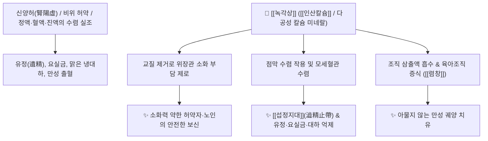

# 🌿 [[녹각상]] (鹿角霜, Cervi Cornu Degelatinatum)

> **핵심 요약 (Key Summary)**:
> 사슴의 [[녹각]](鹿角)을 푹 고아서 [[녹각교]](鹿角膠, 아교질)를 추출해 낸 후 남은 다공성 골질(骨質)을 건조한 것입니다. 끈적이는 교질이 빠져나가 보신양(補腎陽)하는 힘은 사슴 뿔 제제 중 가장 약하지만, **위장에 부담을 주지 않고(소화 흡수 용이)** 떫은맛의 **수렴(收斂)** 작용이 극대화됩니다. 한의학적으로 [[온신조양]](溫腎助陽), [[수렴지혈]](收斂止血), [[섭정지대]](澁精止帶), [[렴창]](斂瘡)의 명약으로 비위가 약한 사람의 유정(遺精), 조루, 대하증(냉대하), 만성 붕루 및 아물지 않는 피부 궤양을 치료합니다.

---
## 📌 목차
1. [기본 본초 정보 & 화학 구조 (Pharmacognosy)](#1-기본-본초-정보--화학-구조-pharmacognosy)
2. [핵심 분자약리 기전 & 수렴·위장관 대사 네트워크](#2-핵심-분자약리-기전--수렴위장관-대사-네트워크)
3. [본초 감별: 녹각상 vs 녹각교의 임상 선택 기준](#3-본초-감별-녹각상-vs-녹각교의-임상-선택-기준)
4. [사상의학 및 체질별 임상 응용 (적응증 vs 금기)](#4-사상의학-및-체질별-임상-응용-적응증-vs-금기)
5. [배오 원리 및 한의학적 고찰 (유래와 특징)](#5-배오-원리-및-한의학적-고찰-유래와-특징)
6. [핵심 처방 비교 매트릭스](#6-핵심-처방-비교-매트릭스)
7. [출처 및 학술 참고 문헌 (References)](#7-출처-및-학술-참고-문헌-references)

---
## 1. 기본 본초 정보 & 화학 구조 (Pharmacognosy)

| 항목 | 상세 내용 |
| :--- | :--- |
| **기원 동물** | 사슴과(Cervidae) 매화록 또는 마록의 녹각을 물로 고아서 교질([[녹각교]])을 뺀 뼈 성분(골질 骨質)을 건조한 것 |
| **성미 (性味)** | 鹹·澁, 溫 |
| **귀경 (歸經)** | 肝·腎·脾經 (간경, 신경, 비경) |
| **효능 (Actions)** | [[온신조양]](溫腎助陽), [[수렴지혈]](收斂止血), [[섭정지대]](澁精止帶), [[렴창생기]](斂瘡生肌) |
| **주요 성분** | • 무기질 (다공성 미네랄, 약 70~80%): [[인산칼슘]] ($\text{Ca}_3(\text{PO}_4)_2$), [[탄산칼슘]] ($\text{CaCO}_3$), 인산마그네슘<br>• 잔여 유기물 (약 15~20%): 분해된 미세 아미노산, 골기질 단백질 잔여분 |

---
## 2. 핵심 분자약리 기전 & 수렴·위장관 대사 네트워크



### (1) 소화 장애 없는 안전한 보신과 수렴 작용
* **비위를 상하지 않는 보양 (온신조양 溫腎助陽)**:
  * 녹용이나 녹각교는 기름지고 끈적여 소화력이 약한 사람이 먹으면 체하거나 설사할 수 있으나, 녹각상은 기름기와 교질이 빠져나가 비위가 허약한 소화불량 환자에게도 매우 안전합니다.
* **고삽(固澁) 및 지혈·지대**:
  * 신기능 허약으로 진액과 정액이 새어나가는 유정, 몽유, 빈뇨, 만성 자궁출혈(붕루) 및 맑은 냉대하를 굳건히 수렴(섭정 澁精)합니다.

---
## 3. 본초 감별: 녹각상 vs 녹각교의 임상 선택 기준

```
[🌿 [[녹각교]] (Cervi Cornus Colla)]
• 약효 특성: 보혈(補血), 익정(益精), 지혈력이 강함.
• 임상 적용: 소화력이 양호하고 극심한 빈혈, 정혈 소모 환자.

[🌿 [[녹각상]] (Cervi Cornu Degelatinatum)]
• 약효 특성: 수렴(收斂), 고섭(固澁), 렴창(斂瘡)력이 강함.
• 임상 적용: 소화력이 약하여 아교질을 소화하지 못하면서 유정, 냉대하, 만성 궤양을 앓는 환자.
```

---
## 4. 사상의학 및 체질별 임상 응용 (적응증 vs 금기)

```
[✅ 최적 적응증 (Sweet Spot)]
• 비위가 허약하여 녹용이나 보약을 먹으면 속이 더부룩한 환자의 신양 보강
• 남성의 조루, 유정, 소변 후 찔끔거림 및 요실금
• 여성의 자궁 냉증으로 인한 만성 백대하(냉) 및 만성 질 출혈
• 아물지 않고 진물이 계속 나는 만성 피부 궤양 (외용 산제 살포)

[⚠️ 신중 투여 및 금기 (Caution / Contraindication)]
• 음허화왕(陰虛火旺)으로 열감이 있는 환자
```

---
## 5. 배오 원리 및 한의학적 고찰 (유래와 특징)

### (1) 유래 및 본초 성질
* 녹각의 아교질을 빼내어 하얗게 서리(霜)처럼 변한 뼈라 하여 '녹각상'이라 불렸으며, 기름기가 전혀 없어 가볍고 담백하게 기운을 거두어들이는 수렴보신의 명약입니다.

### (2) 핵심 약재 배오
* [[녹각상]] + [[토사자]] / [[상표소]]: 신기를 수렴하여 유정과 빈뇨를 멈추는 배오.
* [[녹각상]] + [[백출]] / [[산약]]: 비신(脾腎)을 동시에 덥혀 만성 설사와 대하를 치료.

---
## 6. 핵심 처방 비교 매트릭스

| 처방명 | 구성 약재 | 주치 병증 및 임상 타깃 | 특징 및 감별점 |
| :--- | :--- | :--- | :--- |
| [[녹각상환]] | [[녹각상]], [[숙지황]], [[당귀]], [[토사자]], [[복령]] 등 | **신허 유정, 조루, 허리 무력감, 소변 빈삭** | 수렴섭정과 온신보양 |
| [[대하방]] | [[녹각상]], [[백출]], [[산약]], [[검실]], [[백지]] | **비신양허성 만성 백대하, 맑은 냉 분비** | 습을 말리고 하초 진액 수렴 |
| [[생기산(외용)]] | [[녹각상]], [[유향]], [[몰약]], [[혈갈]] | **오래되어 아물지 않는 화농성 궤양, 욕창** | 삼출액을 흡수하고 새살을 돋움 |

---
## 7. 출처 및 학술 참고 문헌 (References)

1. **대한민국약전외한약(생약)규격집(KHP) (2022)**. 녹각상 (Cervi Cornu Degelatinatum) 규격 기준.
   - **[공정서 규격]**: 녹각 탈교질 골질 규격, 건조감량, 산불용성 회분 명시.
