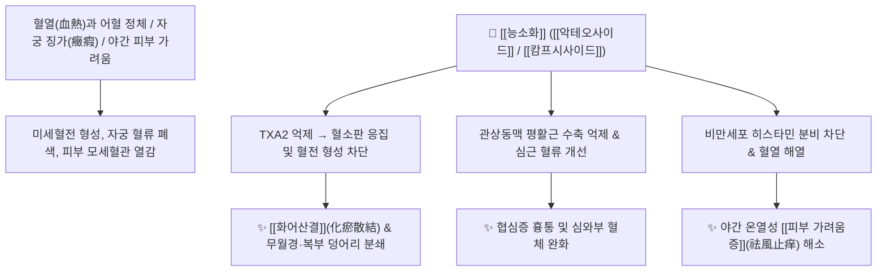

# 🌿 [[능소화]] (凌霄花, Campsis Flos)

> **핵심 요약 (Key Summary)**:
> 능소화과 능소화(*Campsis grandiflora*) 또는 미국능소화(*Campsis radicans*)의 꽃으로, "능히 피의 불(血熱)을 끄고 소화시킨다"는 이름의 유래처럼 혈분의 숨은 화열(火熱)을 내리고 굳은 피를 깨뜨리는 파혈약입니다. [[악테오사이드]](Acteoside), [[캄프시사이드]](Campsiside), [[아피제닌]](Apigenin) 성분이 혈전 형성을 억제하고 관상동맥을 확장하며 자궁 평활근 수축을 유도합니다. 한의학적으로 [[화어산결]](化瘀散結), [[청열량혈]](淸熱涼血), [[거풍지양]](祛風止痒)의 명약으로 어혈성 무월경, 자궁근종(징가), 자궁출혈 및 야간에 몸을 따뜻하게 하면 심해지는 혈열성 피부 가려움증을 치료합니다.

---
## 📌 목차
1. [기본 본초 정보 & 화학 구조 (Pharmacognosy)](#1-기본-본초-정보--화학-구조-pharmacognosy)
2. [핵심 분자약리 기전 & 혈전·혈관 대사 네트워크](#2-핵심-분자약리-기전--혈전혈관-대사-네트워크)
3. [해부생체역학 / 자궁 근층 & 피부 모세혈관 연계](#3-해부생체역학--자궁-근층--피부-모세혈관-연계)
4. [사상의학 및 체질별 임상 응용 (적응증 vs 금기)](#4-사상의학-및-체질별-임상-응용-적응증-vs-금기)
5. [배오 원리 및 한의학적 고찰 (유래와 특징)](#5-배오-원리-및-한의학적-고찰-유래와-특징)
6. [핵심 처방 비교 매트릭스](#6-핵심-처방-비교-매트릭스)
7. [출처 및 학술 참고 문헌 (References)](#7-출처-및-학술-참고-문헌-references)

---
## 1. 기본 본초 정보 & 화학 구조 (Pharmacognosy)

| 항목 | 상세 내용 |
| :--- | :--- |
| **기원 식물** | 능소화과(Bignoniaceae ; 紫葳科) 갈잎덩굴성식물인 능소화 *Campsis grandiflora* (Thunb.) K.Schum. 또는 미국능소화 *Campsis radicans* (L.) Seem.의 꽃 (Campsis Flos) |
| **성미 (性味)** | 辛·酸, 微寒 |
| **귀경 (歸經)** | 肝·心包經 (간경, 심포경) |
| **효능 (Actions)** | [[화어산결]](化瘀散結), [[청열량혈]](淸熱涼血), [[거풍지양]](祛風止痒), [[통경활혈]](通經活血) |
| **주요 성분** | • [[페닐에타노이드]] 배당체: [[악테오사이드]] (Acteoside / Verbascoside), Campneoside I, II<br>• 모노테르펜 및 이리도이드: [[캄프시사이드]] (Campsiside), 5-Hydroxycampethecin<br>• 플라보노이드 및 유기산: [[아피제닌]] (Apigenin), Luteolin, Caffeic acid |

---
## 2. 핵심 분자약리 기전 & 혈전·혈관 대사 네트워크



### (1) 혈전 용해 및 관상동맥 순환 개선
* **파혈 및 항혈전 작용**:
  * 혈소판 응집을 강력히 억제하고 혈전을 용해시켜, 굳어있는 어혈(瘀血)을 삭이고 혈관을 통하게 합니다.
  * 관상동맥 평활근 연축을 억제하여 심근 허혈과 흉통을 완화합니다.
* **혈열(血熱) 해열 및 피부 소양 억제 ([[지양]] 止痒)**:
  * 혈분(血分)의 숨은 화열을 꺼주어, 밤에 이불을 덮고 몸을 따뜻하게 하면 몸이 불타듯 가려워지는 혈열성 피부 소양증, 풍진, 두드러기를 치료합니다.

---
## 3. 해부생체역학 / 자궁 근층 & 피부 모세혈관 연계

* **자궁 평활근 수축 유도**:
  * 자궁 근층의 수축 리듬을 자극하여 자궁 내 정체된 혈괴와 찌꺼기를 밀어내므로, 산후 어혈 정체와 무월경을 치료합니다.

---
## 4. 사상의학 및 체질별 임상 응용 (적응증 vs 금기)

```
[✅ 최적 적응증 (Sweet Spot)]
• 어혈성 부인과 질환: 월경폐색(무월경), 자궁근종, 하복부 찌르는 듯한 생리통
• 밤에 따뜻하게 데우면 더욱 심해지는 혈열성 피부 가려움증, 두드러기
• 타박상으로 인한 피하 어혈 멍울, 혈열성 여드름 및 주사비

[⚠️ 절대 금기 (Contraindication)]
• 임산부 (자궁 수축을 유발하여 유산 위험이 있으므로 절대 복용 금지)
• 기혈이 극도로 쇠약한 허약자 (파혈 작용이 강하므로 신중 투여)
```

---
## 5. 배오 원리 및 한의학적 고찰 (유래와 특징)

### (1) 유래 및 본초 성질
* **능히 불을 끈다(凌霄)**: 붉고 화려한 꽃잎이 혈액 속의 열화(血熱)를 능히 꺼주고(消火) 혈액 순환을 소통시키며 통증을 멎게 한다는 의미를 담고 있습니다.

### (2) 핵심 약재 배오
* [[능소화]] + [[당귀]] / [[홍화]]: 어혈성 무월경과 생리통을 치료하는 파어 배오.
* [[능소화]] + [[지모]] / [[황백]]: 야간 혈열성 피부 가려움증을 치료하는 량혈 배오.

---
## 6. 핵심 처방 비교 매트릭스

| 처방명 | 구성 약재 | 주치 병증 및 임상 타깃 | 특징 및 감별점 |
| :--- | :--- | :--- | :--- |
| [[능소화산]] | [[능소화]], [[당귀]], [[적작약]], [[홍화]] | **부인 어혈 무월경, 징가적취, 복부 찌르는 통증** | 파혈산결의 대표 처방 |
| [[자위탕]] | [[능소화]], [[생지황]], [[목단피]], [[적복령]] | **혈열성 피부 발진, 가려움증, 야간 소양증** | 량혈청열과 거풍지양 |
| [[대황자충환(가미)]] | [[대황자충환]] + [[능소화]] | **만성 간경변 어혈, 복부 종괴, 피부 갑착** | 완고한 체내 건혈을 삭임 |

---
## 7. 출처 및 학술 참고 문헌 (References)

1. **Kim, D. H., et al. (2005)**. Anti-thrombotic and anti-inflammatory activities of acteoside from *Campsis grandiflora*. *Biological and Pharmaceutical Bulletin*, 28(12), 2244-2248.
   - **[연구 요약]**: 능소화의 [[악테오사이드]] 성분이 혈소판 응집을 유의하게 억제하고 혈관 내피 염증을 차단하여 항혈전 및 활혈 효능을 나타냄을 입증.
2. **대한민국약전(KP) 제12개정 (2022)**. 의약품각조 제2부: 능소화 (Campsis Flos) 규격 기준.
   - **[공정서 규격]**: 능소화 꽃 규격, 건조감량, 회분 및 순도시험 명시.
