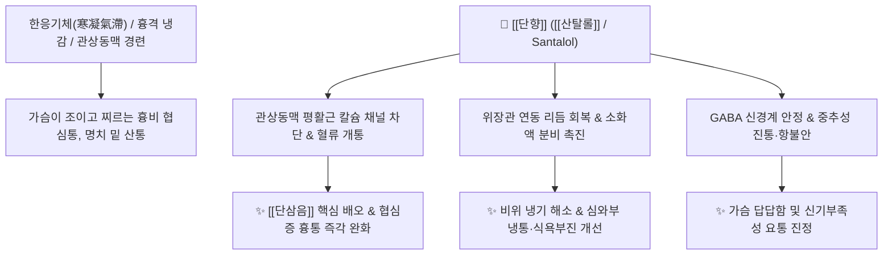

# 🌿 [[단향]] / [[백단향]] (檀香 / 白檀香, Santali Albi Lignum)

> **핵심 요약 (Key Summary)**:
> 단향과 백단나무(*Santalum album*)의 줄기 심재(心材)로, 매우 그윽하고 맑은 향기를 지닌 대표적인 방향성 귀경약입니다. 세스퀴테르펜 성분인 $\alpha,\beta$-[[산탈롤]](Santalol)이 풍부하여 관상동맥과 소화관 평활근의 연축을 풀고 중추신경을 진정시킵니다. [[목향]](木香)과 유사하게 비위의 차가운 기체를 풀어주면서도, 상초 흉격(가슴)의 냉기와 혈어(血瘀)를 뚫어주는 데 특화되어 있습니다. 한의학적으로 [[행기온중]](行氣溫中), [[개위지통]](開胃止痛), [[산한지통]](散寒止痛)의 명약으로 흉비 협심증, 심와부 냉통, 식욕 부진 및 신기부족 요통을 치료합니다.

---
## 📌 목차
1. [기본 본초 정보 & 화학 구조 (Pharmacognosy)](#1-기본-본초-정보--화학-구조-pharmacognosy)
2. [핵심 분자약리 기전 & 관상동맥·소화관 대사 네트워크](#2-핵심-분자약리-기전--관상동맥소화관-대사-네트워크)
3. [본초 감별: 단향 vs 침향 vs 목향](#3-본초-감별-단향-vs-침향-vs-목향)
4. [사상의학 및 체질별 임상 응용 (적응증 vs 금기)](#4-사상의학-및-체질별-임상-응용-적응증-vs-금기)
5. [배오 원리 및 한의학적 고찰 (유래와 특징)](#5-배오-원리-및-한의학적-고찰-유래와-특징)
6. [핵심 처방 비교 매트릭스](#6-핵심-처방-비교-매트릭스)
7. [출처 및 학술 참고 문헌 (References)](#7-출처-및-학술-참고-문헌-references)

---
## 1. 기본 본초 정보 & 화학 구조 (Pharmacognosy)

| 항목 | 상세 내용 |
| :--- | :--- |
| **기원 식물** | 단향과(Santalaceae) 백단나무 *Santalum album* L.의 줄기 중심부 심재(心材, Heartwood) |
| **성미 (性味)** | 辛, 溫 |
| **귀경 (歸經)** | 脾·胃·心·肺經 (비경, 위경, 심경, 폐경) |
| **효능 (Actions)** | [[행기온중]](行氣溫中), [[개위지통]](開胃止痛), [[산한지통]](散寒止痛), [[통규안신]](通竅安神) |
| **주요 성분** | • [[세스퀴테르펜 알코올]] (정유의 약 90% 이상): $\alpha$-[[산탈롤]] ($\alpha$-Santalol), $\beta$-[[산탈롤]] ($\beta$-Santalol), $\alpha,\beta$-Santalene<br>• 탄닌 및 수지: Santalin, Santalol derivatives |

---
## 2. 핵심 분자약리 기전 & 관상동맥·소화관 대사 네트워크



### (1) 관상동맥 확장 및 협심증 진통 작용
* **심장 및 흉격 기체 해소**:
  * 향기 성분인 [[산탈롤]]이 혈관 및 소화관 평활근의 비정상적 연축을 신속히 풀어주어, 가슴이 조여오는 협심증(흉비)과 차가운 기운으로 인한 위통을 멎게 합니다.
* **소화 촉진 및 온중 (開胃止痛)**:
  * 냉기를 몰아내고 위기(胃氣)를 북돋워 소화를 돕고, 풍열로 인한 부스럼이나 신기 부족으로 인한 허리 통증을 완화합니다.

---
## 3. 본초 감별: 단향 vs 침향 vs 목향

```
[🌿 [[단향]] (Santali Albi Lignum)]
• 귀경 및 작용: 주로 흉격(상초)과 위완(중초)에 작용하여 차가운 기운을 흩뜨리고 심와부 통증을 멎게 함.

[🌿 [[침향]] (Aquilariae Lignum)]
• 귀경 및 작용: 신(하초)으로 기운을 끌어내리는 강기(降氣) 작용이 으뜸으로, 신불납기성 천식과 하복부 냉통에 특화.

[🌿 [[목향]] (Aucklandiae Radix)]
• 귀경 및 작용: 비위와 대장(중·하초)의 기체를 통하게 하여 복통, 설사, 뒤무직(이급후중)을 풂.
```

---
## 4. 사상의학 및 체질별 임상 응용 (적응증 vs 금기)

```
[✅ 최적 적응증 (Sweet Spot)]
• 심장 및 위장의 기체(氣滯): 가슴이 뻐근하게 조여오고 명치가 차갑고 아프며 트림이 나는 경우
• 한랭성 소화불량, 헛배부름, 구토, 신기부족성 요통
• 신경성 스트레스로 인한 흉민(가슴 답답함)

[⚠️ 신중 투여 및 금기 (Caution / Contraindication)]
• 음허화왕(陰虛火旺) 및 혈열(血熱) 환자
```

---
## 5. 배오 원리 및 한의학적 고찰 (유래와 특징)

### (1) 핵심 약재 배오
* [[단향]] + [[단삼]] / [[사인]]: 혈어와 기체를 동시에 뚫어 협심증과 심와부 통증을 치료하는 황금 배오 ([[단삼음]]).
* [[단향]] + [[목향]] / [[침향]]: 상·중·하초의 기체를 전면적으로 뚫어주는 배오.

---
## 6. 핵심 처방 비교 매트릭스

| 처방명 | 구성 약재 | 주치 병증 및 임상 타깃 | 특징 및 감별점 |
| :--- | :--- | :--- | :--- |
| [[단삼음]] | [[단삼]], [[단향]], [[사인]] | **혈어기체, 심통, 협심증, 위완통** | 심장과 위장의 혈어기체를 푸는 명방 |
| [[침향강기산(가미)]] | [[침향]], [[단향]], [[소엽]], [[감초]] 등 | **기체로 인한 흉격창만, 딸꾹질, 호흡 곤란** | 방향성 행기강기의 대표 처방 |
| [[백단향산]] | [[백단향]], [[정향]], [[육계]], [[건강]] | **극심한 비위 냉통, 곽란 구토, 사지냉감** | 온중산한과 지통 |

---
## 7. 출처 및 학술 참고 문헌 (References)

1. **Guo, F. L., et al. (2013)**. Chemical composition and cardioprotective effects of *Santalum album* essential oil. *Phytomedicine*, 20(12), 1045-1051.
   - **[연구 요약]**: 단향의 $\alpha,\beta$-[[산탈롤]] 성분이 관상동맥 평활근 이완 및 심근 허혈 재관류 손상을 억제함을 규명.
2. **대한민국약전외한약(생약)규격집(KHP) (2022)**. 백단향 (Santali Albi Lignum) 규격 기준.
   - **[공정서 규격]**: 정유 함량 및 $\alpha,\beta$-산탈롤 규격 명시.
