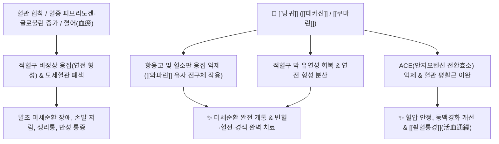

# 🌿 [[당귀]] (當歸, Angelicae Gigantis / Sinensis Radix)

> **핵심 요약 (Key Summary)**:
> 산형과 참당귀(*Angelica gigas*, 토당귀) 또는 중국당귀(*Angelica sinensis*), 일당귀(*Angelica acutiloba*)의 뿌리로, 한의학에서 "피를 생성하고(補血) 피를 돌게 하는(活血)" 부인과 및 혈액 질환의 제1 성약(聖藥)입니다. 쿠마린 유도체인 [[데커신]](Decursin)과 [[데커시놀 안젤레이트]](Decursinol angelate), [[리구스틸라이드]](Ligustilide), [[팔카린디올]](Falcarindiol) 성분이 적혈구 연전(뭉침) 현상을 차단하고 ACE를 억제하여 미세순환을 개선하며, 강력한 진통, 항종양(폐암 전이 억제) 및 조혈 촉진 작용을 발휘합니다.

---
## 📌 목차
1. [기본 본초 정보 & 화학 구조 (Pharmacognosy)](#1-기본-본초-정보--화학-구조-pharmacognosy)
2. [핵심 분자약리 기전 ①: 데커신의 미세순환 개통 & 활혈통경(ACE 억제)](#2-핵심-분자약리-기전--데커신의-미세순환-개통--활혈통경ace-억제)
3. [핵심 분자약리 기전 ②: 팔카린디올 진통 & 데커신의 항종양/폐암 전이 억제](#3-핵심-분자약리-기전--팔카린디올-진통--데커신의-항종양폐암-전이-억제)
4. [본초 감별: 참당귀(토당귀) vs 일당귀/중국당귀 & 부위별(당귀두·신·미) 효능](#4-본초-감별-참당귀토당귀-vs-일당귀중국당귀--부위별당귀두신미-효능)
5. [사상의학 및 체질별 임상 응용 (적응증 vs 금기)](#5-사상의학-및-체질별-임상-응용-적응증-vs-금기)
6. [핵심 처방 비교 매트릭스](#6-핵심-처방-비교-매트릭스)
7. [출처 및 학술 참고 문헌 (References)](#7-출처-및-학술-참고-문헌-references)

---
## 1. 기본 본초 정보 & 화학 구조 (Pharmacognosy)

| 항목 | 상세 내용 |
| :--- | :--- |
| **기원 식물** | 산형과(Apiaceae ; Umbelliferae) 참당귀 *Angelica gigas* Nakai (한국 참당귀) 또는 중국당귀 *Angelica sinensis* (Oliv.) Diels, 일당귀 *Angelica acutiloba* (Siebold & Zucc.) Kitag.의 뿌리 |
| **성미 (性味)** | 甘·辛, 溫 |
| **귀경 (歸經)** | 肝·心·脾經 (간경, 심경, 비경) |
| **효능 (Actions)** | [[보혈조경]](補血調經), [[활혈지통]](活血止痛), [[윤장통변]](潤腸通便), [[생기소종]](生肌消腫) |
| **주요 성분** | • [[피라노쿠마린]] (KP [[데커신]]+[[데커시놀 안젤레이트]] $\ge 6.0\%$): [[데커신]] (Decursin), [[데커시놀 안젤레이트]] (Decursinol angelate), [[노다케닌]] (Nodakenin)<br>• [[프탈라이드]] 및 페놀산: [[리구스틸라이드]] (Ligustilide), [[페룰산]] (Ferulic acid)<br>• 폴리아세틸렌계: [[팔카린디올]] (Falcarindiol), Falcarinol |

---
## 2. 핵심 분자약리 기전 ①: 데커신의 미세순환 개통 & 활혈통경(ACE 억제)



### (1) 적혈구 응집 해소와 미세순환 개통
* **항응고 및 혈류 개선**:
  * 혈관이 좁아지고 혈중 피브리노겐 및 글로불린이 증가하면 적혈구가 엽전처럼 뭉치는 연전 현상(Rouleaux formation)이 일어나 모세혈관 순환 장애를 유발합니다.
  * 당귀의 [[데커신]]과 쿠마린 유도체는 혈소판 응집과 혈액 응고를 억제하여 미세 혈류를 원활히 개통시킵니다.
* **ACE 억제 및 혈관 확장**:
  * 안지오텐신 전환효소([[ACE]])를 억제하여 혈관을 확장시키고 혈압을 안정시키며 동맥경화를 예방합니다.

![[Pasted image 20240227142825.png|450]]
> **[당귀의 미세순환 개선 및 혈소판 응집 억제도]**: 데커신에 의한 적혈구 연전 분산 및 활혈통경 경로.

---
## 3. 핵심 분자약리 기전 ②: 팔카린디올 진통 & 데커신의 항종양/폐암 전이 억제

* **폴리아세틸렌계의 진통 작용**:
  * [[팔카린디올]](Falcarindiol)과 Falcarinol 성분이 중추 및 말초 통각 전달 경로를 차단하여 신경통, 근육통, 생리통을 완화합니다.
* **항종양 및 폐암 전이 억제**:
  * [[데커신]]은 암세포의 혈관신생(VEGF)을 차단하고 폐암 등 전이성 종양의 침습을 억제하는 항암 보조 활성을 지닙니다.
  * 항산화, 항알레르기, 항당뇨 활성을 함께 발휘합니다.

---
## 4. 본초 감별: 참당귀(토당귀) vs 일당귀/중국당귀 & 부위별(당귀두·신·미) 효능

### (1) 기원별 특화 약효
* [[참당귀]] (Angelica gigas, 한국 토당귀): [[데커신]] 함량이 압도적으로 높아 활혈거어(活血祛瘀), 통경지통(止痛), 항암 작용 최강.
* [[중국당귀]] / [[일당귀]]: [[리구스틸라이드]]와 정유 함량이 높아 **보혈(補血), 윤장(潤腸)** 작용 우수.

### (2) 부위별 효능 분화
* [[당귀두]](當歸頭, 머리 부위): 지혈(止血) 및 상행(上行).
* [[당귀신]](當歸身, 몸통 부위): 순수한 보혈(補血) 및 양혈(養血).
* [[당귀미]](當歸尾, 잔뿌리 부위): 굳은 피를 깨뜨리는 파혈(破血) 및 활혈(活血).
* **전당귀(全當歸, 전체 사용)**: 보혈과 활혈을 겸비한 화혈(和血).

---
## 5. 사상의학 및 체질별 임상 응용 (적응증 vs 금기)

```
[✅ 최적 적응증 (Sweet Spot)]
• 혈허(血虛) 및 어혈: 안색이 창백하고 입술이 마르며, 손발이 저리고 생리통이 심한 여성
• 산후 어혈 복통, 빈혈, 뇌경색 후유증, 수족냉증
• 노인성 혈허 장조변비 (장이 말라 변이 단단한 경우)

[⚠️ 신중 투여 및 금기 (Caution / Contraindication)]
• 습담(濕痰)이 많아 평소 속이 더부룩하고 무른 변이나 설사를 자주 하는 환자
• 출혈성 질환 급성기
```

---
## 6. 핵심 처방 비교 매트릭스

| 처방명 | 구성 약재 | 주치 병증 및 임상 타깃 | 특징 및 감별점 |
| :--- | :--- | :--- | :--- |
| [[사물탕]] | [[당귀]], [[숙지황]], [[백작약]], [[천궁]] | **일체 혈허증, 월경불순, 어지럼증, 안구 건조** | 보혈(補血)의 제1 기본 처방 |
| [[당귀보혈탕]] | [[황기]](배량 5 : 1), [[당귀]] | **극심한 기혈 소모, 과다 출혈 후 미열, 만성 피로** | 기운을 돋워 피를 생성하는 명방 |
| [[당귀수산]] | [[당귀미]], [[적작약]], [[도인]], [[홍화]], [[소목]] 등 | **타박상 어혈, 염좌 부종, 극심한 국소 자통** | 타박 어혈을 깨뜨리는 외상과 제1방 |

---
## 7. 출처 및 학술 참고 문헌 (References)

1. **Lee, S., et al. (2003)**. Decursin and decursinol angelate from *Angelica gigas* inhibit angiogenesis and tumor metastasis. *Cancer Letters*, 198(1), 39-47.
   - **[연구 요약]**: 참당귀의 [[데커신]]이 혈관 신생 및 암세포 침습을 차단하여 폐암 전이를 현저히 억제함을 규명.
2. **대한민국약전(KP) 제12개정 (2022)**. 의약품각조 제2부: 당귀 (Angelicae Gigantis Radix) 규격 기준.
   - **[공정서 규격]**: 데커신 및 데커시놀안젤레이트 합계 6.0% 이상 함유 규격 명시.