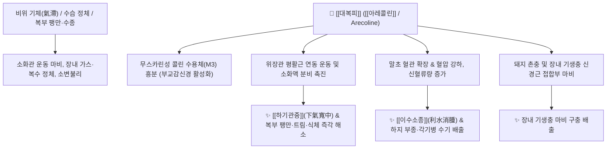

# 🌿 [[대복피]] (大腹皮, Arecae Pericarpium)

> **핵심 요약 (Key Summary)**:
> 야자과 빈랑나무(*Areca catechu*)의 열매껍질(과피)로, 배가 남산만하게 부른 복부 팽만(大腹)을 홀쭉하게 꺼뜨린다는 이수하기약입니다. 피페리딘계 알칼로이드인 [[아레콜린]](Arecoline) 성분이 무스카린성 콜린 수용체($\text{M}_3$)를 흥분시켜 부교감신경을 자극함으로써 침 분비와 위장관 평활근 연동 운동을 강력히 촉진하고 혈관을 확장시켜 혈압을 낮춥니다. 한의학적으로 [[하기관중]](下氣寬中), [[이수소종]](利水消腫)의 명약으로 습저기체(濕沮氣滯)로 인한 복부 팽만, 소화불량, 수종(부종), 각기병 및 장내 기생충 마비 구충을 치료합니다.

---
## 📌 목차
1. [기본 본초 정보 & 화학 구조 (Pharmacognosy)](#1-기본-본초-정보--화학-구조-pharmacognosy)
2. [핵심 분자약리 기전 & 콜린성 부교감·소화관 대사 네트워크](#2-핵심-분자약리-기전--콜린성-부교감소화관-대사-네트워크)
3. [본초 감별: 대복피 vs 빈랑의 임상 타깃](#3-본초-감별-대복피-vs-빈랑의-임상-타깃)
4. [사상의학 및 체질별 임상 응용 (적응증 vs 금기)](#4-사상의학-및-체질별-임상-응용-적응증-vs-금기)
5. [배오 원리 및 한의학적 고찰 (유래와 특징)](#5-배오-원리-및-한의학적-고찰-유래와-특징)
6. [핵심 처방 비교 매트릭스](#6-핵심-처방-비교-매트릭스)
7. [출처 및 학술 참고 문헌 (References)](#7-출처-및-학술-참고-문헌-references)

---
## 1. 기본 본초 정보 & 화학 구조 (Pharmacognosy)

| 항목 | 상세 내용 |
| :--- | :--- |
| **기원 식물** | 야자과(Arecaceae ; Palmae) 빈랑 *Areca catechu* L.의 열매껍질 (Arecae Pericarpium) |
| **성미 (性味)** | 辛·微苦, 微溫 |
| **귀경 (歸經)** | 脾·胃·大腸·小腸經 (비경, 위경, 대장경, 소장경) |
| **효능 (Actions)** | [[하기관중]](下氣寬中), [[행수소종]](行水消腫), [[소도식적]](消導食積) |
| **주요 성분** | • [[피페리딘 알칼로이드]] (약 0.15~0.4%): [[아레콜린]] (Arecoline), Arecaidine, Guvacine, Guvacoline<br>• 탄닌 및 플라보노이드: Catechin, Epicatechin, Proanthocyanidins<br>• 섬유질 및 다당류 |

---
## 2. 핵심 분자약리 기전 & 콜린성 부교감·소화관 대사 네트워크



### (1) 콜린성 부교감신경 자극 및 위장관 운동 촉진
* **무스카린 수용체 활성화**:
  * [[아레콜린]](Arecoline) 성분이 [[필로카르핀]]과 유사하게 부교감신경 무스카린 수용체를 흥분시켜, 타액과 위액 분비를 늘리고 장관 연동을 촉진합니다.
  * 심박수를 안정시키고 말초 혈관을 확장하여 혈압을 강하시키며 이뇨를 유도합니다.
* **구충 및 이수소종 (行水消腫)**:
  * 촌충과 회충 등 장내 기생충을 마비시켜 체외로 배출시키며, 신장 혈류량을 늘려 복수와 각기 수종을 뺍니다.

---
## 3. 본초 감별: 대복피 vs 빈랑의 임상 타깃

```
[🌿 [[대복피]] (Arecae Pericarpium, 열매껍질)]
• 약효 특성: 약성이 부드럽고 상중초(포만감, 헛배)의 수기와 기체를 흩뜨림.
• 주치: 복부 팽만, 더부룩함, 부종, 소변불리.

[🌿 [[빈랑자]] (Arecae Semen, 씨앗)]
• 약효 특성: 파적(破積), 살충(殺蟲), 강기(降氣)력이 매우 맹렬함.
• 주치: 단단한 적취, 완고한 촌충증, 급성 이질의 이급후중.
```

---
## 4. 사상의학 및 체질별 임상 응용 (적응증 vs 금기)

```
[✅ 최적 적응증 (Sweet Spot)]
• 비위에 기와 습이 몰려 배가 팽팽하게 불러오고 그득한 복부 팽만(복창 腹脹)
• 각기병으로 다리가 붓고 무거운 증상, 신장염 수종
• 소화기 정체로 트림이 나고 소변이 시원치 않은 경우

[⚠️ 신중 투여 및 주의점 (Caution)]
• 기허(氣虛)로 배가 더부룩한 허약자는 보기약([[인삼]], [[백출]])과 배오하여 투여
```

---
## 5. 배오 원리 및 한의학적 고찰 (유래와 특징)

### (1) 핵심 약재 배오
* [[대복피]] + [[상백피]] / [[진피]] / [[생강피]] / [[복령피]]: 전신 부종을 치료하는 피부 5대 피제 배오 ([[오피음]]).
* [[대복피]] + [[곽향]] / [[후박]] / [[반하]]: 여름철 식체와 복통, 설사를 다스리는 배오 ([[곽향정기산]]).

---
## 6. 핵심 처방 비교 매트릭스

| 처방명 | 구성 약재 | 주치 병증 및 임상 타깃 | 특징 및 감별점 |
| :--- | :--- | :--- | :--- |
| [[오피음]] | [[복령피]], [[대복피]], [[생강피]], [[상백피]], [[진피]] | **피부 수종, 전신 부종, 임신성 부종, 복창** | 5대 껍질 약재의 이수소종 최고 명방 |
| [[곽향정기산]] | [[곽향]], [[대복피]], [[후박]], [[자소엽]], [[백지]], [[반하]] 등 | **외감풍한 내상습체, 여름 감기, 구토, 설사, 복창** | 기를 통하게 하고 습을 날림 |
| [[대복피산]] | [[대복피]], [[적복령]], [[목통]], [[상백피]] | **각기병 하지 부종, 호흡 곤란, 소변불리** | 수기를 아래로 뺌 |

---
## 7. 출처 및 학술 참고 문헌 (References)

1. **Ghelardini, C., et al. (2001)**. Arecoline-induced gastrointestinal motility stimulation via M3 muscarinic receptors. *Life Sciences*, 68(16), 1879-1888.
   - **[연구 요약]**: 대복피의 [[아레콜린]] 성분이 무스카린 M3 수용체를 흥분시켜 장관 연동 및 소화관 분비를 촉진함을 입증.
2. **대한민국약전(KP) 제12개정 (2022)**. 의약품각조 제2부: 대복피 (Arecae Pericarpium) 규격 기준.
   - **[공정서 규격]**: 빈랑 열매껍질 규격, 건조감량, 회분 명시.