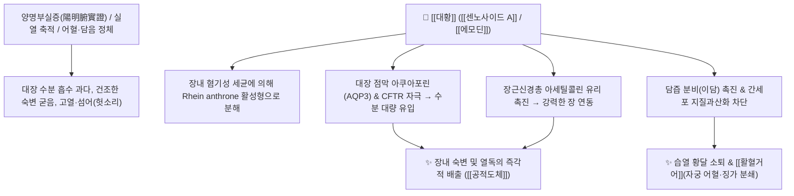

# 🌿 [[대황]] (大黃, Rhei Rhizoma)

> **핵심 요약 (Key Summary)**:
> 마디풀과 장엽대황(*Rheum palmatum*) 또는 당고특대황(*Rheum tanguticum*), 약용대황(*Rheum officinale*)의 뿌리줄기로, "적군을 쓸어버리고 난세를 평정하는 장군(將軍)"이라는 별칭을 가진 사하통부(瀉下通腑)의 황제입니다. 안트론 배당체인 [[센노사이드 A]](Sennoside A)와 안트라퀴논 유도체인 [[에모딘]](Emodin), [[레인]](Rhein)이 대장 점막을 직접 자극하여 장내 숙변과 독소를 맹렬히 배출시킵니다. 한의학적으로 [[공적도체]](攻積導滯), [[사화량혈]](瀉火凉血), [[활혈거어]](活血祛瘀)의 제1 명약으로 양명부실증의 완고한 실열 변비([[대승기탕]]), 황달, 어혈성 무월경([[도핵승기탕]]) 및 급성 췌장염·폐혈증을 치료합니다.

---
## 📌 목차
1. [기본 본초 정보 & 화학 구조 (Pharmacognosy)](#1-기본-본초-정보--화학-구조-pharmacognosy)
2. [핵심 분자약리 기전 & 대장 아쿠아포린·항염증 네트워크](#2-핵심-분자약리-기전--대장-아쿠아포린항염증-네트워크)
3. [포제 및 전탕학: 후하(後下)의 원리와 용량별 양면성 (소량 건위 vs 대량 사하)](#3-포제-및-전탕학-후하後下의-원리와-용량별-양면성-소량-건위-vs-대량-사하)
4. [사상의학: 소양인 위수열리열병의 핵심 구원 투수](#4-사상의학-소양인-위수열리열병의-핵심-구원-투수)
5. [상한론 『약징(藥徵)』 분석: 대황(結) vs 후박(滿)의 감별](#5-상한론-약징藥徵-분석-대황結-vs-후박滿의-감별)
6. [핵심 처방 비교 매트릭스](#6-핵심-처방-비교-매트릭스)
7. [출처 및 학술 참고 문헌 (References)](#7-출처-및-학술-참고-문헌-references)

---
## 1. 기본 본초 정보 & 화학 구조 (Pharmacognosy)

| 항목 | 상세 내용 |
| :--- | :--- |
| **기원 식물** | 마디풀과(Polygonaceae) 장엽대황 *Rheum palmatum* L., 당고특대황 *Rheum tanguticum* Maxim. ex Balf., 약용대황 *Rheum officinale* Baill.의 뿌리 및 뿌리줄기 (Rhei Rhizoma) |
| **성미 (性味)** | 苦, 寒 |
| **귀경 (歸經)** | 脾·胃·大腸·肝·心包經 (비경, 위경, 대장경, 간경, 심포경) |
| **효능 (Actions)** | [[공적도체]](攻積導滯), [[사화량혈]](瀉火凉血), [[활혈거어]](活血祛瘀), [[청열이습]](淸熱利濕), [[해독消癰]](解毒消癰) |
| **주요 성분** | • [[디안트론 배당체]] (KP [[센노사이드 A]] $\ge 0.25\%$): [[센노사이드 A]]~F (Sennosides A~F)<br>• [[안트라퀴논 유도체]]: [[에모딘]] (Emodin), [[레인]] (Rhein), [[크리소파놀]] (Chrysophanol), [[알로에에모딘]] (Aloe-emodin), Physcion<br>• 탄닌류 (소량 복용 시 건위·지사 작용): Catechin, Lindleyin, Procyanidins |

---
## 2. 핵심 분자약리 기전 & 대장 아쿠아포린·항염증 네트워크



### (1) 표적 대장 사하 및 숙변 배출
* **센노사이드의 장내 활성화**:
  * [[센노사이드 A]]는 위와 소장을 그대로 통과하여 대장에서 미생물 효소에 의해 활성 물질인 레인 안트론(Rhein anthrone)으로 전환됩니다.
  * 대장 점막의 수분 재흡수를 막고 분비를 극대화하여 굳은 숙변을 시원하게 쏟아냅니다.
* **해열, 소염, 간기능 보호 및 지혈**:
  * 혈중 내독소(Endotoxin)를 체외로 빼내어 체온을 급격히 떨어뜨리고, 담즙 분비를 촉진하며, 모세혈관 수축을 유도하여 혈액 응고 시간을 단축시킵니다.

---
## 3. 포제 및 전탕학: 후하(後下)의 원리와 용량별 양면성 (소량 건위 vs 대량 사하)

```
[⚡ 전탕 원칙: 후하(後下)]
• 사하 성분인 [[센노사이드]]와 [[에모딘]]은 장시간 가열 시 열분해되어 사하력이 급격히 떨어집니다.
• 강력한 사하를 목적으로 할 때는 탕약을 다 끓이기 5~10분 전에 넣는 **후하(後下)**를 준수합니다.

[⚖️ 용량에 따른 약효 반전]
• 소량 (0.5~1.5g): 탄닌 성분이 작용하여 위액 분비를 돕고 위장을 튼튼히 하는 건위(健胃) 작용.
• 대량 (3~12g): 안트라퀴논 사하력이 우세하여 강력한 완하 및 배변 작용.
```

---
## 4. 사상의학: 소양인 위수열리열병의 핵심 구원 투수

* **소양인 변비와 열독 해소**:
  * [[소양인]]은 비대신소(脾大腎小)하여 위에 열이 쌓이기 쉽습니다.
  * 대변이 2~3일만 막혀도 두통, 번열, 섬어가 발생하므로, [[양격산화탕]]이나 [[지황백호탕]]에 대황을 배오하여 대변을 통하게 함으로써 상충하는 화열을 아래로 끌어내립니다.

---
## 5. 상한론 『약징(藥徵)』 분석: 대황(結) vs 후박(滿)의 감별

### (1) 『[[약징]]』에 나타난 대황의 주치
> **"大黃 主治結熱, 腹滿, 便閉也. 旁治發黃, 瘀血, 蓄血, 吐衄..."**  
> (대황의 주치는 단단히 맺힌 열(結熱), 배가 부르고 그득함(腹滿), 대변 막힘(便閉)이다. 황달, 어혈, 축혈, 토혈과 코피를 곁들여 치료한다.)

* **대황(結) vs 후박(滿) 감별**:
  * [[후박]](厚朴): 기가 울체되어 배가 팽팽하게 부풀어 오른 상태인 **창만(滿)**을 풂.
  * [[대황]](大黃): 장관에 오래 굳고 단단하게 뭉친 숙변과 열독인 **결취(結)**를 부수어 배출.

---
## 6. 핵심 처방 비교 매트릭스

| 처방명 | 구성 약재 | 주치 병증 및 임상 타깃 | 특징 및 감별점 |
| :--- | :--- | :--- | :--- |
| [[대승기탕]] | [[대황]](후하), [[망초]], [[후박]], [[지실]] | **양명부실증, 비만조실(痞滿燥實), 고열, 헛소리, 극심한 변비** | 상한론 사하력 최강의 장군 처방 |
| [[소승기탕]] | [[대황]], [[후박]], [[지실]] | **복부 팽만과 열결 변비 (망초 제외)** | 완만하게 숙변을 통도 |
| [[도핵승기탕]] | [[도인]], [[대황]], [[계지]], [[망초]], [[감초]] | **하초 축혈증, 어혈성 생리통, 정신 착란(발광)** | 어혈과 대변을 동시에 사하 |
| [[대함흉탕]] | [[대황]], [[망초]], [[감수]] | **결흉(結胸), 명치 밑이 돌처럼 단단하고 아픔** | 수열(水熱)이 뭉친 결흉 사하 |

---
## 7. 출처 및 학술 참고 문헌 (References)

1. **Cirillo, C., & Capasso, R. (2015)**. Constipation and botanical remedies: An overview of rhubarb. *Phytotherapy Research*, 29(10), 1488-1493.
   - **[연구 요약]**: 대황의 [[센노사이드 A]] 및 [[레인]] 성분이 대장 아쿠아포린 3(AQP3) 수송체 조절 및 장 연동 운동을 유도하는 분자 기전 검증.
2. **대한민국약전(KP) 제12개정 (2022)**. 의약품각조 제2부: 대황 (Rhei Rhizoma) 규격 기준.
   - **[공정서 규격]**: 센노사이드 A 0.25% 이상 함유 규격 명시.
3. **길익동동 (1784)**. 『약징(藥徵)』: 大黃 조문.
   - **[고전 원전]**: 결열(結熱), 복만(腹滿), 변폐(便閉), 어혈(瘀血) 치료 조문 수록.
