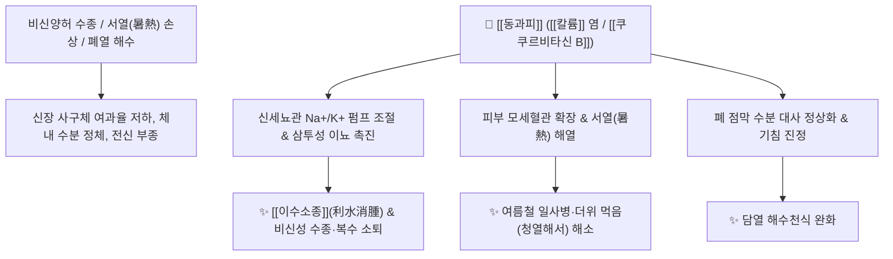

# 🌿 [[동과피]] (冬瓜皮, Benincasae Exocarpium)

> **핵심 요약 (Key Summary)**:
> 박과 동과(*Benincasa hispida*)의 열매껍질(과피)로, 서리가 내린 듯 표면에 하얀 분이 일어나고 겨울까지 저장된다 하여 '동과'라 불립니다. 풍부한 천연 [[칼륨]](K) 염과 트리테르펜([[쿠쿠르비타신 B]], Cucurbitacin B), 다당류 성분이 신장 사구체의 수분 재흡수를 억제하여 나트륨과 수분을 빠르게 배출(이뇨)시킵니다. 한의학적으로 [[이수소종]](利水消腫), [[청열해서]](淸熱解暑), [[지해평천]](止咳平喘)의 명약으로 심장성·신장성·간성 전신 부종, 소변불리, 여름철 더위 먹은 열사병, 설사 및 폐열 해수를 치료합니다.

---
## 📌 목차
1. [기본 본초 정보 & 화학 구조 (Pharmacognosy)](#1-기본-본초-정보--화학-구조-pharmacognosy)
2. [핵심 분자약리 기전 & 신장 전해질·수분 대사 네트워크](#2-핵심-분자약리-기전--신장-전해질수분-대사-네트워크)
3. [본초 감별: 동과피(이수소종) vs 동과자(배농소옹)](#3-본초-감별-동과피이수소종-vs-동과자배농소옹)
4. [사상의학 및 체질별 임상 응용 (적응증 vs 금기)](#4-사상의학-및-체질별-임상-응용-적응증-vs-금기)
5. [배오 원리 및 한의학적 고찰 (유래와 특징)](#5-배오-원리-및-한의학적-고찰-유래와-특징)
6. [핵심 처방 비교 매트릭스](#6-핵심-처방-비교-매트릭스)
7. [출처 및 학술 참고 문헌 (References)](#7-출처-및-학술-참고-문헌-references)

---
## 1. 기본 본초 정보 & 화학 구조 (Pharmacognosy)

| 항목 | 상세 내용 |
| :--- | :--- |
| **기원 식물** | 박과(Cucurbitaceae) 동과 *Benincasa hispida* (Thunb.) Cogn.의 열매껍질(과피, Exocarpium) |
| **성미 (性味)** | 甘·淡, 微寒 |
| **귀경 (歸經)** | 肺·小腸·脾經 (폐경, 소장경, 비경) |
| **효능 (Actions)** | [[이수소종]](利水消腫), [[청열해서]](淸熱解暑), [[지해평천]](止咳平喘), [[생진지갈]](生津止渴) |
| **주요 성분** | • [[트리테르펜]]: [[쿠쿠르비타신 B]] (Cucurbitacin B), $\beta$-Sitosterol, Lupeol<br>• 미네랄 및 유기산: 고농도 [[칼륨]] 염, 비타민 C, Nicotinic acid<br>• 수용성 다당류: Benincasa acidic polysaccharides |

---
## 2. 핵심 분자약리 기전 & 신장 전해질·수분 대사 네트워크



### (1) 삼투성 이뇨 및 전신 부종 소퇴
* **고칼륨에 의한 나트륨 배출**:
  * 풍부한 칼륨 염이 신장 세뇨관의 나트륨 배설을 유도하여 체내 정체된 과다 수분을 소변으로 신속히 빼냅니다.
  * 비장과 신장 기능 저하로 인한 비신성 수종, 심장성 부종, 임신성 하지 부종을 안전하게 가라앉힙니다.
* **청열해서(淸熱解暑) 및 폐열 해수**:
  * 성질이 서늘하여 여름철 무더위로 진액이 마르고 소변이 붉게 찔끔거리는 열감을 꺼주며 마른기침을 삭입니다.

---
## 3. 본초 감별: 동과피(이수소종) vs 동과자(배농소옹)

```
[🌿 [[동과피]] (Benincasae Exocarpium, 껍질)]
• 약효 특성: 신장과 체표로 작용하여 수기를 소변으로 빼내는 이수소종(利水消腫)에 특화.

[🌿 [[동과자]] (Benincasae Semen, 씨앗)]
• 약효 특성: 폐와 장관 깊숙이 작용하여 화농성 고름을 삭이고 배출하는 청폐배농(淸肺排膿)에 특화.
```

---
## 4. 사상의학 및 체질별 임상 응용 (적응증 vs 금기)

```
[✅ 최적 적응증 (Sweet Spot)]
• 신장염, 심장 질환, 간경변으로 인한 만성 전신 부종 및 소변불리
• 여름철 더위를 먹어 열이 나고 갈증이 나며 가슴이 답답하고 설사하는 경우
• 임신 중 다리가 퉁퉁 붓는 임신성 수종 (안전한 이뇨약)

[⚠️ 신중 투여 (Caution)]
• 비위허한(脾胃虛寒)으로 몸이 몹시 차고 소변이 맑고 잦은 환자
```

---
## 5. 배오 원리 및 한의학적 고찰 (유래와 특징)

### (1) 핵심 약재 배오
* [[동과피]] + [[복령피]] / [[대복피]] / [[생강피]]: 임신 부종 및 전신 수종을 치료하는 피부 5대 피제 배오 ([[오피음]]).
* [[동과피]] + [[적소두]] / [[서체]]: 신장성 부종을 소변으로 빼내는 이뇨 배오.

---
## 6. 핵심 처방 비교 매트릭스

| 처방명 | 구성 약재 | 주치 병증 및 임상 타깃 | 특징 및 감별점 |
| :--- | :--- | :--- | :--- |
| [[동과피탕]] | [[동과피]], [[적소두]], [[복령]], [[택사]] | **비신성 수종, 전신 부종, 소변불리** | 부드러운 이수소종 대표방 |
| [[오피음(가미)]] | [[오피음]] + [[동과피]] | **임신성 부종, 각기 수종, 복부 팽만** | 태아를 손상시키지 않는 안전한 부종약 |
| [[해서음]] | [[동과피]], [[하엽]], [[서체]], [[활석]] | **여름철 일사병, 서열 번갈, 소변 단적** | 청열해서와 진액 보충 |

---
## 7. 출처 및 학술 참고 문헌 (References)

1. **Jayaprasha, G. K., et al. (2011)**. Antioxidant and diuretic activities of *Benincasa hispida* fruit peel extracts. *Food Chemistry*, 124(2), 455-460.
   - **[연구 요약]**: 동과피 추출물의 고칼륨 미네랄과 다당류가 신장 사구체 여과율을 증강시켜 전해질 균형을 유지하며 유의한 이뇨 작용을 발휘함을 입증.
2. **대한민국약전외한약(생약)규격집(KHP) (2022)**. 동과피 (Benincasae Exocarpium) 규격 기준.
   - **[공정서 규격]**: 동과 열매껍질 규격, 건조감량, 회분 명시.
