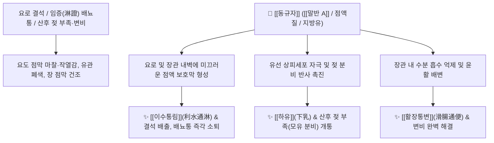

# 🌿 [[동규자]] / [[아욱씨]] (冬葵子, Malvae Semen)

> **핵심 요약 (Key Summary)**:
> 아욱과(무궁화과) 식물인 아욱(*Malva verticillata*)의 여문 씨앗으로, "성질이 차고 해를 따라 잎이 움직여 뿌리를 보호하는 지혜로운 풀(冬葵)"이라는 유래와 "먹으면 소변과 대변이 시원하게 쏟아진다"는 일화가 전해지는 활수통림(滑水通淋)약입니다. 풍부한 점액성 다당류인 [[말반 A]](Mvalan A)와 지방유가 요로 점막과 장 점막을 미끄럽게 코팅하여 통증 없이 결석과 숙변을 밀어내며, 젖 분비를 자극합니다. 한의학적으로 [[이수통림]](利水通淋), [[활장통변]](滑腸通便), [[하유]](下乳), [[청열배농]](淸熱排膿)의 명약으로 임병(열림, 결석림, 혈림), 산후 유즙 불통, 유선염, 부종 및 산후·노인성 변비를 치료합니다.

---
## 📌 목차
1. [기본 본초 정보 & 화학 구조 (Pharmacognosy)](#1-기본-본초-정보--화학-구조-pharmacognosy)
2. [핵심 분자약리 기전 & 요로·장관 점액 코팅 네트워크](#2-핵심-분자약리-기전--요로장관-점액-코팅-네트워크)
3. [본초 감별: 동규자 vs 왕불유행의 통유(通乳) 비교](#3-본초-감별-동규자-vs-왕불유행의-통유通乳-비교)
4. [사상의학 및 체질별 임상 응용 (적응증 vs 금기)](#4-사상의학-및-체질별-임상-응용-적응증-vs-금기)
5. [배오 원리 및 한의학적 고찰 (유래와 특징)](#5-배오-원리-및-한의학적-고찰-유래와-특징)
6. [핵심 처방 비교 매트릭스](#6-핵심-처방-비교-매트릭스)
7. [출처 및 학술 참고 문헌 (References)](#7-출처-및-학술-참고-문헌-references)

---
## 1. 기본 본초 정보 & 화학 구조 (Pharmacognosy)

| 항목 | 상세 내용 |
| :--- | :--- |
| **기원 식물** | 아욱과(Malvaceae ; 무궁화과) 아욱 *Malva verticillata* L.의 잘 익은 씨앗 (Malvae Semen) |
| **성미 (性味)** | 甘·寒, 滑 (매끄럽고 차가움) |
| **귀경 (歸經)** | 膀胱·大腸·小腸經 (방광경, 대장경, 소장경) |
| **효능 (Actions)** | [[이수통림]](利水通淋), [[활장통변]](滑腸通便), [[통유]](通乳), [[청열배농]](淸熱排膿) |
| **주요 성분** | • 점액성 다당류: [[말반 A]] (Mvalan A), Mvalan B, 식물성 점액질(Mucilage)<br>• 지방유 (약 20~25%): [[리놀레산]] (Linoleic acid), Oleic acid, Palmitic acid<br>• 스테롤 및 플라보노이드: $\beta$-Sitosterol, Myricetin |

---
## 2. 핵심 분자약리 기전 & 요로·장관 점액 코팅 네트워크



### (1) 점액 코팅에 의한 요로 결석 배출 및 배뇨통 해소
* **활석처럼 미끄러운 성질 (활리 滑利)**:
  * [[말반 A]] 다당류와 지방유가 요도 점막을 매끄럽게 코팅하여, 요로 결석이 긁고 지나갈 때의 극심한 통증과 출혈을 막고 결석을 부드럽게 밀어냅니다.
* **산후 젖 부족 개통 (통유 下乳) 및 변비 해결**:
  * 젖샘을 자극하여 유즙 분비를 촉진하며, 메마른 대장에 윤활유를 쳐주듯 장관을 매끄럽게 하여 산후 변비와 노인 변비를 부드럽게 치료합니다.

---
## 3. 본초 감별: 동규자 vs 왕불유행의 통유(通乳) 비교

```
[🌿 [[동규자]] (Malvae Semen)]
• 약효 특성: 성질이 차고 매끄러워(滑), 열감이 있는 유선염(유옹)과 대소변 정체를 동시에 통하게 함.

[🌿 [[왕불유행]] (Vaccariae Semen)]
• 약효 특성: 성질이 평하고 활혈통경(活血通經)하여, 기혈 어혈로 유관이 꽉 막힌 산후 결유(缺乳)에 특화.
```

---
## 4. 사상의학 및 체질별 임상 응용 (적응증 vs 금기)

```
[✅ 최적 적응증 (Sweet Spot)]
• 비뇨기 질환: 요로결석(석림), 방광염으로 찌릿하고 아픈 열림(熱淋), 혈뇨
• 산후 모유가 잘 나오지 않는 유즙불통(결유) 및 초기 유선염
• 쇠약하고 마른 사람의 대소변 정체, 산후 변비, 노인성 장조 변비

[⚠️ 절대 금기 (Contraindication)]
• 임산부 (활장 및 자궁 평활근 흥분 작용으로 유산 위험이 있으므로 절대 금기)
• 비위허한(脾胃虛寒)성 만성 설사 환자
```

---
## 5. 배오 원리 및 한의학적 고찰 (유래와 특징)

### (1) 유래 및 해학적 일화
* **겨울을 헤아리는 풀(冬葵)**: 지혜로운 풀이라는 유래와 함께, "자러 가는 줄 알았더니 동규자를 먹고 밀려오는 오줌을 누러 간 것이었다"는 일화처럼 소변과 대변을 시원하게 소통시킵니다.

### (2) 핵심 약재 배오
* [[동규자]] + [[석위]] / [[해금사]] / [[금전초]]: 요로 결석을 녹여 배출하는 최고 결석 배오.
* [[동규자]] + [[왕불유행]] / [[통초]]: 산후 젖을 폭발적으로 돌게 하는 통유 배오.

---
## 6. 핵심 처방 비교 매트릭스

| 처방명 | 구성 약재 | 주치 병증 및 임상 타깃 | 특징 및 감별점 |
| :--- | :--- | :--- | :--- |
| [[동규자산]] | [[동규자]], [[활석]], [[목통]], [[차전자]] | **임병, 요로결석, 소변 찔끔거림, 극심한 요도 작열통** | 활리통림의 대표 처방 |
| [[통유탕]] | [[동규자]], [[왕불유행]], [[통초]], [[당귀]], [[황기]] | **산후 기혈 부족, 젖이 안 나옴(유즙결핍)** | 기혈을 보하고 유관을 개통 |
| [[규자복령산]] | [[동규자]], [[복령]] | **임신 말기 소변불리, 전신 부종** | 태아를 안정시키며 수기 배출 |

---
## 7. 출처 및 학술 참고 문헌 (References)

1. **Tomoda, M., et al. (1989)**. Characterization of an acidic polysaccharide, Mvalan A, from the seeds of *Malva verticillata*. *Chemical and Pharmaceutical Bulletin*, 37(11), 3029-3032.
   - **[연구 요약]**: 동규자의 점액 다당류 [[말반 A]]가 점막 보호 및 삼투성 이뇨 활성을 나타냄을 화학적으로 구조 규명.
2. **대한민국약전(KP) 제12개정 (2022)**. 의약품각조 제2부: 동규자 (Malvae Semen) 규격 기준.
   - **[공정서 규격]**: 아욱 씨앗 규격, 건조감량, 회분 명시.
