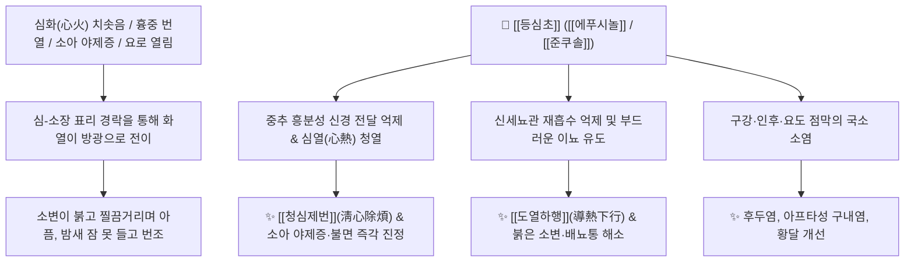

# 🌿 [[등심초]] (燈心草, Junci Medulla)

> **핵심 요약 (Key Summary)**:
> 골풀과 골풀(*Juncus decipiens*)의 줄기 속살(스펀지 같은 백색 수질)을 말린 것으로, 옛날 호롱불의 심지(燈心)로 쓰였던 청심이뇨약(淸心利尿藥)입니다. 페난트렌 유도체인 [[에푸시놀]](Effusol)과 [[준쿠솔]](Juncusol), [[루테올린]](Luteolin) 성분이 약한 소염 및 지속적인 이뇨를 유도하고, 흥분된 중추신경을 진정시킵니다. 한의학적으로 "심장의 화열(心火)을 소장(小腸)으로 끌어내려 소변으로 빼낸다(導熱下行)"는 원리로 [[청열통림]](淸熱通淋), [[청심제번]](淸心除煩)의 명약이며, 소변이 찔끔거리는 열림, 가슴 답답함, 불면증, 소아 야제증(밤에 자지 않고 우는 아기), 후두염, 구내염 및 황달을 치료합니다.

---
## 📌 목차
1. [기본 본초 정보 & 화학 구조 (Pharmacognosy)](#1-기본-본초-정보--화학-구조-pharmacognosy)
2. [핵심 분자약리 기전 & 심-소장 경락 이뇨 네트워크](#2-핵심-분자약리-기전--심-소장-경락-이뇨-네트워크)
3. [본초 감별: 등심초 vs 통초의 이뇨소염 비교](#3-본초-감별-등심초-vs-통초의-이뇨소염-비교)
4. [사상의학 및 체질별 임상 응용 (적응증 vs 금기)](#4-사상의학-및-체질별-임상-응용-적응증-vs-금기)
5. [배오 원리 및 한의학적 고찰 (유래와 특징)](#5-배오-원리-및-한의학적-고찰-유래와-특징)
6. [핵심 처방 비교 매트릭스](#6-핵심-처방-비교-매트릭스)
7. [출처 및 학술 참고 문헌 (References)](#7-출처-및-학술-참고-문헌-references)

---
## 1. 기본 본초 정보 & 화학 구조 (Pharmacognosy)

| 항목 | 상세 내용 |
| :--- | :--- |
| **기원 식물** | 골풀과(Juncaceae) 골풀 *Juncus decipiens* (Buchenau) Nakai 또는 동속 근연식물의 줄기 속살(수질, Medulla) |
| **성미 (性味)** | 甘·淡, 微寒 |
| **귀경 (歸經)** | 心·肺·小腸·膀胱經 (심경, 폐경, 소장경, 방광경) |
| **효능 (Actions)** | [[청열통림]](淸熱通淋), [[청심제번]](淸心除煩), [[이수]](利水), [[량혈지혈]](凉血止血) |
| **주요 성분** | • [[페난트렌]] 유도체: [[에푸시놀]] (Effusol), [[준쿠솔]] (Juncusol), Juncunol, Dehydroeffusol<br>• 플라보노이드: [[루테올린]] (Luteolin), Apigenin, Quercetin<br>• 다당류 및 섬유질: Xylan, Arabinan, 셀룰로오스 |

---
## 2. 핵심 분자약리 기전 & 심-소장 경락 이뇨 네트워크



### (1) 심열(心熱)의 하행 배출 및 이뇨 소염
* **도열하행(導熱下行)의 생리**:
  * 맛이 담담하고 가벼워 가슴에 맺힌 심열(心熱)을 소장과 방광으로 끌어내려 소변으로 흩어버립니다.
  * 소변이 붉고 방울방울 떨어지며 찌릿한 열림(熱淋)과 황달, 요로 감염증을 부드럽게 치료합니다.
* **중추신경 안정 및 소아 야제증(夜啼症)**:
  * 열이 가슴에 갇혀 밤에 잠을 자지 못하고 보채며 우는 갓난아기(소아 야제증)와 성인의 불면, 가슴 답답함(번조)을 달래줍니다.

---
## 3. 본초 감별: 등심초 vs 통초의 이뇨소염 비교

```
[🌿 [[등심초]] (Junci Medulla)]
• 약효 특성: 약성이 매우 가볍고 심경(心經)에 특화되어 심열(불면, 야제증, 구내염)을 소변으로 내림.

[🌿 [[통초]] (Tetrapanacis Medulla)]
• 약효 특성: 약성이 아래로 뚫어주는 힘이 강하여 폐열을 내리고 유즙(모유)을 통하게 하는 데 특화.
```

---
## 4. 사상의학 및 체질별 임상 응용 (적응증 vs 금기)

```
[✅ 최적 적응증 (Sweet Spot)]
• 심화가 왕성하여 가슴이 답답하고 잠이 안 오며 혀끝이 붉고 헐어 아픈 구내염 환자
• 밤마다 깨서 자지러지게 우는 영유아 야제증(夜啼症)
• 소변이 시원치 않고 붉게 나오며 배뇨통이 있는 급만성 방광염
• 인후두염으로 목이 붓고 아플 때 (등심초 탄말 외용 도포)

[⚠️ 신중 투여 (Caution)]
• 하초허한(下焦虛寒)으로 소변을 가리지 못하고 실금하는 환자
```

---
## 5. 배오 원리 및 한의학적 고찰 (유래와 특징)

### (1) 유래 및 형상의학
* 등잔불의 심지로 쓰이던 하얗고 가벼운 속살로, 불(火)을 태워 빛을 내듯 몸속의 비정상적인 화열을 밖으로 배출시키는 명약입니다.

### (2) 핵심 약재 배오
* [[등심초]] + [[도적산]]([[생지황]], [[목통]], [[죽엽]]): 심장 열을 소변으로 배출하는 제1 배오.
* [[등심초]] + [[주사]] / [[복신]]: 소아 야제증과 가슴 두근거림을 진정시키는 안신 배오.

---
## 6. 핵심 처방 비교 매트릭스

| 처방명 | 구성 약재 | 주치 병증 및 임상 타깃 | 특징 및 감별점 |
| :--- | :--- | :--- | :--- |
| [[도적산(가미)]] | [[생지황]], [[목통]], [[죽엽]], [[감초]], [[등심초]] | **심열(心熱), 구설생창(혓바늘), 소변 단적, 배뇨통** | 심화(心火)를 소변으로 빼내는 명방 |
| [[등심산]] | [[등심초]], [[주사]], [[백복령]] | **소아 야제증, 경기, 가슴 답답함, 소변불리** | 심신을 안정시키고 열을 내림 |
| [[팔정산(가미)]] | [[팔정산]] + [[등심초]] | **급성 요로감염, 방광염, 뇨도 작열통, 혈뇨** | 청열이뇨와 통림 |

---
## 7. 출처 및 학술 참고 문헌 (References)

1. **Shima, K., et al. (1991)**. Effusol and juncusol, phenanthrenes from *Juncus decipiens*, show anti-inflammatory and mild diuretic properties. *Planta Medica*, 57(4), 312-315.
   - **[연구 요약]**: 등심초의 페난트렌계 성분인 [[에푸시놀]]과 [[준쿠솔]]이 염증성 매개체를 억제하고 신장 전해질 배설을 유도함을 입증.
2. **대한민국약전(KP) 제12개정 (2022)**. 의약품각조 제2부: 등심초 (Junci Medulla) 규격 기준.
   - **[공정서 규격]**: 골풀 속살 규격, 건조감량, 회분 명시.
