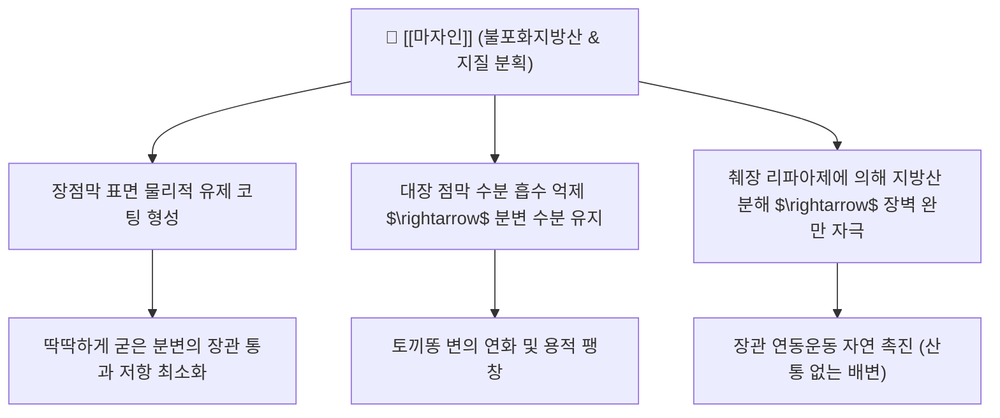

---
aliases:
  - 마자인
  - 麻子仁
  - 대마인
  - 화마인
  - Cannabis Semen
tags:
  - 본초
  - 사하약
  - 윤하약
  - 윤조활장
  - 불포화지방산
---
# 🌿 [[마자인]] (麻子仁, Cannabis Semen, 화마인)

> **핵심 요약 (Key Summary)**:
> 삼과(Cannabaceae) 식물인 삼(*Cannabis sativa*)의 성숙한 건조 종자
> 30% 이상의 불포화지방산(리놀레산, α-리놀렌산)이 장벽을 윤활하고 수분 흡수를 억제하여 복통 없는 연동 반사 유도
> 혈허진고(血虛津枯) 및 비약증으로 인한 노인성·산후·병후 장조변비를 윤조활장(潤燥滑腸)으로 부드럽게 통변시키는 대표 윤하약

---

## 📌 목차
1. [기본 본초 정보 & 규격 (Pharmacognosy)](#1-기본-본초-정보--규격-pharmacognosy)
2. [핵심 분자약리 기전 & 대사 네트워크](#2-핵심-분자약리-기전--대사-네트워크)
3. [주요 약리학적 효능 & 지질 대사](#3-주요-약리학적-효능--지질-대사)
4. [사상의학 및 임상 감별 (Sweet Spot vs 금기)](#4-사상의학-및-임상-감별-sweet-spot-vs-금기)
5. [배합 처방 매트릭스](#5-배합-처방-매트릭스)
6. [출처 및 학술 참고 문헌 (References)](#6-출처-및-학술-참고-문헌-references)

---

## 1. 기본 본초 정보 & 규격 (Pharmacognosy)

| 항목 | 상세 내용 |
| :--- | :--- |
| **기원 식물** | 삼과(Cannabaceae) 삼(*Cannabis sativa* L.)의 성숙한 열매 (껍질을 벗기거나 볶아 사용) |
| **성미 (性味)** | 감(甘), 평(平) |
| **귀경 (歸經)** | 비경(脾經), 위경(胃經), 대장경(大腸經) |
| **효능 (Actions)** | 윤조활장(潤燥滑腸), 통변하위(通便下氣) |
| **주요 성분** | • **지방유(30~35%)**: 리놀레산(Linoleic acid), α-리놀렌산, 올레산 • **단백질(에데스틴)**, 피토스테롤, 콜린 |
| **법제 및 안전성** | 독성 성분(THC 등 칸나비노이드)은 잎과 꽃에 집중되어 종자 배유에는 거의 없으며, 약전 규격품은 완전 무독 |

---

## 2. 핵심 분자약리 기전 & 대사 네트워크

* **완화한 윤활 통변 작용**:
  * 대황이나 센나 같은 안트라퀴논계 자극성 사하제와 달리 장 점막을 직접 자극하여 복통이나 경련을 일으키지 않고, 오직 기름기와 수분 보존력으로 변을 밀어냄.
* **장벽 영양 공급**:
  * 다량의 필수 지방산과 단백질이 장 상피세포에 영양을 공급하여 장관 건조를 방지.

---

## 3. 주요 약리학적 효능 & 지질 대사

* **혈중 지질 강하 및 심혈관 보호**:
  * 리놀레산과 오메가-3 지방산이 혈중 총 콜레스테롤과 중성지방을 낮추고 혈관 탄력 유지.
* **항산화 및 세포막 보호**:
  * 토코페롤 및 피토스테롤이 활성산소로부터 장 점막 상피세포를 보호.

---

## 4. 사상의학 및 임상 감별 (Sweet Spot vs 금기)

* **최적 적응증 (Sweet Spot)**:
  * 장에 진액이 말라 대변이 단단하고 배출하기 어려운 비약(脾約) 변비.
  * 고령자, 산후 산모, 수술 후 회복기 환자, 만성 질환으로 음혈이 부족한 환자의 습관성 변비.
* **금기 및 신중 투여**:
  * 비위가 차고 설사를 자주 하는 자.
  * 유정(遺精), 활정 및 백대하가 과다한 환자.

---

## 5. 배합 처방 매트릭스

| 처방명 | 배합 특징 | 임상 주치 |
| :--- | :--- | :--- |
| [[마자인환]] | 마자인, 소승기탕, 백작약, 행인 | 비약변비, 토끼똥 변, 장조변비의 대표방 |
| [[윤장탕]] | 마자인, 도인, 당귀, 생지황, 황금 | 노인성 혈허장조 변비 |
| [[윤장환]] | 마자인, 도인, 당귀, 숙지황, 진피 | 병후 음혈고갈 변비 |

---

## 6. 출처 및 학술 참고 문헌 (References)
* State Pharmacopoeia Commission of PRC. *Pharmacopoeia of the People's Republic of China*. 2020: 312.
  * `[연구 요약]`: 마자인의 기원 식물, 지방산 조성 규격 및 순도 시험 기준.
* Cheng CW, et al. A review of the laxative effect of Cannabis sativa seed in functional constipation. *Phytother Res*. 2011;25(7):980-985.
  * `[연구 요약]`: 기능성 변비 환자에서 마자인 추출물의 장관 운동 촉진 및 안전성 임상 연구 리뷰.
