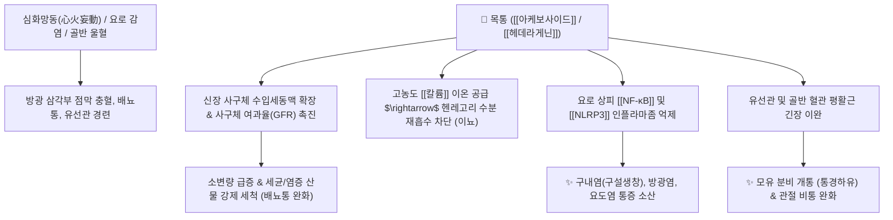

# 🌿 [[목통]] (木通, Akebiae Caulis)

> **핵심 요약 (Key Summary)**:
> 으름덩굴과(*Lardizabalaceae*) 으름덩굴(*Akebia quinata*)의 줄기
> 트리테르페노이드 사포닌인 [[아케보사이드]](Akeboside)와 [[헤데라게닌]](Hederagenin)이 신장 사구체 혈류를 개선하여 이뇨를 촉진하고 비뇨기 점막 항염 작용 발휘
> 심화(心火)를 소장으로 내려 배뇨통과 혓바늘을 치료하고 유관을 개통하는 대표적인 [[강화이뇨소종]](降火利尿消腫)·[[통경하유]](通經下乳)의 청열통림약

---
## 📌 목차
1. [기본 본초 정보 & 화학 구조 (Pharmacognosy)](#1-기본-본초-정보--화학-구조-pharmacognosy)
2. [핵심 분자약리 기전 & 이뇨·항염 네트워크](#2-핵심-분자약리-기전--이뇨항염-네트워크)
3. [해부생체역학 / 신장 사구체 & 유선 도관 대사 연계](#3-해부생체역학--신장-사구체--유선-도관-대사-연계)
4. [사상의학 및 체질별 임상 응용 (적응증 vs 감별점 & 안전성)](#4-사상의학-및-체질별-임상-응용-적응증-vs-감별점--안전성)
5. [상한론 및 고전 의학 배오 원리](#5-상한론-및-고전-의학-배오-원리)
6. [핵심 처방 비교 매트릭스](#6-핵심-처방-비교-매트릭스)
7. [출처 및 학술 참고 문헌 (References)](#7-출처-및-학술-참고-문헌-references)

---
## 1. 기본 본초 정보 & 화학 구조 (Pharmacognosy)

| 항목 | 상세 내용 |
| :--- | :--- |
| **기원 식물** | 으름덩굴과(Lardizabalaceae) 으름덩굴 *Akebia quinata* (Thunb.) Decne. 또는 삼엽으름덩굴의 줄기를 말린 것 (목통 木通) |
| **성미 (性味)** | 苦, 微寒 |
| **귀경 (歸經)** | 心·小腸·膀胱經 (심경, 소장경, 방광경) |
| **효능 (Actions)** | [[강화이뇨소종]](降火利尿消腫), [[청열해독]](淸熱解毒), [[통경하유]](通經下乳), [[활혈통비]](活血通痺) |
| **주요 성분** | • **트리테르펜 사포닌**: [[아케보사이드]] (Akeboside St_a ~ St_k), [[헤데라게닌]] (Hederagenin), [[올레아놀산]] (Oleanolic acid, KP 규격 $\ge 0.15\%$)<br>• **칼륨염 및 무기질**: 다량의 칼륨염($\text{K}^+$)<br>• **이노시톨 및 플라보노이드**: Stigmasterol, D-Inositol, Kaempferol |

> **[유래 및 본초학적 기전]**:
> * 줄기를 자르면 미세한 도관 구멍들이 촘촘히 뚫려 있어 양쪽 끝이 시원하게 통하므로 '통초(通草)' 또는 '목통(木通)'이라 불렸습니다.
> * 인체의 목구멍, 소변구멍(요도), 대변구멍(항문), 땀구멍 등 십이경맥의 모든 관(Duct)과 구규(九竅)를 뚫어주는 작용을 합니다.
> * 심(心)의 열을 소장과 방광으로 끌어내려 배뇨통과 빈뇨를 치료하며, 유즙 분비 부전, 중이염, 구내염(구설생창)을 다스립니다.

### 🔬 목통의 주요 사포닌 및 아케보사이드 화학 구조
```
            [ Glc-Rhamnose ] (당사슬 결합)
                   |
            (C-28 COOH / C-3 OH)
                   |
             [ Hederagenin 골격 ]
                   |
            (C-23 탄소에 -CH2OH 치환)
```
> **[구조적 특징 및 안전성 공인]**: KP 공인 정품 목통(으름덩굴)은 올레아놀산 및 헤데라게닌 사포닌을 함유하여 안전합니다. 과거 신독성(간질성 신섬유화/신부전)을 유발했던 쥐방울덩굴과의 **관목통(關木通, [[아리스톨로크산]] 함유)**과 식물 기원이 완전히 다르므로, 정품 으름덩굴 목통만을 감별하여 사용합니다.

---
## 2. 핵심 분자약리 기전 & 이뇨·항염 네트워크



### (1) 신장 이뇨 및 항요로감염 기전
* **사구체 여과율(GFR) 증대 및 칼륨성 이뇨**:
  * 아케보사이드와 칼륨염이 신장 혈관을 확장하여 사구체 혈류량을 급증시키고, 세뇨관에서의 나트륨/수분 배출을 촉진하여 요량(尿量)을 크게 늘립니다.
* **비뇨기 상피 항염증 및 진통 작용**:
  * 방광 및 요도 상피세포에서 염증 매개물질 생성을 억제하여 배뇨 시 타는 듯한 작열감(배뇨통)과 잔뇨감, 빈뇨를 즉시 완화합니다.
* **유선 도관 및 경락 개통 ([[통경하유]] 通經下乳)**:
  * 산후 유선관의 연축을 이완시키고 유선 분비 세포의 혈류 순환을 촉진하여 산후 젖이 잘 나오지 않거나 유방이 단단하게 붓는 증상을 해소합니다.

---
## 3. 해부생체역학 / 신장 사구체 & 유선 도관 대사 연계

* **심-소장-방광 축열 하달 (청심도적 淸心導赤)**:
  * 뇌신경 흥분 및 스트레스로 인한 구내염(설첨 발적, 혓바늘)과 가슴 답답함(심번)을 소변 배출을 통해 전신 열을 내립니다.
* **미세 순환 및 관절 활막염 (활혈통비)**:
  * 관절낭 내 삼출액 정체를 이뇨 작용으로 흡수시켜 류마티스 및 통풍성 관절통의 부종을 완화합니다.

---
## 4. 사상의학 및 체질별 임상 응용 (적응증 vs 감별점 & 안전성)

```
[✅ 최적 적응증 (Sweet Spot)]
• 비뇨기 염증: 급·만성 방광염, 요도염, 신우신염으로 인한 배뇨통, 혈뇨, 빈뇨
• 심화(心火) 상염: 입안과 혀가 헐고(구설생창), 가슴이 답답하고 불안하며 소변이 붉고 찔끔거릴 때 ([[도적산]])
• 산후 유선 울체: 출산 후 젖이 돌지 않거나 유관이 막혀 유방이 붓고 아플 때
• 습열 관절통: 사지 관절이 붓고 열감이 나며 무겁고 아픈 비통

[🔍 목통 vs 방기 감별 포인트]
• [[목통]]: 소변을 이롭게 하여 상초와 심장의 열을 소변으로 아래로 사함 (降火利尿)
• [[방기]]: 하지와 경락의 풍습을 몰아내고 대변과 관절 부종을 통하게 함 (祛風濕止痺痛)

[⚠️ 신중 투여 및 금기 (Caution / Safety)]
• 임산부 절대 금기 (자궁 수축 및 통경 작용)
• 신장 기능 저하 환자 및 비위허한(소화불량, 만성 설사) 환자
• 기원 식물 확인: 아리스톨로크산 독성이 있는 '관목통'이 아닌 대한민국약전 수록 정품 '으름덩굴 목통' 사용 필수
```

---
## 5. 상한론 및 고전 의학 배오 원리

### (1) 상한론 및 고전 처방 배오
* **핵심 배오 원리**:
  * [[목통]] + [[생지황]] + [[죽엽]] $\rightarrow$ 심장의 열을 맑히고 진액을 보하며 소변으로 열을 배출하는 황금 조합 ([[도적산]])
  * [[목통]] + [[용담초]] + [[차전자]] $\rightarrow$ 간담(肝膽)의 극심한 습열과 하초 비뇨생식기 염증을 강력히 청리 ([[용담사간탕]])
  * [[목통]] + [[당귀]] + [[세신]] $\rightarrow$ 한습(寒濕)으로 굳은 혈맥을 온통(溫通)시키고 혈류를 개통 ([[당귀사역탕]])

---
## 6. 핵심 처방 비교 매트릭스

| 처방명 | 구성 약재 | 주치 병증 및 임상 타깃 | 특징 및 감별점 |
| :--- | :--- | :--- | :--- |
| [[도적산]] | [[목통]], [[생지황]], [[죽엽]], [[감초대]] | **심열(心熱), 구설생창(혓바늘), 소변적삽(붉고 아픈 소변)** | 심열을 소변으로 끌어내리는 대표 청열제 |
| [[용담사간탕]] | [[용담초]], [[황금]], [[치자]], [[목통]], [[택사]], [[차전자]] 등 | **간담습열, 방광염, 음부 소양감, 대하, 협통, 두통** | 하초 비뇨생식기 습열의 제1선 처방 |
| [[팔정산]] | [[목통]], [[차전자]], [[구맥]], [[편축]], [[활석]], [[대황]] 등 | **습열하주(濕熱下注), 급성 요로감염, 요도 결석, 혈뇨** | 요로계의 염증과 결석 배출에 특화된 공하통림제 |
| [[당귀사역탕]] | [[당귀]], [[계지]], [[작약]], [[세신]], [[목통]], [[감초]], [[대추|대조]] | **수족궐한(수족냉증), 레이노 증후군, 만성 동상, 복통** | 목통의 통락 작용으로 말초 혈관 수축을 해소 |
| [[통유탕]] | [[목통]], [[천산갑]](또는 [[왕불류행]]), [[당귀]], [[황기]] 등 | **산후 유즙 불통, 젖몸살, 기혈 울체성 유방통** | 유선 도관을 개통시켜 모유 분비 촉진 |

---
## 7. 출처 및 학술 참고 문헌 (References)

1. **Gao, S., et al. (2018)**. Akebia saponins protect against acute kidney injury via suppression of oxidative stress and inflammation. *Phytomedicine*, 43, 110-119.
   - **[연구 요약]**: 으름덩굴(목통)의 아케보사이드 성분이 신장 사구체 혈류를 보호하고 NF-κB 활성화를 차단하여 염증성 신손상을 억제함을 규명.
2. **대한민국약전(KP) 제12개정 (2022)**. 의약품각조 제2부: 목통 (Akebiae Caulis) 규격 기준.
   - **[공정서 규격]**: 건조물 기준 올레아놀산($\text{C}_{30}\text{H}_{48}\text{O}_3$) 0.15% 이상 함유 규격 및 아리스톨로크산(Aristolochic acid) 불포함 검사 기준 필수 규정.
3. **첸스청 (陳師成, 1076)**. 『태평혜민화제국방(太平惠民和劑局方)』: 導赤散 조문.
   - **[고전 원전]**: "導赤散 治心熱, 小腸壅熱, 煩渴, 口舌生瘡, 小便赤澁" - 목통의 청심도적(淸心導赤) 효능의 고전적 운용 원리 제시.
