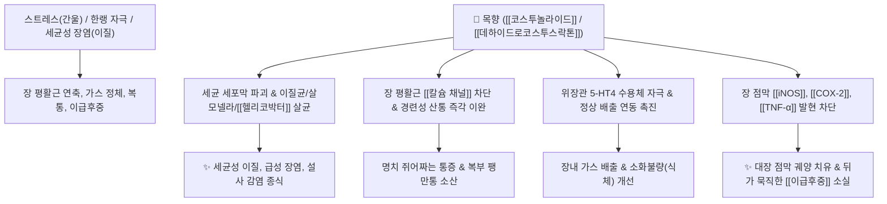

# 🌿 [[목향]] (木香, Aucklandiae Radix)

> **핵심 요약 (Key Summary)**:
> 국화과(*Asteraceae*) 운목향(*Aucklandia lappa*)의 뿌리
> 세스퀴테르펜 락톤인 [[코스투놀라이드]](Costunolide)와 [[데하이드로코스투스락톤]](Dehydrocostuslactone)이 장관 경련을 완화하고 이질균·헬리코박터균 살균 및 점막 항염 작용 발휘
> 상하내외의 울체된 기(氣)를 뚫고 이급후중(裏急後重)과 복통을 치료하는 대표적인 [[행기지통]](行氣止痛)·[[온중화위]](溫中和胃)의 소화기 이기약

---
## 📌 목차
1. [기본 본초 정보 & 화학 구조 (Pharmacognosy)](#1-기본-본초-정보--화학-구조-pharmacognosy)
2. [핵심 분자약리 기전 & 위장관·항균 네트워크](#2-핵심-분자약리-기전--위장관항균-네트워크)
3. [해부생체역학 / 장관 평활근 & 담도 대사 연계](#3-해부생체역학--장관-평활근--담도-대사-연계)
4. [사상의학 및 체질별 임상 응용 (적응증 vs 금기)](#4-사상의학-및-체질별-임상-응용-적응증-vs-금기)
5. [고전 의학 및 배오 원리 (이기지통 배오)](#5-고전-의학-및-배오-원리-이기지통-배오)
6. [핵심 처방 비교 매트릭스](#6-핵심-처방-비교-매트릭스)
7. [출처 및 학술 참고 문헌 (References)](#7-출처-및-학술-참고-문헌-references)

---
## 1. 기본 본초 정보 & 화학 구조 (Pharmacognosy)

| 항목 | 상세 내용 |
| :--- | :--- |
| **기원 식물** | 국화과(Compositae / Asteraceae) 운목향 *Aucklandia lappa* Decne. (또는 *Saussurea costus*)의 뿌리 |
| **성미 (性味)** | 辛·苦, 溫 |
| **귀경 (歸經)** | 脾·胃·大腸·膽·三焦經 (비경, 위경, 대장경, 담경, 삼초경) |
| **효능 (Actions)** | [[행기지통]](行氣止痛), [[온중화위]](溫中和胃), [[건비소식]](健脾消食), [[삽장지사]](澁腸止瀉) |
| **주요 성분** | • **세스퀴테르펜 락톤(Sesquiterpene Lactones)**: [[코스투놀라이드]] (Costunolide, KP 규격), [[데하이드로코스투스락톤]] (Dehydrocostuslactone), Aucklandilide<br>• **정유 성분(Costus oil)**: [[아플라난]], 목향알코올, 캄펜, $\beta$-엘레멘<br>• **알칼로이드**: 사우수린(Saussurine), 이눌린(Inulin), 타락사스테롤 |

> **[유래 및 본초학적 기전]**:
> * 본래 '밀향(蜜香)'이라 불릴 만큼 향기가 짙고 독특하며(화장품 같은 니글하면서도 화한 향), 장미과의 목향과는 완전히 다른 국화과 뿌리 약재입니다.
> * 방향성이 매우 강하여 마치 목캔디처럼 상하내외의 막힌 기체(氣滯)를 막힘없이 뚫어줍니다.
> * 소화를 촉진하고 비위를 따뜻하게 하며, 오래된 한적(寒積) 복통, 가스 팽만, 구토 및 기가 역상하여 치받는 증상을 가라앉힙니다.

### 🔬 목향의 주요 지표물질 화학 구조
```
         CH2
        //
       C
      / \
 [ A 고리 ]-[ B 고리 ]===O  <-- 코스투놀라이드 (Costunolide)
      \     /
       C---O (락톤 고리)
        \\
         CH2
```
> **[구조적 특징 및 반응성]**: 목향의 주성분인 [[코스투놀라이드]]와 [[데하이드로코스투스락톤]]은 10원환 골격에 반응성이 높은 $\alpha,\beta$-불포화 락톤 고리($\alpha$-methylene-$\gamma$-lactone)를 함유하고 있습니다. 이 구조가 세균 및 염증 세포의 설프하이드릴($-\text{SH}$)기와 마이클 부가 반응을 일으켜 병원균 증식과 염증 효소를 강력히 억제합니다.

---
## 2. 핵심 분자약리 기전 & 위장관·항균 네트워크



### (1) 장내 유해균 살균 및 항생제 유사 활성
* **세균성 장염 및 이질(痢疾) 제어**:
  * <font color="#fa7e7e">세스퀴테르펜 락톤 성분이 시겔라(Shigella, 이질균), 대장균, 살모넬라, 헬리코박터 파일로리의 생장을 강력히 저해하여 '천연 한방 항생제' 역할을 수행합니다.</font>
  * 급성 장염, 세균성 설사, 궤양성 대장염의 점막 궤양을 소독하고 치유합니다.
* **장관 평활근 연축 해소 및 진통 기전**:
  * 장관 평활근의 과도한 수축을 유발하는 $\text{IP}_3$ 경로와 세포외 칼슘 유입을 억제하여 쥐어짜듯 아픈 산통(Colic)을 즉시 멎게 합니다.
* **위장관 운동 및 담즙 배출 촉진 (이담 작용)**:
  * 오디 괄약근(Sphincter of Oddi)의 긴장을 완화하고 담즙 분비를 촉진하여 지방 소화불량 및 담낭염, 담석증 통증을 경감합니다.

---
## 3. 해부생체역학 / 장관 평활근 & 담도 대사 연계

* **이급후중(裏急後重, Tenesmus) 완화**:
  * 직장 및 항문 괄약근의 울혈과 신경성 연축을 풀어주어 배변 후에도 뒤가 묵직하고 시원하지 않은 증상을 해소합니다.
* **위 유문부 및 장내 가스 정체 해소**:
  * 복강 내 가스 저류로 횡격막이 압박되어 숨이 차고 명치가 갑갑한 증상을 강력한 행기 작용으로 아래로 배출시킵니다.

---
## 4. 사상의학 및 체질별 임상 응용 (적응증 vs 금기)

```
[✅ 최적 적응증 (Sweet Spot)]
• [[소음인]] 비위 한증(寒證): 속이 차고 소화가 안 되며, 조금만 신경 써도 헛배가 부르고 쥐어짜듯 복통이 오는 경우
• 급성 세균성 이질, 감염성 장염, 식중독으로 인한 복통, 설사, 이급후중
• 간울기체(肝鬱氣滯): 스트레스로 명치와 옆구리가 결리고 더부룩하며 트림이 자주 나오는 경우
• 담낭염, 담석증으로 인한 우상복부 팽만통 및 소화불량

[⚠️ 신중 투여 및 금기 (Caution / Contraindication)]
• 음허화왕(陰虛火旺): 몸에 열이 많고 진액이 부족하여 입안이 바짝 마르는 환자
• 기혈 허약으로 인한 만성 무력증 환자 (과다 사용 시 기를 흩어버려 기운이 빠질 수 있음)
```

---
## 5. 고전 의학 및 배오 원리 (이기지통 배오)

### (1) 고전 본초학적 주치와 배오
> **"木香 辛溫, 能升能降, 通行三焦, 調理諸氣, 止腹痛, 健脾胃, 治瀉痢..."**  
> (목향은 맵고 따뜻하여 능히 오르고 내리며, 삼초를 통행하여 모든 기를 고르게 하고 복통을 멎게 하며 비위를 건실하게 하고 설사와 이질을 치료한다.)

* **핵심 배오 원리**:
  * [[목향]] + [[황련]] $\rightarrow$ 이질과 장염 치료의 명방 조합으로, 황련으로 습열을 끄고 목향으로 기체를 뚫어 이급후중 완벽 해소 ([[향련환]])
  * [[목향]] + [[사인의 뿌리/열매]] ([[사인]]) $\rightarrow$ 비위의 기를 소통시키고 담음을 삭히는 이기건비의 핵심 짝 ([[향사평위산]], [[향사육군자탕]])
  * [[목향]] + [[빙편]] + [[소합향]] $\rightarrow$ 급격한 기궐(氣厥), 흉복부 산통을 강력히 개규 진통

---
## 6. 핵심 처방 비교 매트릭스

| 처방명 | 구성 약재 | 주치 병증 및 임상 타깃 | 특징 및 감별점 |
| :--- | :--- | :--- | :--- |
| [[향사평위산]] | [[평위산]] + [[목향]], [[사인]] | **식체, 위완통, 복부 팽만, 소화불량, 식욕부진** | 소화기 식체와 위내 정수(가스)를 신속히 배출 |
| [[향사육군자탕]] | [[육군자탕]] + [[목향]], [[사인]] | **만성 비위 허약, 식후 졸림, 소화불량, 헛배부름, 담음** | 소음인의 만성 위장 장애 대표 보익이기제 |
| [[향련환]] | [[목향]], [[황련]] | **습열리(濕熱痢), 세균성 이질, 피고름 섞인 설사, 이급후중** | 청열조습과 행기지통의 이질 치료 대표방 |
| [[목향순기산]] | [[목향]], [[향부자]], [[오약]], [[진피]], [[지각]] 등 | **기체(氣滯) 전신 통증, 옆구리 결림, 늑간신경통, 복통** | 온몸의 십이경맥 기운을 순조롭게 통하게 함 |
| [[작약탕]] | [[작약]], [[당귀]], [[황련]], [[황금]], [[대황]], [[목향]], [[빙랑]] | **급성 이질, 하복부 산통, 혈변, 후중감** | 혈열과 장관 어혈, 세균 감염을 동시에 제압 |

---
## 7. 출처 및 학술 참고 문헌 (References)

1. **Rao, K. S., & Babu, G. V. (2001)**. Antiinflammatory and analgesic activities of the rhizome of *Saussurea lappa*. *Fitoterapia*, 72(1), 21-26.
   - **[연구 요약]**: 목향의 코스투놀라이드 및 정유 성분이 COX-2 억제 및 프로스타글란딘 합성 차단을 통해 강력한 진통 및 항염증 효과를 나타냄을 입증.
2. **Choi, H. G., et al. (2012)**. Costunolide inhibits *Helicobacter pylori* growth and induces apoptosis in human gastric cancer cells. *Phytotherapy Research*, 26(9), 1358-1364.
   - **[연구 요약]**: 목향 지표성분인 코스투놀라이드가 헬리코박터균의 세포막을 파괴하여 증식을 억제하고 위점막 손상을 방어함을 규명.
3. **대한민국약전(KP) 제12개정 (2022)**. 의약품각조 제2부: 목향 (Aucklandiae Radix) 규격 기준.
   - **[공정서 규격]**: 건조물 기준 코스투놀라이드 및 데하이드로코스투스락톤의 합 1.0% 이상 함유 규격 명시.