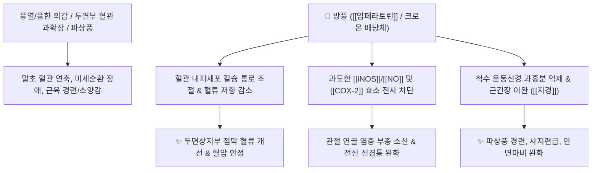

# 🌿 [[방풍]] (防風, Saposhnikoviae Radix)

> **핵심 요약 (Key Summary)**:
> 미나리과(*Apiaceae*) 방풍(*Saposhnikovia divaricata*)의 뿌리
> 푸라노쿠마린계 성분인 [[임페라토린]](Imperatorin)과 [[베르갑텐]](Bergapten)이 혈관 평활근 [[칼슘 채널]]을 조절하고 염증성 [[NO]]/[[COX-2]] 생성을 억제하여 미세순환 개선 및 진통 작용 발휘
> [[소양인]]의 두면상지부 충혈·풍열(風熱) 및 풍한습비(風寒濕痺)·파상풍을 치료하는 풍약 중의 윤제(潤劑)이자 대표적인 [[거풍해표]](祛風解表)·[[승습지통]](勝濕止痛) 약재

---
## 📌 목차
1. [기본 본초 정보 & 화학 구조 (Pharmacognosy)](#1-기본-본초-정보--화학-구조-pharmacognosy)
2. [핵심 분자약리 기전 & 미세순환·항염 네트워크](#2-핵심-분자약리-기전--미세순환항염-네트워크)
3. [해부생체역학 / 두면부 점막 혈류 & 근육 경련 연계](#3-해부생체역학--두면부-점막-혈류--근육-경련-연계)
4. [사상의학 및 체질별 임상 응용 (형개 vs 방풍 배오)](#4-사상의학-및-체질별-임상-응용-형개-vs-방풍-배오)
5. [상한론 및 고전 의학 배오 원리](#5-상한론-및-고전-의학-배오-원리)
6. [핵심 처방 비교 매트릭스](#6-핵심-처방-비교-매트릭스)
7. [출처 및 학술 참고 문헌 (References)](#7-출처-및-학술-참고-문헌-references)

---
## 1. 기본 본초 정보 & 화학 구조 (Pharmacognosy)

| 항목 | 상세 내용 |
| :--- | :--- |
| **기원 식물** | 미나리과(Umbelliferae / Apiaceae) 방풍 *Saposhnikovia divaricata* (Turcz.) Schischk.의 뿌리 (관방풍 關防風) |
| **성미 (性味)** | 辛·甘, 微溫 |
| **귀경 (歸經)** | 膀胱·肝·脾經 (방광경, 간경, 비경) |
| **효능 (Actions)** | [[거풍해표]](祛風解表), [[승습지통]](勝濕止痛), [[지경]](止痙), [[지양]](止痒) |
| **주요 성분** | • **푸라노쿠마린(Furanocoumarins)**: [[임페라토린]] (Imperatorin), [[베르갑텐]] (Bergapten), 프소랄렌(Psoralen), 잔토톡신<br>• **크로몬 유도체**: Prim-O-glucosylcimifugin (KP 규격 지표 $\ge 0.24\%$), 5-O-methylvisammioside (KP 규격 $\ge 0.18\%$)<br>• **폴리아세틸렌 및 다당류**: 파낙시놀, 방풍 다당체 |

> **[기원 감별 및 본초학적 기전]**:
> * 중국 동북부에서 자생하는 관방풍(정품 방풍)을 사용하며, 한국 남부에서 자생하는 식방풍(갯기름나물)이나 해방풍(갯방풍)과는 기원과 약리가 다릅니다.
> * 풍(風)을 방어한다는 이름처럼 모든 풍병(외풍 및 내풍)을 다스리며, 성질이 온화하고 마르지 않아 **'풍약 중의 윤제(風藥之潤劑)'**로 불립니다.
> * 소양인의 체온, 혈압, 혈당, 대사항진 및 두면상지부 점막 혈관 확장 반응을 안정화시킵니다.

### 🔬 방풍의 주요 지표물질 화학 구조
![[Pasted image 20250202170117-1.png|500]]
> **[구조적 특징 및 활성]**: 방풍의 크로몬 배당체와 쿠마린 유도체([[임페라토린]])는 벤젠 고리와 피란 고리가 결합된 안정한 구조로, 혈소판 응집을 억제하고 혈관 내피세포의 산화 스트레스를 경감시켜 미세혈류 순환을 촉진합니다.

---
## 2. 핵심 분자약리 기전 & 미세순환·항염 네트워크



### (1) 혈관 반응성 조절 및 항염증
* **미세 순환 개선 및 혈압 안정**:
  * [[임페라토린]]은 혈관 평활근의 칼슘 유입을 억제하고 과도한 혈관 확장/수축의 진폭을 안정화하여 두통과 혈압 급상승을 완화합니다.
* **항소양(가려움증 억제) 및 피부 장벽 보호**:
  * 히스타민 및 류코트리엔 매개 소양감 신호를 차단하여 두드러기, 풍진, 습진성 가려움증을 가라앉힙니다.
* **항경련(지경 止痙) 작용**:
  * 중추신경계 흥분을 진정시키고 말초 신경근 접합부의 과도한 연축을 억제하여 파상풍, 안면경련, 사지 쥐남을 치료합니다.

---
## 3. 해부생체역학 / 두면부 점막 혈류 & 근육 경련 연계

* **두면상지부 충혈 완화**:
  * 열이 위로 솟구쳐 눈이 충혈되고 두통이 오며 코가 막히는 증상에서 상초의 울혈을 흩어버립니다.
* **승습지통(勝濕止痛) 및 관절낭 활액 순환**:
  * 풍습(風濕)이 뼈마디에 침범하여 쑤시고 저린 관절통에서 관절막의 부종을 제거하고 운동성을 회복합니다.

---
## 4. 사상의학 및 체질별 임상 응용 (형개 vs 방풍 배오)

```
[✅ 최적 적응증 (Sweet Spot)]
• [[소양인]] 망양증 및 상열증: 혈압이 오르고 가슴이 답답하며 두통·어지럼증이 있는 경우
• 외감 풍한/풍열: 오한, 발열, 두통, 전신 근육통이 동반된 초기 감기
• 피부과 질환: 급·만성 두드러기, 알레르기 피부염, 가려움증(소양증)
• 신경근 질환: 구안와사(안면신경마비), 삼차신경통, 경추부 강직

[🔍 형개 vs 방풍 상호 배오 감별]
• [[형개]]: 식물의 지상부(줄기/꽃), 방향성이 강하여 체표의 외풍(外風)을 땀으로 발산
• [[방풍]]: 식물의 지하부(뿌리), 방향성이 완만하여 몸 안의 내풍(內風)과 습기를 거둠
• 소양인에게 형개-방풍 조합은 소음인의 당귀-천궁처럼 전신 미세순환을 뚫어주는 핵심 축

[⚠️ 신중 투여 및 금기 (Caution / Contraindication)]
• 혈허발경(血虛發痙): 혈액과 진액이 극도로 부족하여 경련이 일어난 환자
• 음허화왕(陰虛火旺)으로 인한 만성 도한 환자
```

---
## 5. 상한론 및 고전 의학 배오 원리

### (1) 고전 본초학적 배오 원리
* **핵심 배오**:
  * [[방풍]] + [[형개]] $\rightarrow$ 외풍과 내풍, 피부 소양감과 두통을 함께 다스리는 제1의 풍약 세트 ([[형방패독산]])
  * [[방풍]] + [[황기]] + [[백출]] $\rightarrow$ 표를 굳건히 하면서도 사기가 침범하지 못하게 방어막 형성 ([[옥병풍산]])
  * [[방풍]] + [[강활]] + [[독활]] $\rightarrow$ 상하 전신의 풍한습 관절통을 완벽히 소산 ([[대강활탕]])

---
## 6. 핵심 처방 비교 매트릭스

| 처방명 | 구성 약재 | 주치 병증 및 임상 타깃 | 특징 및 감별점 |
| :--- | :--- | :--- | :--- |
| [[형방패독산]] | [[형개]], [[방풍]], [[강활]], [[독활]], [[시호]], [[전호]], [[지각]] 등 | **외감 풍한습, 오한발열, 두통, 전신 관절통, 무한** | 사스·독감·감기 초기의 명방 |
| [[옥병풍산]] | [[황기]], [[백출]], [[방풍]] | **표허자한(表虛自汗), 잦은 감기, 면역력 저하, 알레르기 비염** | 면역 방어벽을 세워 외감병을 예방하는 보익제 |
| [[방풍통성산]] | [[방풍]], [[마황]], [[대황]], [[망초]], [[석고]], [[황금]], [[활석]] 등 | **풍열표리구실(風熱表裏俱實), 비만, 고혈압, 변비, 여드름** | 땀·대변·소변 삼도로 열독을 배출 |
| [[형방사백산]] | [[소양인]] [[형방패독산]] 변방 | [[소양인]] **폐열천해, 흉만, 상초 충혈** | 소양인 상초 화열을 식히고 순환 촉진 |
| [[대강활탕]] | [[강활]], [[독활]], [[방풍]], [[승마]], [[창출]], [[당귀]] 등 | **풍습열비(風濕熱痺), 사지 관절 급성 종통, 파상풍** | 관절염과 신경통의 강력한 거풍승습제 |

---
## 7. 출처 및 학술 참고 문헌 (References)

1. **Kuo, Y. C., et al. (2002)**. Anti-inflammatory and analgesic constituents from *Saposhnikovia divaricata*. *Journal of Natural Products*, 65(9), 1276-1279.
   - **[연구 요약]**: 방풍의 크로몬 및 쿠마린 유도체들이 iNOS 발현 억제 및 PGE2 생성 차단을 통해 현저한 진통 및 항염증 활성을 나타냄을 검증.
2. **대한민국약전(KP) 제12개정 (2022)**. 의약품각조 제2부: 방풍 (Saposhnikoviae Radix) 규격 기준.
   - **[공정서 규격]**: 건조물 기준 Prim-O-글루코실시미후긴 0.24% 이상, 5-O-메틸비삼미오사이드 0.18% 이상 함유 필수 규격 명시.