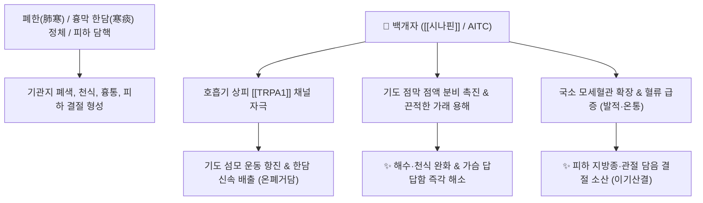

# 🌿 [[백개자]] (白芥子, Sinapis Semen)

> **핵심 요약 (Key Summary)**:
> 십자화과(*Brassicaceae*) 백개(*Sinapis alba*) 또는 갓의 성숙한 씨(겨자씨)
> 글루코시놀레이트인 [[시니그린]](Sinigrin)과 [[시나핀]](Sinapine)이 분해되어 생성된 이소티오시아네이트(AITC)가 [[TRPA1]] 채널을 자극하여 흉막·기관지 점액을 묽게 하고 한담(寒痰) 배출 촉진
> 폐한(肺寒)으로 가슴에 가래가 끓고 기침·천식이 심한 증상 및 피하 음저(陰疽) 결절을 치료하는 대표적인 [[온폐거담]](溫肺去痰)·[[이기산결]](利氣散結)·[[통락지통]](通絡止痛) 약재

---
## 📌 목차
1. [기본 본초 정보 & 화학 구조 (Pharmacognosy)](#1-기본-본초-정보--화학-구조-pharmacognosy)
2. [핵심 분자약리 기전 & TRPA1·거담 네트워크](#2-핵심-분자약리-기전--trpa1거담-네트워크)
3. [해부생체역학 / 흉막 점액 & 피하 결절 대사 연계](#3-해부생체역학--흉막-점액--피하-결절-대사-연계)
4. [사상의학 및 임상 응용 (적응증 vs 외용 첩부)](#4-사상의학-및-임상-응용-적응증-vs-외용-첩부)
5. [고전 의학 및 배오 원리 (삼자양친탕 배오)](#5-고전-의학-및-배오-원리-삼자양친탕-배오)
6. [핵심 처방 비교 매트릭스](#6-핵심-처방-비교-매트릭스)
7. [출처 및 학술 참고 문헌 (References)](#7-출처-및-학술-참고-문헌-references)

---
## 1. 기본 본초 정보 & 화학 구조 (Pharmacognosy)

| 항목 | 상세 내용 |
| :--- | :--- |
| **기원 식물** | 십자화과 / 배추과(Brassicaceae) 백개 *Sinapis alba* L. 또는 갓 *Brassica juncea* (L.) Czern. et Coss.의 잘 익은 씨(종자) |
| **성미 (性味)** | 辛, 溫 |
| **귀경 (歸經)** | 肺·胃經 (폐경, 위경) |
| **효능 (Actions)** | [[온폐거담]](溫肺去痰), [[온화한습]](溫化寒濕), [[이기산결]](利氣散結), [[통락지통]](通絡止痛) |
| **주요 성분** | • **글루코시놀레이트(Glucosinolates)**: [[시날빈]] (Sinalbin), [[시니그린]] (Sinigrin), 알릴이소티오시아네이트(AITC)<br>• **알칼로이드**: [[시나핀]] (Sinapine thiocyanate, KP 규격 $\ge 1.0\%$)<br>• **지방유 및 효소**: 미로시나아제(Myrosinase), 에루크산, 올레산 |

> **[유래 및 본초학적 기전]**:
> * 겨자씨로 매운맛(辛味)이 매우 강하여 섭취 시 체표에 땀을 내고, 흉격(胸膈)에 뭉친 차가운 가래(한담 寒痰)를 녹여 흩어버립니다.
> * 몸을 덥히고 기의 순환을 원활하게 하여 침과 소화액 분비를 촉진하고, 경락에 숨어 있는 담핵(痰核, 피하 결절)과 관절통을 치료합니다.

### 🔬 백개자의 미로시나아제 효소 분해 반응
```
시니그린 (Sinigrin) + 미로시나아제 (Myrosinase)
      │
      ▼
알릴이소티오시아네이트 (Allyl isothiocyanate, AITC)  <-- 매운 휘발성 활성 물질
      │
      ▼
[[TRPA1]] 수용체 활성화 (기관지 점막 충혈 유도 & 가래 용해 배출)
```
> **[구조적 특징 및 반응성]**: 백개자를 빻거나 씹으면 세포 내의 미로시나아제 효소가 글루코시놀레이트를 신속히 가수분해하여 강력한 자극성 휘발유인 **이소티오시아네이트(AITC)**를 생성합니다. 이 성분이 호흡기 점막과 피부를 자극하여 반대 자극(Counter-irritant) 진통 및 혈류 촉진 효과를 냅니다.

---
## 2. 핵심 분자약리 기전 & TRPA1·거담 네트워크



### (1) 표적 수용체 및 약리 작용
* [[TRPA1]] 수용체 자극 및 거담:
  * 호흡기 점막의 [[TRPA1]] 이온 통로를 자극하여 점막 분비를 촉진하고, 굳어 있는 점조한 가래를 묽게 만들어 체외 배출을 극대화합니다.
* **통락산결(通絡散結) 및 피하 결절 소산**:
  * 경락과 피하 조직 깊숙이 정체된 담음(지방종, 결절성 낭종, 림프절염)의 국소 미세순환을 촉진하여 응결을 풀어줍니다.
* **피부 발적 및 외용 반대자극제 (삼복첩 三伏貼)**:
  * 피부에 외용 첩부 시 국소 모세혈관을 확장시켜 충혈과 열감을 유도함으로써 내부 장기의 만성 한성 질환(비염, 천식)을 치료합니다.

---
## 3. 해부생체역학 / 흉막 점액 & 피하 결절 대사 연계

* **흉막 강(Pleural Space) 삼출액 흡수**:
  * 흉격 부위에 담음이 결합되어 뻐근하고 숨이 찬 증상에서 흉벽 혈관의 재흡수를 촉진합니다.
* **관절낭 주변 연부조직 긴장 해소**:
  * 만성 관절염으로 굳어진 건(Tendon)과 근막의 냉증성 유착을 따뜻하게 풀어줍니다.

---
## 4. 사상의학 및 임상 응용 (적응증 vs 외용 첩부)

```
[✅ 최적 적응증 (Sweet Spot)]
• 한담천해(寒痰喘咳): 가래가 묽고 맑거나 거품이 많으며, 가슴이 답답하고 기침할 때 가슴통증이 동반되는 경우
• 피하 담핵(痰核) 및 음저(陰疽): 피하에 멍울이 만져지는데 열감이나 통증이 뚜렷하지 않고 오래된 결절
• 만성 관절통: 날씨가 흐리거나 추워지면 관절이 쑤시고 굳는 한습성 관절염
• 삼복첩(三伏貼): 여름철 복날 폐유(肺兪) 등 혈자리에 분말을 붙여 겨울철 천식/비염 예방

[⚠️ 신중 투여 및 금기 (Caution / Contraindication)]
• 폐열조해(肺熱燥咳): 가래가 누렇고 끈끈하며 인후통과 구갈이 심한 열성 기침 환자
• 위궤양 및 위염 환자: 강한 자극성으로 속쓰림 유발 가능
• 피부 첩부 시 수포 발생 주의: 장시간 첩부 시 화상 및 수포가 생길 수 있으므로 피부 반응 모니터링
```

---
## 5. 고전 의학 및 배오 원리 (삼자양친탕 배오)

### (1) 노인 천식의 명짝: 삼자양친탕(三子養親湯)
* **3대 씨앗 약재 배오**:
  * [[백개자]] $\rightarrow$ **가슴(흉격)의 담을 삭이고 기를 통하게 함** (溫肺化痰)
  * [[소자]] $\rightarrow$ **폐기를 아래로 내려 기침을 멈춤** (降氣平喘)
  * [[나복자]] $\rightarrow$ **음식 식체를 소화시키고 중초를 뚫어줌** (消食化痰)
* **시너지**: 상초의 담, 중초의 식체, 하초의 기역을 동시에 치료하여 노인의 만성 천식과 소화불량을 완치.

---
## 6. 핵심 처방 비교 매트릭스

| 처방명 | 구성 약재 | 주치 병증 및 임상 타깃 | 특징 및 감별점 |
| :--- | :--- | :--- | :--- |
| [[삼자양친탕]] | [[백개자]], [[소자]], [[나복자]] | **노인성 해수·천식, 가래 끓음, 식욕부진, 흉만** | 세 가지 씨앗으로 노인 담음성 기침을 순하게 다스림 |
| [[공진단]](가감) | [[녹용]], [[당귀]], [[산수유]], [[사향]] + [[백개자]] | 만성 피로 + 피하 결절, 림프 순환 저체, 기체 | 원기를 보하면서 묵은 담핵을 뚫어줌 |
| [[양화통맥탕]] | [[숙지황]], [[육계]], [[마황]], [[백개자]], [[포강]] 등 | **음저(陰疽), 골관절 결핵, 만성 무통성 피하 종괴** | 양기를 북돋우며 한응담체(寒凝痰滯)를 소산 |
| [[백개자산]](외용) | [[백개자]](분말), [[생강즙]] 혼화 | 비염, 천식, 만성 기관지염의 혈위 첩부 요법 | 피부 자극을 통해 호흡기 면역 증강 |

---
## 7. 출처 및 학술 참고 문헌 (References)

1. **Jordt, S. E., et al. (2004)**. Mustard oils and cannabinoids excite sensory nerve fibres through the TRPA1 receptor. *Nature*, 427(6971), 260-265.
   - **[연구 요약]**: 겨자씨(백개자)의 이소티오시아네이트가 감각신경의 TRPA1 채널을 직접 흥분시켜 신경성 염증 및 거담, 혈류 확장 반사를 유도함을 밝힌 기초 랜드마크 논문.
2. **대한민국약전(KP) 제12개정 (2022)**. 의약품각조 제2부: 백개자 (Sinapis Semen) 규격 기준.
   - **[공정서 규격]**: 건조물 기준 시나핀티오시아네이트($\text{C}_{16}\text{H}_{24}\text{N}_2\text{O}_5\text{S}_2$) 1.0% 이상 함유 규격 명시.
