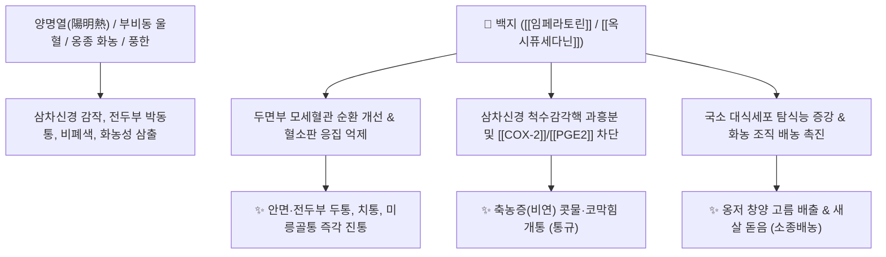

# 🌿 [[백지]] (白芷, Angelicae Dahuricae Radix)

> **핵심 요약 (Key Summary)**:
> 미나리과(*Apiaceae*) 구릿대(*Angelica dahurica*)의 뿌리
> 푸라노쿠마린계 지표성분인 [[임페라토린]](Imperatorin)과 [[옥시퓨세다닌]](Oxypeucedanin)이 비점막 삼출을 억제하고 삼차신경 전도 및 혈소판 응집을 차단하여 강력한 진통·배농·소염 작용 발휘
> [[태음인]]의 양명경(陽明經) 전두통·안면신경통·축농증(비연) 및 화농성 피부 옹종을 치료하는 대표적인 [[통규지통]](通竅止痛)·[[산풍제습]](散風除濕)·[[소종배농]](消腫排膿) 약재

---
## 📌 목차
1. [기본 본초 정보 & 화학 구조 (Pharmacognosy)](#1-기본-본초-정보--화학-구조-pharmacognosy)
2. [핵심 분자약리 기전 & 삼차신경통·항혈전 네트워크](#2-핵심-분자약리-기전--삼차신경통항혈전-네트워크)
3. [해부생체역학 / 부비동 점막 & 전두부 근막 연계](#3-해부생체역학--부비동-점막--전두부-근막-연계)
4. [사상의학 및 체질별 임상 응용 (체질별 활혈지제 비교)](#4-사상의학-및-체질별-임상-응용-체질별-활혈지제-비교)
5. [고전 의학 및 배오 원리 (양명경 인경 작용)](#5-고전-의학-및-배오-원리-양명경-인경-작용)
6. [핵심 처방 비교 매트릭스](#6-핵심-처방-비교-매트릭스)
7. [출처 및 학술 참고 문헌 (References)](#7-출처-및-학술-참고-문헌-references)

---
## 1. 기본 본초 정보 & 화학 구조 (Pharmacognosy)

| 항목 | 상세 내용 |
| :--- | :--- |
| **기원 식물** | 미나리과(Umbelliferae / Apiaceae) 구릿대 *Angelica dahurica* Benth. et Hook. f. 또는 항백지의 뿌리 |
| **성미 (性味)** | 辛, 溫 |
| **귀경 (歸經)** | 胃·大腸·肺經 (위경, 대장경, 폐경) - **족양명위경(足陽明胃經) 인경약** |
| **효능 (Actions)** | [[산풍제습]](散風除濕), [[통규지통]](通竅止痛), [[소종배농]](消腫排膿), [[조습지대]](燥濕止帶) |
| **주요 성분** | • **푸라노쿠마린(Furanocoumarins)**: [[임페라토린]] (Imperatorin, KP 규격 $\ge 0.10\%$), [[옥시퓨세다닌]] (Oxypeucedanin, KP 규격 $\ge 0.10\%$), 이소임페라토린, 비아칸겔리콜, 크산토톡신<br>• **정유 및 폴리아세틸렌**: 팔카린디올, 아니스산, $\alpha$-피넨 |

> **[유래 및 본초학적 기전]**:
> * 향기가 맑고 뿌리가 희며 두통을 신속히 멎게 하여 '향백지(香白止)'라 불리다가 '백지(白芷)'가 되었습니다.
> * 하얀 종이를 대면 습기와 고름이 빨려 나오듯, 부비동 점막의 농성 분비물(콧물)과 피부 궤양의 고름(농 膿)을 말리고 배출시킵니다.
> * 양명경 인경약으로 얼굴, 이마, 코, 치아, 눈 부위의 모든 통증과 염증을 치료합니다.

### 🔬 백지의 주요 지표물질 화학 구조
![[백지-20241105192107290.jpg|500]]
> **[구조적 특징 및 활혈 기전]**: 백지의 푸라노쿠마린 골격([[임페라토린]], [[옥시퓨세다닌]])은 혈소판 응집을 차단하고 적혈구끼리 엉겨 붙는 연전 현상을 억제하여, 태음인의 미세혈관 울혈과 두면부 부종성 통증을 신속히 개선합니다.

---
## 2. 핵심 분자약리 기전 & 삼차신경통·항혈전 네트워크



### (1) 표적 신경통 진통 및 비강 통규 작용
* **삼차신경 감각핵 억제 (두면부 특이적 진통)**:
  * 삼차신경 제1지(안신경)와 제2지(상악신경)의 과도한 통증 신호를 차단하여 미릉골통(눈썹 뼈 통증), 전두통, 치통을 완화합니다.
* **비점막 부종 소산 및 배농 (통규 散風)**:
  * 부비동 점막의 울혈을 내리고 점액 분비를 조절하여 만성 비염 및 축농증(비연 鼻淵)의 코막힘을 뚫어줍니다.
* **항응고 및 혈행 개선 (태음인의 활혈약)**:
  * 혈소판 응집을 억제하고 혈관 내피세포의 항염증 반응을 유도하여 말초 미세순환 장애를 개선합니다.

---
## 3. 해부생체역학 / 부비동 점막 & 전두부 근막 연계

* **전두근(Frontalis Muscle) 및 모상건막 긴장 해소**:
  * 스트레스와 감기로 인해 굳어진 이마 부위 근막 유착을 풀어 전두통을 치료합니다.
* **부비동 자연공(Ostium) 개구부 부종 완화**:
  * 상악동 및 전두동 입구의 부종을 가라앉혀 갇혀 있던 고름 분비물의 배출을 유도합니다.

---
## 4. 사상의학 및 체질별 임상 응용 (체질별 활혈지제 비교)

```
[✅ 체질별 활혈지제(活血之劑) 비교 Matrix]
• [[태음인]]: [[백지]], [[고본]] (두면부 혈행과 순환, 통증, 전신 염증 질환에 활용)
• [[소음인]]: [[당귀]], [[천궁]] (보혈과 순환 촉진)
• [[소양인]]: [[강활]], [[독활]] (승습발산 및 청열진통)

[✅ 최적 적응증 (Sweet Spot)]
• 전두통 및 미릉골통(眉稜骨痛): 이마와 눈썹 뼈 부위가 뻐근하게 아픈 양명경 두통
• 부비동염(축농증) 및 알레르기 비염: 누런 콧물이 흐르고 코가 막히며 냄새를 못 맡는 경우 ([[창이자산]])
• 치통 및 안면신경통: 윗니 통증(양명경) 및 삼차신경통
• 외과 피부 질환: 종기, 모낭염, 유선염 초기의 발적·종통 및 파롱 후 배농
• 부인과 대하증: 냉대하, 습열성 백대하

[⚠️ 신중 투여 및 금기 (Caution / Contraindication)]
• 음허혈허(陰虛血虛)로 인한 두통 (약성이 맵고 건조하여 진액을 말릴 수 있음)
• 옹저가 이미 터져서 기혈이 극도로 허약해진 상태
```

---
## 5. 고전 의학 및 배오 원리 (양명경 인경 작용)

### (1) 두면부 질환의 최고 배오
* **핵심 배오**:
  * [[백지]] + [[신이]] + [[창이자]] + [[박하]] $\rightarrow$ 부비동을 뚫고 콧물·코막힘을 없애는 비염 명방 ([[창이자산]])
  * [[백지]] + [[갈근]] + [[승마]] $\rightarrow$ 양명경의 열을 끄고 전두통과 안면 질환 치료 ([[갈근해기탕]])
  * [[백지]] + [[금은화]] + [[포공영]] $\rightarrow$ 외과 창양의 독을 풀고 고름을 배출

---
## 6. 핵심 처방 비교 매트릭스

| 처방명 | 구성 약재 | 주치 병증 및 임상 타깃 | 특징 및 감별점 |
| :--- | :--- | :--- | :--- |
| [[창이자산]] | [[창이자]], [[신이]], [[백지]], [[박하]] | **비연(축농증), 비색(코막힘), 비체(재채기), 전두통** | 이비인후과 비염·축농증 치료의 최고 기본방 |
| [[열다한소탕]] | [[갈근]], [[황금]], [[고본]], [[백지]], [[나복자]] 등 | [[태음인]] **간열폐조(肝熱肺燥), 두통, 안면 충혈, 조열** | 태음인 전신 순환 촉진 및 열독 해소 |
| [[갈근해기탕]] | [[갈근]], [[시호]], [[황금]], [[강활]], [[석고]], [[백지]], [[길경]] | **양명경 외감, 고열, 안구 통증, 코 건조, 전두통** | 표리와 양명경의 풍열을 해기 |
| [[오적산]] | [[창출]], [[마황]], [[진피]], [[후박]], [[지각]], [[백지]], [[천궁]] 등 | **한·습·기·혈·담 5적, 전신 근육통, 요통, 냉증** | 풍한습 통증을 전방위로 치료 |
| [[십신탕]] | [[갈근]], [[승마]], [[마황]], [[백지]], [[소엽]], [[진피]] 등 | **외감 풍한 두통, 오한 발열, 전신 신통** | 10가지 신미 약재로 사기를 발산 |

---
## 7. 출처 및 학술 참고 문헌 (References)

1. **Ban, H. S., et al. (2003)**. Inhibition of lipopolysaccharide-induced expression of inducible nitric oxide synthase and cyclooxygenase-2 by imperatorin from *Angelica dahurica*. *Planta Medica*, 69(5), 408-412.
   - **[연구 요약]**: 백지의 임페라토린이 iNOS 및 COX-2 발현을 차단하여 신경성 염증과 혈관성 통증을 유의하게 억제함을 규명.
2. **대한민국약전(KP) 제12개정 (2022)**. 의약품각조 제2부: 백지 (Angelicae Dahuricae Radix) 규격 기준.
   - **[공정서 규격]**: 건조물 기준 임페라토린 0.10% 이상, 옥시퓨세다닌 0.10% 이상 함유 필수 규격 명시.